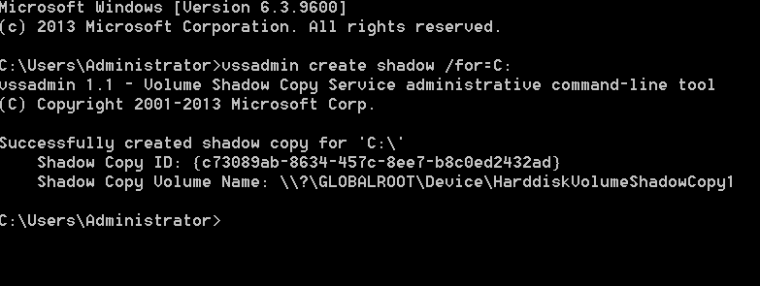

DCSync – Penetration Testing Lab

It is very common during penetration tests where domain administrator access has been achieved to extract the password hashes of all the domain users for offline cracking and analysis. These hashes are stored in a database file in the domain controller (NTDS.DIT) with some additional information like group memberships and users.

The NTDS.DIT file is constantly in use by the operating system and therefore cannot be copied directly to another location for extraction of information. This file can be found in the following Windows location:

1
[object Object]

There are various techniques that can be used to extract this file or the information that is stored inside it however the majority of them are using one of these methods:

1. Domain Controller Replication Services
2. Native Windows Binaries
3. WMI

## Mimikatz

Mimikatz has a feature (dcsync) which utilises the Directory Replication Service (DRS) to retrieve the password hashes from the NTDS.DIT file. This technique eliminates the need to authenticate directly with the domain controller as it can be executed from any system that is part of the domain from the context of domain administrator. Therefore it is the standard technique for red teams as it is less noisy.

1
[object Object][object Object]  [object Object][object Object]  [object Object]

Mimikatz – Dump Domain Hashes via DCSync

By specifying the domain username with the **/user** parameter Mimikatz can dump all the account information of this particular user including his password hash.

1
[object Object][object Object]  [object Object]

Mimikatz – Dump User Hash via DCSync

Alternatively executing Mimikatz directly in the domain controller password hashes can be dumped via the lsass.exe process.

1
2
[object Object]
[object Object]

Mimikatz – Dump Domain Hashes via lsass
The password hashes of the domain users will retrieved.

Mimikatz – Dump domain hashes via lsadump

## Empire

PowerShell Empire has two modules which can retrieve domain hashes via the DCSync attack. Both modules needs to be executed from the perspective of domain administrator and they are using Microsoft replication services. These modules rely on the **Invoke-Mimikatz** PowerShell script in order to execute Mimikatz commands related to DCSync. The following module will extract the domain hashes to a format similar to the output of Metasploit **hashdump** command.

1
[object Object]

Empire – DCSync Hashdump Module

The **DCSync** module requires a user to be specified in order to extract all the account information.

Empire – DCSync Module
The following information will obtained:

Empire – DCSync Account Information

## Nishang

[Nishang](https://github.com/samratashok/nishang) is a PowerShell framework which enables red teamers and penetration testers to perform offensive operations against systems. The [Copy-VSS](https://github.com/samratashok/nishang/blob/master/Gather/Copy-VSS.ps1) script can be used to automatically extract the required files: NTDS.DIT, SAM and SYSTEM. The files will be extracted into the current working directory or into any other folder that will specified.

1
2
3
[object Object][object Object]
[object Object]
[object Object]

Nishang – Extract NTDS PowerShell

Alternatively the script can be executed from an existing Meterpreter session by loading the PowerShell extension.

1
2
3
[object Object]
[object Object][object Object]
[object Object]

It is also possible to establish a direct PowerShell session with the command **powershell_shell** in order to extract the files once the script has been imported to the existing Meterpreter session.

1
2
[object Object]
[object Object]

Nishang – Extract NTDS Meterpreter PowerShell

## PowerSploit

PowerSploit contains a PowerShell script which utilizes the volume shadow copy service to create a new volume that could be used for extraction of files.

1
2
3
[object Object][object Object]
[object Object]
[object Object]

PowerSploit – VolumeShadowCopyTools

Alternatively it can be executed from an existing Meterpreter session by loading the PowerShell extension.

1
2
3
[object Object]
[object Object]
[object Object]

PowerSploit – Volume Shadow Copy

Files can then copied from the new volume to a destination path with the command **copy**.

## Invoke-DCSync

The [Invoke–DCSync](https://gist.github.com/monoxgas/9d238accd969550136db) is a PowerShell script that was developed by [Nick Landers](https://twitter.com/monoxgas) and leverages PowerView, Invoke-ReflectivePEInjection and a DLL wrapper of PowerKatz to retrieve hashes with the Mimikatz method of DCSync. Executing directly the function will generate the following output:

1
[object Object]

Invoke-DCSync – PowerShell

The results will be formatted into four tables: Domain, User, RID and Hash. However executing the **Invoke-DCSync** with the parameter **-PWDumpFormat** will retrieve the hashes in the format: **user:id:lm:ntlm:::**

1
[object Object]

Invoke-DCSync – PowerShell PWDump Format

The same output can be achieved by running the script from an existing Meterpreter session.

Invoke-DCSync Metasploit
With the PWDumpFormat:

Invoke-DCSync – Metasploit PWDump Format

## ntdsutil

The **ntdsutil** is a command line tool that is part of the domain controller ecosystem and its purpose is to enable administrators to access and manage the windows Active Directory database. However it can be abused by penetration testers and red teams to take a snapshot of the existing ntds.dit file which can be copied into a new location for offline analysis and extraction of password hashes.

1
2
3
4
5
6
[object Object]
[object Object]
[object Object]
[object Object]
[object Object]
[object Object]

ntdsutil

Two new folders will be generated: Active Directory and Registry. The NTDS.DIT file will be saved in the Active Directory and the SAM and SYSTEM files will be saved into the Registry folder.

ntdsutil – ntds

## DiskShadow

**DiskShadow** is a Microsoft signed binary which is used to assist administrators with operations related to the Volume Shadow Copy Service (VSS). Originally [bohops](https://twitter.com/bohops) wrote about this binary in his [blog](https://bohops.com/2018/03/26/diskshadow-the-return-of-vss-evasion-persistence-and-active-directory-database-extraction/). This binary has two modes **interactive** and **script** and therefore a script file can be used that will contain all the necessary commands to automate the process of NTDS.DIT extraction. The script file can contain the following lines in order to create a new volume shadow copy, mount a new drive, execute the copy command and delete the volume shadow copy.

1
2
3
4
5
6
7
[object Object]
[object Object]
[object Object]
[object Object]
[object Object][object Object]  [object Object]
[object Object]
[object Object]

It should be noted that the **DiskShadow** binary needs to executed from the **C:\Windows\System32** path. If it is called from another path the script will not executed correctly.

1
[object Object]

DiskShadow

Running the following command directly from the interpreter will list all the available volume shadow copies of the system.

1
2
[object Object]
[object Object]

diskshadow – Retrieve Shadow Copies

The SYSTEM registry hive should be copied as well since it contains the key to decrypt the contents of the NTDS file.

1
[object Object]

diskshadow – Copy system from Registry

## WMI

[Sean Metcalf](https://twitter.com/PyroTek3) demonstrated in his [blog](https://adsecurity.org/?p=2398) that it is possible to remotely extract the NTDS.DIT and SYSTEM files via WMI. This technique is using the **vssadmin** binary to create the volume shadow copy.

1
[object Object][object Object][object Object][object Object]

WMI – Create Volume Shadow Copy

Then it executes the copy command remotely in order to extract the NTDS.DIT file from the volume shadow copy into another directory on the target system.

1
[object Object][object Object][object Object][object Object]

WMI – Copy NTDS File
The same applies and for the SYSTEM file.
1
[object Object][object Object][object Object][object Object]

WMI – Copy System File

The extracted files can then transferred from the domain controller into another Windows system for dumping the domain password hashes.

1
2
[object Object][object Object][object Object][object Object][object Object]
[object Object][object Object][object Object][object Object][object Object]

Transfer Files via Copy

Instead of credentials if a Golden ticket has been generated it can be used for authentication with the domain controller via Kerberos.

## vssadmin

The volume shadow copy is a Windows command line utility which enables administrators to take backups of computers, volumes and files even if they are in use by the operating system. Volume Shadow Copy is running as a service and requires the filesystem to be formatted as NTFS which all the modern operating systems are by default. From a Windows command prompt executing the following will create a snapshot of the **C:** drive in order files that are not normally accessible by the user to be copied into another location (local folder, network folder or removable media).

1
[object Object]

vssadmin – Create Volume Shadow Copy

Since all the files in the C: drive have been copied into another location (HarddiskVolumeShadowCopy1) they are not directly used by the operating system and therefore can be accessed and copied into another location. The command **copy** and will copy the **NTDS.DIT** and **SYSTEM** files to a new created folder on the local drive named ShadowCopy.

1
2
[object Object][object Object][object Object]
[object Object][object Object][object Object][object Object][object Object]

Copy Files from Volume Shadow Copy

These files needs to be copied from the domain controller into another host for further processing.

ShadowCopy – Files

##  vssown

Similar to the **vssadmin** utility [Tim Tomes](https://twitter.com/lanmaster53) developed [vssown](https://github.com/lanmaster53/ptscripts/blob/master/windows/vssown.vbs) which is a visual basic script that can create and delete volume shadow copies, run arbitrary executables from an unmounted shadow copy and initiate and stop the volume shadow copy service.

1
2
3
4
[object Object]
[object Object]
[object Object]
[object Object]

vssown – Volume Shadow Copy
The required files can be copied with the command **copy**.
1
2
3
[object Object][object Object][object Object]
[object Object][object Object][object Object][object Object][object Object]
[object Object][object Object][object Object][object Object][object Object]

vssown – Copy NTDS, SYSTEM and SAM Files

## Metasploit

Metasploit framework has a module which authenticates directly with the domain controller via the server message block (SMB) service, creates a volume shadow copy of the system drive and download copies of the NTDS.DIT and SYSTEM hive into the Metasploit directories. These files can be used with other tools like **impacket** that can perform extraction of active directory password hashes.

1
[object Object]

Metasploit – NTDS Module

There is also a post exploitation module which can be linked into an existing Meterpreter session in order to retrieve domain hashes via the ntdsutil method.

1
[object Object]

Alternatively if there is an existing Meterpreter session to the domain controller the command **hashdump** can be used. However this method is not considered safe as it might crash the domain controller.

1
[object Object]

Metasploit – Hashdump on DC

## fgdump

The [fgdump](http://www.foofus.net/fizzgig/fgdump/fgdump-2.1.0-exeonly.zip) is an old executable file which can extract LanMan and NTLM password hashes. It can be executed locally or remotely if local administrator credentials have been acquired. During execution fgdump will attempt to disable the antivirus that might run on the system and if it is successful will write all the data in two files. If there is an antivirus or an endpoint solution fgdump should not be used as a method of dumping password hashes to avoid detection since it is being flagged by most antivirus companies including Microsoft’s Windows Defender.

1
[object Object]

fgdump – Domain Controller

The password hashes can be retrieved by examining the contents of the .pwdump file.

1
[object Object][object Object][object Object][object Object][object Object]

fgdump – pwdump File

## NTDS Extraction

[Impacket](https://github.com/CoreSecurity/impacket) is a collection of python scripts that can be used to perform various tasks including extraction of contents of the NTDS file. The **impacket-secretsdump** module requires the SYSTEM and the NTDS database file.

1
[object Object]

impacket – Extract NTDS Contents

Furthermore **impacket** can dump the domain password hashes remotely from the NTDS.DIT file by using the computer account and its hash for authentication.

1

[object Object][object Object][object Object][object Object][object Object][object Object][object Object][object Object][object Object][object Object][object Object][object Object][object Object][object Object][object Object][object Object][object Object][object Object][object Object][object Object][object Object][object Object][object Object][object Object][object Object][object Object][object Object][object Object][object Object][object Object][object Object][object Object]  [object Object][object Object][object Object][object Object]

impacket – Extract NTDS Contents Remotely

As an alternative solution to impacket, [NTDSDumpEx](https://github.com/zcgonvh/NTDSDumpEx) binary can extract the domain password hashes from a Windows host.

1
[object Object]

NTDSDumpEx

There is also a shell script [adXtract](https://github.com/LordNem/adXtract) that can export the username and password hashes into a format that can be used by common password crackers such as John the Ripper and Hashcat.

1
[object Object]

adXtract

The script will write all the information into various files under the project name and when the decryption of the database file NTDS is finished will export the list of users and password hashes into the console. The script will provide extensive information regarding the domain users as it can be demonstrated below.

adXtract – List of Users
The password hashes will be presented into the following format.
