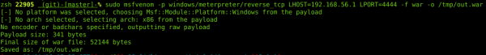

Exploit :: Tomcat Host-manager

# Tomcat exploit variant : host-manager

During an internal audit mission, I was led to exploit a Windows based Tomcat instance. Now usually, exploiting a Tomcat instance involves accessing the “manager”, which is suite a simple exploit.

However, in this context, the manager was not accessible (403 HTTP error). But, and this is where it gets interesting, the host-manager was reachable.

**Context :**
Our target -> Windows 2012R2 server (192.168.56.31)
Command Control C&C (Our Machine) -> Ubuntu 16.04 (192.168.56.1)
Tomcat Version -> Latest release at the time of writing (8.5.37)

## Reconnaissance

A nmap scan on the target host reveals that Tomcat is listening on the 8080 port.

This kind of target is ideal when auditing, because as a rule of thumb Tomcat is running with “nt authority\system” rights on the Windows host, which enables us to gain total control on the server should we succeed in breaching it. This in turn grants us passwords and hashes that will then enable us to move forward in our privilege escalation in the network.

## Authentification

On first discovery of a Tomcat instance, the first action as an auditor is to try and authenticate through the manager. We generally try default credentials such as admin/admin or tomcat/tomcat.

In this instance, I got an “Access Refused 403” when trying to access the manager with the “tomcat/tomcat” combo.

But, when I try the same thing on the host-manager ….
… boom, HTTP 200, we are in.

A few techniques are available to automatize the bruteforce phase:

### Module Metasploit : auxiliary/scanner/http/tomcat_mgr_login

### Hydra

### Nikto (it integrates a test with the login combo “tomcat/tomcat”)

### A few scripts linked to Tomcat

e.g. : *https://gist.github.com/th3gundy/d562eb1ae5dc42d666d3aab761bd4d96*

## Exploiting the « host-manager »

Ok, so we’ve got access to the host-manager, now what?

The application does not have and upload form, and from what I’d gathered from the documentation, you need to know and control the path of the application you want to deploy, as well as a valid vhost.

And when I was reading the doc again, I had the idea which would later become the exploit: what if I could create a UNC path pointing towards an SMB server (smbserver.py by impacket) that I controled !

Bingo! Tomcat connects to my server!

Which means that Tomcat interprets the UNC path and is trying to install an application from the “datatest” folder. We will oblige it and create the “datatest” folder, and add a little WAR file in which we insert a backdoor that will enable us to take over the server from our C&C.

### 1- Creating a WAR

Creating a WAR is relatively simple; it’s a zip file whose extension we change to .war. Inside the zip file we have a JSP file that lets us execute system commands through the browser.

We create our own ZIP with the backdoor inside it…

… and change the extension:

For all you script kiddies out there that aren’t sure about what you’re doing, you can use the handy msfvenom tool to create a WAR file and execute “meterpreter” directly:

### 2- Deploy and pwn

Now that our WAR file is on the Tomcat server and deploy it from our C&C, we are going to use the smbserver.py provided by the “impacket” package to share the following folder:

The deployment is done remotely, and the files are stored on our C&C. To access our backdoor, Tomcat uses the alias, which means it might be necessary to add the server’s IP in the /etc/hosts with vhost that we used for deployment.

Now we configure the application before deployment:

Success !

Connection of Tomcat from my SMB server during deployment:

A quick trip to our browser confirms that our backdoor is now in place, and that we can execute system commands on the Windows server.

Contents of the directory on my machine once deployment is finished:

This method of Tomcat exploit has been tested on the following Tomcat versions when hosted on a windows server: <=7.0.92 et <=8.5.37.