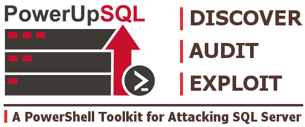

GitHub - NetSPI/PowerUpSQL: PowerUpSQL: A PowerShell Toolkit for Attacking SQL Server

### Join GitHub today

GitHub is home to over 50 million developers working together to host and review code, manage projects, and build software together.

 [Sign up](https://github.com/join?source=prompt-code&source_repo=NetSPI%2FPowerUpSQL)

   master

 [**2**  branches](https://github.com/NetSPI/PowerUpSQL/branches)  [**0**  tags](https://github.com/NetSPI/PowerUpSQL/tags)

 [Go to file](https://github.com/NetSPI/PowerUpSQL/find/master)

  Code

## Latest commit

 

 [nullbind](https://github.com/NetSPI/PowerUpSQL/commits?author=nullbind)    [Update README.md](https://github.com/NetSPI/PowerUpSQL/commit/e244b00cba06b3ae759d2394a6ddef345ba187c9)

 

 [e244b00](https://github.com/NetSPI/PowerUpSQL/commit/e244b00cba06b3ae759d2394a6ddef345ba187c9)  [9 days ago](https://github.com/NetSPI/PowerUpSQL/commit/e244b00cba06b3ae759d2394a6ddef345ba187c9)

## Git stats

- [  **872**  commits](https://github.com/NetSPI/PowerUpSQL/commits/master)

## Files

Type

Name

Latest commit message

Commit time

 

 [images](https://github.com/NetSPI/PowerUpSQL/tree/master/images)

   [Add files via upload](https://github.com/NetSPI/PowerUpSQL/commit/482d9cbc322e002399ddb2cc34e3248c6a756973)

 10 months ago

 

 [presentations](https://github.com/NetSPI/PowerUpSQL/tree/master/presentations)

   [Add PowerUpSQL presentations](https://github.com/NetSPI/PowerUpSQL/commit/7de01bbb3bbdda3424e6ed14cd7ebb63f4eec16a)

 2 years ago

 

 [scripts](https://github.com/NetSPI/PowerUpSQL/tree/master/scripts)

   [Delete sqlclient.csproj](https://github.com/NetSPI/PowerUpSQL/commit/215c5e7fa02955add1c2a62d75fc39716cb16ba1)

 16 months ago

 

 [templates](https://github.com/NetSPI/PowerUpSQL/tree/master/templates)

   [Update AllowPublicXpRegWrite](https://github.com/NetSPI/PowerUpSQL/commit/8ef4adffe86721ad5be1c190399154224e22aa85)

 5 months ago

 

 [tests](https://github.com/NetSPI/PowerUpSQL/tree/master/tests)

   [Add placeholder for Get-SQLDomainObject](https://github.com/NetSPI/PowerUpSQL/commit/e6d07426b35c82138a6ff6025d3bbd7c6d8f62d8)

 3 years ago

 

 [LICENSE](https://github.com/NetSPI/PowerUpSQL/blob/master/LICENSE)

   [Update LICENSE](https://github.com/NetSPI/PowerUpSQL/commit/e59fe8d02ab680dd4df3176690df3b3a83e953ce)

 3 months ago

 

 [PowerUpSQL.ps1](https://github.com/NetSPI/PowerUpSQL/blob/master/PowerUpSQL.ps1)

   [Merge pull request](https://github.com/NetSPI/PowerUpSQL/commit/f7a13f4f16f01258dce17e2e6978772756b704e1)  [#51](https://github.com/NetSPI/PowerUpSQL/pull/51)  [from TVqQAAMA/master](https://github.com/NetSPI/PowerUpSQL/commit/f7a13f4f16f01258dce17e2e6978772756b704e1)

 9 days ago

 

 [PowerUpSQL.psd1](https://github.com/NetSPI/PowerUpSQL/blob/master/PowerUpSQL.psd1)

   [update version](https://github.com/NetSPI/PowerUpSQL/commit/f2a09d5652f772eed673f0f5e11e7d155b94b923)

 16 months ago

 

 [PowerUpSQL.psm1](https://github.com/NetSPI/PowerUpSQL/blob/master/PowerUpSQL.psm1)

   [Clean PowerShell Scripts](https://github.com/NetSPI/PowerUpSQL/commit/b774f3b2e7278556db0dcc97be110a011adc24fc)

 4 years ago

 

 [README.md](https://github.com/NetSPI/PowerUpSQL/blob/master/README.md)

   [Update README.md](https://github.com/NetSPI/PowerUpSQL/commit/e244b00cba06b3ae759d2394a6ddef345ba187c9)

 9 days ago

##  README.md

 

PowerUpSQL includes functions that support SQL Server discovery, weak configuration auditing, privilege escalation on scale, and post exploitation actions such as OS command execution. It is intended to be used during internal penetration tests and red team engagements. However, PowerUpSQL also includes many functions that can be used by administrators to quickly inventory the SQL Servers in their ADS domain and perform common threat hunting tasks related to SQL Server.

### PowerUpSQL Wiki

For setup instructions, [cheat Sheets](https://github.com/NetSPI/PowerUpSQL/wiki/PowerUpSQL-Cheat-Sheet), blogs, function overviews, and usage information check out the wiki: https://github.com/NetSPI/PowerUpSQL/wiki

### Author and Contributors

- Author: Scott Sutherland (@_nullbind)
- Major Contributors: Antti Rantasaari, Eric Gruber (@egru), Thomas Elling (@thomaselling)
- Contributors: Alexander Leary (@0xbadjuju), @leoloobeek, Andrew Luke(@Sw4mpf0x), Mike Manzotti (@mmanzo_), @TVqQAAMA, @cobbr_io, @mariuszbit, @0xe7 (@exploitph), phackt(@phackt_ul), @vsamiamv, and @ktaranov

### Issue Reports

I perform QA on functions before we publish them, but it's hard to consider every scenario. So I just wanted to say thanks to those of you that have taken the time to give me a heads up on issues with PowerUpSQL so that we can make it better.

- Bug Reporters: @ClementNotin, @runvirus, @CaledoniaProject, @christruncer, rvrsh3ll(@424f424f),@mubix (Rob Fuller)

### License

- BSD 3-Clause

## About

PowerUpSQL: A PowerShell Toolkit for Attacking SQL Server

### Resources

 [Readme](https://github.com/NetSPI/PowerUpSQL#readme)

### License

 [![](data:image/svg+xml,%3csvg xmlns='http://www.w3.org/2000/svg' mr='2' height='16' class='octicon octicon-law mr-2 js-evernote-checked' viewBox='0 0 16 16' version='1.1' width='16' aria-hidden='true' data-evernote-id='59'%3e%3cpath fill-rule='evenodd' d='M8.75.75a.75.75 0 00-1.5 0V2h-.984c-.305 0-.604.08-.869.23l-1.288.737A.25.25 0 013.984 3H1.75a.75.75 0 000 1.5h.428L.066 9.192a.75.75 0 00.154.838l.53-.53-.53.53v.001l.002.002.002.002.006.006.016.015.045.04a3.514 3.514 0 00.686.45A4.492 4.492 0 003 11c.88 0 1.556-.22 2.023-.454a3.515 3.515 0 00.686-.45l.045-.04.016-.015.006-.006.002-.002.001-.002L5.25 9.5l.53.53a.75.75 0 00.154-.838L3.822 4.5h.162c.305 0 .604-.08.869-.23l1.289-.737a.25.25 0 01.124-.033h.984V13h-2.5a.75.75 0 000 1.5h6.5a.75.75 0 000-1.5h-2.5V3.5h.984a.25.25 0 01.124.033l1.29.736c.264.152.563.231.868.231h.162l-2.112 4.692a.75.75 0 00.154.838l.53-.53-.53.53v.001l.002.002.002.002.006.006.016.015.045.04a3.517 3.517 0 00.686.45A4.492 4.492 0 0013 11c.88 0 1.556-.22 2.023-.454a3.512 3.512 0 00.686-.45l.045-.04.01-.01.006-.005.006-.006.002-.002.001-.002-.529-.531.53.53a.75.75 0 00.154-.838L13.823 4.5h.427a.75.75 0 000-1.5h-2.234a.25.25 0 01-.124-.033l-1.29-.736A1.75 1.75 0 009.735 2H8.75V.75zM1.695 9.227c.285.135.718.273 1.305.273s1.02-.138 1.305-.273L3 6.327l-1.305 2.9zm10 0c.285.135.718.273 1.305.273s1.02-.138 1.305-.273L13 6.327l-1.305 2.9z' data-evernote-id='831' class='js-evernote-checked'%3e%3c/path%3e%3c/svg%3e)View license](https://github.com/NetSPI/PowerUpSQL/blob/master/LICENSE)

##   [Releases](https://github.com/NetSPI/PowerUpSQL/releases)

No releases published

##   [Contributors12](https://github.com/NetSPI/PowerUpSQL/graphs/contributors)

- 

- 

- 

- 

- 

- 

- 

- 

- 

- 

- 

- 

## Languages

- [PowerShell91.5%](https://github.com/NetSPI/PowerUpSQL/search?l=powershell)

- [TSQL5.7%](https://github.com/NetSPI/PowerUpSQL/search?l=tsql)

- [C#2.0%](https://github.com/NetSPI/PowerUpSQL/search?l=c%23)

- [C++0.8%](https://github.com/NetSPI/PowerUpSQL/search?l=c%2B%2B)