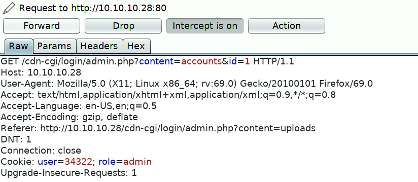

Hack The Box :: Starting Point :: Oopsie :: Linux

# Enumeration

`nmap -sS -A 10.10.10.28`
[nmap.webp](../_resources/6dbd26a9b7ba9a4408093e5c7245fd01.webp)

Nmap reveals reveals that SSH and Apache are available on their default ports. Let's check out the website.

[website.webp](../_resources/82115d1e6848750375d02731c77703a0.webp)

It seems to be a website for the electric vehicle manufacturer MegaCorp. Scrolling down, we note that a reference is made to logging in.

We can't see anything else of interest, so let's send the request to a web proxy such as Burp, so we can examine the website in more detail. We point the browser to the Burp proxy at `127.0.0.1:8080`, refresh the page, and forward the request.

On the `Target` tab, we notice that Burp has passively spidered the website while processing the request.

[spider.webp](../_resources/fc227f7d7132bc8fbd2b2816347c6cf5.webp)

The URL **/cdn-cgi/login** seems interesting, let's examine this in the browser.

[login.webp](../_resources/5e0620787d4f1b4037d655db5cabc694.webp)

We confirm that this is a login page. Let's try to reuse the password `MEGACORP_4dm1n!!` from the previously compromised machine, with common usernames such as **administrator** or **admin** .

This is successful, and we gain access to the web portal, which contains additional functionality.

[portal.webp](../_resources/df760b2ff73a25487302ad1300cd30ce.webp)

However, it seems the developer has implemented tiers of administration, and the `Uploads` page is further restricted to the **super admin** user.

Let's examine the portal further in Burp. We refresh on the `Accounts` page, which displays the user id for our current user, and intercept the request. We notice what seems to be a custom cookie implementation, comprising of the **user** value and **role**. We also notice the **id** parameter, which for our current `admin` user is `1`.

It might be possible to brute force the **id** values, and display the **user** value for another user, such as the super admin account. We can do this using Burp's Intruder module. Click CTRL + i to sent the request to Intruder.

We press `Clear` to remove the pre-populated payload positions, select the Id value (1), and click `Add`. Next, click on the `Payloads` tab.

We can generate a sequential list of 1-100 using a simple bash loop.
`for i in `seq 1 100`; do echo $i; done`
Paste the output into the Payloads box.

Next, click on the `Options` tab, and ensure that `Follow Redirections`is set to "Always", and select the option to "Process cookies in redirections".

Click on the `Target` tab, and then click `Start attack`. We sort responses by Length, and view the results.

A few of a responses have a different length, and we proceed to examine them. The super admin account is visible, and corresponding user value is identified.

Let's try to access the `Uploads` page again, substituting our user value with the super admins.

# Foothold

This is successful, and we gain access to the upload page, which allows branding images to be uploaded.

[uploads_page.webp](../_resources/f0fa3c77e874b7f178c78a4cf3780d08.webp)

It's possible that the developer forgot to implement user input validation, and so we should test if we can upload other files, such as a PHP webshell. On Parrot-OS, we can use the PHP reverse shell `/usr/share/webshells/php/php-reverse-shell.php`.

After changing the IP and port values, we upload the file, capture the request, substitute the user value as before, and click Forward.

Page text reports that the upload was successful, but we don't know where the reverse shell was uploaded to. Let's enumerate the web server for common directories using [dirsearch](https://github.com/maurosoria/dirsearch).

	git clone https://github.com/maurosoria/dirsearch.git
	cd dirsearch
	python3 dirsearch.py -u http://10.10.10.28 -e php

[dirsearch.webp](../_resources/c18d84fbbd68b8978e8ba2842098a21f.webp)

This identified an uploads directory, and we can set up our listener and trigger a reverse shell using curl.

`curl http://10.10.10.28/uploads/test.php`
We land a shell as `www-data` and proceed to upgrade it.
[shell.webp](../_resources/cda39aed9c6101f2ca629f1c8e5fb270.webp)

	SHELL=/bin/bash script -q /dev/null
	Ctrl-Z
	stty raw -echo
	fg
	reset
	xterm

# Lateral Movement

The website records are probably retrieved from a database, so it's a good idea to check for database connection information. Indeed, `db.php` does contain credentials, and we can `su robert` to move laterally.

[db.webp](../_resources/cee1359d9c026579456af1feab7b5269.webp)

# Privilege Escalation

The `id` command reveals that **robert** is a member of the **bugracker** group. We can enumerate the filesystem to see if this group has any special access.

[group.webp](../_resources/725bedb258ed7c37f484d86f6d195594.webp)

There is a `bugtracker` binary, and the setuid but is set. Let's run it and see what it does.

[bugtracker.webp](../_resources/cb7fc547fc316cb1ed16976ac1d32075.webp)

It seems to output a report based on the ID value provided. Let's use strings to see how it does this.

[strings.webp](../_resources/225685be9139569d2fa043611ff119a8.webp)

We see that it calls the `cat` binary using this relative path instead of the absolute path. By creating a malicious `cat`, and modifying the path to include the current working directory, we should be able to abuse this misconfiguration, and escalate our privileges to root.

Let's add the current working directory to PATH, create the malicious binary and make it executable.

	export PATH=/tmp:$PATH
	cd /tmp/
	echo '/bin/sh' > cat
	chmod +x cat

[root.webp](../_resources/fd561f34b5ed37a3a8247d9830f38b20.webp)

# Post Exploitation

Inside root's folder, we see a .config folder, which contains a FileZilla config file with the credentials **ftpuser / mc@F1l3ZilL4** visible in plain text.