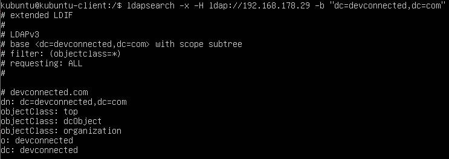
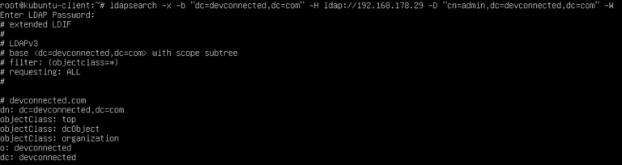
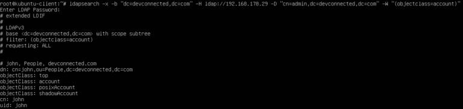
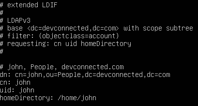
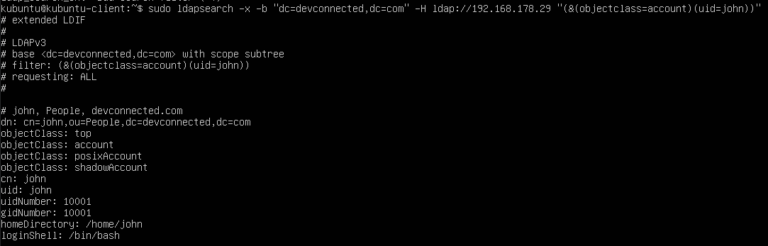
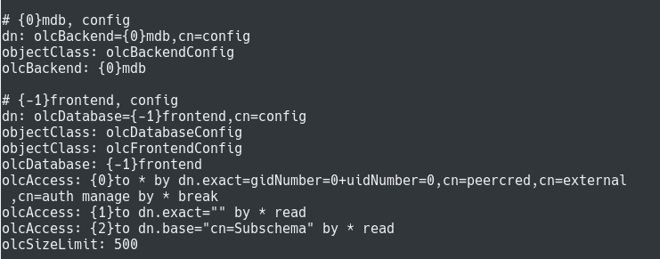
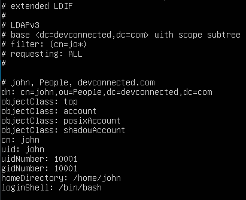

How To Search LDAP using ldapsearch (With Examples) – devconnected

[Advanced](https://devconnected.com/category/linux-administration/advanced/)[Linux System Administration](https://devconnected.com/category/linux-administration/)

# How To Search LDAP using ldapsearch (With Examples)

written by [schkn](https://devconnected.com/author/schkn/)

If you are working in a medium to large company, you are probably interacting on a daily basis with **LDAP.**

Whether this is on a Windows domain controller, or on a Linux **OpenLDAP server**, the **LDAP protocol** is very useful to centralize authentication.

However, as your LDAP directory grows, you might get lost in all the entries that you may have to manage.

Luckily, there is a command that will help you search for entries in a LDAP directory tree : **ldapsearch**.

In this tutorial, we are going to see how you can easily **search LDAP using ldapsearch**.

We are also going to review the options provided by the command in order to perform advanced **LDAP searches**.

Table of Contents
[**]()

- [counters(item,.) . Search LDAP using ldapsearch](https://devconnected.com/how-to-search-ldap-using-ldapsearch-examples/#Search_LDAP_using_ldapsearch)
    - [counters(item,.) . Search LDAP with admin account](https://devconnected.com/how-to-search-ldap-using-ldapsearch-examples/#Search_LDAP_with_admin_account)
- [counters(item,.) . Running LDAP Searches with Filters](https://devconnected.com/how-to-search-ldap-using-ldapsearch-examples/#Running_LDAP_Searches_with_Filters)
    - [counters(item,.) . Finding all objects in the directory tree](https://devconnected.com/how-to-search-ldap-using-ldapsearch-examples/#Finding_all_objects_in_the_directory_tree)
    - [counters(item,.) . Finding user accounts using ldapsearch](https://devconnected.com/how-to-search-ldap-using-ldapsearch-examples/#Finding_user_accounts_using_ldapsearch)
    - [counters(item,.) . AND Operator using ldapsearch](https://devconnected.com/how-to-search-ldap-using-ldapsearch-examples/#AND_Operator_using_ldapsearch)
    - [counters(item,.) . OR Operator using ldapsearch](https://devconnected.com/how-to-search-ldap-using-ldapsearch-examples/#OR_Operator_using_ldapsearch)
    - [counters(item,.) . Negation Filters using ldapsearch](https://devconnected.com/how-to-search-ldap-using-ldapsearch-examples/#Negation_Filters_using_ldapsearch)
    - [counters(item,.) . Finding LDAP server configuration using ldapsearch](https://devconnected.com/how-to-search-ldap-using-ldapsearch-examples/#Finding_LDAP_server_configuration_using_ldapsearch)
    - [counters(item,.) . Using Wildcards in LDAP searches](https://devconnected.com/how-to-search-ldap-using-ldapsearch-examples/#Using_Wildcards_in_LDAP_searches)
- [counters(item,.) . Ldapsearch Advanced Options](https://devconnected.com/how-to-search-ldap-using-ldapsearch-examples/#Ldapsearch_Advanced_Options)
    - [counters(item,.) . LDAP Extensible Match Filters](https://devconnected.com/how-to-search-ldap-using-ldapsearch-examples/#LDAP_Extensible_Match_Filters)
        - [counters(item,.) . Supercharging default operators](https://devconnected.com/how-to-search-ldap-using-ldapsearch-examples/#Supercharging_default_operators)
- [counters(item,.) . Conclusion](https://devconnected.com/how-to-search-ldap-using-ldapsearch-examples/#Conclusion)

## Search LDAP using ldapsearch

**The easiest way to search LDAP is to use ldapsearch with the “-x” option for simple authentication and specify the search base with “-b”.**

If you are not running the search directly on the LDAP server, you will have to specify the host with the “-H” option.

`$ ldapsearch -x -b <search_base> -H <ldap_host>`

As an example, let’s say that you have an [OpenLDAP server installed and running](https://devconnected.com/how-to-setup-openldap-server-on-debian-10/) on the 192.168.178.29 host of your network.

If your server is accepting anonymous authentication, you will be able to perform a LDAP search query without binding to the admin account.

`$ ldapsearch -x -b "dc=devconnected,dc=com" -H ldap://192.168.178.29`

As you can see, if you don’t specify any filters, the LDAP client will assume that you want to run a search on all object classes of your directory tree.

As a consequence, you will be presented with a lot of information. If you want to restrict the information presented, we are going to explain **LDAP filters** in the next chapter.

### Search LDAP with admin account

In some cases, you may want to run LDAP queries as the admin account in order to have additionnal information presented to you.

To achieve that, you will need to make a bind request using the administrator account of the LDAP tree.

**To search LDAP using the admin account, you have to execute the “ldapsearch” query with the “-D” option for the bind DN and the “-W” in order to be prompted for the password.**

`$ ldapsearch -x -b <search_base> -H <ldap_host> -D <bind_dn> -W`

As an example, let’s say that your administrator account has the following distinguished name : “*cn=admin,dc=devconnected,dc=com*“.

In order to perform a **LDAP search** as this account, you would have to run the following query

`$ ldapsearch -x -b "dc=devconnected,dc=com" -H ldap://192.168.178.29 -D "cn=admin,dc=devconnected,dc=com" -W `

When running a LDAP search as the administrator account, you may be exposed to user encrypted passwords, so make sure that you run your query privately.

## Running LDAP Searches with Filters

Running a plain **LDAP search query** without any filters is likely to be a waste of time and resource.

Most of the time, you want to run a **LDAP search** query in order to find specific objects in your LDAP directory tree.

**In order to search for a LDAP entry with filters, you can append your filter at the end of the ldapsearch command : on the left you specify the object type and on the right the object value.**

Optionally, you can specify the attributes to be returned from the object (the username, the user password etc.)

`$ ldapsearch <previous_options> "(object_type)=(object_value)" <optional_attributes>`

### Finding all objects in the directory tree

In order to return all objects available in your LDAP tree, **you can append the “objectclass” filter and a wildcard character “*” to specify that you want to return all objects.**

`$ ldapsearch -x -b <search_base> -H <ldap_host> -D <bind_dn> -W "objectclass=*"`

When executing this query, you will be presented with all objects and all attributes available in the tree.

### Finding user accounts using ldapsearch

For example, let’s say that you want to find all user accounts on the LDAP directory tree.

By default, user accounts will most likely have the “account” structural object class, which can be used to narrow down all user accounts.

`$ ldapsearch -x -b <search_base> -H <ldap_host> -D <bind_dn> -W "objectclass=account"`

By default, the query will return all attributes available for the given object class.

As specified in the previous section, you can append optional attributes to your query if you want to narrow down your search.

For example, if you are interested only in the user CN, UID, and home directory, you would run the following LDAP search

`$ ldapsearch -x -b <search_base> -H <ldap_host> -D <bind_dn> -W "objectclass=account" cn uid homeDirectory`

Awesome, you have successfully performed a LDAP search using filters and attribute selectors!

### AND Operator using ldapsearch

**In order to have multiple filters separated by “AND” operators, you have to enclose all the conditions between brackets and have a “&” character written at the beginning of the query.**

`$ ldapsearch <previous_options> "(&(<condition_1>)(<condition_2>)...)"`

For example, let’s say that you want to find all entries have a “objectclass” that is equal to “account” and a “uid” that is equal to “john”, you would run the following query

`$ ldapsearch <previous_options> "(&(objectclass=account)(uid=john))"`

### OR Operator using ldapsearch

** In order to have multiple filters separated by “OR” operators, you have to enclose all the conditions between brackets and have a “|” character written at the beginning of the query. **

`$ ldapsearch <previous_options> "(|(<condition_1>)(<condition_2>)...)"`

For example, if you want to find all entries having a object class of type “account” or or type “organizationalRole”, you would run the following query

`$ ldapsearch <previous_options> "(|(objectclass=account)(objectclass=organizationalRole))"`

### Negation Filters using ldapsearch

In some cases, you want to negatively match some of the entries in your LDAP directory tree.

**In order to have a negative match filter, you have to enclose your condition(s) with a “!” character and have conditions separated by enclosing parenthesis.**

`$ ldapsearch <previous_options> "(!(<condition_1>)(<condition_2>)...)"`

For example, if you want to match all entries NOT having a “cn” attribute of value “john”, you would write the following query

`$ ldapsearch <previous_options> "(!(cn=john))"`

### Finding LDAP server configuration using ldapsearch

One advanced usage of the ldapsearch command is to retrieve the configuration of your LDAP tree.

If you are familiar with OpenLDAP, you know that there is a [global configuration object](https://www.openldap.org/devel/admin/slapdconf2.html#cn=config) sitting at the top of your LDAP hierarchy.

In some cases, you may want to see attributes of your LDAP configuration, in order to modify access control or to modify the root admin password for example.

**To search for the LDAP configuration, use the “ldapsearch” command and specify “cn=config” as the search base for your LDAP tree. **

To run this search, you have to use the “-Y” option and specify “EXTERNAL” as the authentication mechanism.

`$ ldapsearch -Y EXTERNAL -H ldapi:/// -b cn=config `
**

**> Note **> : this command has to be run on the server directly, not from one of your LDAP clients.

**

By default, this command will return a lot of results as it returns backends, schemas and modules.

If you want to restrict your search to database configurations, you can specify the “olcDatabaseConfig” object class with ldapsearch.

`$ ldapsearch -Y EXTERNAL -H ldapi:/// -b cn=config "(objectclass=olcDatabaseConfig)"`

### Using Wildcards in LDAP searches

Another powerful way of searching through a list of LDAP entries is to use wildcards characters such as the asterisk (“*”).

The wildcard character has the same function as the asterisk you use in regex : it will be used to match any attribute starting or ending with a given substring.

	$ ldapsearch <previous_options> "(object_type)=*(object_value)"

	$ ldapsearch <previous_options> "(object_type)=(object_value)*"

As an example, let’s say that you want to find all entries having an attribute “uid” starting with the letter “j”.

`$ ldapsearch <previous_options> "uid=jo*"`

## Ldapsearch Advanced Options

In this tutorial, you learnt about basic ldapsearch options but there are many others that may be interested to you.

### LDAP Extensible Match Filters

Extensible LDAP match filters are used to **supercharge existing operators** (for example the equality operator) by specifying the type of comparison that you want to perform.

#### Supercharging default operators

**To supercharge a LDAP operator, you have to use the “:=” syntax.**
`$ ldapsearch <previous_options> "<object_type>:=<object_value>"`

For example, if you want to search for all entries have a “cn” that is equal to “john,” you would run the following command

	$ ldapsearch <previous_options> "cn:=john"

	# Which is equivalent to

	$ ldapsearch <previous_options> "cn=john"

As you probably noticed, running the search on “john” or on “JOHN” returns the same exact result.

As a consequence, you may want to constraint the results to the “john” exact match, making the search case sensitive.

**Using ldapsearch, you can add additional filters separated by “:” characters.**

`$ ldapsearch <previous_options> "<object_type>:<op1>:<op2>:=<object_value>"`

For example, in order to have a search which is case sensitive, you would run the following command

`$ ldapsearch <previous_options> "cn:caseExactMatch:=john"`

If you are not familiar with LDAP match filters, here is a list of [all the operators available to you](https://ldapwiki.com/wiki/MatchingRule).

## Conclusion

In this tutorial, you learnt how you can **search a LDAP directory tree** using the **ldapsearch **command.

You have seen the basics of searching basic entries and attributes as well as building **complex matching filters** with operators (and, or and negative operators).

You also learnt that it is possible to **supercharge existing operators** by using extensible match options and specifying the custom operator to be used.

If you are interested in Advanced Linux System Administration, we have a complete section dedicated to it on the website, so make sure to check it out!

[ldap](https://devconnected.com/tag/ldap/)

**1 comment
*0*[**]()

[**Facebook](https://www.facebook.com/sharer/sharer.php?u=https://devconnected.com/how-to-search-ldap-using-ldapsearch-examples/)[**Twitter](https://twitter.com/intent/tweet?text=Check%20out%20this%20article:%20How%20To%20Search%20LDAP%20using%20ldapsearch%20%28With%20Examples%29%20-%20https://devconnected.com/how-to-search-ldap-using-ldapsearch-examples/)[**Reddit](https://reddit.com/submit?url=https%3A%2F%2Fdevconnected.com%2Fhow-to-search-ldap-using-ldapsearch-examples%2F&title=How%20To%20Search%20LDAP%20using%20ldapsearch%20%28With%20Examples%29)

##### [schkn](https://devconnected.com/author/schkn/)

previous post

[ ##### How To Switch Branch on Git](https://devconnected.com/how-to-switch-branch-on-git/)

next post

[ ##### LVM Snapshots Backup and Restore on Linux](https://devconnected.com/lvm-snapshots-backup-and-restore-on-linux/)

#### You may also like

[none](https://devconnected.com/arping-command-on-linux-explained/)

### [Arping Command on Linux Explained](https://devconnected.com/arping-command-on-linux-explained/)

[none](https://devconnected.com/how-to-copy-directory-on-linux/)

### [How To Copy Directory on Linux](https://devconnected.com/how-to-copy-directory-on-linux/)

[none](https://devconnected.com/how-to-install-samba-on-debian-10-buster/)

### [How To Install Samba on Debian 10 Buster](https://devconnected.com/how-to-install-samba-on-debian-10-buster/)

#### 1 comment

[Links 3/2/2020: Wine 5.1 Released, GNU/Linux Benchmarks Against Vista 10 (Windows Loses), KDevelop 5.5 | Techrights](http://techrights.org/2020/02/03/kdevelop-5-5/)

[…] How To Search LDAP using ldapsearch (With Examples) […]

[Reply](https://devconnected.com/how-to-search-ldap-using-ldapsearch-examples/#comment-6677)

### Leave a Comment

Save my name, email, and website in this browser for the next time I comment.

This site uses Akismet to reduce spam. [Learn how your comment data is processed](https://akismet.com/privacy/).