Impacket Guide: SMB/MSRPC

# Impacket Guide: SMB/MSRPC

posted in[Red Teaming](https://www.hackingarticles.in/category/red-teaming/)on [May 7, 2020](https://www.hackingarticles.in/impacket-guide-smb-msrpc/) by[Raj Chandel](https://www.hackingarticles.in/author/raaj/)

[SHARE]()

There have been many Red Team scenarios, Capture the Flag challenges where we face the Windows Server. After exploiting and getting the initial foothold in the server, it is tough to extract the data and as well as there are scenarios where we couldn’t get onto the server per se. But using the SMB, we can execute commands remotely on the server. The SecureAuth visualized this, and they gave us one of the most amazing collections of Python classes for working on different protocols. This collection is named Impacket.

Official GitHub Repository:   [SecureAuthCorp /impacket](https://github.com/SecureAuthCorp/impacket)

### **Table of Contents**

- **Introduction to SMB**
- **Introduction to MSRPC**
- **Configurations Used in Practical**
- **Impacket Categories**
- **Installation**
- **smbclient.py**
- **lookupsid.py**
- **reg.py**
- **rpcdump.py**
- **samrdump.py**
- **services.py**
- **ifmap.py**
- **opdump.py**
- **getArch.py**
- **netview.py**
- **Conclusion**

### **Introduction to SMB**

The SMB is a network protocol which is also known as the Server Message Block protocol. It is used to communicate between a client and a server. It can be used to share the files, printers and some other network resources. It was created by IBM in the 1980s.

### **Introduction to MSRPC**

MSRPC or Microsoft Remote Procedure Call is a modified version of DCE/RPC. It was created by Microsoft to seamlessly create a client/server model in Windows. The Windows Server domain protocols are entirely based on MSRPC.

### **Configurations Used in Practical**

- **Attacker Machine**
    - **OS: **Kali Linux 2020.1
    - **IP Address: **168.1.112
- **Target Machine**
    - **OS: **Windows Server 2016
    - **IP Address: **168.1.105

### **Impacket Categories**

- **Remote Execution**
- **Kerberos**
- **Windows Secrets**
- **Server Tools/MiTM Attacks**
- **WMI**
- **Known Vulnerabilities**
- **SMB/MSRPC**
    - smbclient.py
    - lookupsid.py
    - reg.py
    - rpcdump.py
    - samrdump.py
    - services.py
    - ifmap.py
    - opdump.py
    - getArch.py
    - netview.py
- **MSSQL / TDS**
- **File Formats**
- **Other**

### **Installation **

Before using the Impacket tool kit on our system, we need to install it. The installation process is quite simple. First, head to the GitHub Repository by clicking [here](https://github.com/SecureAuthCorp/impacket). Then using the git clone command, we clone the complete repository to our Attacker Machine. After cloning we can see that there is a setup.py file, let us install it. After installation, we will head to the examples directory and use the scripts as per our convenience.

|     |     |
| --- | --- |
| 1 2 3 4 | git clone  https://github.com/SecureAuthCorp/impacket.git cd impacket/ ls python setup.py install |

### 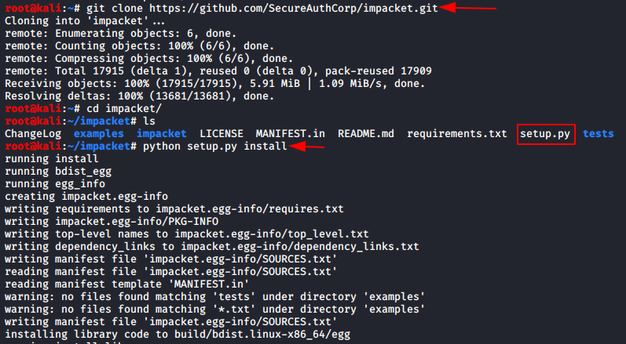

### **smbclient.py**

There are moments where we needed to perform multiple actions between the attacker machine and the target machine. It can be listing shares and files, renaming some file, uploading the binaries or downloading files from the target machine. There are some situations where we even need to create a folder or two on the target machine. Performing such actions can get tricky while working with a shell that can be detected or can close at any time. The smbclient.py script helps us in these situations. It can connect to the Target Machine with the help of a bunch of attributes.

**Requirements:**

- **Domain**
- **Username**
- **Password/Password Hash**
- **Target IP Address**

When we provide the following parameters to the smbclient in such a format as shown below and we will get connected to the target machine and we have an smb shell which can run a whole range of commands like dir, cd, pwd, put, rename, more, del, rm, mkdir, rmdir, info, etc

**Syntax: **
**smbclient.py [domain]/[user]:[password/password hash]@[Target IP Address]**
**Command:**

|     |     |
| --- | --- |
| 1   | smbclient.py ignite/Administrator:Ignite@987@192.168.1.105 |

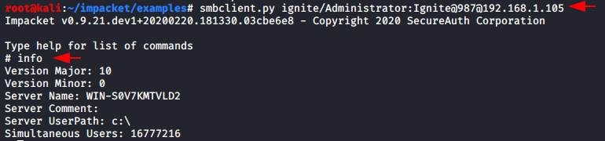

### **lookupsid.py**

A Security Identifier (SID) is a unique value of variable length that is used to identify a user account. Through a SID User Enumeration, we can extract the information about what users exist and their data. Lookupsid script can enumerate both local and domain users. There is a Metasploit module too for this attack. If you are planning on injecting a target server with a golden or a silver ticket then one of the things that are required is the SID of the 500 user. Lookupsid.py can be used in that scenario. When we provide the following parameters to the Lookupsid in such a format as shown below.

**Requirements:**

- **Domain**
- **Username**
- **Password/Password Hash**
- **Target IP Address**

**Syntax: **
**lookupsid.py [domain]/[user]:[password/password hash]@[Target IP Address]**
**Command:**

|     |     |
| --- | --- |
| 1   | lookupsid.py ignite/Administrator:Ignite@987@192.168.1.105 |

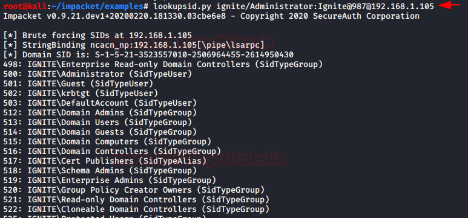

### **reg.py**

This Impacket script is ripped straight out of the reg.exe of the Windows OS. Reg.exe is an executable service that can read, modify and delete registry values when used with eh combination of the query, add, delete keywords respectively. We can even begin to express the importance of access to the registry. Registry controls each and every aspect of the system. It can be used to gain information about the various policies, software and also alter some of those policies.

**Requirements:**

- **Domain**
- **Username**
- **Password/Password Hash**
- **Target IP Address**
- **Registry Key Name **

**Syntax: **

**reg.py [domain]/[user]:[password:password hash]@[Target IP Address] [action] [action parameter]**

**Command:**

|     |     |
| --- | --- |
| 1   | reg.py ignite/Administrator:Ignite@987@192.168.1.105  query  -keyName HKLM\\SOFTWARE\\Policies\\Microsoft\\Windows  -s |

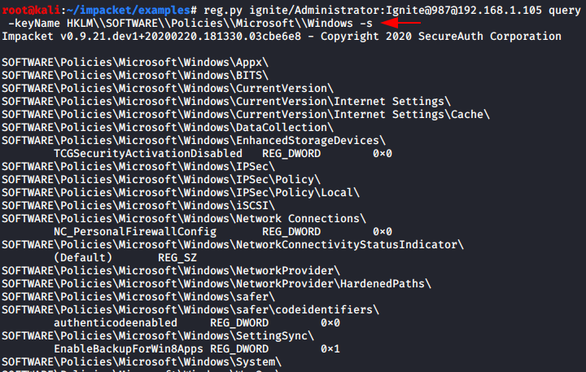

### **rpcdump.py**

RPC or Remote Procedure Call is when a computer program causes a procedure to execute in different address space which is coded as a normal procedure call. This script can enumerate those endpoints for us. It also matches them to some of the well-known endpoints in order to identify them.

**Requirements:**

- **Domain**
- **Username**
- **Password/Password Hash**
- **Target IP Address**

**Syntax: **
**rpcdump.py [domain]/[user]:[Password/Password Hash]@[Target IP Address]**
**Command:**

|     |     |
| --- | --- |
| 1   | rpcdump.py ignite/Administrator:Ignite@987@192.168.1.105 |

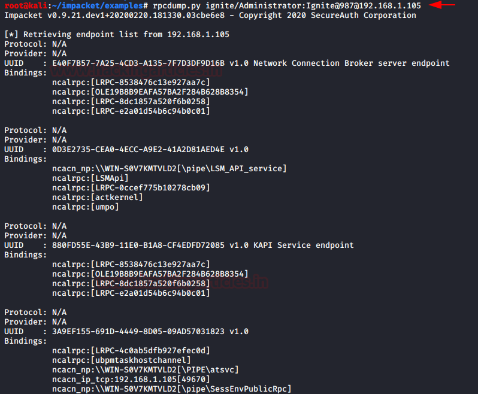

### **samrdump.py**

Samrdump is an application that retrieves sensitive information about the specified target machine using the Security Account Manager (SAM). It is a remote interface that is accessible under the Distributed Computing Environment / Remote Procedure Calls (DCE/RPC) service. It lists out all the system shares, user accounts, and other useful information about the target’s presence in the local network. The image clearly shows us all the user accounts that are held by the remote machine. Inspecting all the available shares for sensitive data and accessing other user accounts can further reveal valuable information.

**Requirements:**

- **Domain**
- **Username**
- **Password/Password Hash**
- **Target IP Address**

**Syntax: **
**samrdump.py [domain]/[user]:[Password/Password Hash]@[Target IP Address]**
**Command:**

|     |     |
| --- | --- |
| 1   | samrdump.py ignite/Administrator:Ignite@987@192.168.1.105 |

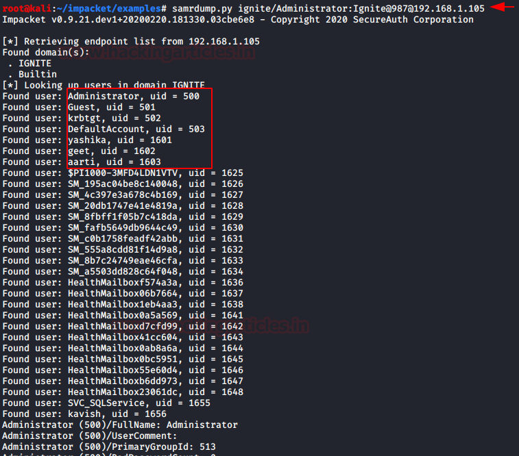

### **services.py**

The services script of the Impacket communicates with Windows services with the help of MSRPC Interface. It can start, stop, delete, read status, config, list, create and change any service. While working on Red Teaming assignments there were so many tasks that could have been simplified if only, we have access to the services of the Target machine. This makes it all a simple task.

**Requirements:**

- **Domain**
- **Username**
- **Password/Password Hash**
- **Target IP Address**
- **Action**

**Syntax: **

**services.py [domain]/[user]:[Password/Password Hash]@[Target IP Address] [Action]**

**Command:**

|     |     |
| --- | --- |
| 1   | services.py ignite/Administrator:Ignite@987@192.168.1.105  list |

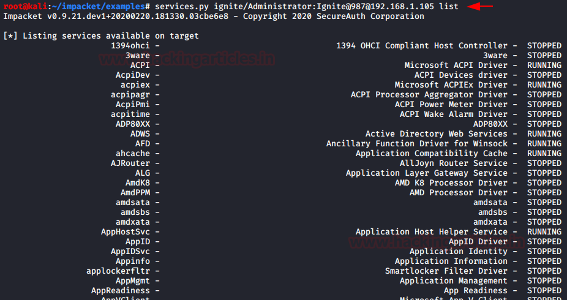

### **ifmap.py**

Ifmap scripts initially bind to the MGMT interface of the Target machine. Then it fetches a list of interface IDs. Then it adds those IDs to another large list of UUIDs it already has in its database. Then it tries to bind each of the interfaces and reports the status of the interface. The status can be listed or listening. Its ability to gather information is unmatched. There is a Metasploit Module that works quite similar to this script is “auxiliary/scanner/dcerpc/endpoint_mapper” The list of UUIDs (Universal Unique Identifier) which are running endpoint-mapper mapped to the unique services. After getting these services, an attacker can search on the internet to find if any of these services are vulnerable to Overflow over RPC.

**Requirements:**

- **Target IP Address**
- **Target Port**
- **Hostname (optional)**

**Syntax: **
**ifmap.py [Target IP Address] [Target Port] **
**Command:**

|     |     |
| --- | --- |
| 1   | ifmap.py  192.168.1.105  135 |

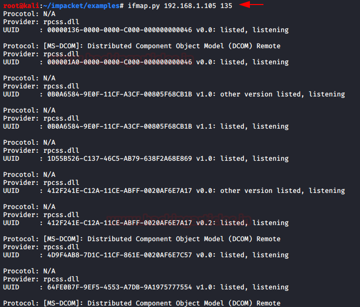

### **opdump.py**

This script binds to the given hostname:port and connects to the DCERPC (Distributed Computing Environment/ Remote Procedure Calls) interface. After connecting, it tries to call each of the first 256 operation numbers in turn and reports the outcome of each call. This generates a burst of TCP connections to the given host:port!

It gives the output as follows:
op 0 (0x00): rpc_x_bad_stub_data
op 1 (0x01): rpc_x_bad_stub_data
op 2 (0x02): rpc_x_bad_stub_data
op 3 (0x03): success
op 4 (0x04): rpc_x_bad_stub_data
ops 5-255: nca_s_op_rng_error

rpc_x_bad_stub_data, rpc_s_access_denied, and success generally means there’s an operation at that number.

**Requirements:**

- **IP Address**
- **Hostname (optional)**
- **Port Interface Version**

**Syntax: **
**opdump.py [Target IP Address] [Port Interface Version]**
**Command:**

|     |     |
| --- | --- |
| 1   | opdump.py  192.168.1.105  135  99FCFEC4-5260-101B-BBCB-00AA0021347A  0.0 |

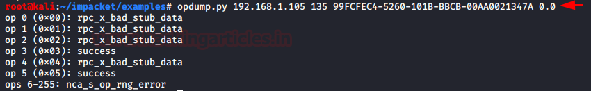

### **getArch.py**

All PDUs (Protocol Data Unit) encoded with the NDR64 transfer syntax must use a value of 0x10 for the data representation format label. This value is used only in the transfers of the x64 bit systems. This scripts when provided with a target tried to communicate with the target system and collects the value of the data representation format label. Then it matches it to the NDR64 syntax stored in its code. Then it can provide the information to the attacker if the Operating System is a 64 bit or 32-bit system. We can also provide a list of targets and it can work simultaneously on all the targets.

**Requirements:**

- **Target IP Address**

**Syntax: **
**getArch.py -target [Target IP Address]**
**getArch.py -targets [Target List]**
**Command:**

|     |     |
| --- | --- |
| 1   | getArch.py  -targets  /root/Desktop/target.txt |

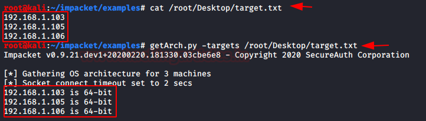

### **netview.py**

It is an enumeration tool. It requires the domain name to enumerate hosts. It can also be provided with a list of hosts or targets. Once a list is gathered then netview checks each of the following:

- **IP addresses**
- **Shares**
- **Sessions **
- **Logged On Users**

Once finding the information it doesn’t stop. It keeps looping over the hosts found and keeps a detailed track of who logged in/out from remote servers. It keeps the connections with the target systems and it is very stealthy as it just sends few DCERPC packets. This script requires that the attacker machine is able to resolve the domain machine’s NetBIOS names. This can be achieved by setting the DNS on the attacker machine to the domain DNS.

**Requirements:**

- **Domain**
- **Target IP Address**
- **Username**

**Syntax:**
**netview.py [domain]/[User] -target [Target IP Address] -users [User List]**
**netview.py [domain]/[User] -targets [Target List] -users [User List] **
**Command:**

|     |     |
| --- | --- |
| 1   | netview.py ignite/Administrator  -targets  /root/Desktop/target.txt  -users  /root/Desktop/user.txt |

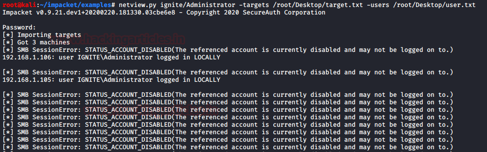

### **Conclusion**

In this article, we discussed the scripts in the Impacket Toolkit that can interact with the SMB/MSRPC services on a target system. Impacket has many categories which will further explore in due time.

**Author: Pavandeep Singh** is a Technical Writer, Researcher and Penetration Tester. Can be Contacted on **[Twitter](https://twitter.com/pavan2318)** and **[LinkedIn](https://www.linkedin.com/in/pavan2318/)**

### Share this:

- [Click to share on Twitter (Opens in new window)](https://www.hackingarticles.in/impacket-guide-smb-msrpc/?share=twitter&nb=1)
- [Click to share on Facebook (Opens in new window)](https://www.hackingarticles.in/impacket-guide-smb-msrpc/?share=facebook&nb=1)

-

### Like this:

[Like](https://widgets.wp.com/likes/#)
Be the first to like this.