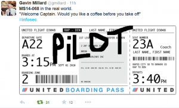

Kerberos Vulnerability in MS14-068 (KB3011780) Explained – Active Directory Security

Nov  19  2014

# Kerberos Vulnerability in MS14-068 (KB3011780) Explained

- By [Sean Metcalf](https://adsecurity.org/?author=2) in [Microsoft Security](https://adsecurity.org/?cat=11), [Technical Reference](https://adsecurity.org/?cat=2)

Thanks to Gavin Millard ([@gmillard](https://twitter.com/gmillard) on Twitter), we have a graphic that covers the issue quite nicely (wish I had of thought of it!)

**[Exploit Code](https://adsecurity.org/?p=660) is now on the net!**

As of December 4th, 2014, there is [Proof of Concept (POC) code posted that exploits MS14-068](https://adsecurity.org/?p=660) by Sylvain Monné by using Python to interact with an unpatched DC generating the invalid Kerberos ticket and then [Mimikatz](https://adsecurity.org/?p=556) to use the ticket.

***UPDATE: I have successfully tested the MS14-068 exploit in my lab and [posted detailed information including WireShark pcaps and DC event logs](https://adsecurity.org/?p=676).***

#### MS14-068 References:

- [AD Kerberos Privilege Elevation Vulnerability: The Issue](https://adsecurity.org/?p=525)
- [MS14-068 Exploit POC with the Python Kerberos Exploitation Kit (aka PyKEK)](https://adsecurity.org/?p=660)
- [Exploiting MS14-068 Vulnerable Domain Controllers Successfully with the Python Kerberos Exploitation Kit (PyKEK)](https://adsecurity.org/?p=676)
- [PyKEK Kerberos Packets on the Wire aka How the MS14-068 Exploit Works](https://adsecurity.org/?p=763)

I wrote up a description of the issue that should help explain MS14-068 (KB3011780) without too much [Kerberos technical overhead](https://adsecurity.org/?p=227).

For more detail, please read my earlier [blog post on MS14-068 (KB3011780)](https://adsecurity.org/?p=525).

Get Domain Controller patch status with this sample PowerShell script: [Get-DCPatchStatus](https://adsecurity.org/wp-content/uploads/2014/12/Get-DCPatchStatus.txt) (rename file extension to .ps1).

Note that Windows Server 2012 impact is less vulnerable than previous Windows versions (i.e., it’s much harder to exploit on Windows Server 2012/2012R2), but all Domain Controllers should be patched ASAP, starting with DCs running Windows Server 2008R2 and below. Patch servers next and workstations last to support “defense-in-depth.” Additionally, Azure Active Directory doesn’t expose Kerberos over any external interface and is not affected by this vulnerability.

**Introduction:**

Active Directory leverages the Kerberos protocol for authentication. The vulnerability patches an issue with how the Domain Controller validates group membership in Kerberos tickets (hint: this issues is that the ticket is always validated by the DC if the checksum is set to certain values which are invalid).

According to [Microsoft](https://technet.microsoft.com/en-us/library/security/MS14-068): ***“When this security bulletin was issued, Microsoft was aware of limited, targeted attacks that attempt to exploit this vulnerability.”***

**This is FAR worse than the Kerberos “Golden Ticket” issue since an attacker doesn’t need the domain Kerberos service account [(KRBTGT)](https://adsecurity.org/?p=483) NTLM password hash (only accessible from a Domain Controller with domain-level admin privileges) for exploit. The attacker simply modifies the existing TGT by changing the group membership to have access to everything in Active Directory and creates a specific invalid checksum for the PAC signature causing the DC to validate it.

**

**MS14-068 Issue Overview:
**

Simply stated, the vulnerability enables an attacker to modify an existing, valid, domain user logon token (Kerberos Ticket Granting Ticket, TGT, ticket) by adding the false statement that the user is a member of Domain Admins (or other sensitive group) and the Domain Controller (DC) will validate that (false) claim enabling attacker improper access to any domain (in the AD forest) resource on the network. This is all done without changing the members of existing AD groups.

When a user logs on with domain credentials for the first time, the user name and password are validated by the Domain Controller and the DC enumerates the user’s group membership and logon restrictions. A domain logon token (TGT) is created with this data and provided to the user.

One of the benefits of Kerberos is that the user doesn’t have to re-authenticate to the Domain Controller to access resources on the domain, the user simply presents the logon token (TGT) to the DC and receives a resource access token (Kerberos Ticket Granting Service, TGS, ticket). The user then provides the resource access token (generated by the DC and specific to the user) to the server hosting the service the user wishes to access. The resource access token includes the user’s information including the user’s group membership enabling the resource to determine if the user should be granted access and what level of rights the user has.

The issue here is that core to this functionality is that the DC trusts all non-expired logon tickets (valid for 10 hours by default) since they are signed by the domain’s Kerberos account [(KRBTGT)](https://adsecurity.org/?p=483). In other words, Kerberos tickets signed by a (writable) DC on the network are inherently trusted as correct since they are signed by the DC’s Kerberos service account [(KRBTGT)](https://adsecurity.org/?p=483). When the DC receives an access request for a service on the network, the user’s token (TGT) is supposed to be validated by checking the signature to ensure the user’s claim is a valid one.

For example

*Logon Token (TGT): “I am Joe User and I am a member of the following groups: Domain Users, Limited Access Users.”*

The Domain Controller should validate the claim that Joe is a member of these groups (also called PAC validation), not by enumerating group membership again (which was done before the ticket was generated), but by validating the cryptographic signature on the token which was signed by the domain’s Kerberos account [(KRBTGT)](https://adsecurity.org/?p=483) and for which only a Domain Controller in that domain knows the credentials. This is done for improved efficiency – since the work was already done by a DC and signed by that DC that it was performed; another DC takes the claim at face value and doesn’t attempt to enumerate the user’s group membership again.

The vulnerability introduces a scenario where an attacker can modify an existing Kerberos user logon token (TGT) changing the group membership claim to include a higher-privileged group.

*Logon Token (TGT): “I am Joe User and I am a member of the following groups: Domain Users, Limited Access Users Domain Admins, Special Project Users, Executive Access, Super Secret Share Access.”*

Since the DC doesn’t properly validate the signature associated with the claim (the attacker modified the Kerberos ticket and changed the checksum to be invalid), the DC accepts Joe’s token and associated group membership and generates a resource access token (TGS) which includes the group membership included in the logon token (TGT).

At this point, the attacker has a valid user token with a claim that the user is a member of groups that do not have the user listed as a member in AD. However, *since the user token states the user is a member of these groups and the Domain Controller generates this token based on the user’s actual group membership at the time of token generation, the user is treated as if he is a member of these groups by all domain resources.*

An attacker can take the modified user logon token (TGT) and present it to gain access to any resource on the network by requesting resource access tokens (TGS). The resource accepts the resource access token since it is signed by the DC and even if the resource requests validation of the group membership (because it’s cautious), a DC will validate it. The resource then allows the users access to the level of permissions configured on the resource appropriate to the user’s group membership.

This enables an attacker on a computer in the AD domain with a valid AD credential to effectively “spoof” any user in the domain (and likely the forest) since the PAC contains user or group Security Identifiers (SIDs). This means that an attacker can bypass all configured resource ACLs which limit access on the network by spoofing credentials for any user in Active Directory.

Note: The caveat to this process is that the attacker requires the ability to run code on a domain-joined computer and have access to a user account. With that stated, this is a relatively low bar given how easily malicious code tends to enter and propagate in modern networks.

**Detection:**

Detecting Kerberos attacks is inherently difficult since there are tens of Kerberos tickets generated for each user in a single day (1 TGT and at least 1 TGS each for every file share, SharePoint server, Exchange server, etc. accessed by the user). Furthermore, 99% of Kerberos attacks look like valid Kerberos tickets and communication.

While Microsoft notes that in the attack method they have determined, the event log id, Event 4624 (“An account was successfully logged on”), shows a user mismatch between the security id and account name they also note that a determined attacker is likely to fix this so they match, limiting detection ability: *“Please note that this logging will only catch known exploits; there are known methods to write exploits that will bypass this logging.”*

Note: *After installing the update, for Windows 2008R2 and above, the *[*4769 Kerberos Service Ticket Operation event*](https://www.ultimatewindowssecurity.com/securitylog/encyclopedia/event.aspx?eventID=4769)* log can be used to detect attackers attempting to exploit this vulnerability. This is a high volume event, so it is advisable to only log failures (this will significantly reduce the number of events generated).* [[From Microsoft Security Bulletin MS14-068 – Critical Vulnerability in Kerberos Could Allow Elevation of Privilege](https://technet.microsoft.com/en-us/library/security/MS14-068)]

CERT describes the issue in [CWE-347: Improper Verification of Cryptographic Signature](http://www.kb.cert.org/vuls/id/213119)

*“The Microsoft Windows Kerberos KDC fails to properly check for valid signatures in the Privilege Attribute Certificate (PAC) included with the Kerberos ticket request. **A domain user may forge the information contained in the PAC to request higher user privileges than should be allowed. Since the KDC does not verify the signature correctly, it will award the user the requested privileges, effectively making the user a domain administrator and allowing complete compromise of the entire domain.**”*

** Remediation of an Attack Leveraging this Vulnerability:**

[According to Microsoft](http://blogs.technet.com/b/srd/archive/2014/11/18/additional-information-about-cve-2014-6324.aspx), if an attacker gets Admin rights to your Active Directory environment, it’s game over.

**> Remediation**

> The only way a domain compromise can be remediated with a high level of certainty is a complete rebuild of the domain. An attacker with administrative privilege on a domain controller can make a nearly unbounded number of changes to the system that can allow the attacker to persist their access long after the update has been installed. Therefore it is critical to install the update immediately.

For more detail on this issue, please read my earlier [blog post on MS14-068](https://adsecurity.org/?p=525).

(Visited 7,041 times, 1 visits today)

- **  [KB3011780](https://adsecurity.org/?tag=kb3011780), [KerberosGoldenTicket](https://adsecurity.org/?tag=kerberosgoldenticket), [KerberosHacking](https://adsecurity.org/?tag=kerberoshacking), [KerberosInvalidChecksum](https://adsecurity.org/?tag=kerberosinvalidchecksum), [KerberosVulnerability](https://adsecurity.org/?tag=kerberosvulnerability), [MS14-068](https://adsecurity.org/?tag=ms14-068), [MS14068](https://adsecurity.org/?tag=ms14068)

-