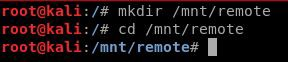
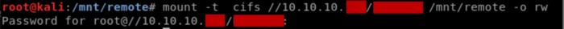
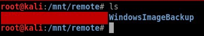
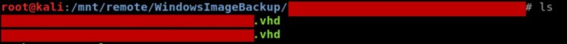
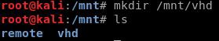

Mounting VHD file on Kali Linux through remote share | by Samuel Whang | Medium

# Mounting VHD file on Kali Linux through remote share

[Samuel Whang](https://medium.com/@klockw3rk?source=post_page-----f2f9542c1f25----------------------)

[May 14, 2019](https://medium.com/@klockw3rk/mounting-vhd-file-on-kali-linux-through-remote-share-f2f9542c1f25?source=post_page-----f2f9542c1f25----------------------) · 3 min read

Recently I came across an instance where I found a .vhd image on a remote share. Virtual Hard Disk (VHD) files are typically used to backup data stored on a hard-disk partition. As such, data on a .vhd file is very interesting to penetration testers since it may contain valuable information.

There were two problems that I was faced with:

1. I was operating in Kali Linux and I didn’t have an operational Windows system to work with at the time. Generally, it is very easy to mount .vhd files in a Windows environment, but the same can’t be said within a Linux environment since the file type isn’t native to Linux.

2. The .vhd file was in a remote share, and can’t be downloaded in a reasonable time due to the size of the file.

After reading through a bunch of articles and forum posts, I came across a tool called *guestmount* that allowed me to mount .vhd in my Kali Linux environment. If you are running Kali, this tool should be available in the repository. You can get it by running the following:

*apt-get install libguestfs-tools*
After you install that, you should have *guestmount* available.

Before we begin using *guestmount* we still need to solve the issue with the .vhd file being located in a remote share and not easily downloadable. We can solve this problem by using the *mount* command, but we will need *cifs-utils*, so you may need to download that first. You can get this by running this command:

*apt-get install cifs-utils*

Now that we have all the prerequisites completed, we need to mount the remote share. In order to do this, we need to create a mount point on our Kali file system. I decided to create a directory called *“remote”* in the *“/mnt”* directory.

Once we navigate to this directory, we are going to mount the remote share.

When this operation completes, when you list the mount point, you should see the contents of the share. If you don’t, you have to navigate out to an arbitrary directory and navigate back to the mount point.

Now that we solved the remote share problem, we need to now mount the .vhd file within this share. In my particular scenario, I had to navigate deeper into the share until I found the .vhd file.

Before we mount the .vhd file, we need to create another mount point where the contents of .vhd file will reside. I created “vhd” directory within my “/mnt” directory for my mount point.

We can now mount the .vhd file using the following command:
guestmount --add /mnt/remote/path/to/vhdfile.vhd --inspector --ro /mnt/vhd -v

The mounting process may take some time. After it completes, navigate to the location where you mounted the .vhd file and the contents should be there!