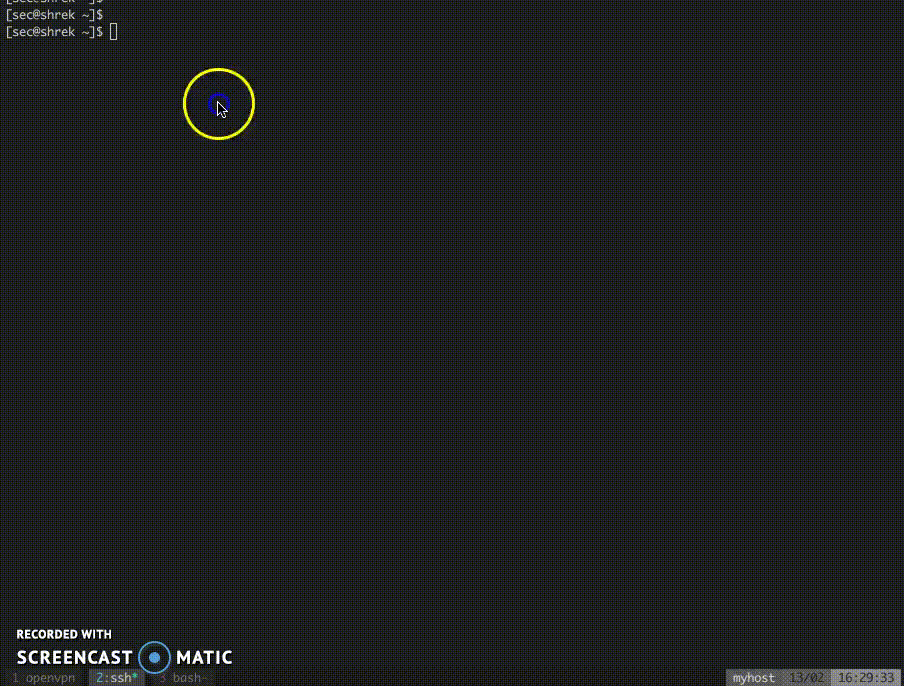

PSPY

# pspy - unprivileged Linux process snooping

pspy is a command line tool designed to snoop on processes without need for root permissions. It allows you to see commands run by other users, cron jobs, etc. as they execute. Great for enumeration of Linux systems in CTFs. Also great to demonstrate your colleagues why passing secrets as arguments on the command line is a bad idea.

The tool gathers the info from procfs scans. Inotify watchers placed on selected parts of the file system trigger these scans to catch short-lived processes.

## Getting started

### Download

Get the tool onto the Linux machine you want to inspect. First get the binaries. Download the released binaries here:

- 32 bit big, static version: `pspy32`  [download](https://github.com/DominicBreuker/pspy/releases/download/v1.2.0/pspy32)
- 64 bit big, static version: `pspy64`  [download](https://github.com/DominicBreuker/pspy/releases/download/v1.2.0/pspy64)
- 32 bit small version: `pspy32s`  [download](https://github.com/DominicBreuker/pspy/releases/download/v1.2.0/pspy32s)
- 64 bit small version: `pspy64s`  [download](https://github.com/DominicBreuker/pspy/releases/download/v1.2.0/pspy64s)

The statically compiled files should work on any Linux system but are quite huge (~4MB). If size is an issue, try the smaller versions which depend on libc and are compressed with UPX (~1MB).

### Build

Either use Go installed on your system or run the Docker-based build process which ran to create the release. For the latter, ensure Docker is installed, and then run `make build-build-image` to build a Docker image, followed by `make build` to build the binaries with it.

You can run `pspy --help` to learn about the flags and their meaning. The summary is as follows:

- -p: enables printing commands to stdout (enabled by default)
- -f: enables printing file system events to stdout (disabled by default)
- -r: list of directories to watch with Inotify. pspy will watch all subdirectories recursively (by default, watches /usr, /tmp, /etc, /home, /var, and /opt).
- -d: list of directories to watch with Inotify. pspy will watch these directories only, not the subdirectories (empty by default).
- -i: interval in milliseconds between procfs scans. pspy scans regularly for new processes regardless of Inotify events, just in case some events are not received.
- -c: print commands in different colors. File system events are not colored anymore, commands have different colors based on process UID.
- --debug: prints verbose error messages which are otherwise hidden.

The default settings should be fine for most applications. Watching files inside `/usr` is most important since many tools will access libraries inside it.

Some more complex examples:

# print both commands and file system events and scan procfs every 1000 ms (=1sec)./pspy64 -pf -i 1000 # place watchers recursively in two directories and non-recursively into a third./pspy64 -r /path/to/first/recursive/dir -r /path/to/second/recursive/dir -d /path/to/the/non-recursive/dir# disable printing discovered commands but enable file system events./pspy64 -p=false -f

### Examples

### Cron job watching

To see the tool in action, just clone the repo and run `make example` (Docker needed). It is known passing passwords as command line arguments is not safe, and the example can be used to demonstrate it. The command starts a Debian container in which a secret cron job, run by root, changes a user password every minute. pspy run in foreground, as user myuser, and scans for processes. You should see output similar to this:

~/pspy (master) $ make example[...]docker run -it --rm local/pspy-example:latest[+] cron started[+] Running as user uid=1000(myuser) gid=1000(myuser) groups=1000(myuser),27(sudo)[+] Starting pspy now...Watching recursively : [/usr /tmp /etc /home /var /opt] (6)Watching non-recursively: [] (0)Printing: processes=true file-system events=false2018/02/18 21:00:03 Inotify watcher limit: 524288 (/proc/sys/fs/inotify/max_user_watches)2018/02/18 21:00:03 Inotify watchers set up: Watching 1030 directories - watching now2018/02/18 21:00:03 CMD: UID=0 PID=9 | cron -f2018/02/18 21:00:03 CMD: UID=0 PID=7 | sudo cron -f2018/02/18 21:00:03 CMD: UID=1000 PID=14 | pspy2018/02/18 21:00:03 CMD: UID=1000 PID=1 | /bin/bash /entrypoint.sh2018/02/18 21:01:01 CMD: UID=0 PID=20 | CRON -f2018/02/18 21:01:01 CMD: UID=0 PID=21 | CRON -f2018/02/18 21:01:01 CMD: UID=0 PID=22 | python3 /root/scripts/password_reset.py2018/02/18 21:01:01 CMD: UID=0 PID=25 |2018/02/18 21:01:01 CMD: UID=??? PID=24 | ???2018/02/18 21:01:01 CMD: UID=0 PID=23 | /bin/sh -c /bin/echo -e "KI5PZQ2ZPWQXJKEL\nKI5PZQ2ZPWQXJKEL" | passwd myuser2018/02/18 21:01:01 CMD: UID=0 PID=26 | /usr/sbin/sendmail -i -FCronDaemon -B8BITMIME -oem root2018/02/18 21:01:01 CMD: UID=101 PID=27 |2018/02/18 21:01:01 CMD: UID=8 PID=28 | /usr/sbin/exim4 -Mc 1enW4z-00000Q-Mk

First, pspy prints all currently running processes, each with PID, UID and the command line. When pspy detects a new process, it adds a line to this log. In this example, you find a process with PID 23 which seems to change the password of myuser. This is the result of a Python script used in roots private crontab `/var/spool/cron/crontabs/root`, which executes this shell command (check [crontab](https://github.com/DominicBreuker/pspy/blob/master/docker/var/spool/cron/crontabs/root) and [script](https://github.com/DominicBreuker/pspy/blob/master/docker/root/scripts/password_reset.py)). Note that myuser can neither see the crontab nor the Python script. With pspy, it can see the commands nevertheless.

### CTF example from Hack The Box

Below is an example from the machine Shrek from [Hack The Box](https://www.hackthebox.eu/). In this CTF challenge, the task is to exploit a hidden cron job that's changing ownership of all files in a folder. The vulnerability is the insecure use of a wildcard together with chmod ([details](https://www.defensecode.com/public/DefenseCode_Unix_WildCards_Gone_Wild.txt) for the interested reader). It requires substantial guesswork to find and exploit it. With pspy though, the cron job is easy to find and analyse:

## How it works

Tools exist to list all processes executed on Linux systems, including those that have finished. For instance there is [forkstat](http://smackerelofopinion.blogspot.de/2014/03/forkstat-new-tool-to-trace-process.html). It receives notifications from the kernel on process-related events such as fork and exec.

These tools require root privileges, but that should not give you a false sense of security. Nothing stops you from snooping on the processes running on a Linux system. A lot of information is visible in procfs as long as a process is running. The only problem is you have to catch short-lived processes in the very short time span in which they are alive. Scanning the `/proc` directory for new PIDs in an infinite loop does the trick but consumes a lot of CPU.

A stealthier way is to use the following trick. Process tend to access files such as libraries in `/usr`, temporary files in `/tmp`, log files in `/var`, ... Using the [inotify](http://man7.org/linux/man-pages/man7/inotify.7.html) API, you can get notifications whenever these files are created, modified, deleted, accessed, etc. Linux does not require priviledged users for this API since it is needed for many innocent applications (such as text editors showing you an up-to-date file explorer). Thus, while non-root users cannot monitor processes directly, they can monitor the effects of processes on the file system.

We can use the file system events as a trigger to scan `/proc`, hoping that we can do it fast enough to catch the processes. This is what pspy does. There is no guarantee you won't miss one, but chances seem to be good in my experiments. In general, the longer the processes run, the bigger the chance of catching them is.

# Misc

Logo: "By Creative Tail [CC BY 4.0 (http://creativecommons.org/licenses/by/4.0)], via Wikimedia Commons" ([link](https://commons.wikimedia.org/wiki/File%3ACreative-Tail-People-spy.svg))