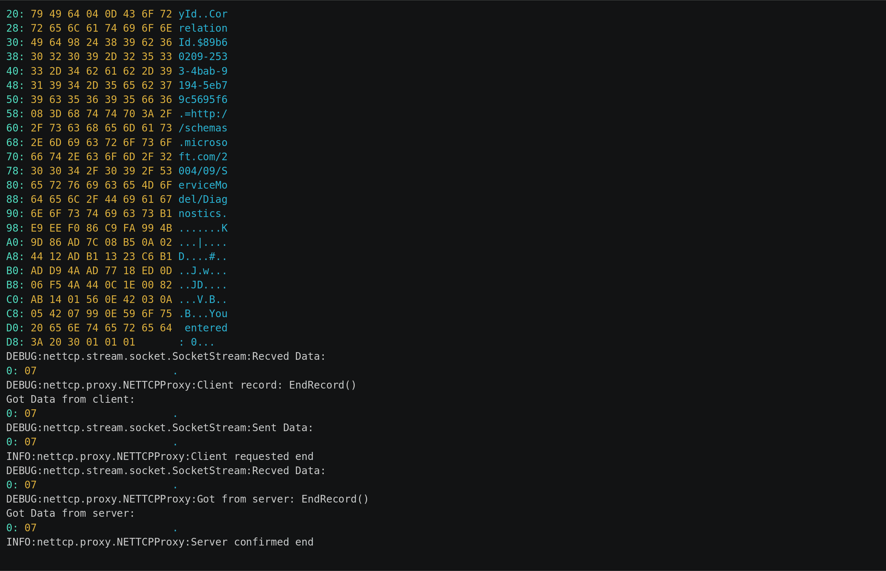

Pentesting Webservices with Net.TCP Binding – Insinuator.net

# Pentesting Webservices with Net.TCP Binding

Hi all,

Most of you that are  pentesters  may have already tested plenty of webservices using SOAP (*Simple Object Access Protocol*)for communication. Typically, such SOAP messages are transferred over HTTP (*Hypertext Transfer Protocol*) and are encapsulated in XML (*Extensible Markup Language*). Microsoft has developed different representations of this protocols to reduce the network load. As these representations/protocols aren’t really covered by typical tools out there, this post will show you some of them, and a proxy which can be used to simplify the testing.

A typical SOAP request over HTTP looks like the one you’ll find below.
POST http://localhost/Service1 HTTP/1.1
Accept-Encoding: gzip,deflate

Content-Type: application/soap+xml;charset=UTF-8;action="http://tempuri.org/IService1/GetData"

Content-Length: 440
Host: localhost
Connection: Keep-Alive
User-Agent: Apache-HttpClient/4.1.1 (java 1.5)
<soap:Envelope xmlns:soap="http://www.w3.org/2003/05/soap-envelope"
xmlns:tem="http://tempuri.org/">
<soap:Header xmlns:wsa="http://www.w3.org/2005/08/addressing">
<wsa:Action>http://tempuri.org/IService1/GetData</wsa:Action>
<wsa:To>http://localhost/Service1</wsa:To>
</soap:Header>
<soap:Body>
<tem:GetData>
<tem:value>12345</tem:value>
</tem:GetData>
</soap:Body>
</soap:Envelope>
This also results in a typical XML based response:
HTTP/1.1 200 OK
Content-Length: 542
Content-Type: application/soap+xml; charset=utf-8
Server: Microsoft-HTTPAPI/2.0
Date: Thu, 28 Jul 2016 11:13:31 GMT
<s:Envelope xmlns:s="http://www.w3.org/2003/05/soap-envelope"
xmlns:a="http://www.w3.org/2005/08/addressing">
<s:Header>

<a:Action s:mustUnderstand="1">http://tempuri.org/IService1/GetDataResponse</a:Action>

<ActivityId CorrelationId="ed341f95-b902-45bd-81fd-37419a72cd44"

xmlns="http://schemas.microsoft.com/2004/09/ServiceModel/Diagnostics">da3fe24f-3efa-4222-913a-2e5814904a6d</ActivityId>

</s:Header>
<s:Body>
<GetDataResponse xmlns="http://tempuri.org/">
<GetDataResult>You entered: 12345</GetDataResult>
</GetDataResponse>
</s:Body>
</s:Envelope>

Let’s see which protocols are used here… First of all, we’ve the link layer (ethernet most of the time), second the internet layer (IPv4|IPv6), next comes TCP, optionally TLS, now HTTP, and finally SOAP. As you may notice, SOAP and HTTP especially introduce a lot of repetitive data and speaking identifiers. This is great for humans, but bad in the case of network load. One of the optimizations done by Microsoft  in the WCF (*Windows Communication Foundation*) library was the *.Net Binary Format: XML Data Structure* [MC-NBFX] and based on that [MC-NBFS] and [MC-NBFSE] for SOAP. Some of the long time readers might remember that I’d already written a library for de- and encoding of this binary representation back in [2011](https://www.insinuator.net/2011/12/python-library-for-de-and-encoding-of-wcf-binary-streams/) (meanwhile also published on [github](https://github.com/ernw/python-wcfbin)). With this library, you’re able to read and modify requests and responses from webservices which do not support the XML based encoding. The same request from above could be represented in NBFS:

POST http://localhost/Service1 HTTP/1.1
Accept-Encoding: gzip,deflate

Content-Type: application/soap+msbin1;charset=UTF-8;action="http://tempuri.org/IService1/GetData"

Content-Length: 228
Host: localhost
Connection: Keep-Alive
User-Agent: Apache-HttpClient/4.1.1 (java 1.5)
Csoap
soap	temhttp://tempuri.org/Csoap
wsaCwsa
�Hhttp://tempuri.org/IService1/GetDataCwsa
�2http://localhost/Service1CsoapAtemGetDataAtemvalue�90
or as displayed in a hex viewer:
00000000: 4304 736f 6170 020b 0473 6f61 7004 0903 C.soap...soap...
00000010: 7465 6d13 6874 7470 3a2f 2f74 656d 7075 tem.http://tempu
00000020: 7269 2e6f 7267 2f43 0473 6f61 7008 0b03 ri.org/C.soap...
00000030: 7773 6106 4303 7773 610a b748 6800 7400 wsa.C.wsa..Hh.t.
00000040: 7400 7000 3a00 2f00 2f00 7400 6500 6d00 t.p.:././.t.e.m.
00000050: 7000 7500 7200 6900 2e00 6f00 7200 6700 p.u.r.i...o.r.g.
00000060: 2f00 4900 5300 6500 7200 7600 6900 6300 /.I.S.e.r.v.i.c.
00000070: 6500 3100 2f00 4700 6500 7400 4400 6100 e.1./.G.e.t.D.a.
00000080: 7400 6100 4303 7773 610c b732 6800 7400 t.a.C.wsa..2h.t.
00000090: 7400 7000 3a00 2f00 2f00 6c00 6f00 6300 t.p.:././.l.o.c.
000000a0: 6100 6c00 6800 6f00 7300 7400 2f00 5300 a.l.h.o.s.t./.S.
000000b0: 6500 7200 7600 6900 6300 6500 3100 0143 e.r.v.i.c.e.1..C
000000c0: 0473 6f61 700e 4103 7465 6d07 4765 7444 .soap.A.tem.GetD
000000d0: 6174 6141 0374 656d 0576 616c 7565 8b39 ataA.tem.value.9
000000e0: 3001 0101 0...

As you may notice, some of the xml tag names are gone as for example *Envelope, Header* or *Body*. This is because MC-NBFS uses a predefined dictionary to represent most of the strings occurring in SOAP messages by a one or two byte value (if you are interested how the dictionary looks like: https://github.com/ernw/python-wcfbin/blob/develop/wcf/dictionary.py)

If it is still transported over HTTP, you’re done and fully able to test and interact with the webservice as if it was communicating over XML-SOAP.

During your tests, you may find a client which is communicating with a webservice, but not over HTTP and it’s not using SOAP (but something which looks like the NBF above). This is typically the same type of webservice, but this time it does not use the so called HTTP-binding, but the Net.TCP one. This binding is used by WCF applications to remove the parsing overhead of HTTP and add more reliability. It is based on the *.NET Message Framing Protocol *[MC-NMF] and is defined in [MS-NMTFB]. It’s packets follow a type-value format:

0 1 2 3 0 1 2 3 4 5 6 7 8 9 0 1 2 3 4 5 6 7 8 9 0 1 2 3 4 5 6 7 8 9 0 1
+---------------------------------------------------------------+

| RecordType | Value... +---------------------------------------------------------------+

This protocol runs on top of TCP and does some sort of handshake which specifies the used transport encoding (typically NBFSE), the targeted service and an optional transport encryption/protection.

00000000 0001 0001 0202 246e 6574 2e74 6370 3a2f ......$net.tcp:/
00000010 2f31 3932 2e31 3638 2e35 362e 313a 3835 /192.168.56.1:85
00000020 3233 2f53 6572 7669 6365 3103 080c 23/Service1...
00000000 0b .
0000002E 06b0 016c 2468 7474 703a 2f2f 7465 6d70 ...l$http://temp
0000003E 7572 692e 6f72 672f 4953 6572 7669 6365 uri.org/IService
0000004E 312f 4765 7444 6174 6124 6e65 742e 7463 1/GetData$net.tc
0000005E 703a 2f2f 3139 322e 3136 382e 3536 2e31 p://192.168.56.1
0000006E 3a38 3532 332f 5365 7276 6963 6531 0747 :8523/Service1.G
0000007E 6574 4461 7461 1368 7474 703a 2f2f 7465 etData.http://te
0000008E 6d70 7572 692e 6f72 672f 0576 616c 7565 mpuri.org/.value
0000009E 5602 0b01 7304 0b01 6106 5608 440a 1e00 V...s...a.V.D...
000000AE 82ab 0144 1aad 9ddf 13ad aa57 0140 8fe2 ...D.......W.@..
000000BE 2830 d9d9 e8e7 442c 442a ab14 0144 0c1e (0....D,D*...D..
000000CE 0082 ab03 0156 0e42 050a 0742 098b 3905 .....V.B...B..9.
000000DE 0101 01 ...
00000001 06bd 025f 2c68 7474 703a 2f2f 7465 6d70 ..._,http://temp
00000011 7572 692e 6f72 672f 4953 6572 7669 6365 uri.org/IService
00000021 312f 4765 7444 6174 6152 6573 706f 6e73 1/GetDataRespons
00000031 650f 4765 7444 6174 6152 6573 706f 6e73 e.GetDataRespons
00000041 6513 6874 7470 3a2f 2f74 656d 7075 7269 e.http://tempuri
00000051 2e6f 7267 2f0d 4765 7444 6174 6152 6573 .org/.GetDataRes
00000061 756c 7456 020b 0173 040b 0161 0656 0844 ultV...s...a.V.D
00000071 0a1e 0082 ab01 400a 4163 7469 7669 7479 ......@.Activity
00000081 4964 040d 436f 7272 656c 6174 696f 6e49 Id..CorrelationI
00000091 6498 2436 3038 3538 3730 642d 3835 3264 d.$6085870d852d
000000A1 2d34 6236 322d 3931 6437 2d61 3563 6334 -4b6291d7a5cc4
000000B1 3530 3361 3635 3808 3d68 7474 703a 2f2f 503a658.=http://
000000C1 7363 6865 6d61 732e 6d69 6372 6f73 6f66 schemas.microsof
000000D1 742e 636f 6d2f 3230 3034 2f30 392f 5365 t.com/2004/09/Se
000000E1 7276 6963 654d 6f64 656c 2f44 6961 676e rviceModel/Diagn
000000F1 6f73 7469 6373 b167 9317 e29b 145e 4685 ostics.g.....^F.
00000101 3657 8293 1d6b 8644 12ad 9ddf 13ad aa57 6W...k.D.......W
00000111 0140 8fe2 2830 d9d9 e8e7 440c 1e00 82ab .@..(0....D.....

00000121 1401 560e 4203 0a05 4207 9911 596f 7520 ..V.B...B...You 00000131 656e 7465 7265 643a 2031 3333 3701 0101 entered: 1337...

000000E1 0642 0056 020b 0173 040b 0161 0656 0844 .B.V...s...a.V.D
000000F1 0a1e 0082 ab01 441a adf8 4321 1e83 4c8f ......D...C!..L.
00000101 4e8f 0ce4 7db9 cf3a 6744 2c44 2aab 1401 N...}..:gD,D*...
00000111 440c 1e00 82ab 0301 560e 4205 0a07 4209 D.......V.B...B.
00000121 8101 0101 ....
00000141 06db 0100 5602 0b01 7304 0b01 6106 5608 ....V...s...a.V.
00000151 440a 1e00 82ab 0140 0a41 6374 6976 6974 D......@.Activit
00000161 7949 6404 0d43 6f72 7265 6c61 7469 6f6e yId..Correlation
00000171 4964 9824 3639 3837 3737 6665 2d65 3637 Id.$6987 77fee67
00000181 322d 3461 6332 2d62 3163 642d 6239 6237 2-4ac2b1cdb9b7
00000191 3464 3134 3739 6538 083d 6874 7470 3a2f 4d1479e8.=http:/
000001A1 2f73 6368 656d 6173 2e6d 6963 726f 736f /schemas .microso
000001B1 6674 2e63 6f6d 2f32 3030 342f 3039 2f53 ft.com/2004/09/S
000001C1 6572 7669 6365 4d6f 6465 6c2f 4469 6167 erviceModel/Diag
000001D1 6e6f 7374 6963 73b1 bef9 db6d 9c99 8b4e nostics....m...N
000001E1 9a14 0ebf 2d69 41a2 4412 adf8 4321 1e83 ....-iA.D...C!..
000001F1 4c8f 4e8f 0ce4 7db9 cf3a 6744 0c1e 0082 L.N...}..:gD....
00000201 ab14 0156 0e42 030a 0542 0799 0e59 6f75 ...V.B...B...You
00000211 2065 6e74 6572 6564 3a20 3001 0101 entered: 0...
00000125 07 .
0000021F 07 .
The first 32 bytes in the capture could be decoded as:
VersionRecord(Major=1, Minor=0)
ModeRecord(Mode=DUPLEX)
ViaRecord(Length=0x24, Via="net.tcp://192.168.56.1:8523/Service1")
KnownEncodingRecord(Encoding=BINARY_DICT)
PreambleEndRecord()
Note: BINARY_DICT means MC-NBFSE in this case.

The server acknowledges the connection (`0xb`) and the actual messages are transferred in the specified encoding (BINARY_DICT), encapsulated in an additional message which prefixes the data with the data length. As you may see, the data sent to server in the second request (the part at 0xE1 to 0x121) is much smaller than the first one. This is because MC-NBFSE defines that a custom dictionary is transfered at the beginning of the first request. All subsequent requests will use this extended dictionary and will transfer only the identifiers (the same applies to the responses).

With this knowledge, you’ll be  able to, at least, extract the requests and responses and decode them with my wcfbin library. But as I noted before, the NMF protocol allows to establish a secured connection. This could be either done by TLS or by GSSAPI. If one of them is used, you’ll be unable to view nor modify the SOAP calls between a client and a server. Additionally, if you’ve the client software and the server requires to authenticate via GSSAPI (Kerberos) and your machine is not part of the domain, it’ll be rather difficult to convince the client software to authenticate with the correct credentials, as this is completely done in the background.

But luckily (especially if we have the client under our control) we can implement a proxy between the client and the server, which would

1. decode and display the transferred messages

2. establish a secured connection to the server while the connection to the client is unsecured (like sslstrip)

3. can be adjusted to modify requests/responses on the fly to bypass some client side restrictions

So lets see how a a proxied connection would look like. First of all, you’ll need the library itself (you can find it [here](https://github.com/ernw/net.tcp-proxy)). To install it with pip, just run:

pip install git+https://github.com/ernw/net.tcp-proxy.git
If you like to have some colorful hexdumps you’ll also need my utility library:
pip install git+https://github.com/bluec0re/python-helperlib.git

If you want to connect to a webservice using kerberos authentication (more on this later), gssapi is also required (python2 only!):

pip install gssapi

After installation, you’ll find 3 scripts in your binary folder: decode-nmf.py, decode-wcfbin.py and nettcp-proxy.py

The decode-* scripts can be used to decode trace files which are generated by the proxy (you’ll need the wcfbin decoder mentioned above for the decode-wcfbin script). To generate such trace files (and view the traffic between a client and a server) you can use the nettcp-proxy script as follows:

nettcp-proxy.py -b <ip address to bind to> -p <port to bind to> -t <name of the tracefile> <serverip> <serverport>

The result can be seen in the following asciicast (you may want to reduce the playing speed (“<” key) as the output comes fast)

[(L)](https://asciinema.org/a/71sbvkyjpr0jpmznk36u3ec9q)

[(L)](https://asciinema.org/a/71sbvkyjpr0jpmznk36u3ec9q)

If you want to connect to a webservice which is using the negotiate protocol, some additional steps are required. First you’ll need the krb5 library and the gssapi python bindings (mentioned above). Second, you’ll have to configure the krb library to authenticate against the KDC of the domain. If you’re lucky, a

kinit user@domain

is enough (you’ll be prompted for the user password and the klist command will show a obtained ticket). If not, you’ll need to specify the target KDC in the krb5.conf file:

[logging]
default = STDERR
[libdefaults]
ticket_lifetime = 24h
clock-skew = 300
default_realm = test.local
dns_lookup_realm = true
dns_lookup_kdc = true
forwardable = true
renew_lifetime = 7d
[realms]
FOODOMAIN = {
kdc = 127.0.0.1:88
admin_server = 127.0.0.1:464
}
[domain_realm]
foodomain = FOODOMAIN
(adjust the FOODOMAIN and the ips according to your environment).

The next thing you need is a ticket for the target system (the actual service name might be different):

kvno host@service.domain

In the last step, the client has to be configured to not use any transport level authentication. This could be done by adjusting the *.config file which typically comes with such clients:

<?xml version="1.0" encoding="utf-8" ?>
<configuration>

<startup> <supportedRuntime version="v4.0" sku=".NETFramework,Version=v4.5.2" />

</startup>
<system.serviceModel>
<bindings>
<netTcpBinding>
<binding name="NetTcpBinding_IService1">
<security mode="None" />
</binding>
</netTcpBinding>
</bindings>
<client>

<endpoint address="net.tcp://192.168.56.1:8523/Service1" binding="netTcpBinding"

bindingConfiguration="NetTcpBinding_IService1" contract="ServiceReference1.IService1"

name="NetTcpBinding_IService1">
<identity>
<dns value="localhost" />
</identity>
</endpoint>
</client>
</system.serviceModel>
</configuration>

The important part here is the `<security mode="None" />` which has to be assigned to the specific endpoint (by using the `<binding name` parameter and the `<endpoint bindingConfiguration parameter`).

Last but not least you use the nettcp-proxy script as before but additionally specify the service name used with krb5:

nettcp-proxy.py -b <ip address to bind to> -p <port to bind to> -t <name of the tracefile> -n host@service.domain <serverip> <serverport>

That’s all folks. You are now able to view and decode requests going from clients to webservices over the nettcp binding. Additionally, you can use the library to inject your own requests by either doing it directly in python or by connecting to the proxy and let him do the authentication stuff.

That’s it, if you have any questions don’t hesitate to ask, if you find any bugs feel free to report it at github or (even better) fix it right away.

Best & happy hacking,
Timo
@bluec0re
Github: https://github.com/ernw/net.tcp-proxy