SensePost | A new look at null sessions and user enumeration

# A new look at null sessions and user enumeration

Reading time
~23 min
 * Posted by Reino Mostert on
11 May 2018 *

Categories: [Active directory](https://sensepost.com/blog/active%20directory/), [Deepdive](https://sensepost.com/blog/deepdive/), [Tools](https://sensepost.com/blog/tools/)

Hello,

TLDR; I think I found three new ways to do user enumeration on Windows domain controllers, and I wrote [some scripts](https://github.com/sensepost/UserEnum) for it.

Over the years, I have often used the NULL session vulnerability to enumerate lists of users, groups, shares and other interesting information from remote Windows systems.

For the uninitiated, Windows exposes several administrative and hidden shares via SMB by default.

Some of these shares allow one to access the complete storage device on remote systems. For example, C$ will allow one to access the C Drive. Another share, Admin$, allows one to access the Windows installation directory. To be able to mount these shares however, one needs to be an administrator on the remote system.

IPC$ is a special share that is used to facilitate inter-process communication (IPC). That is, it doesn’t allow one to access files or directories like other shares, but rather allows one to communicate with processes running on the remote system. Specifically, IPC$ exposes named pipes, that one can write to or read from to communicate with remote processes. Such named pipes are created when an application opens a pipe and registers it with the Windows Server service (SMB), such that it can be exposed by the IPC$ share. Any data written to such a named pipe is sent to the remote process, and conversely any output data written by the remote process can be read by a local application from the pipe. One can use such named pipes to execute specific functions, often referred to as Remote Procedure Calls (RPC) on the remote system.

Certain versions of Windows allowed one to authenticate and mount the IPC$ share without providing a username or password. Such a connection is often referred to as a NULL session, which while limited in its privileges, could be used to execute various RPC calls and as a result obtain useful information about the remote system. Arguably the most useful information one could extract in this manner is user and group listings, which can be used in brute force attacks.

NULL sessions is pretty old news. I remember learning about it in “Hacking For Dummies” in 2004, and by then it was already well known. After applications like Cain& Able and others allowed one to exploit it, Microsoft clamped down on it. From Windows XP onwards one can disable NULL sessions, or it is disabled by default. There are numerous guides on how to disable NULL sessions, with some somewhat confusing advice from Microsoft’s side regarding what setting does what exactly.

An application that has grown in popularity to test for NULL sessions is [rpcclient](https://www.samba.org/samba/docs/current/man-html/rpcclient.1.html), which other tools like [enum4linux](https://github.com/portcullislabs/enum4linux) and [ridenum](https://github.com/trustedsec/ridenum) uses under their hoods. Another is Nmap’s [smb-enum-user](https://nmap.org/nsedoc/scripts/smb-enum-users.html) NSE script.

During some tests, I found that when I used rpcclient against known vulnerable systems, that it would often produce error messages and fail to enumerate user information. In a penetration test scenario, this behaviour could make one believe that the remote system does not allow one to access the IPC$ share and execute RPC calls, while it could be possible.

In these tests, I ran rpcclient and nmap’s smb-enum-users NSE script against the same vulnerable system and viewed the output.

Below, the output of the smb-enum-users script shows that it was possible to enumerate the user information:

[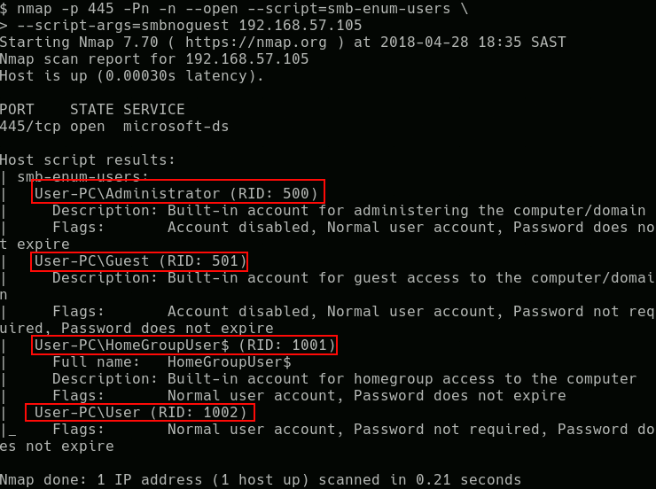](https://sensepost.com/img/pages/blog/2018/a-new-look-at-null-sessions-and-user-enumeration/image1.png)

Under the hood, the smb-enum-users’ script executes the QueryDisplayInfo RPC call to enumerate user information. However, when I used rpcclient to execute the QueryDisplayInfo RPC call, it failed to enumerate the user information and instead produced the following output:

[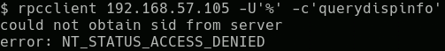](https://sensepost.com/img/pages/blog/2018/a-new-look-at-null-sessions-and-user-enumeration/image2.png)

To understand why this behaviour occurs, let’s look at the Wireshark trace of each connection starting with the capture of smb-enum-users which was able to enumerate a list of users on the system:

[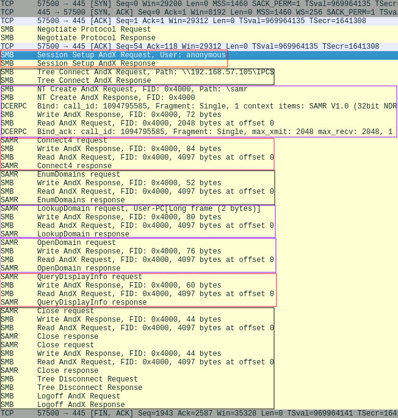](https://sensepost.com/img/pages/blog/2018/a-new-look-at-null-sessions-and-user-enumeration/image3.png)

The smb-enum-users script goes through various phases, as highlighted by the different boxes. It firsts establishes an anonymous session with the SMB server and then accesses the IPC$ share. It then opens up the samr named pipe, and runs several RPC calls, including Connect4, EnumDomains, LookupDomain,OpenDomain and QueryDisplayInfo, each of which completes successfully. The first few RPC calls extracted information regarding the system’s local domain, while QueryDisplayInfo used that information to produce a list of all users within that domain.

Let’s now look at the rpcclient connection:

[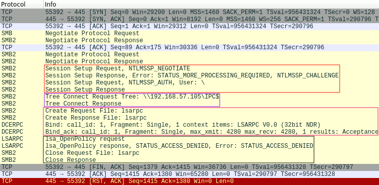](https://sensepost.com/img/pages/blog/2018/a-new-look-at-null-sessions-and-user-enumeration/image4.png)

In this capture, we can see that the rpcclient goes through four stages before finally reaching an error condition. The first stage, as highlighted by the first box, show that rpcclient was able to connect and authenticate to the server, using a blank username and password. The second stage shows that rpcclient was able to access the IPC$ share, and the third stage shows that it was able to open the lsarpc named pipe. Only in the fourth stage, when rpcclient tries to execute the LsaOpenPolicy RPC call does the remote server reply with an access denied error message. It is important to highlight that this behaviour is default to rpcclient, and is run before executing any provided RPC commands, such as QueryDisplayInfo.

By looking at these network traces, we see that the authentication and authorisation steps for the connections are performed separately. That is, we first authenticate with the SMB server, using a blank username and password. After this authentication has succeeded, authorisation is performed at three different places: when we attempt to open the IPC$ share, when we attempt to open a pipe, and finally when we attempt to execute an RPC call available via the pipe. As we’ve seen with LsaOpenPolicy, a system may allow one to perform most of these actions, but prevent one from finally executing the RPC function call. This however doesn’t mean that the system prevents NULL session authentication. It simply means that the system does not allow an anonymous user to execute a particular RPC function call.

By default, rpcclient first opens the LSARPC pipe and then requests the remote system to execute the LsaOpenPolicy and LsaQueryInformationPolicy functions. If an anonymous user is not allowed to execute these function, rpcclient exits. Most RPC calls however don’t require the information provided by these functions. In our test for example, the smb-enum-users script could still execute QueryDisplayInfo, and enumerate user information, without access to these functions.

Because of this behaviour, one may thus obtain false negatives when using rpcclient to determine whether a system allows NULL sessions, and whether that session could be used to provide useful information.

After playing around with rpcclient and Wireshark, I started to wonder which RPC function calls, if any, one could execute on a default Windows system using a NULL session. With this in mind, I consulted MSDN, which contained details on various different named pipes, and the functions that each of these named pipes exposed. I also started testing various versions of Windows. I particularly looked at domain controllers, as I have noted during several pentests that they often allowed one to connect using a NULL session, and then enumerate all users within the domain.

The tests showed that not only was it possible to authenticate to a default Windows 2012 domain controller without providing credentials, but one could also open the IPC$ share and several different pipes. In particular, as soon as one promoted a Windows 2012 system to become a domain controller, its security configuration was modified to allow anonymous access to the samr, lsarpc and netlogon pipes. In a default configuration, most functions within the SAMR and LSARPC pipes could hnot be executed.

However, one could execute a few functions within the NETLOGON pipe anonymously, including GetDcName, DsrGetDcName, DsrGetDcNameEx and DsrGetDcNameEx2.

These functions allow one to request the remote system to find a domain controller for any specified domain name. Note that the domain does not need to be the same as the domain to which the remote system is joined to.

From https://msdn.microsoft.com/en-us/library/cc237228.aspx, one can see that the DsrGetDcNameEx2 function allows one to request the remote system to locate a domain controller, for a specified domain name, which contains a specific user. If the remote system can locate a domain controller for such a domain, and the specified user exists, the remote system will return with a successful response including details regarding the domain controller. If the remote system can find a domain controller for the specified domain, but the user does however not exist, the remote system will return an ERROR_NO_SUCH_USER error message.

The DsrGetDcNameEx2 function requires one to specify an AllowableAccountControlBits field. This field is a set of 32 bits, six of which signify some specific attribute the user account should possess. For the most part, we are interested in normal domain accounts, which is selected by the 10th bit. This thus becomes 0000000000000000000001000000000, or 1000000000 for short, which when converted to decimal is 512.

With this information in hand, one can execute the DsrGetDcNameEx2 function using rpcclient. If the provided username exists in the domain, the response looks as follows:

[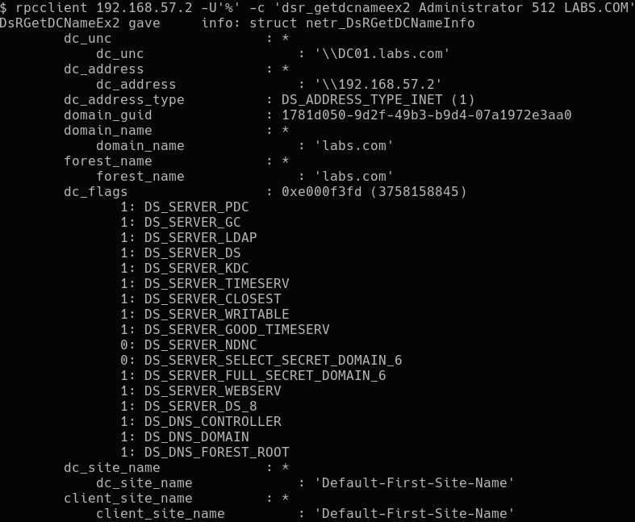](https://sensepost.com/img/pages/blog/2018/a-new-look-at-null-sessions-and-user-enumeration/image5.png)

If one however provided a username that does not exist, rpcclient returns the following error message:

[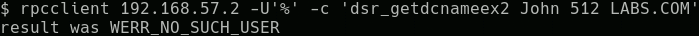](https://sensepost.com/img/pages/blog/2018/a-new-look-at-null-sessions-and-user-enumeration/image6.png)

One can thus establish if a user on a remote domain exists, or not. While this type of user enumeration requires one to provide the username (i.e. an oracle), and can only validate if the username exists or not, it can nonetheless be useful in several situations.

For instance, if one has established the naming convention of a particular domain, one could generate all possible variations and check which have been created. For example, if one user has the username M1000, one could generate all users between M1000 and M9999, and check which exists on the domain.

Alternately, one could employ a list of commonly used domain usernames that typically bypass password complexity rules. We maintain an internal one, but if you pull accounts from a few GALs or hashes from a few DCs you’ll be able to create your own.

With the previously mentioned issues of rpcclient in mind, I decided that it may be a better idea to write a custom application that could call DsrGetDcNameEx2 on a remote system.

To this extent, I used the impacket framework, which allows one the ability to call various RPC functions via SMB. The application takes in a list of potential usernames, and tries to establish if each one exists by calling DsrGetDcNameEx2 on a remote system. You can get it [here](https://github.com/sensepost/UserEnum/blob/master/UserEnum_RPC.py). I have had it field tested, and while it was reported to work on all domain controllers, it did take a while to complete the enumeration. The tests also indicated that it only seemed to work on domain controllers.

In an attempt to speed up the enumeration, I investigated how DsrGetDcNameEx2 works.

The GetDcName, DsrGetDcName, DsrGetDcNameEx and DsrGetDcNameEx2 functions are able to locate a domain controller for any provided domain name. To do so, they can either use DNS and LDAP, or NetBIOS.

The details of this process is provided at https://msdn.microsoft.com/en-us/library/cc223817.aspx, however in short it works as follows:

1. The system obtains the IP address of a domain controller related to the provided domain name either by using DNS lookups, or by sending NetBIOS broadcast requests for the domain name.

2. If the system obtained an IP address using DNS, it will send an LDAP ping packet to that address, while if it obtained an address via NetBIOS, it will send a mailslot ping packet to it. Both the LDAP and NetBIOS packets are UDP based, and contains a list of requirements that the domain controller should possess.

3. The domain controller checks if it possesses the required attributes, and replies to the system’s request.

4. The system processes the response send by the remote system to either the LDAP ping or mailslot ping packets.

What’s interesting about these approaches are that they do not use any authentication by design. Since the implementation of DsrGetDcNameEx2 can use either of these methods, i.e. DNS and LDAP, or NetBIOS, we can assume that we will be able to use both to enumerate users in the same way.

Let’s first look at the DNS and LDAP, approach. Since we are not actually interested in finding a domain controller using the method, we will skip the DNS part, and focus only on the LDAP packet.

Specifically, the method sends a LDAP search query to the remote system. This is often referred to as a CLDAP packet, or connectionless LDAP packets, as it uses UDP instead of TCP. Beyond this, there is little difference between the structure of a CLDAP packet and a normal LDAP search packet, as they both use ASN.1.

[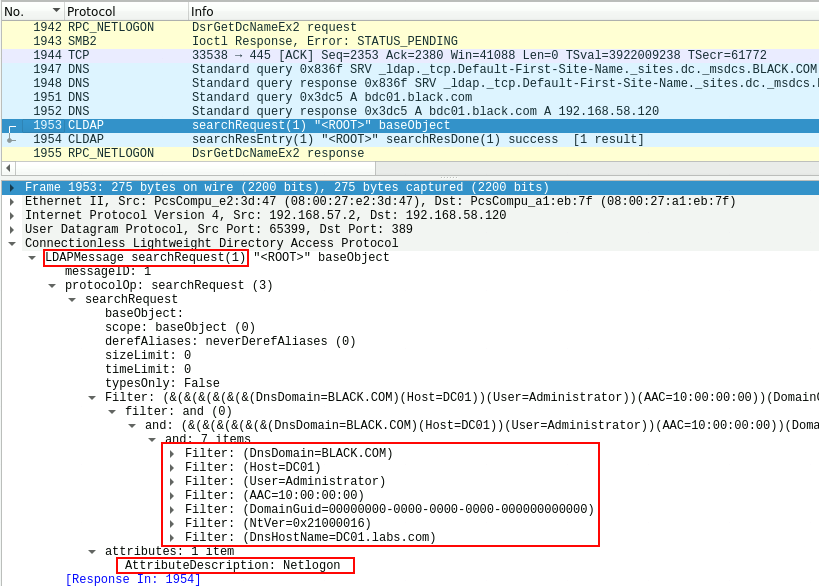](https://sensepost.com/img/pages/blog/2018/a-new-look-at-null-sessions-and-user-enumeration/image7.png)

As can be seen in the above picture, the CLDAP packet requests the LDAP server to search for an object that matches various filters. These include:

- the provided domain name (BLACK.COM)
- the requested username (Administrator)
- the name of the host that requested the search, in both NetBIOS and DNS form (DC01.LABS.com)
- The GUID of the sought domain, which can be left blank.
- The NETLOGON_NT_VERSION, which can be used to configure the reply of the server as detailed at https://msdn.microsoft.com/en-us/library/cc223801.aspx.
- the AAC or AllowableAccountControl, bits. This value is mapped from the AAC value provided by the DsrGetDcNameEx2 request, according to the table at https://msdn.microsoft.com/en-us/library/cc245737.aspx/. One can get the values at https://msdn.microsoft.com/en-us/library/cc245514.aspx and https://msdn.microsoft.com/en-us/library/cc245515.aspx. For a normal account, i.e. UF_NORMAL_ACCOUNT (512), the value is changed to USER_NORMAL_ACCOUNT(16) which has a hex value of 0x00000010.

The request also specifies that only the Netlogon attribute of the object be returned.

In the above case, the user Administrator exists on the BLACK.COM domain, and thus the server replies with the following structure:

[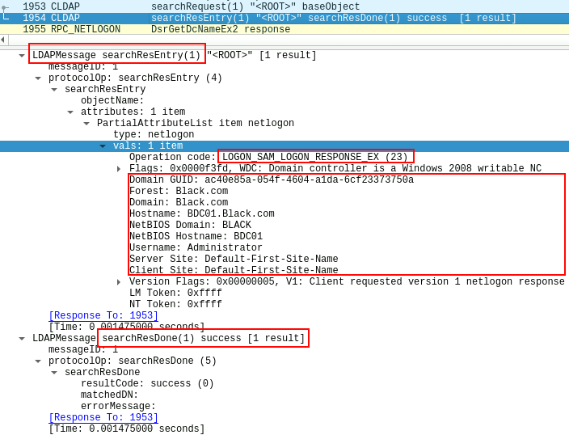](https://sensepost.com/img/pages/blog/2018/a-new-look-at-null-sessions-and-user-enumeration/image8.png)

The operation code is perhaps the most important value, as it indicates if the search returned a result or not. As detailed at https://msdn.microsoft.com/en-us/library/cc223803.aspx,the number 23 indicates that the server responded with a valid LOGON_SAM_LOGON_RESPONSE_EX structure, which contains information about the domain controller. This indicates that the user existed in the specified domain.

When the same packet is sent, but for a user that doesn’t exists, we get an operation code of 25 and the LOGON_SAM_USER_UNKNOWN_EX structure, as is shown below for the username John:

[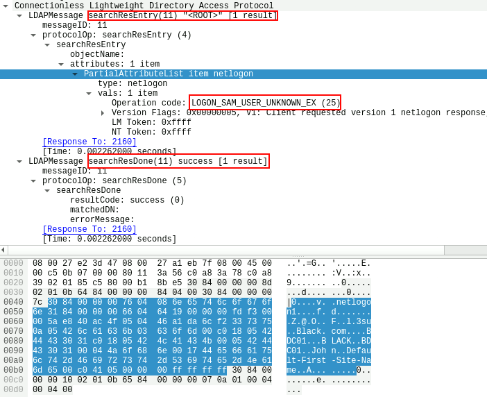](https://sensepost.com/img/pages/blog/2018/a-new-look-at-null-sessions-and-user-enumeration/image9.png)

We can thus send such a packet to a remote domain controller, and determine if a user exists by checking if it responds with an operation code of 23 or of 25.

To do so, we need to however be able to craft a CLDAP packet. The Samba source code includes an example perl script which can create such a CLDAP packet, located at https://github.com/samba-team/samba/blob/master/examples/misc/cldap.pl.

Based on this example, I created a python script which will take in a list of usernames, and for each user create a CLDAP packet, send it to a remote domain controller, and based on the response determine if the user exists or not. Specifically, I used the asn1tools python module to create the packet, which consist completely of an ANS.1 structure. Only the DnsDomain, NtVer, User, and AAC fields were required for a server to respond. You can get the script [here](https://github.com/sensepost/UserEnum/blob/master/UserEnum_LDAP.py).

I tested this script on a remote domain controller, and it worked fairly quickly, checking about 3500 usernames in 40 seconds.

While implementing the script, I wondered if it would be possible to alter the LDAP search filter to use wildcards in the search. This would allow one to enumerate users without fully knowing their usernames. If one could search for all usernames matching a pattern, one could increment the pattern until an exact match is found. For instance, one could start at B*, then Bo*, and finally Bob. To this extent, I modified the script to rather use a substring filter than an equality match filter. However, this did not work as the server simply refused to reply. I’ll continue to play around with the request, but at this point it seems like one can only confirm if a known username exists or not.

With the CLDAP method complete, I wanted to see if one could implement the NetBIOS mailslot ping method, and once again consulted Wireshark.

I connected to the DC01.labs.com system (192.168.57.2) and issued the DsrGetDcNameEx2 command, requesting DC01.labs.com to find a domain controller for the domain name BLACK (192.168.57.120), with has a user called Administrator.

In the trace below, we can see the packets sent directly after the DsrGetDcNameEx2 command is executed.

[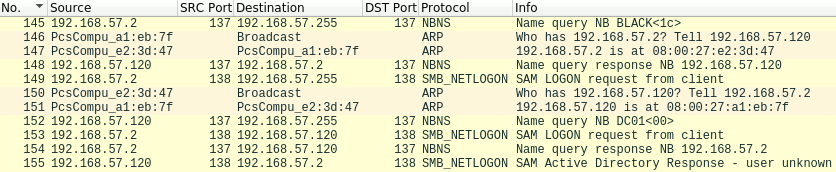](https://sensepost.com/img/pages/blog/2018/a-new-look-at-null-sessions-and-user-enumeration/image10.png)

The DC01.labs.com system first sends out a NBNS name query broadcast, trying to find any domain controller <1C> for the domain name BLACK.

At #148 we see the BLACK domain controller respond to the NBNS query broadcast, telling the DC01.labs.com its IP address. In #150, the DC01 system starts to process the response, and sends out ARP requests to connect the BLACK domain controller.

In #149 the DC01.labs.com system broadcasts a UDP SMB_NETLOGON packet, and then later in #153 specifically sends the same packet to the BLACK domain controller, using its IP address.

When the BLACK domain controller processes the SMB_NETLOGON packet, it tries in #152 to establish the IP address of DC01 via a NBNS lookup, and gets a NBNS response in #153.

Finally, in #155, the BLACK domain controller sends its response to the SMB_NETLOGON packet.

From this trace, we can see that we can cause both the system that we execute the DsrGetDcNameEx2 function on, and the domain controller that responds to the SMB_NETLOGON request, to do NBNS lookup requests. We also control the names that both systems will lookup via NBNS, and can respond to those requests with any IP address. This effectively allows one, without providing any authentication, to instruct a Window domain controller to connect to any provided IP address via NetBIOS. I wondered if this could be used to obtain hashes using something like Responder, however as all packets resulting from theDsrGetDcNameEx2 are UDP based, and no SMB TCP connections are established, it doesn’t seem to be trivial. I’m still playing around with Responder to see what one could do with this, but at the very least one seem to be able to use this approach to proactively poison a system’s cache with a NETBIOS name and a corresponding IP.

With regards to enumerating users, let’s look at the SMB_NETLOGON packet. While Wireshark classifies this packet as SMB_NETLOGON, it is in fact a mailslot write packet, as discussed by MSDN in [https://msdn.microsoft.com/en-us/library/cc223816.aspx,](https://msdn.microsoft.com/en-us/library/cc223816.aspx)https://msdn.microsoft.com/en-us/library/cc234511.aspx , https://msdn.microsoft.com/en-us/library/ee442092.aspx and [https://msdn.microsoft.com/en-us/library/cc223804.aspx.](https://msdn.microsoft.com/en-us/library/cc223804.aspx)

The structure of the packet is quite involved, and includes various fields. In Wireshark a request such as the one sent in #153, would look as follows:

[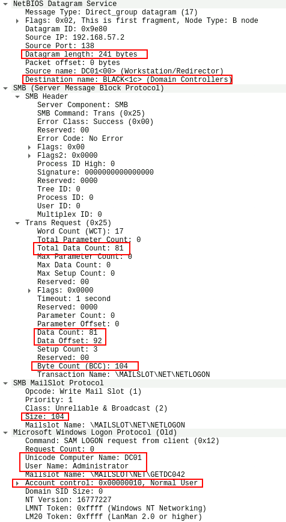](https://sensepost.com/img/pages/blog/2018/a-new-look-at-null-sessions-and-user-enumeration/image11.png)

The majority of this packet is simply preamble, working its way towards the request which Wireshark puts under the section “Microsoft Windows Logon Protocol (Old)”, and MSDN calls the NETLOGON_SAM_LOGON_REQUEST structure in the Databytes field. The exception to this is the requested domain name, in this case BLACK, which is sent in the start of this packet.

Looking at the NETLOGON_SAM_LOGON_REQUEST structure we can see three fields of interest, i.e. UnicodeComputerName, UnicodeUserName and AllowableAccountControlBits.

The AllowableAccountControlBits value is the same as before, i.e. 0x00000010 as was used in the construction of the CLDAP packet. The Computer Name field contains the NetBIOS host name of the system from which the request originated. It is this value that the domain controller will lookup using NBNS requests, as previously discussed. This isn’t ideal, as this requires an implementation of NBNS response packets to obtain the mailslot ping response. One can avoid this behaviour, by simply setting the value to an IP address. The MSDN documents state that both the Computer Name and User Name fields should be encoded in UTF-16.

Looking at the response provided for this packet, we see a near identical structure, with the exception of the Databytes field:

[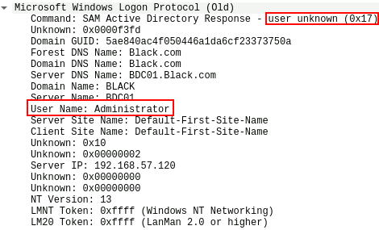](https://sensepost.com/img/pages/blog/2018/a-new-look-at-null-sessions-and-user-enumeration/image12.png)

Wireshark somewhat confusingly interprets the response code incorrectly as “user unknown”. As mentioned before, MSDN states that the response code 23, or 0x17 in hex is reserved for “LOGON_SAM_LOGON_RESPONSE_EX”. Response code 25, or 0x19 is however reserved for “LOGON_SAM_USER_UNKNOWN_EX”.

When sending a mailslot ping request with a username that doesn’t exist, the server does reply with the 25 response code, however Wireshark fails to interpret the response structure:

[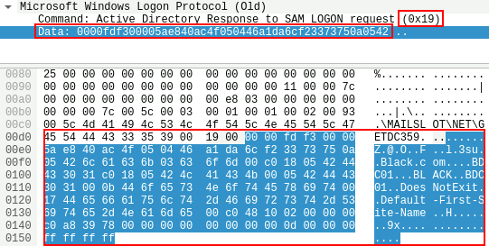](https://sensepost.com/img/pages/blog/2018/a-new-look-at-null-sessions-and-user-enumeration/image13.png)

Regardless, we can thus establish if a user exists by sending a mailslot ping packet, and checking if the response code is 23 or 25.

Crafting these packets is somewhat complicated, so I looked at scapy for some help. I had to make some changes to the existing scapy structures, and also had to implement the NETLOGON_SAM_LOGON_REQUEST structure. In addition, both the username and source hostname needed to be encoded with UTF-16. Another thing to take into account, as highlighted in the above captures, was the length and size fields that change with different usernames and hostnames. MSDN and RFC 1001 and RFC 1002 helpfully state the required calculations needed for these fields. Putting this altogether I was able to create a script that can enumerate users using this method, which you can get over [here](https://github.com/sensepost/UserEnum/blob/master/UserEnum_NBS.py).

Comparing the three different approaches, I found that the CLDAP technique to be the fastest, with the mailslot approach second, and the DsrGetDcNameEx2 coming in third. Via a remote connection, I have been able to test about 3500 usernames in about 40 seconds using the CLDAP technique. Note that the scripts at this stage are only PoCs, and haven’t really been optimised for speed. Using multiple threads and so forth could lead to an increase.

Regarding the logs that these techniques generate, it would seem that both the CLDAP and mailslot ping approach generate no entries, while the DsrGetDcNameEx2 approach does generate an anonymous logon entry which contains the IP address of the system that executed the script.

Hopefully the provided scripts can help you in enumerating a list of domain users. I’m not aware of any existing scripts that use these techniques, however, in either way I learned quite a lot in implementing them.

Thanks for reading, and happy hacking.
Reino