    

# Escalate Local Privileges

[Mohans](https://medium.com/@RedTeam.BlueTeam.Series?source=post_page-----f11987baaada----------------------)

[May 3](https://medium.com/redteam-blueteam-series/escalate-local-privileges-f11987baaada?source=post_page-----f11987baaada----------------------) · 6 min read

Local privilege escalation happens when one user acquires the system rights of another user, means getting privileges to access something that should not be accessible. Attackers use various privilege escalation techniques to access unauthorized resources. Compromised credentials may also grant an adversary increased privilege to specific systems or access to restricted areas of the network. Adversaries may choose not to use malware but uses tools in conjunction with the legitimate access those credentials provide to make it harder to detect their presence. Let’s understand both red team and blue team tactics in offending and defending.

# **Red Team: Attack vectors and Techniques**

Let’s understand the common approaches/techniques the red-teamer performs in finding local privilege escalation.

**1) Local Exploits**
**2) Weak Configurations**

***1a)***  ***Adversaries check for the kernel exploits*** and for any missing security patches. Check if windows version has any exploits and any vulnerable drivers.

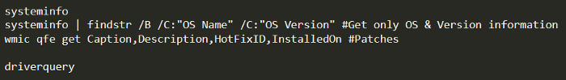
System info gathering
> Metasploit has scripts that can check for kernel exploits
> /post/windows/gather/enum_patches
> /post/multi/recon/local_exploit_suggester
***2a) Enumerate to find weak configurations***

- Check to find if any passwords are stored in environmental variables — set, export *#commands*
- Check for Weak Configurations — WinSCP, Putty ([Tools out their which can decrypt](https://github.com/ropnop/windows_sshagent_extract) like SessionGropher)

HKEY_CURRENT_USER\Software\Martin Prikryl\WinSCP 2\SshHostKeys

- ***Check to execute any sudo command***
- ***Check for any weird suid command***

**> find / -perm -u=s -type f 2>/dev/null**

> suid=It is a security tool that permits users to run certain programs with escalated privileges

- ***Process Injection***
- ***Exploiting AlwaysInstallElevated key*** by silent installation of malicious files using msiexec.

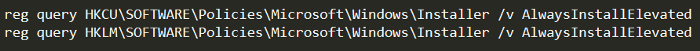

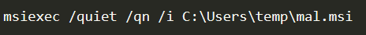
Silent installation

- ***Check ***users can read***  ***[***LAPS***](https://blog.stealthbits.com/running-laps-in-the-race-to-security/) attributes(*ms-msc-AdmPwd* and *ms-mcs-AdmPwdExpirationTime)* in the domain computer objects. CQURE Academy has a video on this technique.
- ***Check Audit Settings from the registry keys ***which maintains system activity logs for audit trial.

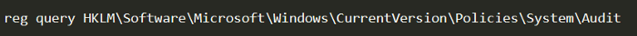
Audit registry keys

- Check if any of the ***groups having interesting permissions***

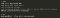
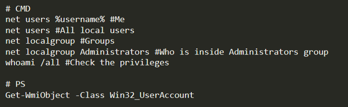
Check user permissions

- Check to perform ***DLL Hijacking or binary overwriting*** among installed softwares.
- Check ***scheduled tasks running from writable locations*** so that you can modify the script to your malicious payload with elevated privileges.

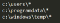
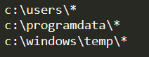
Writable locations

- ***Token Manipulation*** which is used to describe the security context of a process or a thread. The token contains information like the SID of the uses, the groups of the user, the privileges assigned to the user and its groups.

Using the ***incognito *module **of metasploit you can easily **list **and **impersonate **other **tokens**. This could be useful to perform** actions as if you where the other user**. You could also **escalate privileges **with this technique.

> I have seen this in wild where a scheduled task was created with rundll32.exe as a invoking method for the malicious script.

- **Check UAC** — UAC is used to allow an **administrator user to not give administrator privileges to each process executed**. This is **achieved using default **the **low privileged token **of the user.

To differentiate between which binary is executed with low or high privileges, Mandatory integrity Controls (MIC) is used which entails 5 levels of integrity for processes. bypass the UAC (elevate from medium integrity level to high) some attackers use this kind of binaries to execute arbitrary code because it will be executed from a High level integrity process.

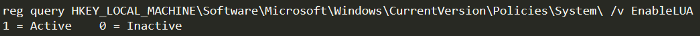
UAC registry keys

Meanwhile adversaries also checks for other keys like *ConsentPromptBehaviorAdmin, LocalAccountTokenFilterPolicy, FilterAdministratorToken* under the same location.

- ***Check permissions***  ***of process binaries and folders*** to perform dll injection using icacls
- ***Perform memory password mining ***of running process like FTP(stores credentials in clear text in memory) using sysinternals ***procdump ***[*(which I mentioned in blog-4 ).*](https://medium.com/redteam-blueteam-series/run-the-payload-commands-d2956276173d)

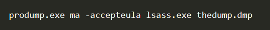
Dumping lsass process memory

- Check if ***authenticated users***  ***can modify any service*** using accesschk/accessenum from sysinternals tools, SC.EXE, ICACLS.EXE

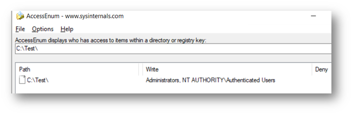
Vulnerable directory & process under it

- **Check if you can modify any service registry — **Check if Authenticated Users or NT AUTHORITY\INTERACTIVE have FullControl. In that case you can change the binary that is going to be executed by the service.

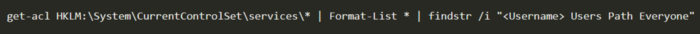
Check services & its permissions for users

- **Check Unquoted service paths** — If the path to an executable is not inside quotes, Windows will try to execute every ending before a space.

For example, for the path *C:\Program Files\Some Folder\Service.exe* Windows will try to execute

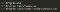
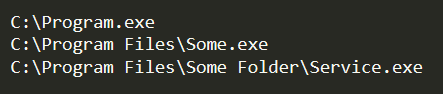
Execution mechanism of unquoted service paths

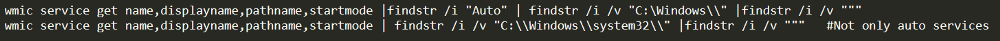
*list all unquoted service paths (minus built-in Windows services)*

- Recently released [***PrintSpoofer tool — Abusing SeImpersonate***](https://itm4n.github.io/printspoofer-abusing-impersonate-privileges/) works great for privilege escalation on Win10 and Server 2016/2019 wherein code can be executed in the context of SYSTEM account.
- ***Escalation via RottenPotato, JuicyPotato tools***
- ***Escalation via Windows Subsystem for Linux.***

> [*> WinPEAS*](https://github.com/carlospolop/privilege-escalation-awesome-scripts-suite/tree/master/winPEAS)*>  & LPEAS enumeration tools facilitates in finding misconfigurations and absence of patches on a system that you can take advantage of to gain administrative privileges. Check that out.*

# **BLUE TEAM: Detective and Preventive Controls**

Following the best practices reduce the chance of successful privilege escalation attacks and we shall see the same at multiple levels.

**Endpoint Level:**

1. Purchase Threat Detection & Prevention tools — Installing A.V tools mitigates the chance of machine getting compromised and if unfortunately happens, at least it will detect so that we can perform necessary actions to remediate.

2. Implementing Secure Group Policies like a) Disallow Removable Media b)Restrict Software Installations c) Follow the principle of least privilege d) Control Access to CMD e) Disable Guest Account f) Password length g)Password age limit h) Disabling Anonymous SID Enumeration in A.D h) Moderating access to control panel, I just mentioned few but there are many policies an organization can implement.

3. Installing security patches (Microsoft release the security patches once in every month & core security patches of any 0-day exploits ASAP)

4. Harden Authentication by centralizing identity with Single sign-on (SSO) and deploy Multi-Factor authentication (MFA)

5. Configuring AppLocker and Whitelisting and blacklisting applications based on organization dependency.

6. Implementing SIEM in an organization and integrating with other threat detection sources and monitoring those alerts. (If possible configure sysmon to SIEM, Monitor the above mentioned registry keys for any violation)

7. Disabling DEP, ASLR protection enhances the chances of attackers achievement at core level for creating backdoors & rootkits which needed high level access, Configure the SIEM for any modification here.

**> wmic OS Get DataExecutionPrevention_Available**
> If the output is “TRUE,” hardware-enforced DEP is available.
**> wmic OS Get DataExecutionPrevention_SupportPolicy**

> Current DEP support policy (0,1,2,3 — Off, On for all process, only for windows components, Enabled for all but admins can provide list of not DEP process)

8. Checkout WinPEAS & LinPEAS and act accordingly.

9. Maintaining an audit trail of system activity logs(above all) can help identify configuration errors, troubleshoot service disruptions, and analyze compromises that have occurred, as well as detect attacks.

**Network Level:**

Harden Authentication by centralizing identity with Single sign-on (SSO) and deploy Multi-Factor authentication (MFA) is the best practice we can do to prevent attacker from entering your network and decrease their ability move around easily once inside.

**Process level:**

1. Preparation is the effective key in identifying & responding. Training end users at regular intervals and providing awareness on cyber-attacks can help the organization against cyber-attacks.

2. Train staff on the latest security threat and security tools.