Web App Pentest Cheat Sheet. Everybody has their own checklist when… | Medium

#### Top highlight

# Web App Pentest Cheat Sheet

[Murat Karaöz](https://medium.com/@muratkaraoz?source=post_page-----c17394af773----------------------)

[Oct 6, 2018](https://medium.com/@muratkaraoz/web-app-pentest-cheat-sheet-c17394af773?source=post_page-----c17394af773----------------------) · 12 min read

Image from [x365.se](http://x365.se/)

Everybody has their own checklist when it comes to pen testing. If you are new to pen-testing, you can follow this list until you build your own checklist. I have extracted these steps from OWASP testing guide and I believe it is a good starting point.

* * *

*...*

## Robots.txt

Inspect robots.txt file. I have never found anything interesting in robots.txt files files but you never know.

[OWASP OTG-INFO-003](https://www.owasp.org/index.php/Review_Webserver_Metafiles_for_Information_Leakage_(OTG-INFO-003))

* * *

*...*

## Server Headers

Check out header values in server responses. Headers like **Server**, **X-Powered-by** or **X-Generator** can leak information about the technologies used in the back-end. You can use Burp or wget to read server headers. Following command saves header values in index.html file.

wget --save-headers [http://www.site.com/](http://www.livescore.com.tr/)
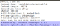
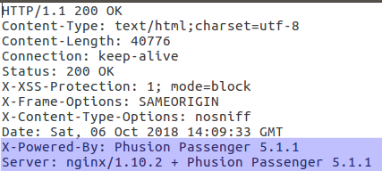

[OTG-INFO-008](https://www.owasp.org/index.php/Fingerprint_Web_Application_Framework_(OTG-INFO-008))

* * *

*...*

## Cookies

- A cookie may contain username and/or password in an encoded format. Send the cookie value to burp decoder and hit smart decode. Cookies should never contain any sensitive data. (Username is sensitive data!)
- If you see **BIG-IP** in a cookie value the app might be behind a load balancer.
- Make sure the cookie is marked as **http-only** and **secure.**

[OTG-SESS-002](https://www.owasp.org/index.php/Testing_for_cookies_attributes_(OTG-SESS-002))

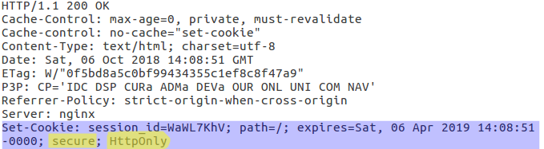

* * *

*...*

## HSTS

Check if the server sets **Strict-Transport-Security** (HSTS) header. This header makes sure that the page is always served via https and prevents attacks like ssl strip.

[OTG-CONFIG-007](https://www.owasp.org/index.php/Test_HTTP_Strict_Transport_Security_(OTG-CONFIG-007))

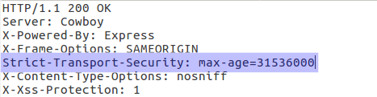

* * *

*...*

## Security Headers

If the app is accessible through public internet, use [SecurityHeaders](https://securityheaders.com/).com to see if it includes the following security headers. If not you can do it manually by inspecting headers.

- X-Frame-Options: SAMEORIGIN
- X-XSS-Protection: 1; mode=block
- X-Content-Type-Options: nosniff

[OWASP Security Headers](https://www.owasp.org/index.php/Security_Headers)

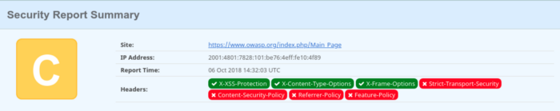

* * *

*...*

Look for hidden pages using Burp Intruder. You can find the instructions on [Using Burp to Test for Missing Function Level Access Control](https://support.portswigger.net/customer/portal/articles/1965720-Methodology_Missing%20Function%20Level%20Access%20Control.html) page under Forced Browsing title. You can find forgotten test pages and unmapped functional pages using this method.

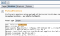
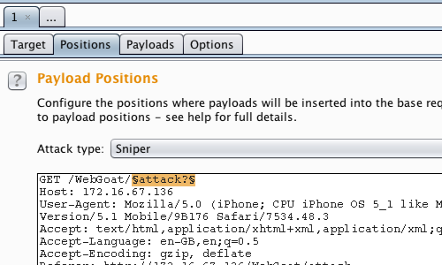

* * *

*...*

## SSL Ciphers

If the app works over HTTPS, check for TLS security.

- Weak Ciphers: Run the command below, report any cipher that is not rated A. If SSL is supported it should be removed and only TLS versions should be supported.

nmap --script ssl-enum-ciphers -p 443 www.example.com
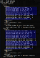
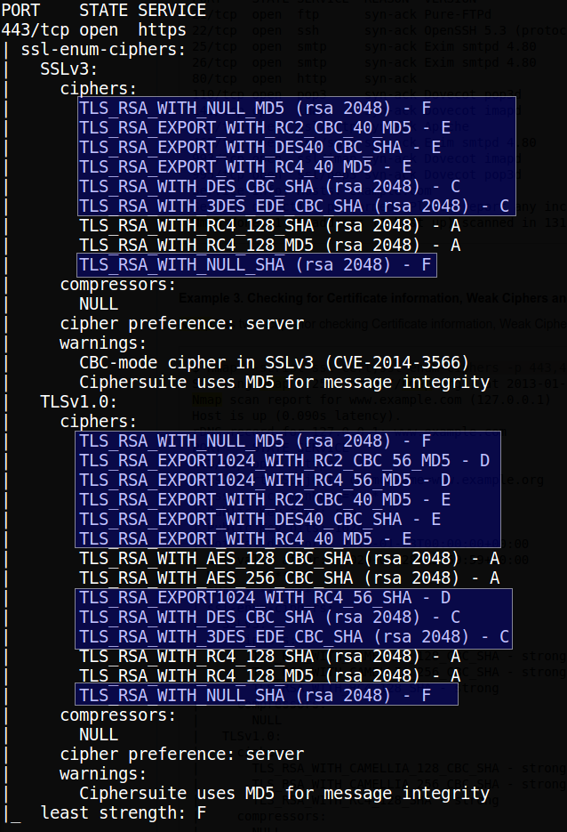

If you are not sure which ciphers are OK you can scan amazon.com and compare your results with it.

[OTG-CRYPST-001](https://www.owasp.org/index.php/Testing_for_Weak_SSL/TLS_Ciphers,_Insufficient_Transport_Layer_Protection_(OTG-CRYPST-001))

If the app is accessible via public internet you can use [Qualys SSL Labs](https://www.ssllabs.com/ssltest/) to scan the app.

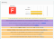
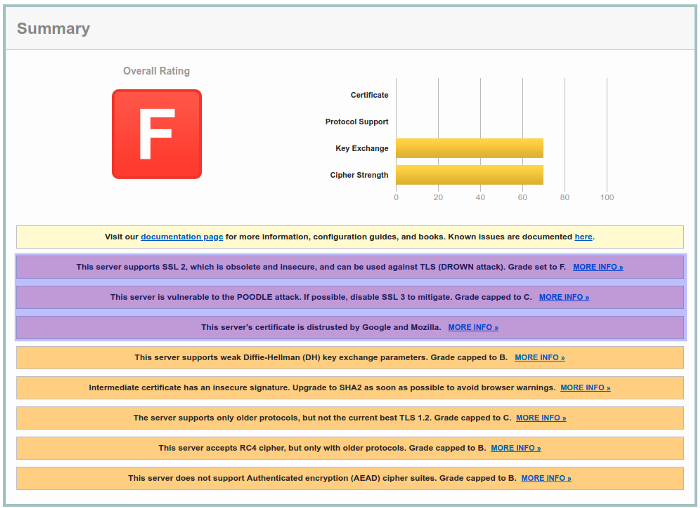

* * *

*...*

## Testing HTTP Methods

Run the following command to see which HTTP methods are supported. 99% of the time a web app is good with only GET and POST methods. All other methods should be removed. Potentially dangerous methods are TRACE, PUT and DELETE.

nmap -p 443 --script http-methods www.example.com

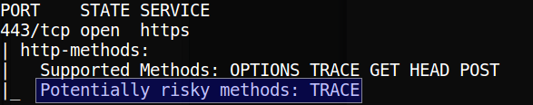

[OTG-CONFIG-006](https://www.owasp.org/index.php/Test_HTTP_Methods_(OTG-CONFIG-006))

* * *

*...*

## Testing for HEAD access control bypass

Find a page in the app that cannot be accessed by default and gives you 302 redirect. Try to access the page using HEAD method instead of GET. If you get a 200 response, it means the access control is broken.

* * *

*...*

## Arbitrary HTTP Methods

Try arbitrary HTTP methods. Find a page in the app that cannot be accessed by default and gives you 302 redirect. Try to access the page using made up words like JEFF or CATS. If you get a 200 response, it means the access control is broken.

[OTG-CONFIG-006](https://www.owasp.org/index.php/Test_HTTP_Methods_(OTG-CONFIG-006))

* * *

*...*

## Testing cross domain policy

Test cross domain policy. Add crossdomain.xml to end of base URL of the web page. If you get an xml file inspect the file. If you see <allow-access-from domain=”*” /> in the file, it means something is wrong. You can check OWASP OTG-CONFIG-008 for details if you find a page that has the policy.

[OTG-CONFIG-008](https://www.owasp.org/index.php/Test_RIA_cross_domain_policy_(OTG-CONFIG-008))

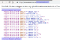
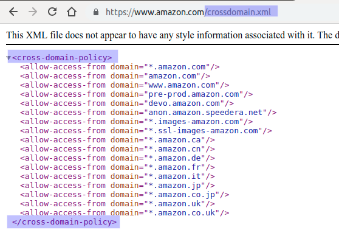

* * *

*...*

## Username Enumeration

- Enter a valid username and a wrong password. Note the warning you get. then Enter an invalid username and a password. If you get a different warning this means you can collect the valid usernames using brute-force. For example I registered to etsy.com with desidero44@yahoo.com mail address and tried to login with a wrong password, then tried to login with desidero55@yahoo.com which is not registered to etsy.com at all.

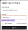
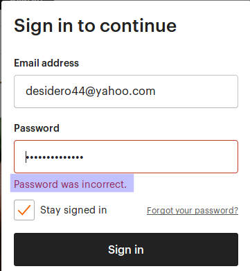
Password is incorrect so the email address should be valid.
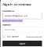
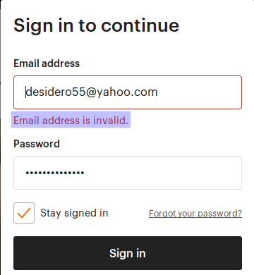
E-mail address is invalid.

- If there is a directory that can be accessed with the username like site.com/users/my_user_name we can try to access the page with different user names. You might get a 403 forbidden for registered users and 404 for invalid usernames.
- Test forgot password functionality to see if generates different error messages for valid and invalid usernames.
- An advanced technique is to measure the server response time for valid and invalid usernames. Server might take longer to respond to valid user names.

[OWASP-AT-002](https://www.owasp.org/index.php/Testing_for_User_Enumeration_and_Guessable_User_Account_(OWASP-AT-002))

* * *

*...*

## Testing for **user registration and provisioning**

Ask the following questions and try to find answers. There is no wright or wrong answer. You should decide if the answer makes sense or not.

1. Can anyone register for access?

2. Are registrations vetted by a human prior to provisioning, or are they automatically granted if the criteria are met?

3. Can the same person or identity register multiple times?
4. Can users register for different roles or permissions?
5. What proof of identity is required for a registration to be successful?
6. Are registered identities verified?
7. Can identity information be easily forged or faked?
8. Can the exchange of identity information be manipulated during registration?

9. Is there any verification, vetting and authorization of provisioning requests?

10. Is there any verification, vetting and authorization of de-provisioning requests?

11. Can an administrator provision other administrators or just users?

12. Can an administrator or other user provision accounts with privileges greater than their own?

13. Can an administrator or user de-provision themselves?

14. How are the files or resources owned by the de-provisioned user managed? Are they deleted? Is access transferred?

[OTG-IDENT-002](https://www.owasp.org/index.php/Test_User_Registration_Process_(OTG-IDENT-002)), [OTG-IDENT-003](https://www.owasp.org/index.php/Test_Account_Provisioning_Process_(OTG-IDENT-003))

* * *

*...*
**Test for authentication**

- Username and password must be transferred over an encrypted channel like HTTPS. [OTG-AUTHN-001](https://www.owasp.org/index.php/Testing_for_Credentials_Transported_over_an_Encrypted_Channel_(OTG-AUTHN-001))
- Username and password must be sent via POST method. If they are sent via GET method the username and password might be cashed in browser history and server logs.
- If authentication is performed with POST method, intercept the POST request via burp and change request to GET. If you can authenticate yourself go to previous item.

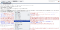

- If the app has an admin panel, you should test it for default usernames and password. You can use Burp intruder in cluster-bomb mode for this kind of attack.

[Using Burp to Brute Force a Login Page](http://using%20burp%20to%20brute%20force%20a%20login%20page/)

[OTG-AUTHN-002](https://www.owasp.org/index.php/Testing_for_default_credentials_(OTG-AUTHN-002))

* * *

*...*

## Testing for Weak lock out mechanism

- After a pre-determined amount of consecutive failed login attempts, accounts must be locked. If the number is too small legit users might lock themselves out. If it is too big, attackers can take advantage of it. To me 5 is good.
- After your account is locked, try to login from a different browser or from a different computer and IP if possible. Account should still be locked.
- If you can request a password reset e-mail, try to decompile it. If should be completely random. If it can be guessed or generated for other users it is broken.
- Password reset links should be valid for at most 1 day. After that it should be invalid. If you request more than one link, only the most recent one should be valid. Old reset links must be invalidated even if they are not used.
- Password reset link or code must be for single use. It must be invalidated after first use.

[OTG-AUTHN-003](https://www.owasp.org/index.php/Testing_for_Weak_lock_out_mechanism_(OTG-AUTHN-003))

[OTG-AUTHN-009](https://www.owasp.org/index.php/Testing_for_weak_password_change_or_reset_functionalities_(OTG-AUTHN-009))

* * *

*...*

## Testing for Vulnerable Remember Password

If the app has remember me feature, enable it while logging in. Then check your cookies. Some apps just save the username and password in the cookie, some only use simple base 64 encoding. You can use your favorite browser extension to see your cookies. For chrome you can use EditThisCookie and Cookie Editor for Firefox.

[OTG-AUTHN-005](https://www.owasp.org/index.php/Testing_for_Vulnerable_Remember_Password_(OTG-AUTHN-005))

* * *

*...*

## Testing for weak passwords

- App should enforce a password policy to prevent passwords like 12345 or asdasd. The complexity can be determined by assessing the user base and the data that can be accessed using the app.
- If the users are forced to change their password after a pre-determined time period, and they cannot use the last 3 passwords, you should check if you can return to your original password by changing your password 4 times.
- Under no circumstances, username should be allowed in a password.

[OTG-AUTHN-007](https://www.owasp.org/index.php/Testing_for_Weak_password_policy_(OTG-AUTHN-007))

* * *

*...*

## Testing log out functionality

- Verify that all pages in the app have an easily accessible log-out button.
- After logging out, hit the back button to see what happens. If you can see the last visited page, try to click on a link. If you can follow new links, the log-out mechanism is broken. If you can only see the previously visited pages it is the browser cache, not an app vulnerability.
- After logging out try to reach a login protected page with your old session id. If you can access the page, server might not be invalidating old session cookies.
- Open the app in two tabs in the same browser and log-out from one of them. If you are still logged-in in the other tab, log out feature is not working properly.

[OTG-AUTHN-006](https://www.owasp.org/index.php/Testing_for_Browser_cache_weakness_(OTG-AUTHN-006))

* * *

*...*

## Testing for Weak security question

- You can collect security questions by creating new accounts. After gathering enough questions, answer the following questions. The answer should be “no” for all of them.
- Can the questions be answered by the family members?
- Can you answer the questions by stalking people on social media?
- Can users write their own questions? (They should not because if you let users to pick their own questions they will select relatively easy questions.)
- Can you lock the account by giving wrong answers? (If you could, it might be used as a way to lock legit user accounts and this functionality turns to a form of DoS attack. Instead of locking out the user, app should introduce increasing time delays)

[OTG-AUTHN-008](https://www.owasp.org/index.php/Testing_for_Weak_security_question/answer_(OTG-AUTHN-008))

* * *

*...*

## Testing Password Reset Functionality

- Make sure that a user can only reset her own password. If a privileged user can reset other users’ passwords, make sure that the super user cannot see the new password.
- During password change, intercept the traffic with burp and check if username is present in the request. If it is, change the username to see what happens. You might change someone else’s password this way.
- After a password reset, user should be informed via e-mail or sms.
- If the system requires high level security, password reset functionality should try to id the user before sending a password reset e-mail or code.
- If the system sends back your forgotten password, it means they are keeping it in somewhere which is always a bad idea. (MediaMarkt used to do this)

[OTG-AUTHN-009](https://www.owasp.org/index.php/Testing_for_weak_password_change_or_reset_functionalities_(OTG-AUTHN-009))

* * *

*...*

## Testing for Directory Traversal

If you find a URL or a cookie that points to a file in the system, you should try changing the file name to a known file in the server to see if you can break out of application sandbox. You should look for URLs like below

http://example.com/getUserProfile.jsp?item=ikki.html
http://example.com/index.php?file=content
http://example.com/main.cgi?home=index.htm

If you spot a URL like these, you can use Burp intruder to test for directory traversal. Intercept the packet with burp and send it to intruder. If you have Burp Pro you can use traversal fuzzing list, if not you can find a decent fuzzing list in this [Github Repo](https://github.com/1N3/IntruderPayloads/tree/master/FuzzLists).

* * *

*...*

## Testing Session Management

- Follow the traffic with Burp and find when the server sends a session id. Send that packet to sequencer and collect as much packages as you can. Analyze the session ids to see if they look random. Check out [Using Burp to Test Session Token Generation](https://support.portswigger.net/customer/portal/articles/1964169-using-burp-to-test-session-token-generation) of Burp Help.
- Check whether the server is sending a new session id after a successful login. If not the app is vulnerable to Session Fixation attacks.

[OTG-SESS-003](https://www.owasp.org/index.php/Testing_for_Session_Fixation_(OTG-SESS-003))

* * *

*...*

## Testing for CSRF

If you have Burp Pro, Burp will warn you about possible CSRF. Inspect these packets. If you don’t have Burp Pro you should manually check request that make a change in the app, like adding a user or updating an items value. If such a package does not contain a random value, it is possible that the app is vulnerable to CSRF. You can use Burp to create a CSRF PoC.

[Using Burp to Test for Cross-Site Request Forgery (CSRF)](https://support.portswigger.net/customer/portal/articles/1965674-using-burp-to-test-for-cross-site-request-forgery-csrf-)

* * *

*...*

## Session Puzzling

NOTE: I have never seen this problem in a real world application. But here are 3 different ways to test for it.

Method 1:

- Force browse a URL that is behind a login page. You probably get a 302 redirect to the login page.
- Open a new tab and navigate to reset password page. Enter a valid username and proceed to the next step.
- Return to the first tab and refresh the page. If the app is vulnerable it might log you in as the user you used in step two.

Method 2:

- Log in to the app.
- Open a new tab, navigate to user registration page. Pick a user name that is already registered. Try to proceed and get the user is already registered warning.
- Return to the first tab, and refresh the page. If the app is vulnerable you might be logged in as the user you used in step two.

Method 3:

- Login to the app.
- Open user’s profile page. Copy the url and log out.
- Paste the url in to the address bar. Hit enter and you will probably be directed to the login page.
- Open another tab and navigate to the login page. Enter a valid username and made up a password and intercept the login request with Burp. Forward the request and intercept and drop the response.
- Re-try the URL that you copied in step 2. If the app is vulnerable, it might give you a valid session for the user you used in step four.

[OTG-SESS-008](https://www.owasp.org/index.php/Testing_for_Session_puzzling_(OTG-SESS-008))

* * *

*...*

## HTTP Parameter Pollution (HPP)

To test for HPP just send the same parameter twice with different values. HTTP standard does not include guidance on how to interpret multiple input parameters with the same name. A simple test fort HPP is can be performed as follows:

- Find a search box in the app and try the following queries.
- search?q=seattle
- search?q=boston
- search?q=seattle&q=boston
- The important part is the result of the 3rd query. If it is the same as the first or the second, app is good but if it gives a different result from any of the previous searches, you got a HPP vulnerability.

[OTG-INPVAL-004](https://www.owasp.org/index.php/Testing_for_HTTP_Parameter_pollution_(OTG-INPVAL-004))

* * *

*...*

## Clickjacking

To test for Clickjakcing use the following html code and replace src parameter with the target app’s URL. Open the html file in a browser. If you can see the page in the iframe, then the app is vulnerable to Clickjacking attacks.

<html>
<head>
<title>Clickjack test page</title>
</head>
<body>

Website is vulnerable to clickjacking!

<iframe src=”http://www.sayfa.com" width=”500" height=”500">
/iframe>
</body>
</html>

* * *

*...*

## File Upload

- Make sure that you can only upload allowed file types.
- Make sure that there is a reasonable file size is enforced.
- Make sure that the file cannot be sent to the server via burp repeater again and again. That might lead to a DoS attack.
- Test if you can intercept the upload request and send a malicious html file to perform XSS attack. Check [OTG-INPVAL-002](https://www.owasp.org/index.php/Testing_for_Stored_Cross_site_scripting_(OTG-INPVAL-002)) page for details.

* * *

*...*

## CAPCHA

- Check out page source code to see if the app is hiding the captcha answer in the client side.
- Make sure that the captcha changes after failed login attempts.
- Make sure that the captcha is enforced on the server side.

* * *

*...*

## XSS

You can use the following payloads for manual testing. There are many more but these are the basic ones and gives you the low hanging fruit.

a. ">
b. 
c. 
d. 
e. <a onmouseover="alert(13)">xxs link</a>
f. 
g. ' onerror='alert(1)';
h. javascript:alert(1)
i. <body onload=alert("XSS")>
j. 

* * *

*...*

## SQL Injection

Put a single quote in every search box you see in the app and check if you can get an error. If you do, further investigate with SQL Map.