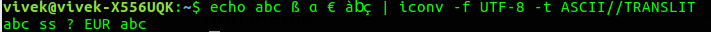
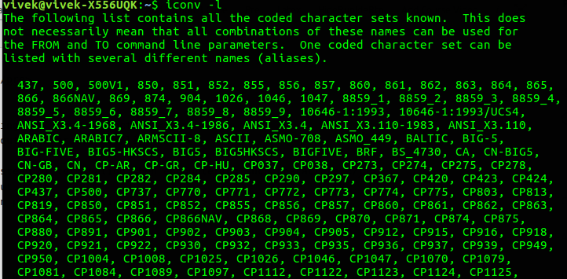
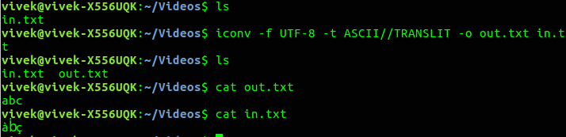

iconv command in Linux with Examples - GeeksforGeeks

# iconv command in Linux with Examples

**iconv** command is used to convert some text in one encoding into another encoding. If no input file is provided then it reads from standard input. Similarly, if no output file is given then it writes to standard output. If no **from-encoding** or **to-encoding** is provided then it uses current local’s character encoding.

**Syntax:**
iconv [options] [-f from-encoding] [-t to-encoding] [inputfile]...
**Options:**

- **-f from-encoding, –from-code=from-encoding** : Use from-encoding for input characters.
- **-t to-encoding, –to-code=to-encoding** : Use to-encoding for output characters.
- **-l, –list** : List all known character set encodings.
- **-c** : Silently discard characters that cannot be converted instead of terminating when encountering such characters.
- **-o outputfile, –output=outputfile** : Use outputfile for output.
- **–verbose** : Print progress information on standard error when processing multiple files.

**Note:**

- If the string **//IGNORE** is appended to to-encoding, characters that cannot be converted are discarded and an error is printed after conversion.
- If the string **//TRANSLIT** is appended to to-encoding, characters that cannot be represented in the target character set, it can be approximated through one or several similar looking characters.

**Examples:**

- To convert from UTF-8 to ASCII :

echo abc ß ? € à?ç | iconv -f UTF-8 -t ASCII//TRANSLIT

- Print the list of all character set encodings :

iconv -l

- Reading and writing from a file :

iconv -f UTF-8 -t ASCII//TRANSLIT -o out.txt in.txt

* * *

If you like GeeksforGeeks and would like to contribute, you can also write an article using [contribute.geeksforgeeks.org](https://contribute.geeksforgeeks.org/) or mail your article to contribute@geeksforgeeks.org. See your article appearing on the GeeksforGeeks main page and help other Geeks.

Please Improve this article if you find anything incorrect by clicking on the "Improve Article" button below.

 **Article Tags : **
[Linux-Unix](https://www.geeksforgeeks.org/category/linux-unix/)
[linux-command](https://www.geeksforgeeks.org/tag/linux-command/)

[Linux-text-processing-commands](https://www.geeksforgeeks.org/tag/linux-text-processing-commands/)

 *thumb_up*
1

0

No votes yet.

Please write to us at contribute@geeksforgeeks.org to report any issue with the above content.